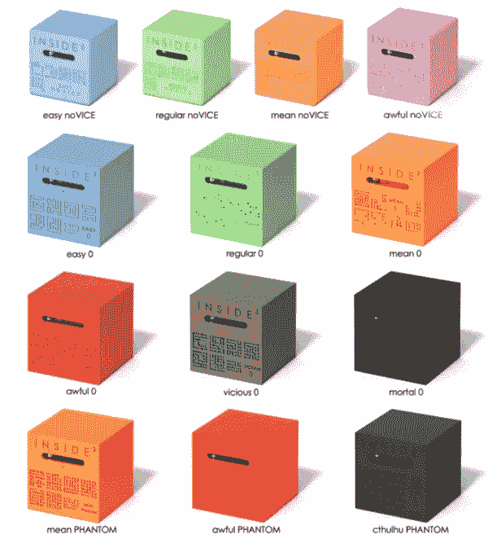
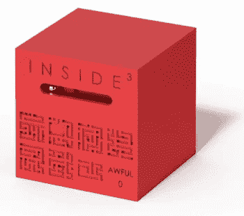
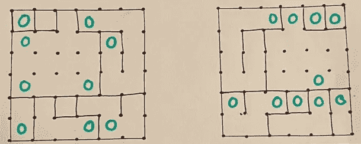
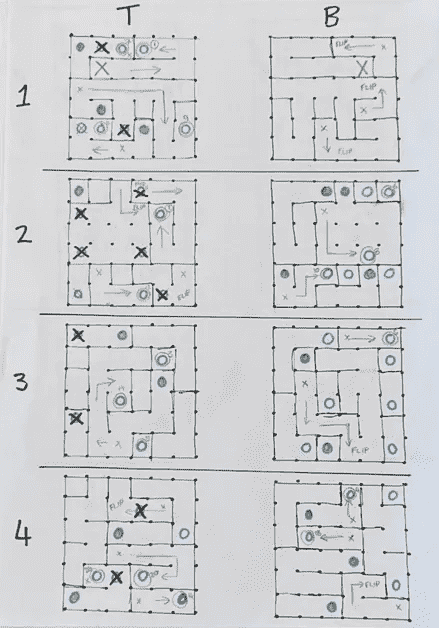
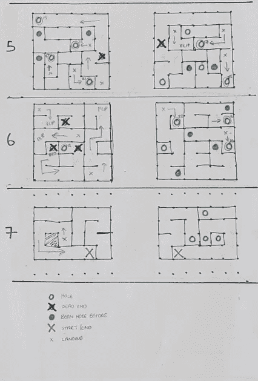

# 如何解决 3D 迷宫

> 原文：<https://medium.com/analytics-vidhya/how-to-solve-a-3d-maze-9f0c8f2cf24?source=collection_archive---------27----------------------->

我喜欢解谜。COVID 让我们都呆在室内，我想尝试一些新的东西。我从[道格工厂](https://www.dougfactory.com/)找到了这一系列的 3D 迷宫( [Inside3 Original](https://www.dougfactory.com/en/inside-cest-quoi/) )，看起来和[医生点的](https://idioms.thefreedictionary.com/just+what+the+doctor+ordered#:~:text=If%20you%20say%20that%20something,or%20to%20improve%20a%20situation.&text='%20A%20few%20days'%20break%20in,just%20what%20the%20doctor%20ordered.)一模一样。

有很多选择，因为我的预算有限，所以我想尝试一个能给我“最物有所值”的选择。我想要的东西将是一个挑战，但同样不是无法解决的。有三个主要的立方体:

*   新手—较小的立方体(5x5)
*   0 系列—更大的立方体(7x7)
*   PHANTON 系列——更大的立方体(7x7 ),内部有第二个弹球来分散你的注意力

颜色也有含义，从容易到非常难。最难的立方体是封闭的，无法打开。

最后，我满足于“红色可怕的 0”立方体。我的理由是:这是最难的，最大的立方体，如果我把事情搞砸了，我仍然可以打开它。我也不想让第二个金属球分散我的注意力。

# 你能解决它吗？

哈哈…如果我自己这么说的话，这是个很棒的问题！这能有多难？目标是让金属球沿着印在外面(正面和背面)的迷宫地图从立方体的一端到达另一端。

我很快认识到，你不仅要在精神上跟踪你在哪里，而且你还应该灵巧地将小金属球沿着你想要的路径移动。举例来说…有时你在立方体(3 层)中往下掉，却发现底部是一个死胡同，你应该向侧面移动立方体，以便“中途”走另一条路。

我刚走了三步就卡住了！！公平地说，发明者确实说过，你可能应该先从简单的立方体开始，以适应所需的技能。

更有趣的是，这个迷宫不仅沿着一条路向下延伸到底部。你需要回去取得进展，为此你必须翻转魔方。你可能会认为迷宫还是一样的，但不仅仅是实际的地图颠倒了(很明显)，相反方向的洞也是全新的(不那么明显)。

这是从顶部(左)和底部(右)看到的一个关卡的示例，绿色圆圈代表金属球可能掉落的洞。

仅仅走了 3 步，我的精神上和身体上仍然停滞不前！

# 那么你打算怎么解决呢？

这里需要一些横向思维。如果我连 3 个步骤都记不住，更别说这里需要多少个 100…让我先在纸上算出来。

不知何故，我一直喜欢建筑图纸和它所要求的精确度。这本身就是一个有趣的挑战。在这里，绘图纸似乎是一个很好的选择，因为我可以将这个迷宫的每一层放大到印刷在立方体侧壁上的原始版本。(注意，虽然我没有绘图纸，但用尺子、笔和点就可以很容易地做出自己的样子)

最终结果如下所示

最终，解决方案需要访问超过 28 个洞，多次起伏，许多死胡同等。在纸上算出答案本身就花了我相当多的时间，我现在真正理解了这个立方体的名字——“可怕”。

# 把这和机器学习联系起来

当在纸上解决这个迷宫时，我想了很多关于我的方法是如何成为一个“[暴力算法](https://www.freecodecamp.org/news/brute-force-algorithms-explained/#:~:text=Brute%20Force%20Algorithms%20are%20exactly,%2C%20each%20from%200%2D9.)”的问题。

> 蛮力算法就像它们听起来的那样——解决问题的简单方法，依靠纯粹的计算能力和尝试每一种可能性，而不是先进的技术来提高效率。

例如，我可以用强化学习(RL)更有效地解决这个难题吗？如果 RL 足以让 open ai[解决魔方](https://openai.com/blog/solving-rubiks-cube/)，那么我肯定可以写一些类似的东西来解决这个迷宫，甚至更具挑战性的版本。

我也想知道我是否选择了最短的路径？还有其他解决方案吗？听起来很像[图的问题](https://en.wikipedia.org/wiki/Dijkstra%27s_algorithm#:~:text=Dijkstra's%20algorithm%20(or%20Dijkstra's%20Shortest,and%20published%20three%20years%20later.)。图论和 RL 有交集吗？([链接](http://proceedings.mlr.press/v89/madjiheurem19a/madjiheurem19a.pdf) ) ( [链接](https://github.com/tkipf/c-swm) ) ( [链接](https://arxiv.org/abs/1910.07421))

接下来我将计划涉足上述领域，敬请关注。

# 但是你解开迷宫了吗？

回到手头的业务…

我实际上还没有从物理上解决这个迷宫。我觉得在纸上解决它已经非常令人满意了，我的一部分想继续前进，但我的另一半总是想学习新的手灵巧技巧，这是实际执行我的纸上计划所需要的:)

“可怕”迷宫的挑战，未完待续…