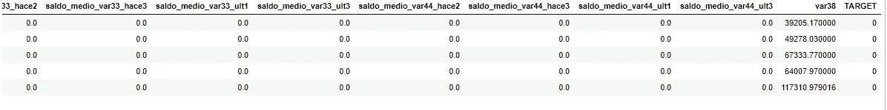
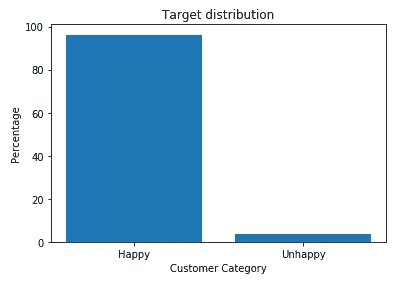
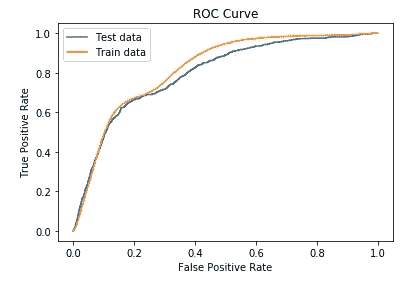

# 如何解决机器学习问题:代码示例

> 原文：<https://medium.com/analytics-vidhya/how-to-solve-a-machine-learning-problem-example-with-code-695e623102c8?source=collection_archive---------7----------------------->


克里斯·利维拉尼在 [Unsplash](https://unsplash.com/s/photos/data-science?utm_source=unsplash&utm_medium=referral&utm_content=creditCopyText) 上的照片

*先决条件:机器学习基础*

在过去的几年里，机器学习和人工智能已经成为几乎所有技术相关博客中的热门词汇。通过这篇文章，我想用 Kaggle 的一个例子简要说明如何应用机器学习技术来解决一个问题(对于那些不知道的人来说，Kaggle 是一个举办机器学习竞赛的平台)。

# 理解问题

第一步是理解手头的问题。我们需要分析我们试图解决的问题，然后提出理想的解决方案。我们可以从主题专家那里获得帮助，以获得关于该问题的领域知识。例如，如果我们致力于癌症预测模型，我们可以从医学专家那里获得帮助，以了解手头的数据集。

我举的例子是桑坦德银行来自 Kaggle 的客户满意度预测问题。西班牙银行 Santander 提供了与其客户相关的数据，他们需要一个机器学习模型来预测客户是否满意。如果银行能够准确地确定其客户满意度，它就可以大幅改善其业务。问题描述可以从这个[链接](https://www.kaggle.com/c/santander-customer-satisfaction/overview)获得。

# 数据清理、探索性数据分析(EDA)和功能工程

数据集由 370 个特征和我们需要预测的目标值组成。提供的数据是原始的。在应用机器学习模型之前，我们需要对其进行预处理和清理。在 EDA 中，我们分析数据结构及其分布。散点图、箱线图、直方图等各种图用于分析每个特征的分布，每个特征如何与目标变量相关，了解数据中的异常等，以便帮助我们进行特征工程，这是机器学习中最重要的步骤之一。在特征工程中，我们修改实际特征以获得更好的模型性能。进行正确的特征工程可以极大地提高模型的准确性。

在桑坦德银行提供的数据集中，所有的特征名称都是匿名的。因此，由于我们不知道实际的功能名称，很难进行更多的功能工程。但是让我们尝试一些基本的特征工程技术。

数据集可以从这个[链接](https://www.kaggle.com/c/santander-customer-satisfaction/data)下载。

让我们读取数据。

```
data=pd.read_csv("data.csv")
data.head(5)
```



数据集样本

现在让我们清理数据，做一些功能工程。

从数据中删除 ID 列，因为它不包含任何有用的信息。

```
#Dropping the ID column from data file
data.drop(columns=["ID"],inplace=True)
```

检查并删除空值(如果有)。

```
i=0
for col in data.columns:
    if(data[col].isnull().any()):
        i+=1
print("No. of features that have null values:",i)
```

输出:*具有空值的特征数量:0*

数据集中没有任何空值。

所有数据点都具有相同值的特征不包含任何有用的信息。所以我们可以去掉这样的特征。

```
i=0
for col in data.columns:
    if len(data[col].unique()) == 1:
        data.drop(columns=[col],inplace=True)
        i+=1
print(" No. of features that have constant values and removed:",i)
```

Out: *具有恒定值并被删除的特征数:34*

现在，让我们获得一些关于数据集的基本信息。

```
data.describe()
```


数据的基本统计

从上面我们可以看到，与其他特性不同，var3 特性有一个最小值，它是一个很大的负值。这看起来像是异常现象。许多 Kagglers 也在比赛的[讨论区](https://www.kaggle.com/cast42/debugging-var3-999999)指出了这一点。所以让我们仔细检查一下。

让我们检查 var3 特性中的唯一值

```
print("Unique values in var3")
print(np.sort(data['var3'].unique()))
```


var3 功能中的唯一值

从上面的分布中，我们可以看到值的范围是从 0 到 238，并且-999999 可能是一个异常值。

还让我们检查这些唯一值的计数。

```
print("Value count for var3:")
data['var3'].value_counts().to_frame().T
```


让我们绘制 var3 特征值的分布图。


var3 特征值的分布

从上面的分布，我们可以看到考虑-999999 作为一个离群值。所以让我们替换这个值-999999。我使用了一个 KNN 模型来预测可以替代-999999 的值。方法如下:

*   取 var3！=-999999(无 var3 功能)作为输入列车数据(Xtrain)。
*   取所有的 var3 值，其中 var3！=-999999 作为列车数据标签(Ytrain)。
*   取 var3=-999999(不含 var3 特征)的所有数据点作为输入测试数据(Xtest)。
*   使用 KNN 模型，预测 y_test，这是所需的 var3 值

```
data_cols=data.columns
#Reference: [https://www.kaggle.com/cast42/debugging-var3-999999](https://www.kaggle.com/cast42/debugging-var3-999999)
X_train = data.loc[data['var3'] != -999999, data.columns[1:]] #Taking all the datapoints where var3!=-999999 (without var3 feature) as the Xtrain
y_train = data.loc[data['var3'] != -999999, 'var3']#Taking all the var3 values where var3!=-999999 as the Ytrain
X_test = data.loc[data['var3'] == -999999, data.columns[1:]]#Taking all the datapoints where var3!=-999999 (without var3 feature) as the Xtest#Defining KNN for predicitng the values to replace for -999999
clf = KNeighborsClassifier(n_neighbors=20,n_jobs=-1)
clf.fit(X_train, y_train)y_test = clf.predict(X_test)
```

由于 KNN 预测所有的值都是 2，我们可以用 2 替换 var3 特性中的-999999。我用不同的 k 值试过 KNN，结果都是 2。
var 3 特征中的多数值也是 2。

```
#Replacing -999999 with 2
data['var3'].replace(to_replace=-999999,value=2,inplace=True)
```

现在让我们检查是否有重复的行。

```
dup=data.duplicated(keep='first')#keep='first' to retain one instance of all the duplicate points
dup_count=data["TARGET"][dup].value_counts()
print("There are {} duplicate entries for TARGET=0(happy customers) and {} duplicate entries for TARGET=1(unhappy customers)".format(dup_count[0],dup_count[1]))
print("Total duplicate rows={}".format(dup_count[0]+dup_count[1]))
```

out:*TARGET = 0(满意的客户)有 4648 个重复条目，TARGET=1(不满意的客户)有 193 个重复条目
重复行总数=4841*

删除重复的行。

```
#Removing duplicate rows by keeping only one instance of all
dup_ind=data.index[dup]
data.drop(index=dup_ind,inplace=True)
```

让我们检查是否存在具有不同目标标签的相同特征值。即同一个顾客被标记为快乐和不快乐。这是无效数据。

```
#Checking if any rows have same features but different Target labels which is invalid
dup_list=data[data_cols[:-1]].duplicated(keep=False) 
dup_count=data["TARGET"][dup_list].value_counts()
print("There are {} data points that have same feature values, but with different target labels".format(dup_count[0]+dup_count[1]))
```

Out: *有 266 个数据点具有相同的特征值，但目标标签不同*

从上面，我们有 266 个数据点，它们具有相同的特征，但是具有不同的目标标签。即 133 个数据点具有目标=0，另外 133 个数据点具有目标=1。这是无效的。因此，我们删除一组 133 个重复点，然后使用 KNN 模型的预测为剩余的 133 个点找到合适的标签。
KNN 的列车数据是没有重复数据点的全部数据。
测试数据是一组 133 个重复的数据点。

```
dup_total=data[data_cols[:-1]].duplicated(keep=False)#getting boolean representation of all duplicates
dup_first=data[data_cols[:-1]].duplicated(keep='first')#getting boolean representation of first set of 133 duplicates
dup_last=data[data_cols[:-1]].duplicated(keep='last')#getting boolean representation of second set of 133 duplicatesdup_total_index=data.index[dup_total]#indeces of all duplicates 
temp_x_train=data.drop(index=dup_total_index)#creating train data without any duplicates
temp_y_train=temp_x_train["TARGET"]
temp_x_train.drop(columns=["TARGET"],inplace=True)# dropping target variable from train datadup_first_index=data.index[dup_first]#indices of one set of 133 duplicates
temp_xtest=data.loc[dup_first_index]#test data with one set of 133 duplicates
temp_xtest.drop(columns=["TARGET"],inplace=True)# dropping target variable from test data#Defining KNN for predicitng the values 
clf = KNeighborsClassifier(n_neighbors=10,n_jobs=-1)
clf.fit(temp_x_train, temp_y_train)
pred=clf.predict(temp_xtest)
```

我们有一个高度不平衡的数据集。0(满意)是多数目标值。我通过改变 k 值来尝试这个模型。但是每次，模型都预测输出为 0。这可能是因为偏向多数阶级。但是我们取的是预测值，因为这比随机赋值要好。

```
#Replacing the target values of one set of 133 duplicate rows with predicted value 
for ind in dup_first_index:
    data.loc[ind,'TARGET']=0#Dropping the other set of 133 duplicates
dup_last_index=data.index[dup_last]#indices of one set of 133 duplicates
data.drop(index=dup_last_index,inplace=True)
```

现在让我们检查数据是否平衡。

```
count=data["TARGET"].value_counts()
happy_percent=np.round(100*count[0]/(count[0]+count[1]),2)
unhappy_percent=np.round(100*count[1]/(count[0]+count[1]),2)print("Number of happy customers={} and their percentage={}%".format(count[0],happy_percent))
print("Number of unhappy customers={} and their percentage={}%".format(count[1],unhappy_percent))
```

输出:*满意客户数=68364，百分比=96.22%
不满意客户数=2682，百分比=3.78%*

我们可以看到数据集是高度不平衡的。与任何组织一样，这是意料之中的，大多数客户都会感到满意。

让我们画出目标变量来了解一下阶级的不平衡。

```
plt.bar([0,1],[happy_percent,unhappy_percent])
plt.xticks([0,1],['Happy','Unhappy'])
plt.xlabel("Customer Category")
plt.ylabel("Percentage")
plt.title("Target distribution")
plt.show()
```



阶级不平衡

不平衡的数据可能会导致模型将大多数数据点预测为多数类。因此，我们需要在将数据集输入机器学习模型之前对其进行平衡。在此之前，让我们将数据分为训练和测试数据集，以防止数据泄漏问题。

**分割成列车测试数据**

```
X=data.drop(columns=["TARGET"])
Y=data["TARGET"]X_train1,X_test,y_train1,y_test=train_test_split(X, Y, test_size=0.30, random_state=0,stratify=Y) #Splitting data into test and train datasetscount=y_train1.value_counts()
print("No. of data points before upsampling=",y_train1.shape[0])
print("Percentage of unhappy customers in train data before upsampling={}%".format(round(count[1]*100/(count[0]+count[1]),2)))
print("Percentage of happy customers in train data before upsampling={}%".format(round(count[0]*100/(count[0]+count[1]),2)))
```

Out: *上采样前数据点数= 49732
上采样前列车数据中不满意客户的百分比=3.77%
上采样前列车数据中满意客户的百分比=96.23%*

**使用 SMOTE 平衡数据**

有许多方法可以处理类不平衡，如复制少数类点、使用类权重、使用 SMOTE 等算法。这里我使用了 SMOTE 或合成少数过采样技术来对少数类进行上采样。SMOTE 使用最近邻算法来生成新的合成数据，我们可以使用这些数据来训练我们的模型。你可以从这个[链接](https://arxiv.org/pdf/1106.1813.pdf)阅读更多关于 SMOTE 算法的内容。

```
from imblearn.over_sampling import SMOTE
smt = SMOTE()
X_train, y_train = smt.fit_sample(X_train1, y_train1)# upsampling using SMOTE
#SMOTE return numpy array. Converting it to dataframe
X_train=pd.DataFrame(X_train,columns=list(data_cols)[:-1])
y_train=pd.DataFrame(y_train,columns=["TARGET"])
count=y_train["TARGET"].value_counts()
print("No. of data points after upsampling=",y_train.shape[0])
print("Percentage of unhappy customers in train data before upsampling={}%".format(round(count[1]*100/(count[0]+count[1]),2)))
print("Percentage of happy customers in train data before upsampling={}%".format(round(count[0]*100/(count[0]+count[1]),2)))
```

Out: *上采样后的数据点数= 95710
上采样前列车数据中不满意客户的百分比=50.0%
上采样前列车数据中满意客户的百分比=50.0%*

```
happy_percent=np.round(100*count[0]/(count[0]+count[1]),2)
unhappy_percent=np.round(100*count[1]/(count[0]+count[1]),2)
plt.bar([0,1],[happy_percent,unhappy_percent])
plt.xticks([0,1],['Happy','Unhappy'])
plt.xlabel("Customer Category")
plt.ylabel("Percentage")
plt.title("Target distribution after upsampling")
plt.show()
```


平衡后的数据分布

**数据标准化**

我们需要将数据标准化，以避免规模效应。

```
#Train data standardization
std=StandardScaler()
X_train = std.fit_transform(X_train)#Test data standardization
X_test = std.transform(X_test)
```

## 使用主成分分析进行降维

让我们检查功能的数量:

```
print("Number of features in data=",X_train.shape[1])
```

Out: *数据中的特征数= 335*

由于特征的数量很大，让我们通过考虑方差来使用 PCA 降低维数。

```
pca = decomposition.PCA()
pca.n_components = X_train.shape[1]
pca_data = pca.fit_transform(X_train)percentage_var_explained = pca.explained_variance_ / np.sum(pca.explained_variance_)
cum_var_explained = np.cumsum(percentage_var_explained)# Plot the PCA spectrum
plt.figure(1, figsize=(8, 6))plt.plot(cum_var_explained, linewidth=2)
plt.title("Explained_variance VS n_components")
plt.grid()
plt.xlabel('n_components')
plt.ylabel('Cumulative_explained_variance')
plt.show()
```


我们可以从上面的图中看到，即使我们使用 150 个特征而不是 335 个，我们也可以保持大约 100%的方差。因此，让我们将维度减少到 150，以便我们可以使用较低的计算资源配置来训练模型。下图显示了 150 个特征的解释差异。

```
#Plotting variance of 150 features
plt.figure(1, figsize=(8, 6))plt.plot(cum_var_explained[0:150], linewidth=2) 
plt.title("Explained_variance VS n_components")
plt.grid()
plt.xlabel('n_components')
plt.ylabel('Cumulative_explained_variance')
plt.show()
```


解释了 150 个特征的差异

让我们把维数降低到 150。

```
pca.n_components = 150
X_train=pca.fit_transform(X_train) #PCA on train data
X_test=pca.transform(X_test) #PCA on test data
print("Size of train data after dimensionality reduction(PCA)=",X_train.shape)
print("Size of test data after dimensionality reduction(PCA)=",X_test.shape)
```

Out: *降维后的训练数据量(PCA)= (95710，150)
降维后的测试数据量(PCA)= (21314，150)*

# 定义机器学习模型

我们需要根据我们的问题选择一个模型。如果我们有一个分类任务，我们需要一个分类器模型。如果我们需要预测一个真实值，我们需要使用回归模型。因为我们的任务是将客户分类为快乐或不快乐，所以我们需要一个分类器模型。

我们需要检查不同模型对数据的性能，并选择性能最佳的模型。在本文中，我测试了以下模型:

*   XgBoost
*   带校准的逻辑回归
*   RFDT

**XgBoost 型号**

XgBoost 是一种高级的 boosting 算法，在大多数情况下，与其他模型相比，它可以提供可观的性能。

该模型在训练数据上被训练，并且超参数基于交叉验证(CV)数据上的模型性能被调整。XgBoost 中有很多 hyper 参数。我在这里考虑了“n 估计量”和“学习率”作为例子。你可以从这个[链接](https://xgboost.readthedocs.io/en/latest/python/python_api.html)了解更多关于 XgBoost 算法的内容。

GridsearchCV 是 sklearn 提供的一个函数，用于遍历 hyper 参数的所有组合，并选择具有最佳性能的模型。你可以通过这个[链接](https://scikit-learn.org/stable/modules/generated/sklearn.model_selection.GridSearchCV.html)了解更多。

我已经使用 AUC 分数来评估模型性能。因此，给出最佳 AUC 分数的超参数将被 GridSearchCV 视为最佳模型。

```
tuned_param={'n_estimators':range(10,20),'learning_rate':[.05,.06,.07,.08,.09,.1,0.15,0.2,0.25,0.3]}
xgb_model=GridSearchCV(XGBClassifier(n_jobs=-1,random_state=0),param_grid=tuned_param,scoring='roc_auc',return_train_score=True)
xgb_model.fit(X_train, y_train)print("Best hyperparamters-",xgb_model.best_params_)
print("Best AUC value: ",xgb_model.best_score_ )
```

Out: *最佳超参数- {'learning_rate': 0.3，' n_estimators': 19}
最佳 AUC 值:0.917746861944092*

现在，让我们绘制所有超参数组合的 CV 数据的 AUC 分数的热图，以了解模型性能如何随超参数而变化。

```
auc_df=pd.DataFrame(xgb_model.cv_results_['params'])
auc_df["auc"]=xgb_model.cv_results_['mean_test_score'] #Creating a data frame with hyperparameters and AUCauc_df=auc_df.pivot(index='learning_rate',columns='n_estimators',values='auc') #Pivoting the dataframe for plotting heat mapplt.figure(figsize=(20,10))
sns.heatmap(data=auc_df,annot=True)
plt.title("AUC plot for CV data")
plt.show()
```


下面是我们获得的最佳模型的 ROC 曲线。


此外，下面还有几个图来评估模型性能。

```
pred_train_prob=xgb_model.predict_proba(X_train)
pred_test_prob=xgb_model.predict_proba(X_test)
print("Train AUC=",roc_auc_score(y_train,pred_train_prob[:,1]))
print("Test AUC=",roc_auc_score(y_test,pred_test_prob[:,1]))pred_train=xgb_model.predict(X_train)
pred_test=xgb_model.predict(X_test)
#Plotting confusion, precision and recall matrices of train data
plot_confusion_matrix(y_train, pred_train)
```


**带校准的逻辑回归**

逻辑回归是最简单的分类器模型之一。它依靠对数损失来进行标签预测。我使用了校准和逻辑回归模型。校准有助于获得更可靠的预测概率。你可以从这个[博客](https://machinelearningmastery.com/calibrated-classification-model-in-scikit-learn/)中了解更多关于校准的信息。

逻辑回归的超参数是正则化项 alpha(代码中的 C)。现在，让我们针对超参数α的各种值，在我们的训练数据上拟合校准的逻辑回归模型。

```
alpha_list=[10**a for a in range(-5,3)]
train_auc_list=[]
test_auc_list=[]
for i in alpha_list:
    log_clf=LogisticRegression(penalty='l2',C=i, max_iter=500,n_jobs=-1)
    calib_clf=CalibratedClassifierCV(log_clf, method="sigmoid")
    calib_clf.fit(X_train, y_train)
    pred_train=calib_clf.predict_proba(X_train)
    pred_test=calib_clf.predict_proba(X_test)
    train_auc=roc_auc_score(y_train,pred_train[:,1])
    test_auc=roc_auc_score(y_test,pred_test[:,1])
    train_auc_list.append(train_auc)
    test_auc_list.append(test_auc)
```

出局:


让我们绘制 AUC w.r.t 超参数的变化。

```
for i in range(0,len(alpha_list)):
    print("For alpha=",alpha_list[i]," train AUC=",train_auc_list[i]," and test AUC=",test_auc_list[i])plt.title("alpha VS AUC")
plt.plot(alpha_list,train_auc_list,label="Train")
plt.plot(alpha_list,test_auc_list,label="Test")
plt.xlabel("alpha")
plt.ylabel("AUC")
plt.legend()
plt.show()
```


让我们找出给出最佳 AUC 值的超参数。

```
best_alpha_ind=np.argmax(test_auc_list)
print("Best alpha=",alpha_list[best_alpha_ind])
print("Best train AUC=",train_auc_list[best_alpha_ind])
print("Best test AUC=",test_auc_list[best_alpha_ind])
```

Out: *最佳 alpha= 0.001
最佳列车 AUC= 0.8205906942467746
最佳测试 AUC = 0.7925951460788*

逻辑回归模型的 ROC 曲线绘制如下。代码与我们用于 XgBoost 模型的代码相同。



让我们检查混淆矩阵、精确矩阵和召回矩阵。


**随机森林决策树(RFDT)模型**

RFDT 是一个集合模型，使用决策树作为它的基础模型。决策树基本上是嵌套的 if-else 语句。RFDT 的超级参数是基础决策树的数量(n_estimators)和它的最大深度(max_depth)。你可以从我的关于 RFDT 的博客[中读到更多关于 RFDT 及其工作的内容。](/@jijogeorgeab/a-walk-through-random-forest-decision-tree-rfdt-algorithm-with-code-932271af4ec7)

我们只需修改一行代码，就可以将 XgBoost 模型的代码转换成 RFDT 模型的代码。这就是 sklearn 的妙处！！！

```
tuned_param={'max_depth':range(1,10),'n_estimators':range(1,6)}
rfdt_model=GridSearchCV(RandomForestClassifier(n_jobs=-1),param_grid=tuned_param,scoring='roc_auc',return_train_score=True)
rfdt_model.fit(X_train, y_train)
```

让我们检查给出最佳 AUC 值的超参数值。

```
print("Best hyperparamters-",rfdt_model.best_params_)
print("Best AUC value: ",rfdt_model.best_score_ )
```

Out: *最佳超参数- {'max_depth': 9，' n_estimators': 5}
最佳 AUC 值:0.942976539431358*

让我们绘制各种超参数值的 AUC 值的热图


**RFDT 的 ROC 曲线**


让我们检查混淆矩阵、精确矩阵和召回矩阵。


# 结论

我们已经简要讨论了设计和实现机器学习模型的方法。首先我们必须彻底理解手头的问题。学科专家可以帮助我们获取领域知识。下一步是预处理数据，并执行 EDA 和功能工程。这一步至关重要，因为在此获得的见解将贯穿整个设计过程。

一旦特征工程完成，我们可以将数据分成训练、交叉验证(CV)和测试数据。在训练数据上训练模型，在 CV 数据上进行超参数调整，并且在测试数据上进行实际测试。生成不同的模型，并选择给出最佳性能的模型。

我们从各种模型中获得的结果总结如下。


从表中我们可以看出，XgBoost 模型在测试数据上给出了最好的结果。所以我们选择 XgBoost 模型作为这个问题的首选模型。

# 未来范围

作为未来的工作，您可以尝试更多的功能工程技术(例如:从现有功能引入新功能)，并检查您是否可以获得更好的性能。

从结果表中，我们可以观察到训练 AUC 相对高于测试 AUC。这意味着我们的模型有点过度拟合。您可以尝试一些正则化技术，看看是否可以消除过度拟合效果。

我们使用的模型也是经典的机器学习模型。你可以尝试使用深度学习模型，以获得更好的性能。

# 参考

*   [https://www . ka ggle . com/c/Santander-customer-satisfaction/overview](https://www.kaggle.com/c/santander-customer-satisfaction/overview)
*   【https://arxiv.org/pdf/1106.1813.pdf 号
*   [https://xgboost . readthedocs . io/en/latest/python/python _ API . html](https://xgboost.readthedocs.io/en/latest/python/python_api.html)
*   [https://sci kit-learn . org/stable/modules/generated/sk learn . model _ selection。GridSearchCV.html](https://scikit-learn.org/stable/modules/generated/sklearn.model_selection.GridSearchCV.html)
*   [https://www.kaggle.com/cast42/debugging-var3-999999](https://www.kaggle.com/cast42/debugging-var3-999999)