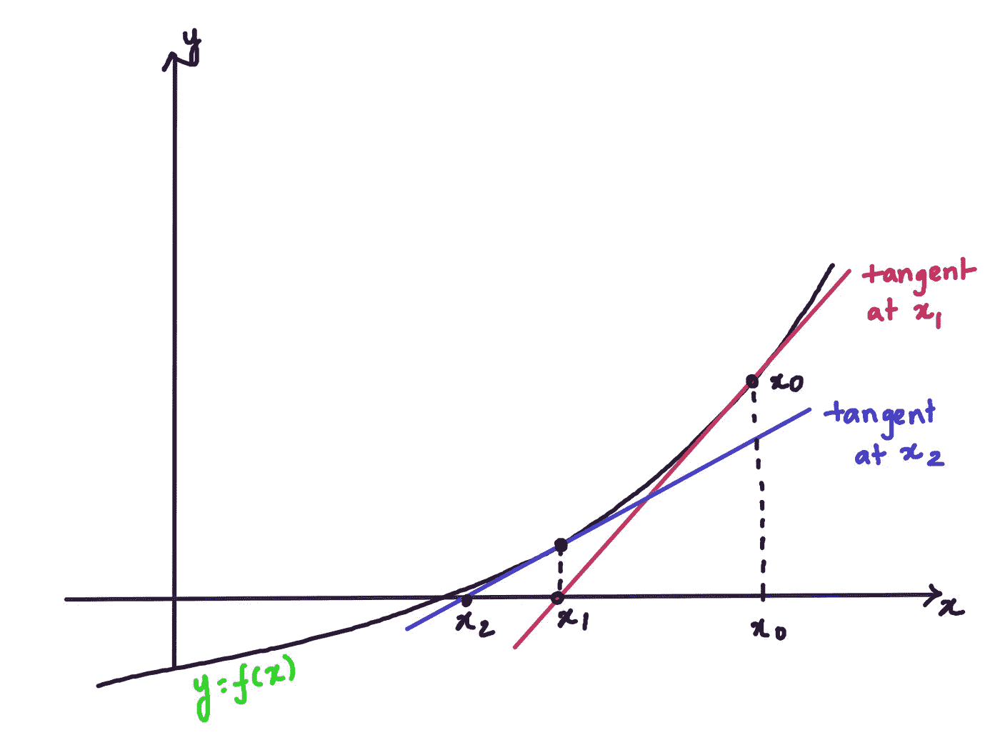

# 如何求解多项式

> 原文：<https://medium.com/analytics-vidhya/how-to-solve-a-polynomial-f8b746b49a1?source=collection_archive---------8----------------------->

# 问题陈述

这篇文章解释了如何解一个任意次的多项式方程。

我们没有任何预定义的公式来求解次数超过 3 的多项式。数值方法是数学工具，可用于寻找多项式的近似根。

因此，我们基本上实现了一种算法，它结合了数值方法和综合除法来求解多项式方程。点击查看我的代码[。](https://github.com/reyscode/SolveAnyPoly)

我们的实现将一个多项式的系数列表作为输入，并给出它的所有根。

我们可以利用二分法来求多项式的根。但是这个问题我们还没有用到二分法。在讨论为什么之前，我们先来看看什么是二分法。

# 二分法

给定一个函数 f(x)和两个数字‘a’和‘b’

## 假设

1.f(x)在区间(a，b)
2 之间是连续的。和 f(a) * f(b) < 0

## 解决办法

1.  找到 a 和 b 的中点，比如 c
2.  如果 f(c)=0，则 c 是根
3.  Else:
    1。如果 f(a)*f(c) < 0 那么根位于(a，c)之间。用新的区间(a，c)
    2 重复上述步骤。Else f(b)*f(c) < 0 则根位于(b，c)之间。用新的间隔(b，c)重复这些步骤

## 优势

我们知道我们离解决方案有多近，因为我们重复这个过程，间隔变得越来越小，使我们离解决方案越来越近。

## 不足之处

使用二分法的缺点是我们不能找到一个多项式的多重根。

另一个主要缺点是寻找区间(a，b)。音程必须稍微靠近根音。最重要的是，在这个区间内应该只有一个根。例如，如果我们给定一个大的区间，并且在同一个区间内有不止一个根下落，则算法停止。

因此，我们需要一个更好的算法来有效地解决这个问题。

# 牛顿方法

由于二分法不适合我们，我们利用牛顿法来找出任意给定多项式的一个根。

还有其他的数值方法，比如割线法来求多项式的根。但是，牛顿法相对简单，不需要更多的输入。

现在让我们讨论什么是牛顿法。

假设我们想要找到函数 f(x)的解(在这种情况下是任意次的多项式函数)，假设我们找到了这个解的初始猜测，比如 x0。这个最初的猜测几乎总是不好的，所以我们想找到一个更好的近似。这可以通过在 x0 处画一条 f(x)的切线来实现。

x0 处切线的方程式为:

y = f(x0)+f′(x0)(x x0)

下图显示了切线



我们可以看到，在 x0 处的切线更接近解。让我们把这个新的点称为 x1(这是我们新的近似值)。

现在我们知道了新近似的坐标。即(x1，0)。我们将该值代入原始方程，并对 x1 进行如下评估:

0 = f(x0)+f′(x0)(x1 x0)

x1 x0 = f(x0)/f’(x0)

x1 = x0f(x0)/f’(x0)

因此，我们可以找到解，只要 f'(x0)！= 0.

现在，我们再次重复这一过程，以找到 x1 的更好近似值，如下所示。假设下一个近似值是 x2。我们计算 x2 如下

x2 = x1f(x1)/f’(x1)

牛顿的方法是，给定一个函数 f(x)=0，xn 是 f(x)和 f'(x)的近似值！= 0，则下一个近似值计算如下:

x { n+1 } = xn f(xn)/f’(xn)

使用牛顿的方法，我们找到一个给定方程的一个根。牛顿法本质上是迭代的。它循环运行，一点点接近最优解。

使用牛顿法的缺点是

1.f'(x)不应为零且
不为 2。我们需要以某种方式找到初始近似值(x0)3。我们需要找到 f(x)对每个近似值的导数

现在让我们看看如何在这个问题中利用牛顿法。

1.  使用函数 *symbolic_fn()* 将输入函数(基本上是系数列表)转换成符号表达式。

```
def symbolic_fn(coef):
  """
  Generating function using coefficients
  The function takes the list of input coefficients and generate Symbolic function
  """
  sym_fun=0
  x=sym.Symbol('x')
  for i,val in enumerate(coef):
    sym_fun=sym_fun+coef[-1-i]*x**i
  return sym_fun
```

2.使用 *evaluate_sym_exp()* 对符号表达式求值。

```
def evaluate_sym_exp(exp, value):
  """Evaluating the symbolic function"""
  return exp.subs(list(exp.free_symbols)[0], value)
```

3. *newtons_method()* 函数是牛顿方法的实现，它输出符号表达式的根。我们用 *sympy* 来求 f(x)的一阶导数。

```
def newtons_method(fn):
  """
  Newtons Method
  The function takes a symbolic expression as the input and gives one root of the function as output
  """
  n=0
  x=1
  while n < 10:
    fn_val=evaluate_sym_exp(fn, x)
    dif_fn_val=evaluate_sym_exp(sym.diff(fn), x)
    x = x - (fn_val/dif_fn_val)
    n = n + 1
  return round(x)y=symbolic_fn([1,-9,26,-24])
newtons_method(y)
```

现在，我们有一个方程和它的一个根。

4.用牛顿的方法，我们找到 x 的一个根，比如说 x=5。我们正在把这个根转换成一个因子，x-5(做合成除法)。

5.使用上一步中的因子，我们可以利用综合除法将 n 次多项式化简为 n-1 次多项式。

什么是合成除法？

# 合成分裂

综合除法是多项式除法的一种方法。在这种情况下，我们使用合成除法，每次将多项式的次数减少一次，用牛顿法得到的根。

让我们以一个三次多项式为例来解释合成除法是如何工作的:

x -9x +26x-24=0

让我们假设，我们的牛顿法确定 3 是这个多项式的一个根

多项式的一般除法如下:


现在，让我们看看合成除法是如何对同一个例子起作用的:

首先，我们必须将多项式的所有系数写在一个“L”形除法符号内:


将因子 3 放在左侧


将第一个系数(前导系数)取出不变。


现在将这个进位值乘以因子 3，并将结果放入下一列(除法符号内)。现在添加列，并将总和放在除法符号的底部。


现在，将前一个进位值乘以因子，得到下一个值。


重复这个过程，直到我们到达最后一个数字。


如果最后一列的值是 0，那么 x-3 就是这个多项式的一个因子。即 3 实际上是这个多项式的根。

```
def synthetic_division(coef,root):
  """
  Synthetic Division
  It takes one of the roots of n-degree polynomial and outputs a polynomial of n-1 degree
  """
  quotient=[]
  val=coef[0]
  for i,j in enumerate(coef):
    if i==0:
      quotient.append(coef[i])
    else:
      val=val*root+coef[i]
      quotient.append(val)
  quotient.pop()
  return (quotient)
```

商的值将是 x -6x+8(比实际多项式小 1 度)

现在我们给出这个(n-1=2)二次多项式作为牛顿法的输入，以得到这个方程的一个根。

我们用牛顿法给出的根对新的二次多项式重复综合除法，得到一个低次多项式。

我们重复这个过程，直到得到多项式的所有根。

```
def solve_any_poly(coef):
  """
  Solving Polynomial
  The function takes the list of coefficients of the polynomial of any degree
  and outputs list of all roots of the given polynomial
  """
  roots=[]
  for i,j in enumerate(coef):
    while len(coef)>2:
      fn = symbolic_fn(coef)
      root=newtons_method(fn)
      roots.append(root)
      coef=synthetic_division(coef,root)
  return roots + [-coef[-1]]
```

# 如何使用我的代码

```
python3 solve_any_poly.py# Enter Coefficients of Equation (comma separated):1,-9,26,-24
# [2, 3, 4] 
```


solve_any_poly.py 的输出

# 用来解决这个问题的工具

1. **Matplotlib** :用于带有解的多项式的可视化
2。 **Sympy** :求函数的一阶导数，实现牛顿法。我们可以通过使用*有限差分法*来消除对 Sympy 的依赖性。
3。**Numpy**4。**绘图用克里塔**

# 如何投稿

通过利用泰勒级数展开，这个项目可以扩展到求解非线性项的方程，如正弦、余弦和指数。

欢迎发表评论。