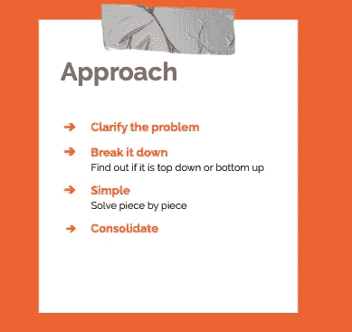
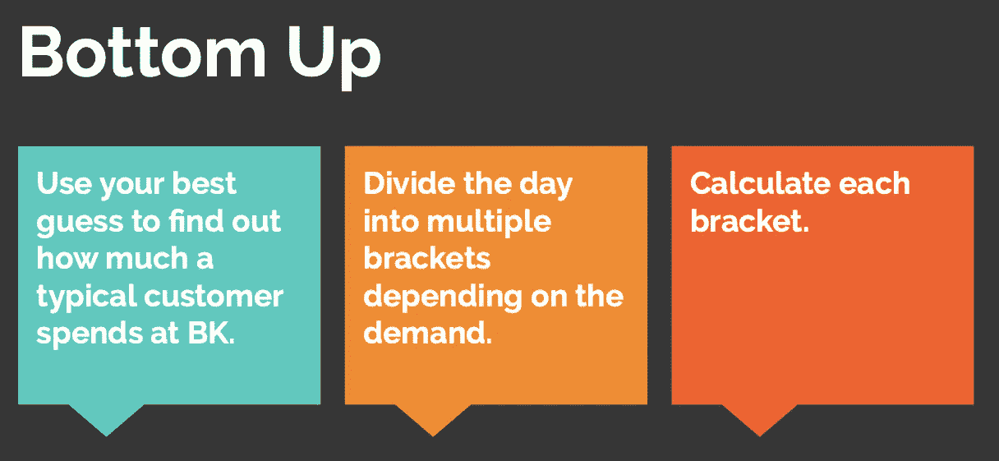

# 如何解决猜测和市场规模问题？

> 原文：<https://medium.com/analytics-vidhya/how-to-solve-guesstimate-and-market-sizing-questions-1e380944b8dd?source=collection_archive---------5----------------------->

史蒂夫·哈拉马在 [Unsplash](https://unsplash.com/s/photos/interview?utm_source=unsplash&utm_medium=referral&utm_content=creditCopyText) 上拍摄的照片

我的几个同事正在讨论这些猜测问题。我甚至不知道是否存在这样一个词。但事实证明，猜测在排队申请咨询和分析师职位的人群中，以及在猎头寻找咨询和分析师简历的招聘人员中，非常受欢迎。
guest imate 的词源不难猜测。这是猜测和估计的混合。听起来很公平！

在采用这种方法之前，你应该记住的一件重要的事情是，招聘人员永远不会强迫你给出一个准确的答案。他们主要是想观察你的方法。所以你可以自由地假设，只要它们不太直观。

我将分享一个示例问题，我们将在讨论所用方法的同时制定出解决方案。

> **问题:**在德里，汉堡王一天能赚多少钱
> ？

我们将使用下面提到的方法来解决上述问题。

猜测问题有时会非常含糊不清。澄清你对这个问题的所有疑问总是明智的。举个例子。你可能会被要求找到从德里出发的航班号。现在这个问题可以有多种解读。面试官关注的是客运航班还是货运航班，还是两者都关注？他说的是本地航班还是国际航班？他说的是 IGI 机场还是德里的其他机场，比如 Safdarjung，Hindon AF Station？在你开始寻找答案之前，所有这些问题都需要澄清。一旦你明白了面试官想要什么，就很容易假设数字和情况。

第二步，也许是最重要的一步，是决定走哪条路。有两种可能的方法来解决这个问题。第一种是**自上而下的方法。当你必须从一个城市、州或国家的人口开始时，自上而下的方法是有用的。一旦你选择了一个与实际数字足够接近的数字*(提示:在你参加面试之前，确保你了解你所在城市、州和国家的人口细节)*，下一步就是将人口按年龄、性别、收入群体等细分。例如，如果你得到一个问题，要找出德里吉列剃须泡沫用户的数量，你将不得不使用自上而下的方法。首先，你需要从德里的人口开始，然后你需要找出男性的数量。第一个分歧是在性别参数上。然而，它并没有就此结束。现在你将把男性分成不同的年龄组。18 岁以下的男性不会刮胡子。你至少可以淘汰 25%的男性。剩下的雄性将分为两类。刮胡子的和修剪的。你可以至少再淘汰 20%可能会裁员的男性。下一批男性将是那些经常刮胡子的人。但不是所有人都会使用剃须泡沫。他们中的一些人可能会使用剃须膏。所以你需要进一步分解。诸如此类。**

如果你还记得，我们通过挑选德里的全部人口开始解决上述问题，并最终将其分解为剃须泡沫的目标受众。这种方法本质上是一种自顶向下的方法。

下一个方法是**自底向上的方法。** *当你必须通过假设你的目标群体中的某个人会做的事情来开始解决方案时，这种方法很有用。*例如，您可能想假设一个人一天在麦当劳的消费是多少。根据这个平均数，你可以推断出整个人口，并找出多少麦当劳店一天赚多少钱。在我们的例子中，我们将使用自底向上的方法。所以我现在不会详细解释。

一旦你得到问题，最好是你决定用哪种方法来解决问题。理解这一点，猜测并不难，因为你必须做出许多假设；它们很难，因为你必须消除所有的 grot 信息。一旦你获得了你将要使用的方法，所有需要消除的 grot 信息开始涌入你的大脑。

现在你知道你将使用的方法，并且已经解决了问题，直到你接触到你的目标群体。你所要做的就是解决所有这些问题，整合它们，给出答案。让我们试着回答我上面写的问题。也贴在下面。

> **问题:**在德里，一家汉堡王分店每天能赚
> 多少钱？

花些时间，找出你要用哪种方法来解决这个特殊的问题。

猜测中没有正确或错误的答案。如上所述，重要的是你解决问题的方法。我的方法可能与你的不同。你的方法可能与面试官的不同。只要你能为你的理由提供合乎逻辑的解释，并消除所有 grot 信息，你就在正确的轨道上。

回到上面的问题。首先，我将澄清我对这个问题的疑问。

*他是不是在谈论某个特定的经销店，因为 CP 经销店可能比东德里的一些经销店赚得更多？
他说的“每天的产量”是指收入还是利润？
我是否需要选择某一天，因为与工作日相比，商店在周末可能会赚得更多？*

澄清之后，我必须支持我将用来解决这个问题的方法。我采用的方法是自下而上的。

初始假设:

1.  平均每个人在汉堡王店消费 200 印度卢比。
2.  销售不受周末因素的影响。整个星期都是统一的。
3.  德里所有的商店都有相似的客流量。
4.  汉堡王分店有 3 个收银台。
5.  这家商店上午 10 点开门，晚上 10 点关门。

所以我把这些*初始*假设，也传达给了面试官。

解决方案:

一个普通人花费卢比。在一家典型的汉堡王分店里要 200 英镑。我要把一天分成两个时段。第一个桶是*低流量桶*，表示客户流量低。第二个桶是高流量桶，意味着顾客流量极高。

桶:

上午 10 点—下午 12 点:低流量铲斗(2 小时窗口)

中午 12 点—下午 4 点:高流量时段(4 小时窗口)

下午 4 点— 6 点:低流量铲斗(2 小时窗口)

下午 6 点—晚上 10 点:高流量时段(4 小时窗口)

奇数小时选择低流量铲斗。高流量桶是午餐和晚餐时间。

进一步的假设。

1.  下一个订单的平均时间是 3 分钟，高流量和低流量时段也是一样。
2.  高流量使用了所有三个计数器，假设有一个长队列，下一组客户的时间损失为零。
3.  在低流量期间，下一批顾客进入商店所需的时间为 7 分钟。

计算:

**为高流量期。**

因为三个柜台同时使用，下一个订单需要 3 分钟。因此**在 3 分钟内，三个订单被发出**(来自三个计数器的订单的总和)。

在 60 分钟内，将下 60 个订单(不会浪费时间，因为在高流量期间会有很长的队列)。

一个订单的平均价格是卢比。200.所以在 60 分钟内，价值 60*200= **12，000** 的钱将进入现金银行。

一个高流量周期持续 4 小时；因此，在此期间赚取的总收入为 4 * 12000 =**48000 印度卢比。**

假设在第二个高流量时期有类似的表现，则又赚了 48，000 英镑。高流量期赚的钱总数是 2 * 48000 =**96000 印度卢比。**

由于我们假设在上述情况下，呼出和呼入客户之间的时间损失为零，这将是我们在高流量期间获得的最大收入。

**为低流量期。**

仍然假设同时使用三个计数器。但是客户流量低，下一组客户 7 分钟后到。这仍然是一个合理的假设，因为我们已经考虑了两组客户之间相当大的时差。在低流量期，**我们在 3+7=10 分钟内获得三个订单。**

在 60 分钟内，我们将在低流量期间获得 3*6=18 个订单。一个订单的平均价格是卢比。200.所以在 60 分钟内，价值 18*200= **3，600** 的钱会进入现金银行。

一个低流量期为 2 小时；因此，在此期间的总收入为 2 * 3600 =**7200 印度卢比。**

假设在第二个低流量时期有类似的表现，则又赚了 7，200 英镑。低流量期赚的钱总数是 2 * 7200 =**14400 印度卢比。**

一整天的总收入是 96000+14400 =**110400 印度卢比。**

这就是如何使用自下而上的方法来解决一个猜测问题。我已经尽力使它尽可能简单。如果你有不同的解决方案，请在评论中提出来，我很乐意阅读。

如果你对猜测有任何疑问，也要提出来；我会试着解决并上传解决方案。

祝你下次面试好运！