# 如何解决 Kaggle 中的 Instacart 购物篮分析问题？

> 原文：<https://medium.com/analytics-vidhya/how-to-solve-instacart-market-basket-analysis-problem-in-kaggle-fd2cf7fa7055?source=collection_archive---------9----------------------->


这个博客是关于如何解决 Kaggle 中的 instacart 问题。希望这篇博客能让你很好地理解如何解决推荐问题。

# **什么是 Instacart，这个问题是关于什么的？**

Instacart 是一家美国公司，在美国和加拿大经营杂货交付和提货服务。Instacart 中的消费者一次又一次地从他们那里订购大篮子大小的各种食物。他们比任何电子商务公司都更关注用户行为。一个数据科学家在 Instacart 的工作:[https://tech . insta cart . com/data-science-at-insta cart-dab BD 2d 3 f 279](https://tech.instacart.com/data-science-at-instacart-dabbd2d3f279)

由于拥有巨大的用户行为数据密度，Instacart 致力于向客户推荐产品，正如上面的 URL 所提到的。这个问题的重点是改善推荐系统的用户更多的手经验，为用户建议或推荐类型的产品，以填补篮子，因此 Instacart 市场篮子分析。

基于以前的订单，该模型必须预测用户最终会重新订购什么，并且更加精确地为用户提供 N 个最适用的建议。对于部署，Instacart 作为一家公司对每个模型进行 AB-Test，以获得更好的用户体验。

# **让我们从更多的实现形式**来看这个问题。

***数据来源:***[https://www . ka ggle . com/c/insta cart-market-basket-analysis/Data](https://www.kaggle.com/c/instacart-market-basket-analysis/data)

我们拥有的数据集是 6 个相关的 csv 文件，可以使用主键轻松合并。

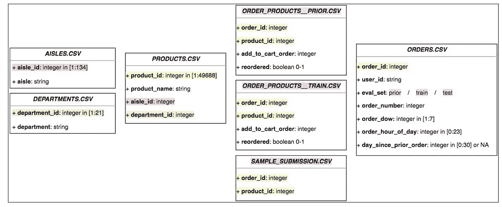

csv 文件之间的相关性。

任何推荐问题面临的最大问题是，该问题往往是冷启动问题，但在这种情况下，由于相关文件，我们实际上可以获取每个用户和产品的行为，并使用该行为进行推荐。

如果我们看一下图表，我们可以看到 orders.csv 包含用户的交易历史记录，而 oreders.csv 中的 eval set 列实际上引用了 order_products_prior.csv 文件和 order_products_train.csv 文件，并且 eval set 等于 test 的 orders.csv 文件中的所有数据是我们必须预测产品的数据。

这是问题不是冷启动问题的主要原因，因为我们实际上可以通过相关性和行为来区分用户和产品。

# **如何处理问题和分析数据。**

该问题的现有解决方案实际上主要更多地关注特征工程，然后实际上在其上构建简单的模型，这使得该问题更加有趣，因为在解决该问题时可以想到各种各样的特征。

***配送数据:***

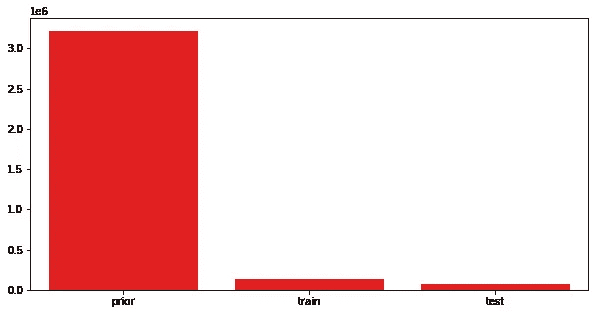

正如我们所看到的，大部分数据位于前一个区域，这就是为什么我们可以从中提取最大行为，并使用该行为在训练区域训练模型，然后预测测试区域。

因此，我们通过合并 order _ products _ previous . CSV 文件和 orders.csv 文件来制作数据，并对用户和产品进行分析。

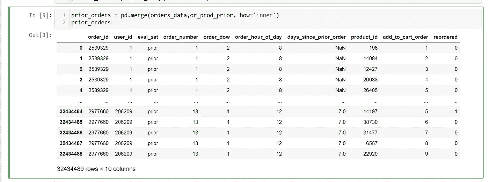

制作 prior _ orders 数据集。

**值得一看的特色是:**

1.  订单编号
2.  订单 _ 道琼斯
3.  订单 _ 小时 _ 天
4.  天数 _ 自 _ 先前 _ 订单
5.  添加到购物车订单

***对这些因素如何影响用户和产品的再订购进行单因素和多因素分析:***

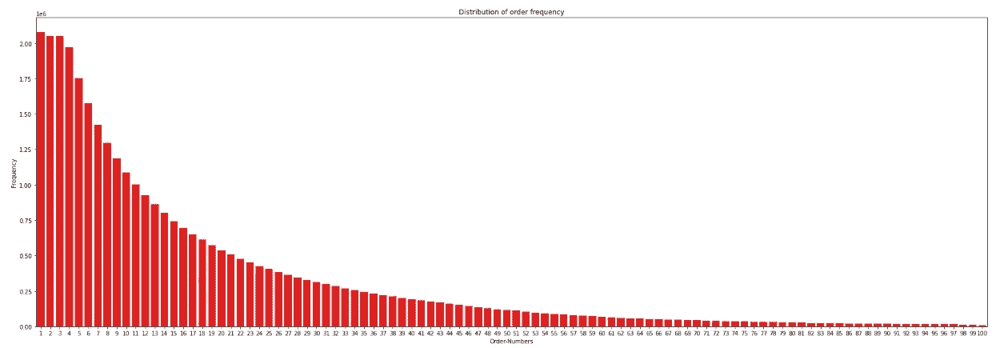

订单编号分配。

*正如我们所看到的，大部分订单编号等于 1，即订单编号的行为出现正偏差*

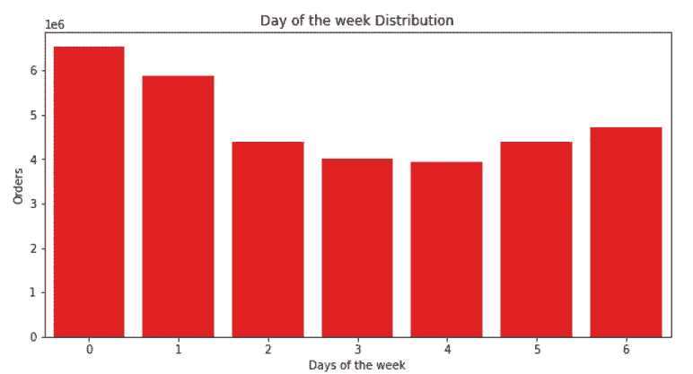

Order_dow 分销。

*从条形图中可以明显看出，第 0 天和第 1 天是订单最多的日子，这就引出了第 0 和第 1 天是否是周末的问题？-是的 0 和 1 是周末。*

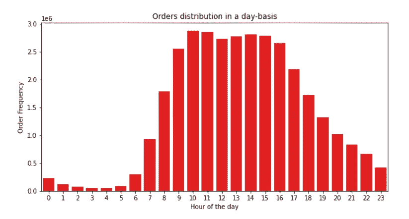

order _ hour _ day 配送。

*一天中第 10 至 16 小时之间可以订购最多订单*

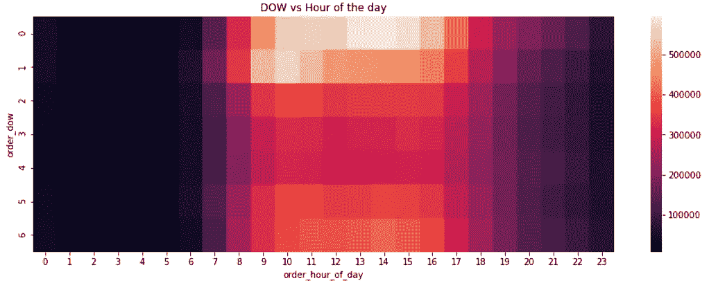

一周中的某天与一天中的某小时的热图。

*由于周六下午和周日上午的中间订单数量较多。*

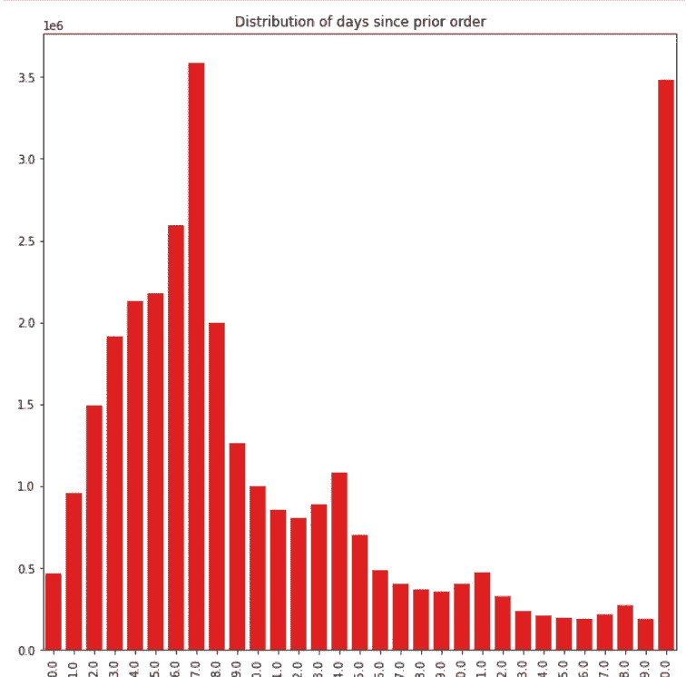

days _ 自 _ prior _ orders 分发。

*可见，30 天和 7 天的再订购率最高，意味着最多用户倾向于在 7 天或 30 天后再订购。*

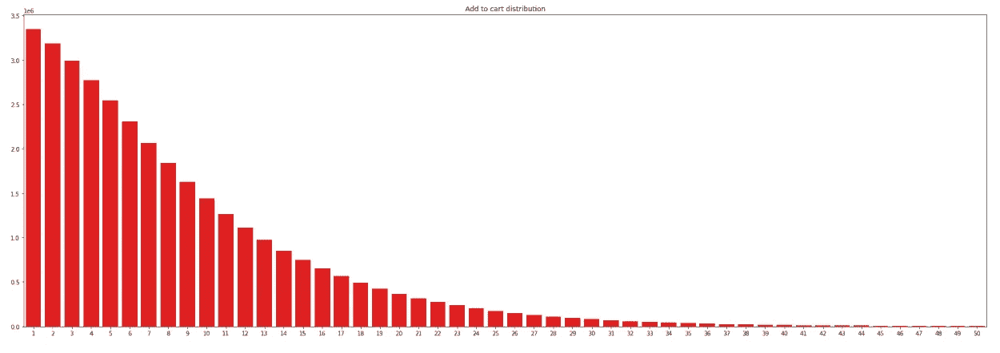

添加到购物车分发

*可见，add_to_cart_order 的个数大多等于 1。*

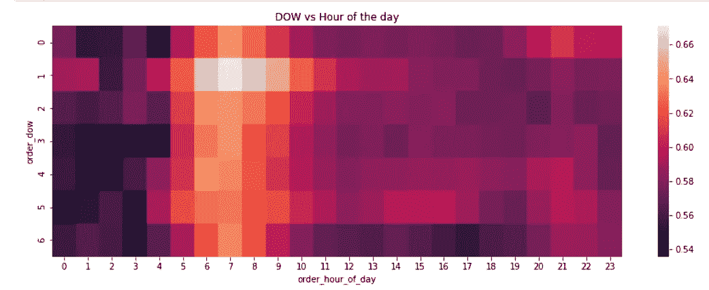

一周中的某一天与一天中的某一小时，具有重新排序速率。

*最大重组发生在周日早上，所有重组基本上都发生在凌晨。*

# **数据的特征工程:**

***所有特征列表:***

```
<class 'pandas.core.frame.DataFrame'>
MultiIndex: 4833292 entries, (3, 248) to (206208, 49621)
Data columns (total 47 columns):
 #   Column                       Dtype  
---  ------                       -----  
 0   up_unique_dow                int8   
 1   up_unique_hod                int8   
 2   up_unique_atc                int8   
 3   up_unique_reordered          int8   
 4   up_cumcount_on               int16  
 5   up_cumcount_dow              int16  
 6   up_cumcount_hod              int16  
 7   up_cumcount_dsp              float16
 8   up_cumcount_atc              int16  
 9   up_orders_cumcount           int8   
 10  up_orders_num                int8   
 11  up_orders_since_previous     int8   
 12  up_reordered                 int8   
 13  up_order_ratio               float16
 14  up_order_dow_score           float16
 15  up_order_hour_of_day_score   float16
 16  up_last_five                 float16
 17  up_last_five_ratio           float16
 18  max_orders                   int8   
 19  total_items                  int16  
 20  orders_ratio                 float16
 21  unique_products              int16  
 22  num_reorders                 int16  
 23  reordered_mean               float16
 24  reordered_std                float16
 25  user_dow_mean                float16
 26  user_dow_var                 float16
 27  user_dow_std                 float16
 28  user_hod_mean                float16
 29  user_hod_var                 float16
 30  user_hod_std                 float16
 31  user_dsp_mean                float16
 32  user_dsp_var                 float16
 33  user_dsp_std                 float16
 34  prod_sum_on                  int32  
 35  prod_sum_dow                 int32  
 36  prod_sum_hod                 int32  
 37  prod_sum_dsp                 float32
 38  prod_sum_atc                 int32  
 39  prod_sum_reordered           int32  
 40  prod_num                     int32  
 41  prod_unique_users            int32  
 42  prod_reorder_mean            float16
 43  prod_order_hour_of_day_mean  float16
 44  prod_order_hour_of_day_var   float16
 45  prod_order_dow_mean          float16
 46  prod_order_dow_var           float16
dtypes: float16(23), float32(1), int16(7), int32(7), int8(9)
memory usage: 507.1 MB
```

这个问题的核心问题是使特征更强，并赋予模型更多的可预测性。我的功能涵盖了用户单独的行为，产品单独，以及用户如何使用产品。

帮助构建这些功能的主要功能是熊猫图书馆中的“群比”功能，让我们看看如何:

***针对用户:***

举一个例子，用户将获得任何用户已经完成的最大订单数量。

```
#max_orders:Max orders ordered by users
max_orders = prior_orders.groupby(by='user_id'['order_number'].max().to_frame('max_orders')
max_orders = max_orders.reset_index()
max_orders
```

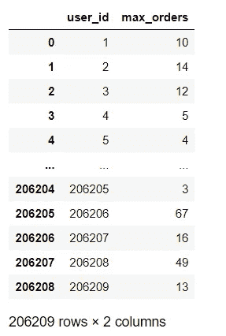

*类似地，像这样为用户创建其他功能，我们实际上可以实验并提出许多不同类型的功能来代替。max()我们可以使用。应用()并创建我们自己的函数，并提出新的特性。*

***用于产品:***

举一个产品的例子，任何产品都会得到 prod _ reorder _ mean。

```
#prod_reorder_mean : product reorder mean
prod_reorder_mean = 
prior_orders.groupby(by="product_id)["reordered"].mean().to_frame("prod_reorder_mean").reset_index()
prod_reorder_mean
```

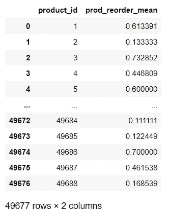

类似地，为产品创造其他功能，我们实际上可以试验并想出许多不同类型的功能来代替。mean()我们可以用。apply()并创建我们自己的函数，提出新的特性。

***为用户-产品特性:***

举一个用户产品的例子，用户和产品的订单数量。

```
#up_orders_num : Number of times user ordered the products
up_orders_num = prior_orders.groupby(["user_id","product_id"])["order_id"].count().to_frame("up_orders_num").reset_index()
up_orders_num
```

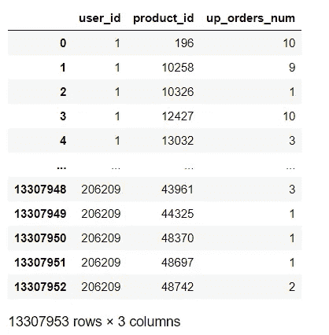

*类似地，为用户产品创建其他功能，我们实际上可以试验并提出许多不同类型的功能来代替。我们可以使用 count()。apply()并创建我们自己的函数，提出新的特性。*

就像这样，我们基本上制作了三个 pickle 文件，命名为“users.pickle”、“products.pickle”和“user_products.pickle ”,并将所有这些文件合并到一个数据集，我们可以称之为绝对数据集，我们必须从中创建 data_train 和 data_test，我们必须在此基础上进行建模并得出预测。

***制作绝对数据:***

```
user = pickle.load(open("users.pickle" , 'rb'))
products = pickle.load(open("products.pickle" , "rb"))
user_products = pickle.load(open("user_product.pickle" , "rb"))data = pd.merge(user_products , user , on="user_id" , how="left")
data = pd.merge(data , products , on="product_id" , how="left") #We want only the data with eval_set = "train" and "test"
orders_filtered = orders_data[(orders_data.eval_set == "train") | (orders_data.eval_set == "test")]
orders_filtered = orders_filtered[['user_id', 'eval_set', 'order_id']]#Making the absolute data
data = pd.merge(data , orders_filtered , on="user_id" , how="left")
data.fillna(0,inplace = True)
```

***制作数据 _train:***

```
#Training Dataset
data_train = data[data.eval_set == "train"]#Getting the information for the Trainig data from train data
data_train = data_train.merge(or_prod_train[['product_id', 'order_id', 'reordered']], on=['product_id', 'order_id'], how='left')#filling the NAN values in the reordered
data_train.reordered.fillna(0, inplace=True)#setting user_id and product_id as index.
data_train = data_train.set_index(['user_id', 'product_id'])#deleting eval_set, order_id as they are not needed for training.
data_train.drop(['eval_set', 'order_id'], axis=1, inplace=True)
```

**制作数据 _ 测试:**

```
#Creating Test Dataset
data_test = data[data.eval_set == "test"]#setting user_id and product_id as index.
data_test = data_test.set_index(['user_id', 'product_id'])#deleting eval_set, order_id as they are not needed for training.
data_test.drop(['eval_set', 'order_id'], axis=1, inplace=True)
```

# ***造型:***

*如果我们看看这个问题的业务约束，即延迟约束、准确性约束。*

*我用来选择最佳模型的指标是:*

*   *混淆矩阵*
*   *AUC-ROC*
*   *AUC-PR*
*   *f1-分数*

****查看指标:****

******AUC-ROC :*** 对于这个问题，这是一个很好的指标，可以确定模型对数据集的表现是否良好，以及是否应该考虑该模型。***

********F1 分数:*** 这是评估结果的主要指标，但就个人而言，这只是 F1 分数，而不是平均 F1 分数，因此对我来说，AUC-PR 是模型的更好的直觉。*****

********如何在这样的大数据上做建模？********

*****我面临的训练数据集的一个问题是管理训练的数据量。在像 XG-Boost 和 Random Forest 这样的模型上训练这样的大数据往往需要很长时间才能收敛，所以我建议使用那些有更多参数可以调整并且可能收敛更快的模型。*****

******对我来说，这些模型是:******

1.  *****轻梯度推进分类器。*****
2.  *****Catboost 分类器。*****

********取对数概率，然后最大化 F1 分数:********

*****最大化 F1 分数的代码片段:*****

```
*****thresholds = clf.predict_proba(X_test)[:, 1]
f1_scores = []
values = np.arange(np.mean(thresholds)-(2*np.std(thresholds)) , np.mean(thresholds) +(2*np.std(thresholds))  , 0.02)#Getting F1-Scores
for value in tqdm(values):
    y_pred = (clf.predict_proba(X_test)[:, 1] >= value).astype('int')
    f1_scores.append(metrics.f1_score(y_test , y_pred))#Plotting
plt.figure(figsize=(10,10))
sns.barplot(values , f1_scores , color = "red")
plt.xlabel("thresholds")
plt.ylabel("F1-score")
plt.title("Thresholds vs F1-score")
plt.grid(True)
plt.xticks(rotation = 90)plt.show()*****
```

*****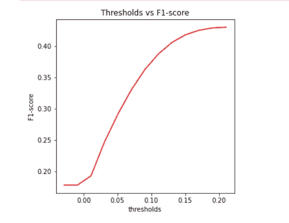*****

******用于光梯度增强分类器。******

*****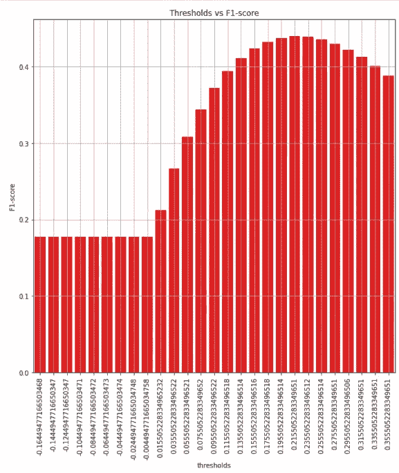*****

******用于 Catboost 分类器。******

*****我尝试的其他模型有 XG-Boost，随机森林分类器，MLP 分类器，Conv-1D 分层神经网络，密集层神经网络。*****

*****我选择的模型是 **Catboost 分类器**，因为它给了我其他模型中最高的 Kaggle 分数。*****

# *******ka ggle-评分和提交:*******

> ******所以，最后的 Kaggle 分数是* ***0.37868********
> 
> ******公众评分为 0.37868******
> 
> ******私人得分为* 0.37802*****

*****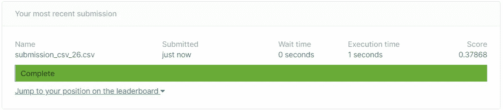*****

*****Kaggle 提交*****

*****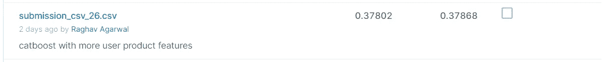*****

*****卡格尔分数*****

*****这个分数让我进入了排行榜前 20%的前 500 名。*****

# *****未来的工作*****

*****实际上还有一个增加准确度分数的技巧，即通过建立两个模型，一个用于预测哪些产品将被重新订购，另一个用于预测哪些用户将重新订购，然后合并使用阈值和概率形成的两个数据集。我真的很想尝试这种方法，因为尝试这种方法的人实际上得到了 0.4 以上的分数。*****

*****计算更多与用户和产品相关的特性，如用户购物车大小、用户的平均订单日等。*****

*****此外，我期待尝试 Apriori 算法，以获得更多的功能。*****

# *****参考*****

1.  *****[https://www . ka ggle . com/errolpereira/xgboost-with-minimal-feature-engineering # Creating-user-product-features。](https://www.kaggle.com/errolpereira/xgboost-with-minimal-feature-engineering#Creating-user-product-features.)*****
2.  *****[https://www . ka ggle . com/philippsp/explorative-analysis-insta cart](https://www.kaggle.com/philippsp/exploratory-analysis-instacart)*****
3.  *****[https://www.kaggle.com/nickycan/lb-0-3805009-python-edition](https://www.kaggle.com/nickycan/lb-0-3805009-python-edition)*****
4.  *****[https://medium . com/analytics-vid hya/insta cart-market-basket-analysis-ka ggle-competition-856 DDD 7 b 08 e 0](/analytics-vidhya/instacart-market-basket-analysis-kaggle-competition-856ddd7b08e0)*****
5.  *****[https://www . ka ggle . com/c/insta cart-market-basket-analysis/discussion/99252](https://www.kaggle.com/c/instacart-market-basket-analysis/discussion/99252)*****
6.  *****[https://www.appliedaicourse.com/](https://www.appliedaicourse.com/)*****

********GitHub 链接针对此问题的所有 pynb****:*[https://GitHub . com/Rag-hav 385/inta cart-Market-Basket-Analysis](https://github.com/Rag-hav385/Intacart-Market-Basket-Analysis)*****

********我的领英***:[https://www.linkedin.com/in/raghav-agarwal-127539170](https://www.linkedin.com/in/raghav-agarwal-127539170)*****