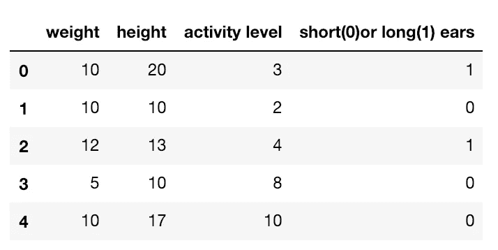
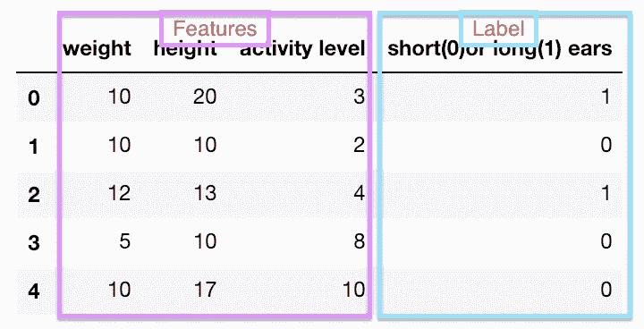

# 如何拆分训练和测试数据

> 原文：<https://medium.com/analytics-vidhya/how-to-split-train-and-test-data-3251ac6c4eb6?source=collection_archive---------0----------------------->

为初学者讲解的概念！


机器学习是数据科学的新热点领域。各种机器学习算法都可以用来寻找许多问题的解决方案，从情绪分析到预测股票价格，再到使用脑成像进行疾病分类。输入算法的数据对于形成结果的准确性至关重要。在机器学习中，至关重要的是将训练和测试数据正确地分成特征和标签，以便能够拥有提供良好预测的模型。

在本教程中，我将解释训练和测试数据的概念，并给出一个如何使用 Python 中的 Scikit-Learn 拆分数据的迷你演示。

我们首先要看我所说的特征、标签、训练数据和测试数据，以便更好地理解如何分解我们所拥有的信息。我创建了一个玩具数据集来解释这些概念。下面给出的示例数据集应该为我们提供了一种直观的方式，来概念化我们需要在数据框中了解的这些概念。玩具数据集有 4 列，给出了关于狗的体重(公斤)、身高(厘米)、活动水平(1-10)以及耳朵长度(分为短和长两类)的信息。我们想知道给定狗的体重、身高和活动水平，狗的耳朵是长还是短。(友情提示:该数据集仅用于说明方法，并不基于任何真实数据。)



先说标签。标签就是我们想要预测或者分类的东西。换句话说，标签是我们希望从算法中得到的结果。在我们的玩具数据集中，我们想要预测狗的耳朵是长还是短。我们的标签是标题为“短/长”的列。由于数据中只有两个选项，“长”和“短”，所以用数字 0 表示短，用数字 1 表示长。这是一个二元分类问题，因为我们想要的结果是将给定的信息分类为 1 或 0，长或短。在体重、身高和活动水平等其他栏中，我们可以获得关于狗耳朵长度的信息。



分割数据时，X 通常是要素，y 是标注。

在分割数据之前，我们将指定 X 和 y，如下所示。

在某些实际情况下，某些列可能与标签无关。在这种情况下，我建议要么将它们从要素中排除，要么找到与数据集上其他要素的连接，将其定制为另一个要添加到数据集的列。

首先，我们将导入我们的依赖项 numpy、pandas 和 scikit-learn。

```
import numpy as np
import pandas as pd
from sklearn.model_selection import train_test_split
```

我们将展示我们的数据框，以便更好地理解我们想要预测或分类的内容。在这种情况下，我从头开始创建我们的玩具数据集，并将其转换为熊猫数据框。

```
df = pd.DataFrame(a, columns = ["weight", "height", "activity level", "short(0)or long(1) ears"])
```

让我们通过将 features 列转换为 numpy 数组并排除 ear length 列来定义 X。对于 y，我们将只把标签列转换成 numpy 数组。请注意，在分割之前缩放和标准化数据也很重要，但不会在本文中讨论。

```
X = np.array(df.drop(['short(0)or long(1) ears'],1))y = np.array(df['short(0)or long(1) ears'])
```

这是一个好习惯，检查形状或 X 和 y，以确保形状在一条线上，以在训练时有一个适当的配合。否则，不同的形状可能会扰乱学习过程。打印出 X 和 y 来查看我们想要的信息是否到位也是有益的。让我们展示这些形状。

```
X.shape
```

这可以简单地用。形状函数。

```
y.shape
```

现在我们有了 X 和 y。我们可以使用 Scikit Learn 的 train_test_split 方法拆分数据。这样做的目的是将数据划分为来自 X:通常命名为 X_train 的训练数据，对应于来自 y: y_train 的 X 值的训练数据，以及将用于评估或换言之测试机器学习模型如何执行 X_test 和 y_test 的数据。

```
X_train, X_test, y_train, y_test = train_test_split(X, y, test_size = 0.2, random_state = 0)
```

test_size 指的是有多少数据将作为测试数据存储起来。在这种情况下，0.2 指的是数据的%20。该数字应介于 0 和 1 之间，对应于百分比刻度。test_size 越大，分割的训练数据量就越少。这可能会导致我们的模型没有足够的数据来训练。虽然对于 test_size 没有一套硬性的规则，但是它通常是数据的 20%左右。random_state 是一个确定内部随机整数的数字，该整数将用于随机分割数据。我们使用的数字不应该对模型或预测产生重大影响。

你有它！分割训练和测试数据，为机器学习算法的训练和测试做好准备。

*原载于 2018 年 12 月 28 日*[*【https://medium.com】*](/@karyaozmen/how-to-split-train-and-test-data-c1381d240fc4)*。*