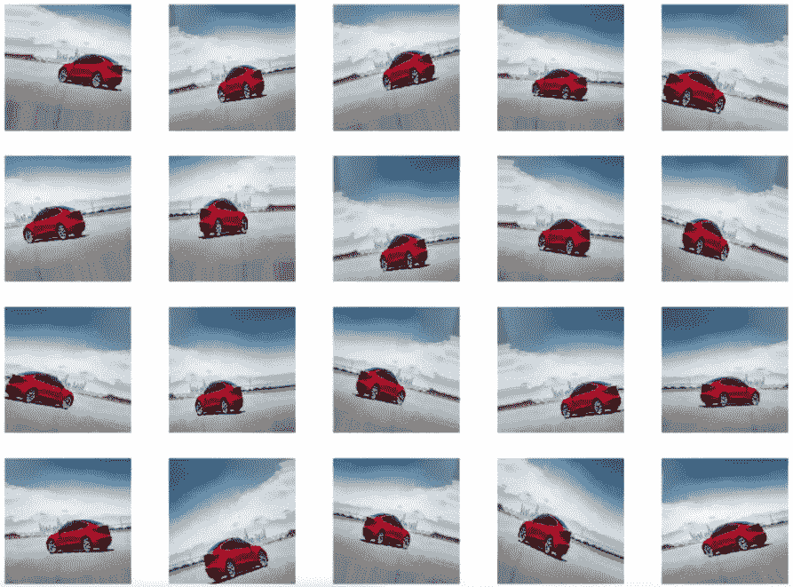
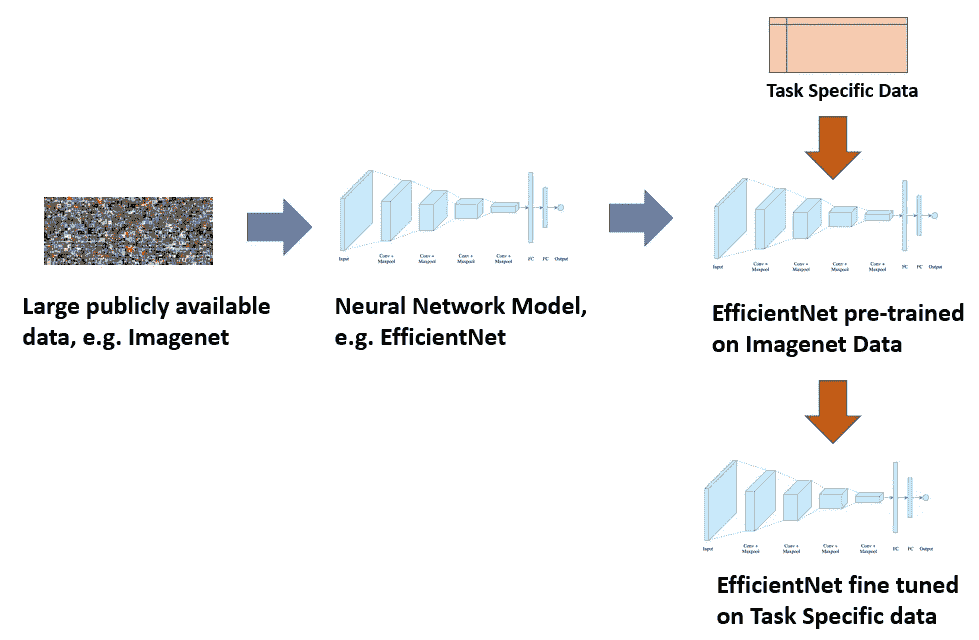
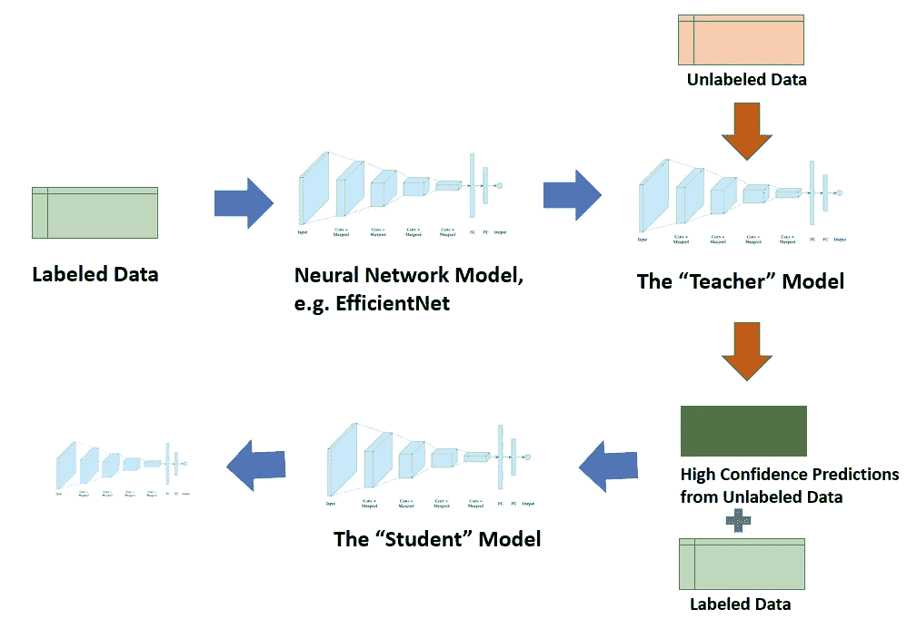

# 如何在训练人工智能模型时从数据中挖掘更多信息

> 原文：<https://medium.com/analytics-vidhya/how-to-squeeze-out-more-from-your-data-when-training-an-ai-model-884f0048feed?source=collection_archive---------4----------------------->

我们都听说过类似“数据是新的石油”之类的话。众所周知，大多数深度学习模型都非常渴望数据，获得适当的(带标签的)数据既困难又昂贵。考虑到所有这些，自然要做的事情是从你已经有的数据中挤出尽可能多的数据，我将介绍一些帮助我们做到这一点的技术

以下是我将在这个博客中涉及的项目列表。

1.  增大
2.  迁移学习
3.  半监督学习/伪标记
4.  模拟

请注意，并非所有这些技术都是通用的，它们是否适用取决于问题所在。当我深入研究时，我将指定一些适用的用例

# 增大

这项技术在计算机视觉中被大量使用。让我们以图像分类为例——即使我们对原始图像进行各种变换，例如翻转、旋转、改变光照、转换为灰度等，一张汽车照片也应该被分类为一辆汽车。事实证明，输入图像的所有这些变体为模型提供了增量信息并提高了性能。

**图 1:原始图像**

**图 2:增强图像**

增强的用例不仅限于*计算机视觉*(这是一个非常常用的基本概念)，还可以在其他领域使用。例如，在 *NLP* 中，一些有效的增强方法是:

*   *同义词替换—* 用同义词替换句子中随机选择的单词。
*   *随机删除单词——从句子中删除一些随机选择的单词。*
*   *中间语言翻译* —在这种方法中，将某种语言(比如英语)的文本翻译成中间语言(比如法语)，然后再翻译回源语言(英语)。理性是最终的英语句子会与最初的略有不同。这个很酷的[技巧](https://www.kaggle.com/c/jigsaw-toxic-comment-classification-challenge/discussion/48038)被 Kaggle [有毒评论分类挑战](https://www.kaggle.com/c/jigsaw-toxic-comment-classification-challenge/overview)中的一些顶级团队使用

*增强*是一项非常强大的技术，只需要对增强类型进行创造性的思考，就可以在问题领域工作，并且不依赖于任何其他外部数据。

# 迁移学习

这一概念再次在计算机视觉中大量使用，由于 [ELMo](https://arxiv.org/abs/1802.05365) 和 [BERT](https://arxiv.org/abs/1810.04805) 的成功，在 NLP 中也逐渐流行起来，并且可能也适用于其他一些领域。核心思想是——不是从零开始训练一个深度神经网络模型(使用你拥有的少量数据),而是微调一个为相关任务训练的现有模型(使用大量公开可用的数据)。

例如— [*Imagenet*](https://en.wikipedia.org/wiki/ImageNet) 是一个公开可用的图像数据集，包含大约 1400 万张跨越 20000 个类别的图像。如果您试图将图像分类到的类别在 *Imagenet* 数据中不存在，并且您只有几百张图像，那么您最好使用在 *Imagenet* 数据上预先训练的模型作为起点，并且通过使用您的几百张图像微调最后几层，您可以实现出色的性能。

**图 3:迁移学习过程**

迁移学习起作用的原因是——在一个有几十层的深度神经网络中——早期的层学习更多的基本模式，例如——学习识别线条、边缘等，而后期的层学习更多的特定任务模式，例如——定义图片中的猫的关键特征——所以只需对特定任务数据的最后几层进行微调就可以了。

# 半监督学习/伪标记

这是一种非常广泛适用的技术，适用于所有类型的数据——图像、文本、表格等，唯一的问题是——能够应用这种技术的先决条件是除了一些已标记的数据之外，还有未标记的数据(这通常更容易获得，也更便宜)。Kaggle 的顶级团队经常使用这种技术来获得额外的性能提升。

它的工作方式是——首先用你所有的标记数据训练一个(相对较小的)模型，并生成所谓的“教师”模型。“教师”模型用于对您拥有的大量未标记数据进行预测。您使用高置信度预测，有时通过在原始标记数据中添加一些噪声来训练一个更大的模型，称为“学生”模型。结果模型比仅在原始标记数据上训练的“教师”模型具有更好的性能。这里有一篇更详细的文章。

**图 4:半监督学习**

# 模拟

对于某些问题，通常在*强化学习*中，但有时在其他领域也是如此，人们可以在模拟环境中生成数据，并将其用于训练或测试。例如——*deep mind 的 AlphaStar* 在*星际争霸* II 中通过[训练](https://deepmind.com/blog/article/AlphaStar-Grandmaster-level-in-StarCraft-II-using-multi-agent-reinforcement-learning)在数万年的虚拟(模拟)游戏体验中取得了大师级的地位。

模拟环境用于培训或验证的另一个例子是自动驾驶汽车模型。

还有很多框架，比如脸书的 [Habitat](https://aihabitat.org/) ，谷歌的[Behavior Suite for Reinforcement Learning](https://deepmind.com/research/open-source/bsuite)，OpenAI 的 [Gym](https://gym.openai.com/) 帮助运行模拟环境。

# **总结**

虽然从模型训练的角度来看，更多的数据总是更好，但这可能会花费大量的时间和金钱。至少可以最有效地利用他们现有的数据。上面描述的技术是你可以做到这一点的一些方法。