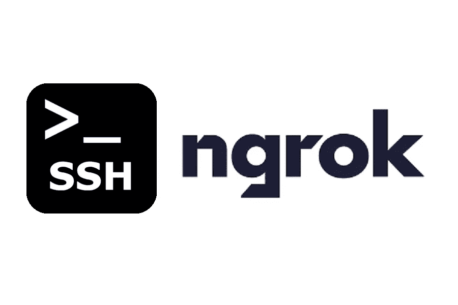
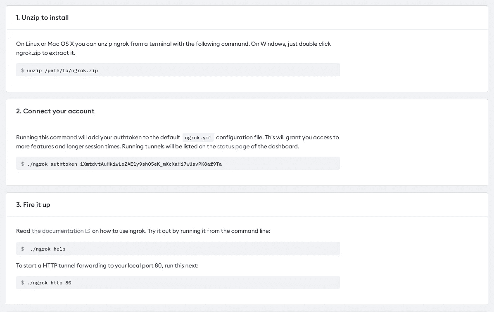
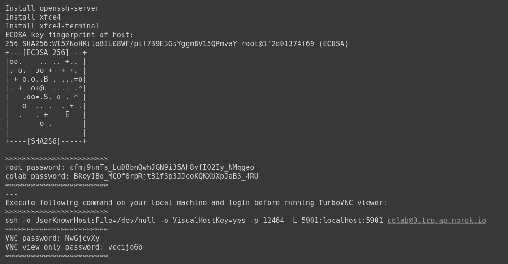
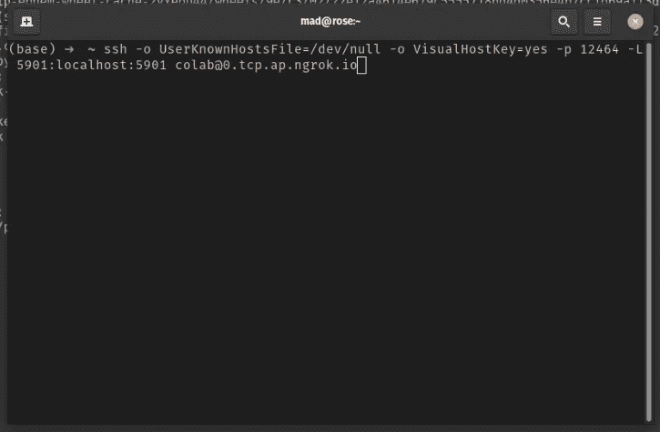
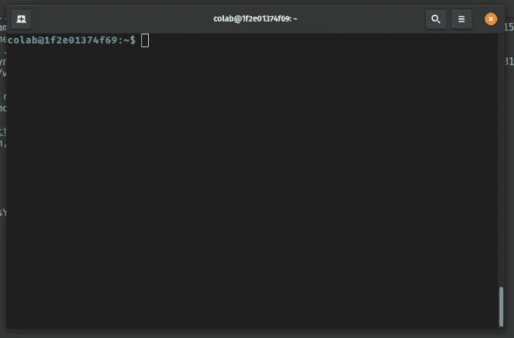
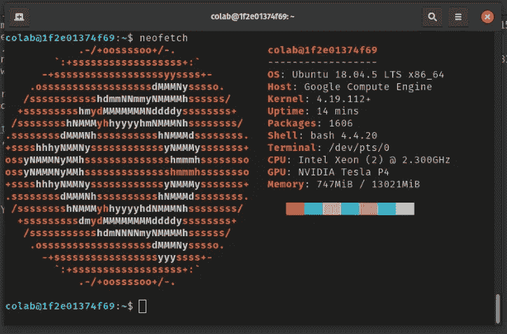
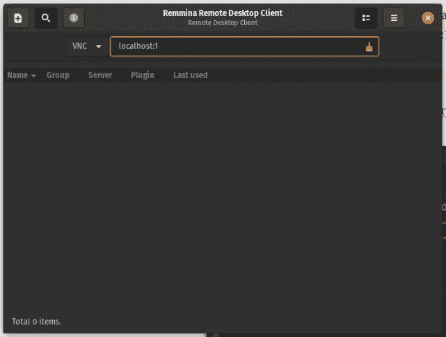
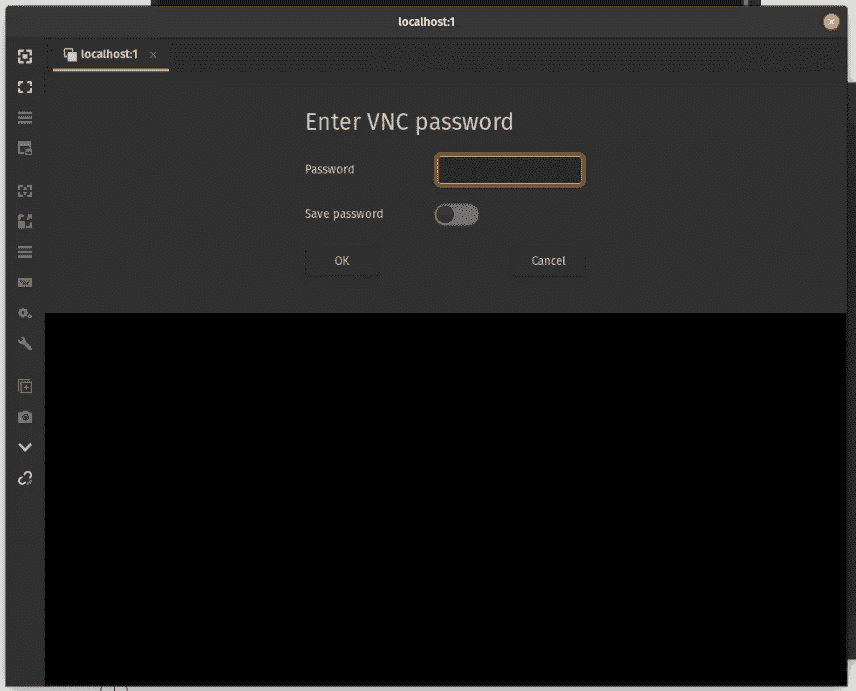
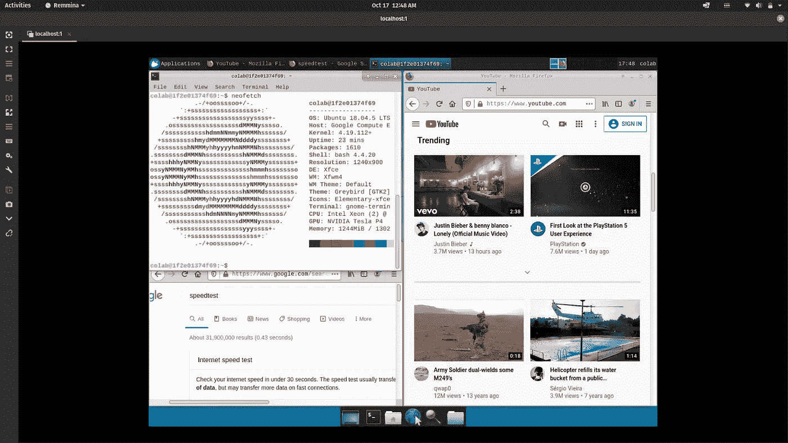
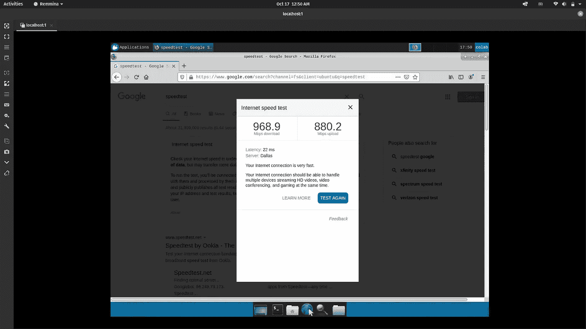

# 如何在 Google Colab 上使用宋承宪和 VNC

> 原文：<https://medium.com/analytics-vidhya/how-to-ssh-and-vnc-on-google-colab-fb05de96098a?source=collection_archive---------5----------------------->

如你所知，谷歌实验室运行在 Jupyter 笔记本界面，使用 Linux 服务器。但是，对于一些人来说，Jupyter 笔记本界面并不能真正满足他们的需求。例如，想象你使用 Docker 等第三方应用程序进行一些测试，使用 torrent 将数据传输到你的 Google Drive 帐户，或者可能需要运行一些 GUI 应用程序。

ngrok —保护到本地主机的自省隧道

在此之前，你必须准备一些东西:

1.  [Ngrok](https://ngrok.com/) 账户。
2.  [OpenSSH](https://www.openssh.com/)(Mac/Linux)[Putty](https://www.putty.org/)(Windows)，或者 WSL。
3.  VNC 浏览器( [Remmina](https://remmina.org/) 、 [TigerVNC](https://tigervnc.org/) 等)，GUI 界面可选。

首先，您需要一个 Ngrok 帐户并获得您的授权令牌

NGROK 仪表板

之后，去你的谷歌实验室粘贴这段代码。在这一部分，你需要安装一个神奇的软件包，它允许你使用 ngrok [remocolab](https://github.com/demotomohiro/remocolab) 进行连接。

密码

然后，prompt 会询问您有关 ngrok 身份验证令牌的信息。只需粘贴您的身份验证令牌。等待安装完成。

即时结果

如果你做对了，那么结果和上面差不多。

最后到你的终端粘贴链接。对于访问密码，只需粘贴 colab 密码。

嘘

登录后

新获取

如果你需要一些 GUI(图形用户界面)，你需要 VNC 浏览器(这里是 Remmina)。对于地址为**的本地主机:1**

和密码是 VNC 密码在 Jupyter 笔记本提示。

仅此而已。

对有些人来说，也许 Jupyter 笔记本就够了，而对另一些人则不然。也许这个教程可以帮助你的一天，或者让你的生活更轻松。

….谢谢你…