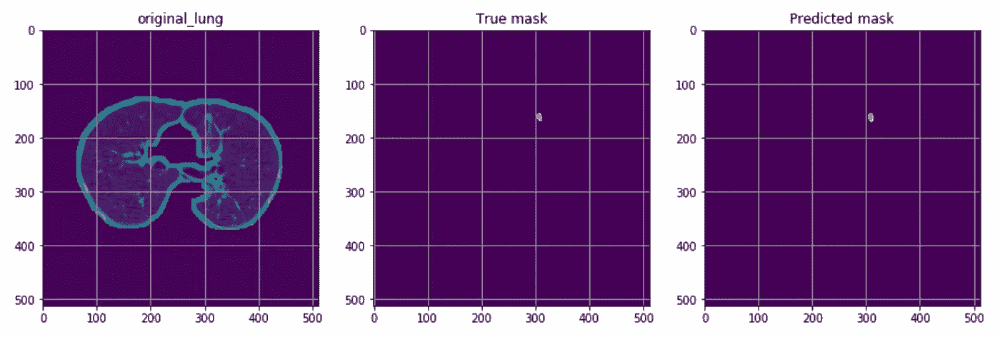

# 如何使用 Python 开始您的第一个肺癌检测项目(第 1 部分)

> 原文：<https://medium.com/analytics-vidhya/how-to-start-your-very-first-lung-cancer-detection-project-using-python-part-1-3ab490964aae?source=collection_archive---------2----------------------->

分割模型的输出

人工智能在医疗领域是如何使用的？对这类问题的一个老生常谈的回答是肺癌检测。但是说真的，你们中有多少人以前见过肺部图像数据？或者一个简单的 Jupyter 内核对这种类型的数据进行预处理？老实说，这不是一个容易的项目，一个人可以简单地…