# 如何保持 Airbnb 主机的竞争力(第一部分-定价)

> 原文：<https://medium.com/analytics-vidhya/how-to-stay-competitive-as-an-airbnb-host-part-i-pricing-472685c43c61?source=collection_archive---------20----------------------->


Airbnb 在 2008 年由三个出租空气床垫的家伙开始，今天已经成为 350 亿美元的企业，重塑了世界各地的租赁市场和旅游业。我认识的很多人都认为 Airbnb 是与世界各地的旅行者建立联系的好方法，同时还能获得额外收入。在我目前居住的城市西雅图，在过去五年里，成为 Airbnb 的主持人无疑变得非常受欢迎。

上个季度，我和我在华盛顿大学福斯特商学院的团队偶然发现了这个很棒的 Airbnb 数据库。我们决定在西雅图开展一个关于 Airbnb 房源的项目。我们旨在回答的大问题是——作为 Airbnb 房东，如何保持竞争力？我们从两个角度探讨了这个问题——一个是定价，另一个是超主机状态。这篇文章是关于第一部分——**Airbnb 房东应该如何选择他们的房源价格？**有兴趣可以在这里找到第二部[。](/@randu/how-to-stay-competitive-as-an-airbnb-host-part-ii-superhost-a1ecad0e89f3?source=friends_link&sk=202843109ccaaf811419cbe2539d0344)

# 第一部分——定价

作为一个主持人，尤其是一个新主持人，你需要做的第一个也是最重要的决定是，我应该给我的 Airbnb 房源定价多少？为了回答这个问题，对 Airbnb 上类似房源的平均价格进行基准测试将是有用的。在这里，列表的相似性取决于列表特征，例如邻居、财产类型、房间类型、便利设施等等。我们相信 CART 模型将是我们解决这个问题的一个很好的工具，因为对于每个列表，数据集中有相当多的属性可用，包括分类变量和数值变量。在我们开始研究这个模型之前，让我们先来看看数据。

## 探索性数据分析

1.  位置

传统观点认为，房地产投资最重要的是位置、位置、位置。我们先来看看西雅图 Airbnb 房源的地域分布。

```
ggplot(listings_merged) + 
    geom_bar(aes(x = fct_rev(fct_infreq(neighbourhood_group)), fill = room_type )) +
    ggtitle("Number of Airbnb's per Neighbourhood Group in Seattle") +
    xlab("Neighbourhood Group") +
    ylab("Count") +
    guides(fill=guide_legend(title="Room Type")) +
    coord_flip()
```

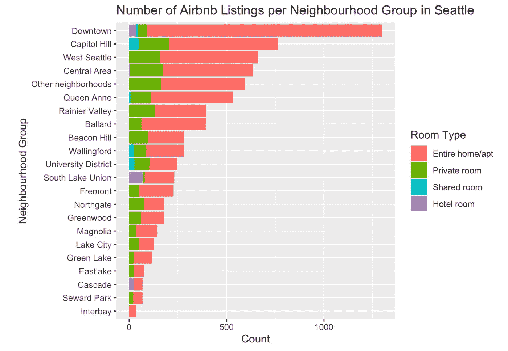

毫不奇怪，市中心有最多的 Airbnb 房源，其余的分布是倾斜的。对于我们的分析来说，一些小的邻里团体可能太细了。我们创建了一个新的可变邻域区域，它将邻域分组为八个区域。例如，西雅图市中心包括南湖联盟、东湖、西湖、蒙特莱克、波蒂奇湾和其他一些周边地区。

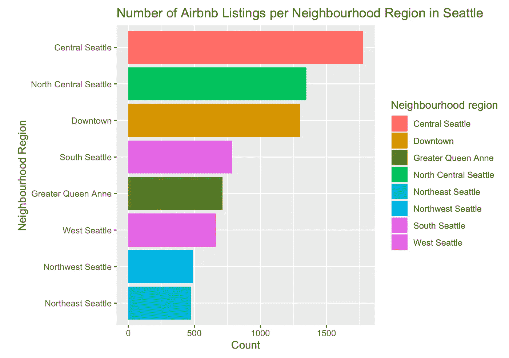

2.财产属性

典型地，Airbnbs 是房子或公寓；客人可以进入整个住宅/公寓或私人房间。还有其他类型吗？我惊讶地发现 Airbnb 上也有酒店房间。

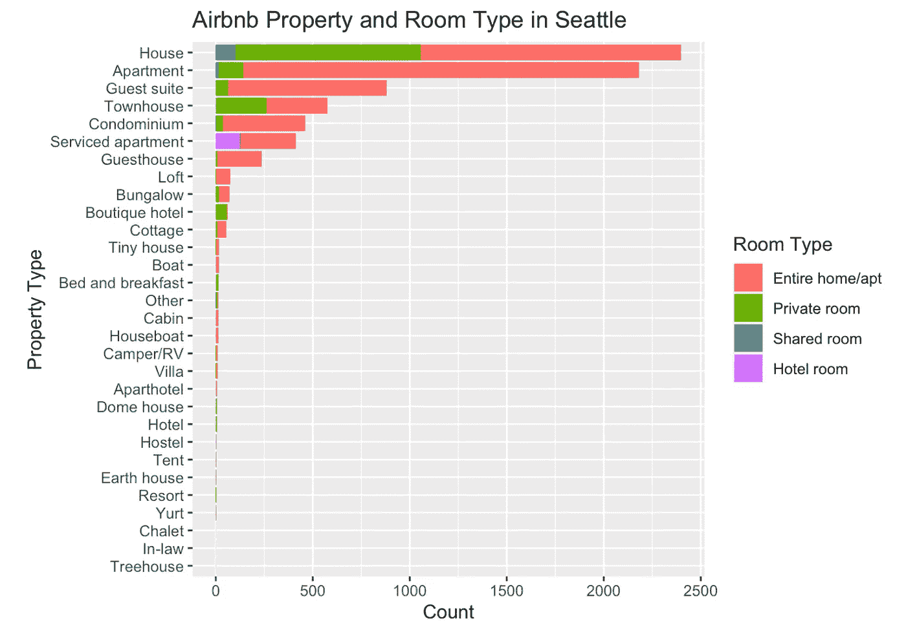

平均面积是 1-2 间卧室和 1-2 间浴室。

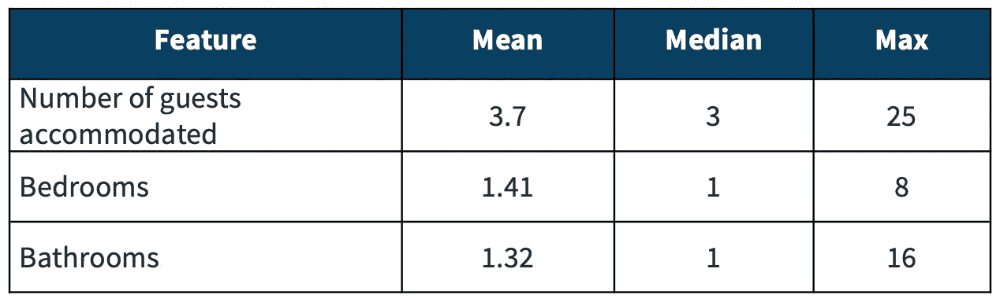

暖气和 Wifi 似乎是西雅图的标准设施，而厨房、电视和免费停车场却不是。拥有空调和允许宠物是非常罕见的。

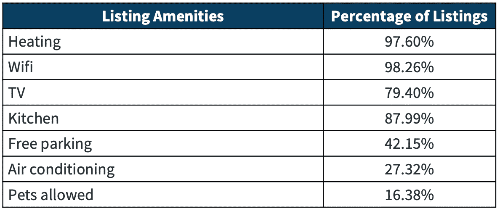

3.主机属性

西雅图的主持人相对比较有经验。Airbnb 成立于 2008 年，一个主人可以拥有的最长月数约为 12 年，即 144 个月。西雅图主持人的平均经验约为 50-60 个月。

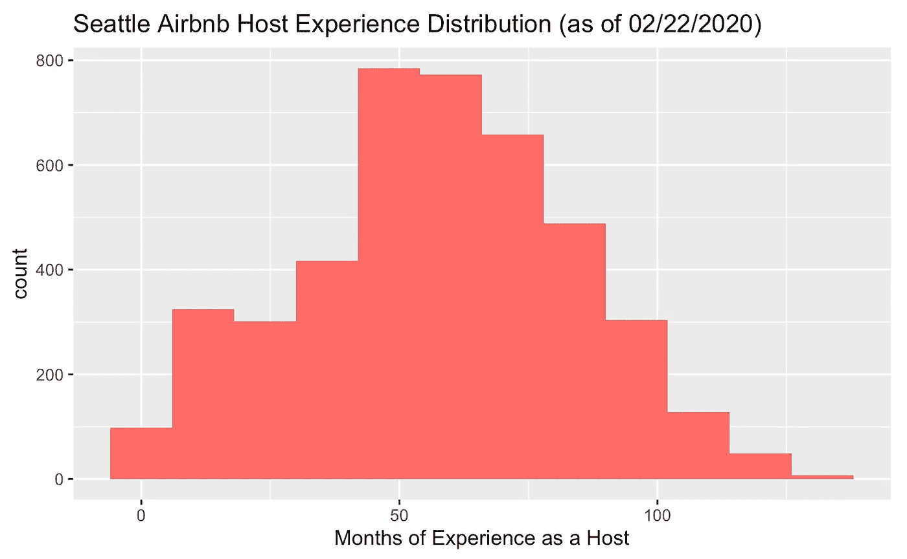

虽然西雅图的大多数 Airbnb 主机可能是业余爱好者，但也有主机在西雅图有超过 300 个列表。进一步分析发现，这些都是度假租赁管理公司一样，瓦卡萨。

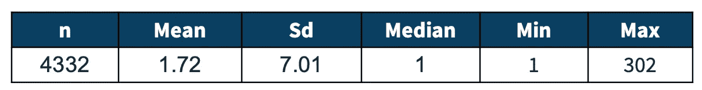

西雅图每台主机的列表数量

4.评级

Airbnb 有几个评分。总体评分为 1 至 100 分，而准确度和清洁度等分项评分为 1 至 10 分。这里我们看的是总体评分。看起来大多数人对自己的评分都很慷慨，大多数人的评分都在 90 分以上。

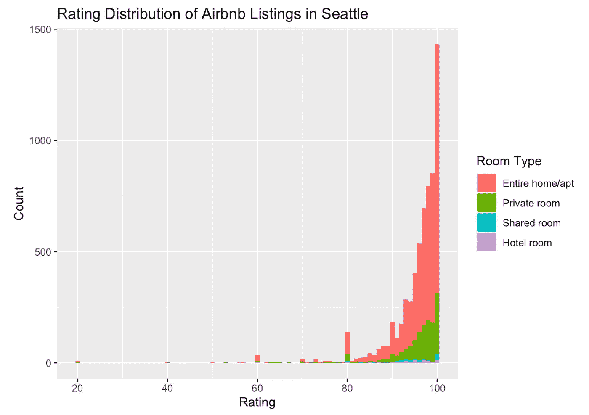

5.价格

请注意，一个技术细节是，在 Airbnb 上，主人设定的价格并不是客人看到的价格。客人看到的价格通常较高，因为除了主人定的价格之外，还包括服务费、清洁费和任何其他费用。因为我们在这个项目中使用的数据库是在今年的某一天(准确地说是 2020 年 2 月 22 日)从公共互联网上搜集的，所以这个数据集中的价格数据就是客人在那一天看到的价格。出于本分析的目的，我们将始终将价格称为客人看到的价格。

从下图可以看出，截至 2020 年 2 月 22 日，西雅图大多数 Airbnb 房源的价格都在 100 美元左右。显然，数据集中有一些异常值，价格为 9999 美元，可能是由于一个错误。一个有趣的观察是，让你的价格以 9 结尾的旧零售“技巧”，比如 109 美元，似乎在 Airbnb 空间也很常见。目前还不清楚这是由主人精心计算客人的最终成本控制的，还是由 Airbnb 定价算法优化的。

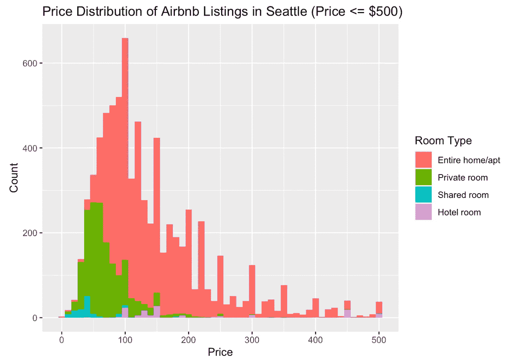

6.杂项属性

一些有趣的发现。大约一半的房源可以即时预订，大约一半的房东是超级房东。

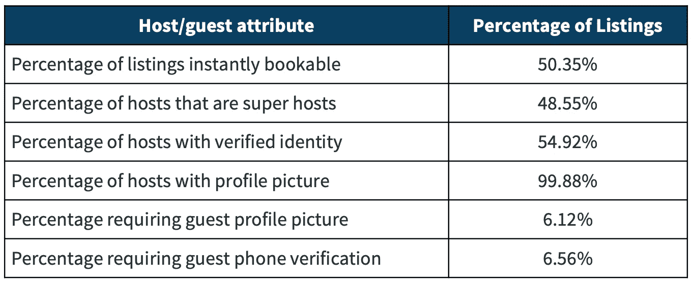

## 分类和回归树

现在我们已经对数据有了一个很好的概念，让我们创建模型。我们将使用 18 个预测因素来预测平均价格，包括酒店的属性、便利设施、主人、评论评级、取消政策、响应速度、最短停留时间等。

```
library(rpart)
library(rpart.plot)model1 <- price ~ neighbourhood_region + property_type + room_type +  accommodates + bedrooms + bathrooms + amenities_tv + amenities_ac + amenities_kitchen + amenities_petsallowed + amenities_freeparking + instant_bookable + host_identity_verified + cancellation_policy_strictness + minimum_nights + number_of_reviews + months_as_host + host_is_superhosttree <- rpart(formula = model1, data = listings_train, control = rpart.control(cp = 0.005))
rpart.plot(tree)
```

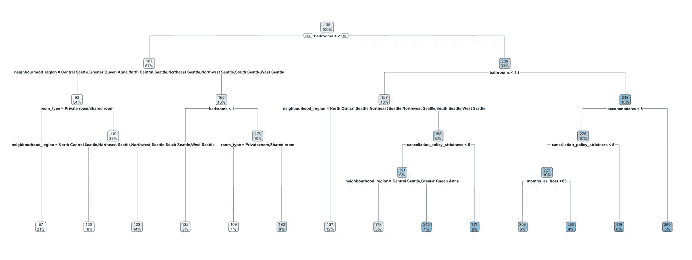

正如我们在 CART 图中看到的，尽管模型中有 18 个预测值，但我们的树非常浅，只有 4-5 层。Airbnb 房源的价格似乎在很大程度上与卧室数量相关，然后是邻近地区，换句话说，是面积和位置。像便利设施、超级主机状态或取消政策等功能似乎与定价没有任何明显的关系。

## XGBoost

因为我们的树很浅，我们将提升它。这里我们使用的是 XGboost，一种由我的学校华盛顿大学开发的梯度推进算法。

```
library(xgboost)
xgboost <- xgboost(data = data.matrix(listings_train[,..col]), 
                  label = listings_train$price,
                  eta = 0.1,
                  max_depth = 8,
                  nrounds = 50, 
                  subsample = 0.75,
                  colsample_bytree = 1,
                  min_child_weight = 10,
                  gamma = 1,
                  nthread = 55,
                  eval_metric = "rmse",
                  objective = "reg:squarederror",
                  verbose = 0
                  )xgb.plot.tree(model = xgboost, trees = 3, show_node_id = TRUE)
```

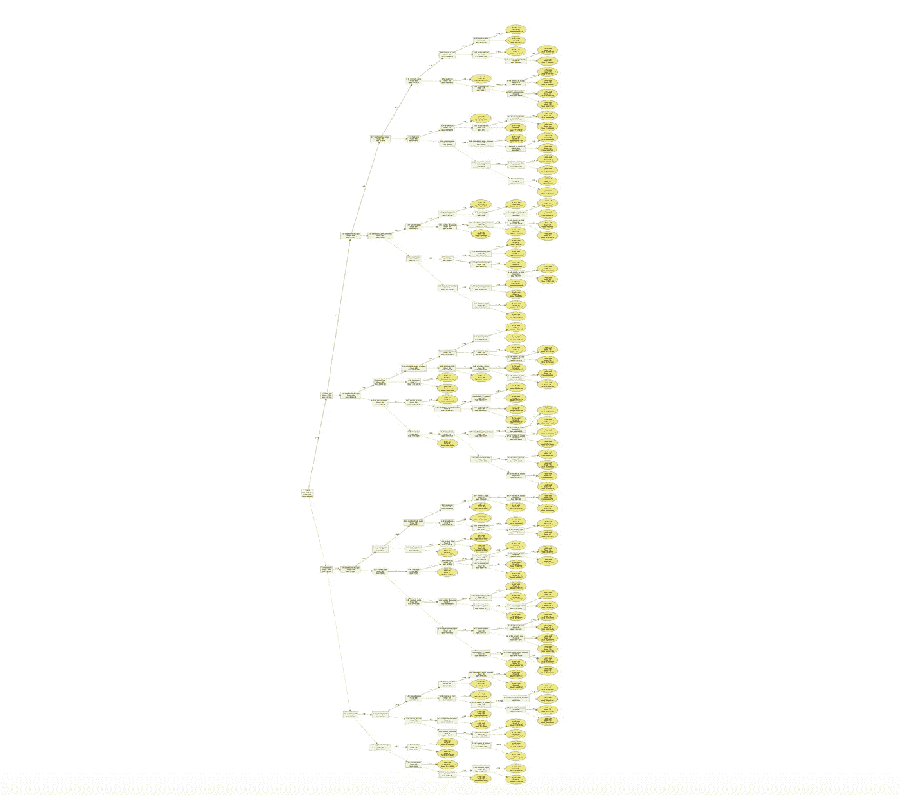

不容易看到被助推的树的细节。我们将使用交叉验证来微调模型的超参数。

## 交互效度分析

经过一些调整，我们已经确定了我们的模型。由于我们有一个回归模型，我们将使用 RMSE(均方根误差)来评估这两个模型的性能。较小的 RMSE 表明更适合。如您所见，XGboost 在训练和验证数据集上都有较小的 RMSE。我们将使用 XGboost 进行预测。

```
# CART train vs validation
rmse(listings_train$price_pred1, listings_train$price)
rmse(listings_val$price_pred1, listings_val$price)#XGboost train vs validation
rmse(listings_train$price_pred2, listings_train$price)
rmse(listings_val$price_pred2, listings_val$price)+---------+-----------+-------------+
|  RMSE   |  Training |  Validation |
+---------+-----------+-------------+
| CART    |  61.51315 |    64.07400 |
| XGBoost |  38.00336 |    53.92921 |
+---------+-----------+-------------+
```

## 预言；预测；预告

为了便于说明，我们创建了两个虚构的新 Airbnb 主机配置文件。默认情况下，它们不会有评论，也不是超级帖子。

**场景 1:**

*   西西雅图房子里的私人房间。一次最多两位客人。客人可以使用一间卧室和一间浴室。没有厨房。
*   房前免费停车，但没有电视或空调
*   主机将允许宠物:)
*   主机身份得到验证
*   取消政策是灵活的
*   至少入住 1 晚

**场景二:**

*   整个公寓位于西雅图市中心。一次最多两位客人。客人可以进入一间卧室、一间浴室和厨房。
*   没有免费停车场(在市中心！)但是还有电视和空调
*   大楼里不允许养宠物:(
*   主机身份得到验证
*   取消政策是灵活的
*   至少入住 1 晚

Airbnb 房源和我们虚构的主机差不多的平均价格是多少？根据我们的 XGBoost 模型，场景 1 的平均价格为每晚 112 美元，场景 2 的平均价格为每晚 146 美元。

## 结论

如果你是迫切需要你帮助的新主人的朋友，你会建议价格是多少？嗯，没有价格和需求数据，很难说如果定价高于或低于平均价格会影响多少需求。我推荐的一个常见策略是定价略低于平均价格，假设这将有助于更快地吸引新的预订。略低于多少？回想一下我们之前的价格分布图。以“9”结尾的价格，比如$109，$119，…，似乎很受欢迎。我建议我们的虚拟主机一的价格为 109 美元(低于 112 美元)，虚拟主机二的价格为 139 美元(低于 146 美元)。你可能还想考虑到季节性。由于我们的价格预测是基于 2020 年 2 月 22 日收集的样本，这不是在西雅图的旅游旺季，因此与今年其他时间相比，这些价格可能较低。时间序列分析有助于将季节性因素纳入我们的定价模型，但我们受到数据的限制。常识告诉我们，我们的虚拟主人可能有提高价格的空间，以抓住旺季不断增长的需求。

# 第二部分——超级主机

未完待续…

你可以在这里找到第二部。

*   *本文中的数据处理和可视化都是用 r .在我的* [*Github*](https://github.com/raaandu/blog_posts/tree/master/Airbnb_how_to_stay_competitive) *上找到更多。*
*   这个项目的贡献者还包括我的队友 Mike Lahoda 和 Nivedita Thiagarajan