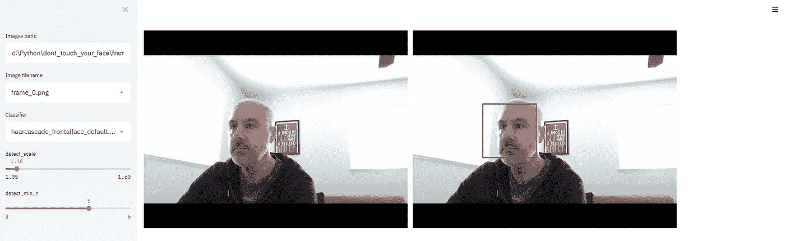
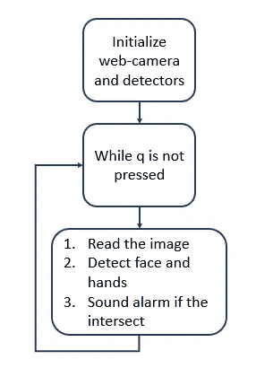
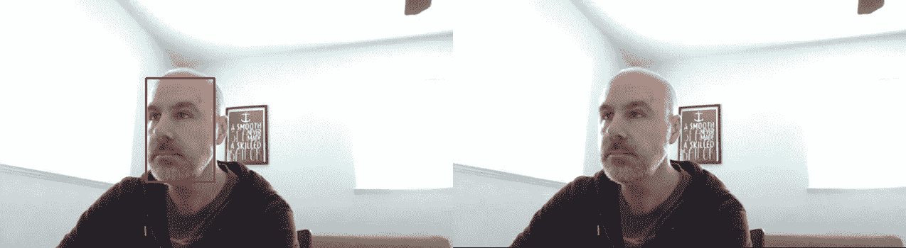
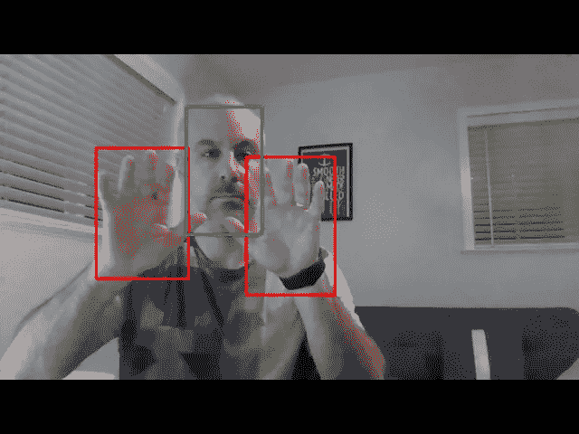

# 如何停止摸脸？使用 Python 进行手部和面部检测

> 原文：<https://medium.com/analytics-vidhya/how-to-stop-touching-your-face-hands-and-face-detection-with-python-60ecb0d28d69?source=collection_archive---------4----------------------->

当双手靠近面部时，会发出警报声

# 介绍

我通常会写一些关于[业务发展](/analytics-vidhya/growth-hacker-guide-to-business-intelligence-2eb9f77c559c?source=friends_link&sk=62020c248ca686a0db913018d9f3687d)、[营销和成长黑客](/analytics-vidhya/introduction-to-growth-hacking-how-to-expand-your-contacts-database-virtually-infinitely-9845b03234e2?source=friends_link&sk=cc076a0bfc2b8ce0ab40becb385dc006)的文章。这个帖子不一样。嗯，我们的生活也变得非常不同…

> 目的是说明一种(非常)简单的方法来利用人工智能和机器学习来检测手和脸。我将使用已经存在的模型和库，所以不需要培训。

我最终使用的用于人脸检测的库( [*cvlib*](https://github.com/arunponnusamy/cvlib) )也可以检测 [80 个上下文](http://cocodataset.org/#home)中的常见对象。因此它对其他应用程序也很有用。

**完整代码在这里:**[**https://github.com/borismay/dont_touch_your_face**](https://github.com/borismay/dont_touch_your_face)

如果你还记得，有一个非常流行的帖子:[用 Mask R-CNN 和 Python 抢停车位](/@ageitgey/snagging-parking-spaces-with-mask-r-cnn-and-python-955f2231c400)，我用了几乎相同的方法。

它在我配有 i7 CPU 的笔记本电脑上运行，没有 GPU，正如你所见，它非常接近实时。因此，人们可以将它移植到其他平台，或者在家里使用它来培养健康和拯救生命的习惯:-)

你会惊讶于自己摸脸的次数！

所以，保持安全和健康，让我们看看它是如何工作的。

# 寻找正确的分类器

对于人脸检测，我测试了几个现有的库。

可以参考 *detectors.py* 实现所有被测试的检测器。还有一个用于微调检测参数的 Streamlit UI。Github 库里什么都有。



简化用户界面，微调各种检测参数

判决如下:

1.  *cv2。cascade classifier*——这是一个嵌入式分类器，附带了 [Open-CV 库](https://pypi.org/project/opencv-python/)。有多个参数可以配置，在文档中没有很好地解释。幸运的是，有一个 [StackOverflow post](https://stackoverflow.com/questions/20801015/recommended-values-for-opencv-detectmultiscale-parameters) 可以带你通过。整体性能不够。只有当你直视镜头时才有效
2.  [*face _ recognition*](https://pypi.org/project/face-recognition/)—构建在 dlib 之上的一个包。有两种检测模式:*【hog】*和*【CNN】*。它用*‘CNN’*提供了合理的结果，然而在我简单的硬件上它非常耗时
3.  **获胜者是…**[***cvlib***](https://github.com/arunponnusamy/cvlib)*——下面， *cvlib* 正在使用一个类似 AlexNet 的模型，该模型是在 Gil Levi 和 Tal Hassner 的 [CVPR 2015](https://talhassner.github.io/home/publication/2015_CVPR) 论文的 [Adience 数据集](https://talhassner.github.io/home/projects/Adience/Adience-data.html#agegender)上训练的。它产生了非常稳健的结果和快速的性能。除了人脸检测，它可以用一行代码检测上下文中的 80 个[常见物体](https://github.com/arunponnusamy/object-detection-opencv/blob/master/yolov3.txt)。对于对象检测，它使用在 [COCO 数据集](http://cocodataset.org/)上训练的 [YOLOv3](https://pjreddie.com/darknet/yolo/) 模型*

*找到一个可靠的手部检测库有点困难。我用的是 [Victor Dibia 的](https://medium.com/u/304fe0310a13?source=post_page-----60ecb0d28d69--------------------------------)作品，在本帖中描述:[如何在 Tensorflow](/@victor.dibia/how-to-build-a-real-time-hand-detector-using-neural-networks-ssd-on-tensorflow-d6bac0e4b2ce) (2017)，GitHub repository，[https://github.com/victordibia/handtracking](https://github.com/victordibia/handtracking)上使用神经网络(SSD)构建实时手部探测器。*

# *把所有的放在一起*

*流程如下:*

**

1.  *配置网络摄像机并初始化其参数*
2.  *初始化探测器*
3.  *无限循环:
    读取图像
    检测面部和手部
    如果他们靠得很近，警告用户*

## *网络摄像头*

*创建网络摄像机对象，并配置图像大小:*

```
*cap = cv2.VideoCapture(0)
cap.set(3, 1280/2)
cap.set(4, 1024/2)*
```

*网络摄像头的参数描述可以在[这里](https://stackoverflow.com/questions/11420748/setting-camera-parameters-in-opencv-python)找到。*

*捕捉视频帧也非常简单:*

```
*ret, frame = cap.read()*
```

*然而，来自照相机的图像是 BGR 格式的。为了将它提供给分类器，您需要将其转换为 RGB:*

```
*rgb = cv2.cvtColor(frame, cv2.COLOR_BGR2RGB)*
```

## *面部和手部检测*

*我定义了一个基类，为我将使用的所有检测器提供一个类似的接口:*

```
*class Detector:
    detector_params = {}
    detector = None

    def __init__(self):
        pass

    def set_detector_params(self, params):
        self.detector_params = params

    def detect(self):
        pass*
```

*每个检测器将从这个类继承并实现它的方法，包括构造函数。使得在创建检测器对象之后，它将具有相同的接口。*

*例如，这是 FaceDetector 的实现，以及它在代码中的调用方式:*

```
*class CVLibDetector(Detector):
    def __init__(self):
        self.detector = cv

    def detect(self, rgb_image):
        # returns an array of (top, right, bottom, left)
        objects, confidences = self.detector.detect_face(rgb_image)
        # change to an array of (x, y, w, h)
        return [(top, left, bottom - top, right - left) for (top, right, bottom, left) in objects]FaceDetector = CVLibDetector()
face = FaceDetector.detect(rgb)*
```

**

*人脸检测结果*

*正如我提到的，我使用了[如何在 Tensorflow](/@victor.dibia/how-to-build-a-real-time-hand-detector-using-neural-networks-ssd-on-tensorflow-d6bac0e4b2ce) (2017)、GitHub repository、[https://github.com/victordibia/handtracking](https://github.com/victordibia/handtracking)上使用神经网络(SSD)构建实时手部检测器作为起点。我需要更新几行代码，让它在没有 GPU 的情况下与 TensorFlow 2.0 一起工作。*

## *检测面部触摸*

*因为这是 2D 图像，所以没有简单的方法来模拟手和脸的三维位置。*

*我假设如果检测到的手和脸的边界框相交，它将被声明为触摸事件。*

**

*为了实现检测，我使用了 [shapely](https://github.com/Toblerity/Shapely) 库。这是一个非常有用的几何计算库，我经常用它进行地理空间分析。*

*每个检测到的对象由以下参数表示:*

```
*x, y, w, h = obj*
```

*我将把每个检测到的对象变成一个多边形，然后计算手的多边形和脸的多边形之间的交集:*

```
*def obj_to_poly(obj):
    x, y, w, h = obj
    return Polygon([(x, y), (x+w, y), (x+w, y+h), (x, y+h)])def objects_touch(face, hands):
    if face and hands:
        face_poly = obj_to_poly(face[0])
        for hand in hands:
            hand_poly = obj_to_poly(hand)
            if face_poly.intersects(hand_poly):
                return True
    return False*
```

*如果这些对象相交，该函数将返回 True。*

*就是这样。*

*我在周末花了几个小时把它们放在一起，目的是展示用 python 使用机器学习和人工智能是多么容易。有许多已经可用的经过训练的库，使我们能够以最小的努力构建强大的应用程序。*

*还有一件事。也许这个原型也可以用来增加我们触摸面部的自我意识。下载它，运行 30 分钟，你就会看到结果。*

***呆在家里，把手从脸上拿开。***