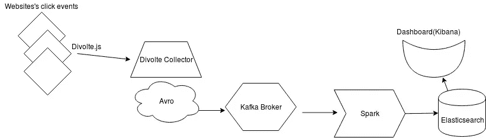

# 如何存储和实时分析点击流数据？

> 原文：<https://medium.com/analytics-vidhya/how-to-store-and-real-time-analysis-of-clickstream-data-e8460467aa88?source=collection_archive---------12----------------------->



实时点击流数据分析

上图不言自明。

**为什么要存储点击流？**

1.  了解访客的行为并获得有价值的客户洞察。
2.  为实时推荐系统获取实时用户行为和活动
3.  开发横幅优化系统。

T **科技**:

1.  电压 **:**
2.  阿帕奇卡夫卡
3.  阿帕奇火花
4.  弹性搜索
5.  基巴纳

# **Divolte:**

Divolte Collector 是一个可扩展的高性能服务器，用于收集 HDFS 和 Kafka 主题的点击流数据。它在客户端使用 JavaScript 标签*来收集用户交互数据，类似于许多其他网络跟踪解决方案。Divolte Collector 可以用作构建任何东西的基础，从基本的 web 分析仪表板到实时推荐引擎或横幅优化系统。*

Divolte 使用 Apache Avro 序列化系统来存储数据。Divolte 提供 ip2location 支持和用户代理解析。您可以在配置文件中定义自定义事件。

**Divolte 安装:**

Divolte Collector 目前仅在类 Unix 系统上受支持。下一步是下载、解压缩并运行 Divolte Collector。你可以在我们的[项目主页](https://github.com/divolte/divolte-collector)上找到最新版本。运行以下命令:

```
% tar -xzf divolte-collector-*.tar.gz
% cd divolte-collector-*
% touch conf/divolte-collector.conf
% ./bin/divolte-collector
```

它以默认配置运行，而您可以设置您的配置。

几个文件:

1.  **divolte-collector . conf-**这是服务器配置文件。您可以为事件定义**源**并定义 java 脚本文件名。你可以定义**映射**，在那里你可以映射你的源(点击流)到汇(卡夫卡)。您还可以定义**水槽**配置。
2.  你可以在 Avro 中定义你的事件或数据的格式。
3.  **mapping.groovy:** 映射你的点击流数据到你的 avro 文件。

请在您想要记录事件的网站上包含以下文件。

```
<script src="divolte.js" defer async></script>
```

默认情况下，当您运行 divolte with below 命令时，它会将 **tmp** 目录中的事件写入文件。

```
./bin/divolte-collector
```

现在，用你的网络浏览器访问 [http://127.0.0.1:8290/](http://127.0.0.1:8290/) ，检查你是否看到了一个页面。该网页中插入了 Divolte Collector JavaScript 标记，因此加载该页面将向服务器注册一个 pageview 事件。此外，您可以单击横幅一次或多次，以生成其他事件或重新加载页面几次。你也可以用下面的命令查看数据。

```
% find /tmp/ -name '*divolte-tracking-*.avro' | sort | tail -n1 | xargs ./bin/avro-tools tojson --pretty
```

# 写给卡夫卡

在我们的例子中，水槽是卡夫卡。将以下内容添加到您的 Divolte 配置中，重新启动您的 Divolte 收集器，并更改您的 kafka 引导服务器的 IP 和主题名称。

```
divolte {
  global {
    kafka {
      // Enable Kafka flushing
      enabled = true

      // The properties under the producer key in this
      // configuration are used to create a Properties object
      // which is passed to Kafka as is. At the very least,
      // configure the broker list here. For more options
      // that can be passed to a Kafka producer, see this link:
      // https://kafka.apache.org/documentation.html#producerconfigs
      producer = {
        bootstrap.servers = "10.200.8.55:9092,10.200.8.53:9092,10.200.8.54:9092"
      }
    }
  }

  sinks {
    // The name of the sink. (It's referred to by the mapping.)
    kafka {
      type = kafka

      // This is the name of the topic that data will be produced on
      topic = divolte-data
    }
  }
}
```

现在数据将存储在 Apache Kafka 中。

# **阿帕奇** Spark:

Apache spark 基本上用于分布式数据的并行处理。我们可以做任何加工。我们可以实时将阿帕奇火花和卡夫卡联系起来。两者都提供实时流。

# 弹性搜索:

在分析数据并根据我们的需要将其转换为有意义的数据后，我们可以将其存储在 Elasticsearch 中。Elasticsearch 非常适合搜索，但我们在这里使用它是因为 ELK stack 在 Kibana 的帮助下提供了非常好的可视化功能。

# 基巴纳:

Kibana 分别用于查询和可视化点击流数据。它为开发仪表板提供了一个非常好的工具。

请给我发邮件，如果你需要在 mlanujsharma@gmail.com 的上述项目的任何进一步的信息。