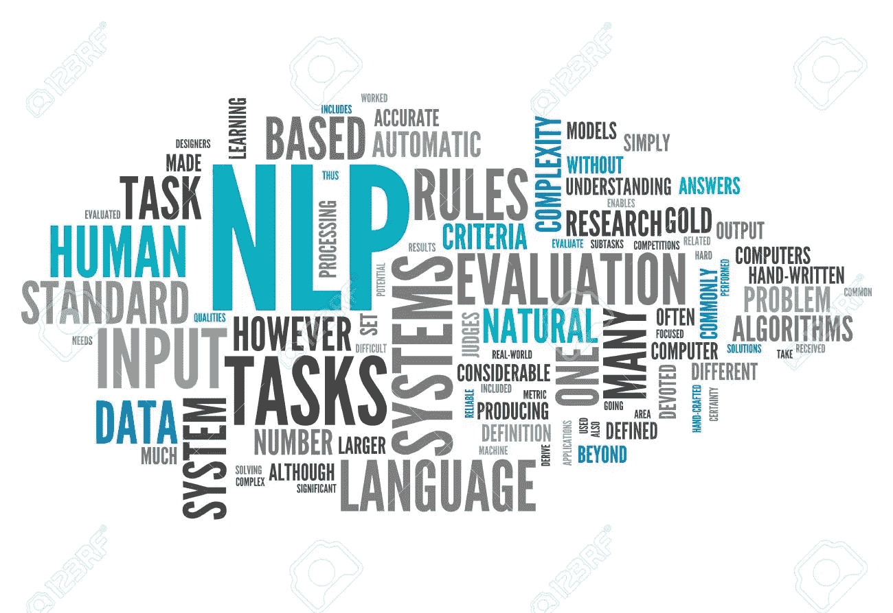

# 如何在没有变形金刚的情况下成功进行多语言情感分析

> 原文：<https://medium.com/analytics-vidhya/how-to-succeed-in-multilingual-sentiment-analysis-without-transformers-f1a98c76c30c?source=collection_archive---------4----------------------->

图片来自[互联网](https://www.123rf.com/photo_27857012_word-cloud-with-nlp-related-tags.html)

情感分析在不同的应用领域(新闻、政治科学、市场营销、金融等)越来越突出。).你可以在 GitHub 上找到无数预先训练好的英语情感模型，以及推动艺术发展的学术文章。