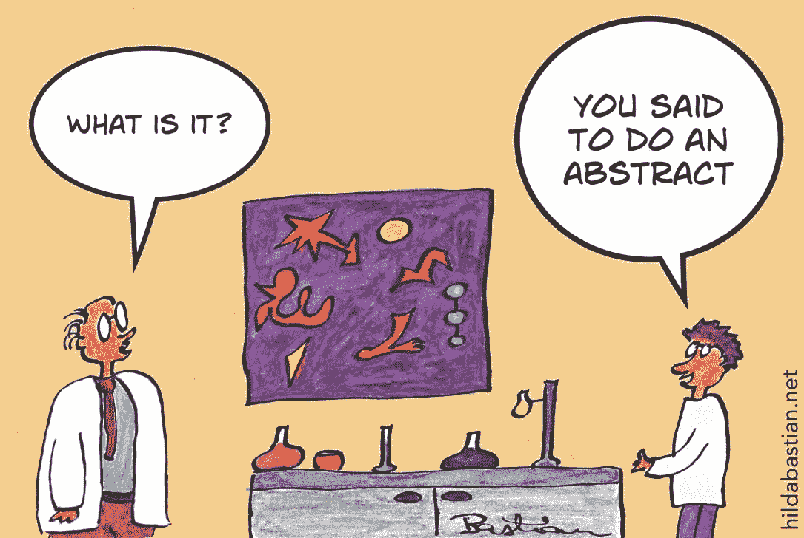
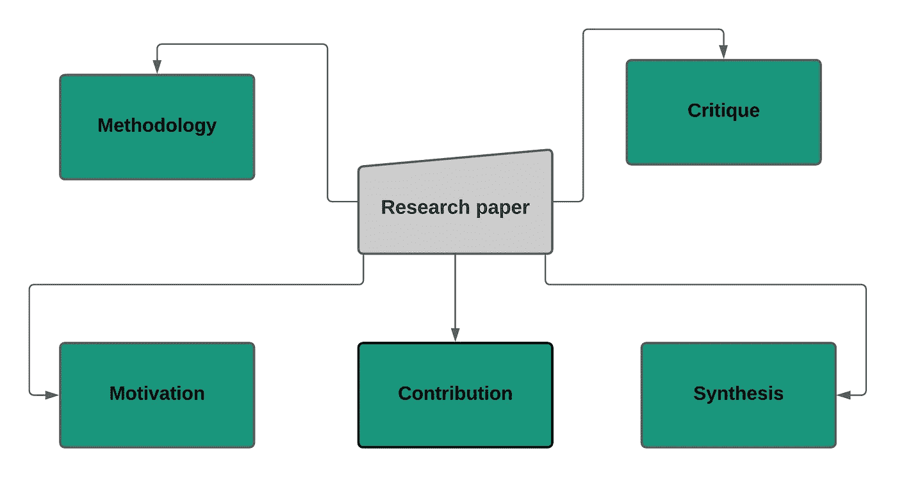

# 如何概括一篇研究论文:一个温和的介绍

> 原文：<https://medium.com/analytics-vidhya/how-to-summary-a-research-paper-a-gentle-introduction-67596e59ae33?source=collection_archive---------15----------------------->

在阅读科学手稿时，你是否曾经感到困惑？当我试图阅读一篇研究论文时，我第一次遇到了麻烦。我仍然记得有一天，我被分配了一个任务，阅读大量的论文，并总结背景是相当具有挑战性的！！

我写的是说明你在读科学手稿的时候会练习什么方法。读完这篇文章后，你会知道一种有效的方法，这种方法在评论一篇研究论文时会非常特别。

来源:[https://www . the daily star . net/shout/news/how-read-research-paper-1801756](https://www.thedailystar.net/shout/news/how-read-research-paper-1801756)

在阅读之前，我想说，请看看我以前的帖子:**“如何撰写科学稿件”**:[https://medium . com/analytics-vid hya/How-to-write-a-scientific-research-paper-fundamental-instruction-for-初学者-e86074761018](/analytics-vidhya/how-to-write-a-scientific-research-paper-fundamental-instruction-for-beginner-e86074761018)

# 开始前的几句话

通常，一篇科学手稿由几个部分组成，插图、引言、文献综述、方法论、结果和讨论。仔细想想，问问自己是否有可能阅读整个上下文来总结手稿。根据卡尔加里大学的指导方针，其他任何人都不必通读整篇研究论文来实现目标，因为这可能需要无数次，而那些第一次阅读的人在阅读时不会理解。论文评论可能是一篇短文，宣布你从阅读学期论文中学到了什么。为你已经检查过的论文撰写评论可能是磨练你的论文阅读能力的绝佳方式。这样的综述通常分为三个部分——总结、评论和综合。

**研究论文摘要(RPS)**

RPS 部分的结构如下:(1)动机，(2)贡献，(3)方法，(4)评论，和(5)综合。

**图:论文摘要概述。**

**动机**

> *动机部分通常可以在摘要部分找到。更简单地说，当你读完所选论文的摘要时，你会观察到该研究将针对任何问题陈述。你必须找出建议研究的当前问题，以及研究提出了什么解决方案来解决需要解决的问题。*

**贡献**

> *假设，你正试图开发一个手机应用程序来对抗家庭暴力，并确保个人的安全。如果有人问你，你对开发重要的应用程序有什么贡献，那么答案会是什么？。研究贡献应该主要与现存的问题和你的研究如何解决它联系起来。*

**方法论**

> *方法论是任何科学手稿的核心。为了对研究方法有一个整体的了解，你不需要阅读整个手稿以及整个方法部分。首先，仔细阅读研究论文的摘要，作者将使用他们提出的研究方法或算法，或者他们使用了哪种方法，或者总体结果是如何获得的，这需要了解研究方法。在我的例子中，我会阅读整个方法论，但我不会这样做，因为有时我通常在介绍的结尾找到它。假设，他们用六种分类算法进行了比较研究，发现(X)算法表现良好，准确率为 92%。*

**批判**

> *选择两到三个你想和作者一起探讨的事情。不要重复论文中关于限制的部分。结果，作者同意你的观点！选择合理的题目，开始与作者进行学术讨论。仔细附上你的论点并加以证明。不要只说“我不喜欢这个东西。”相反，提供技术上的理由来支持你的批评。指定你喜欢的单词。避免使用通用的形容词，如“淘气的”、“软弱的”、“蹩脚的”、“愚蠢的”。更简单的说，假设一篇研究论文对有毒相关文本进行了分类。在这一部分，你可以从你的观察中谈论他们是如何处理文本的，这项研究是否应用了嵌入技术，或者正确地调整了参数。你可以看到这些问题背后的原因。*

**合成**

> *建议一两种进一步改进研究工作的方法。不要重复关于未来工作的论文部分。如果你认为需要使用另一种方法或算法来改进这项任务，证明它们的合理性并提供清晰的解释。通过这种方式，作者将会对研究的改进有一个简明的想法。*

到总结，这篇文章描述了总结一篇研究论文的一些要点。事实上，当一个初学者开始阅读一篇研究论文时，他面临着许多问题，尤其是在总结论文时。这篇文章解释了总结一篇论文的一些最好的方法。

你可以访问 Researchgate 获取我最近的出版物。

[https://www.researchgate.net/profile/Elias_Hossain7](https://www.researchgate.net/profile/Elias_Hossain7)