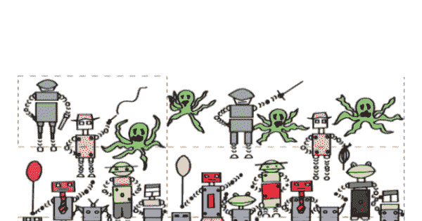
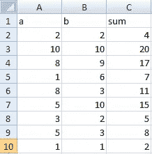
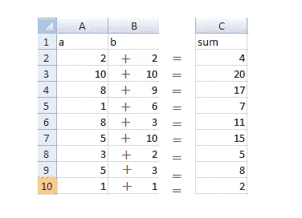
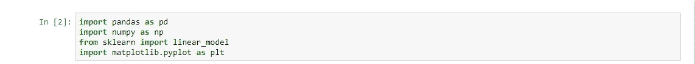
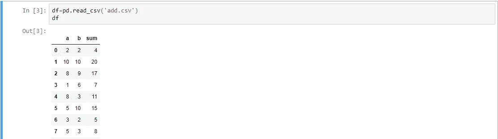
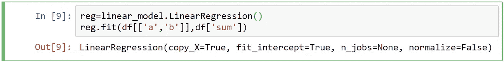
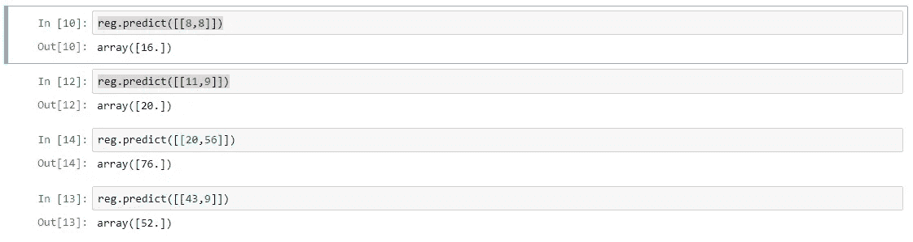

# 如何用人工智能三步教会机器计算两个数的加法

> 原文：<https://medium.com/analytics-vidhya/how-to-teach-a-machine-to-calculate-two-numbers-using-artificial-intelligence-under-3-steps-f27cb07aad32?source=collection_archive---------10----------------------->

教机器

如果你熟悉任何编程语言。加法程序是初学者可能喜欢做的第一个也是最容易的任务之一，为了做到这一点，以任何语言向计算机给出一个且唯一的指令(c=a+b)来执行该任务。这很简单，伙计们。

问题

但是你有没有想过，计算机不需要显式编程，仅仅通过观察数据就可以学会两个数的相加？

如果不是呢？读完这篇文章。你会因为机器的能力而爱上它们。

我们需要遵循几个步骤。所以让我们开始吧…

## 步骤 1-创建数据集

这是我们将为计算机的大脑训练准备的数据集。让我们制作一个数据集。我制作的简单数据集 a 和 b 是因变量，sum 是自变量。打开 Microsoft Excel 并在其中添加这些条目。

**数据集:**这是一个样本数据集，定义了两个变量之间的关系，计算机将从这些数据中学习:

用于机器训练的数据集

我们可以通过简单地添加+和=来简化数据集:现在这个数据就很容易了。右:用 add.csv 保存此数据集，扩展名必须是 csv。因为在 python 熊猫中使用 CSV 是非常容易的。我们的第一个**步骤 1** 完成了。

简化数据集

## **第二步——训练:**将这个数据集交给计算机进行训练。

*   我们将使用 Jupyter notebook、python、sci-kit 学习库来实现线性回归。
*   他需要的库。像熊猫，numpy，sklearn，matplotlib。

必需的进口

*   **阅读:**数据集使用熊猫 python。这将创建与我们使用名为 add.csv 的 excel 文件相同的输出。

使用 python 读取数据集。

*   **数据的训练:**这将根据数据集训练模型。

数据训练

> **步骤 3:** 从模型预测:

在这种情况下，我们将使用未知数据测试我们的模型。这不应该与我们在 add.csv 中提供的相同。让我们快速完成它。

预言

正如我们所看到的，我们的计算机已经学会了只用数据将两个数相加。我还没有给出方程 c=a+b。

这背后的主要思想是线性回归，在这里，我们使用多元线性回归。如果你不熟悉这些术语，请查看我的 Youtube 播放列表。

**希望你喜欢这个博客**