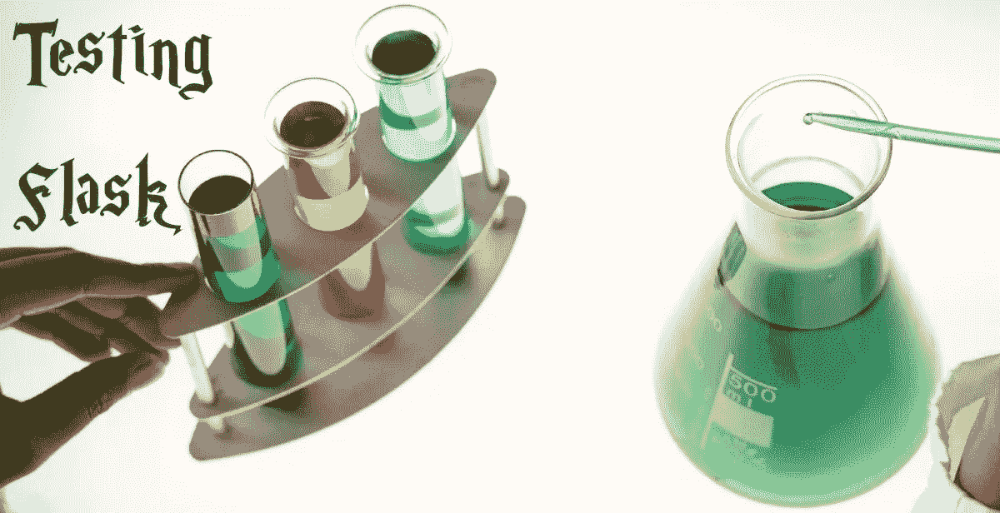

# 如何测试烧瓶应用

> 原文：<https://medium.com/analytics-vidhya/how-to-test-flask-applications-aef12ae5181c?source=collection_archive---------0----------------------->

## 路线、模板、数据库和一点点负载测试

作为一名数据科学家，我需要让我的模型易于访问。我通常[用烧瓶](/analytics-vidhya/deploying-a-machine-learning-model-on-web-using-flask-and-python-54b86c44e14a)部署模型。作为一名软件工程师，我想通过单元测试来确保事情按预期运行。

出于多种原因，对网站或 web 服务进行单元测试是很困难的:你有像…