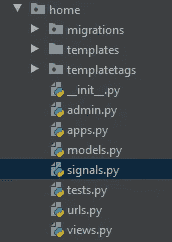
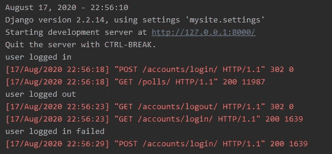
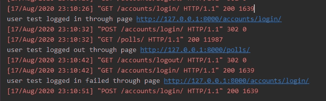

# 如何跟踪用户的登录和退出活动

> 原文：<https://medium.com/analytics-vidhya/how-to-track-user-activity-of-sign-in-and-out-d7720d58e283?source=collection_archive---------5----------------------->

你想过用户有多喜欢你的网站吗？他们多久登录一次？他们使用你的网站最喜欢的时间窗口是什么？这些价值百万美元的问题对企业来说是件大事。签到/退的活动似乎是回答他们最可靠的数据。在本教程中，我将带您了解如何在 Django 中跟踪这些数据。

在比较和尝试了几年不同的方法后，我想到了最好的解决方案，那就是 Django signal，它是一种常见的设计模式:观察者模式。在设计了许多 Django 项目之后，我注意到 signal 是一个非常方便的工具，可以帮助分离应用程序的依赖性，并使代码库易于维护。不要误解我。信号是一把双刃剑。我们需要在行动前明智地计划。这是一个完美的例子。

# 目标:

使用 Django 信号记录登录/退出活动。在本教程中，我将在控制台中打印活动。

依赖关系:

1.Python 3.6

2.2014 年 2 月 2 日姜戈

# 第 1/3 步

在 app 中创建 **signals.py** 文件。建议你加在一个和账号有关系的 app 里。比如我准备把它添加到**首页** app 里。



然后写下面的代码。注意 Django 提供了默认的 auth 信号， **user_logged_in** ， **user_logged_out** ，以及 **user_login_failed** 。我们需要做的就是为每个信号建立接收器。

```
from django.dispatch import receiver
from django.contrib.auth.signals import user_logged_in, user_logged_out, user_login_failed

@receiver(user_logged_in)
def log_user_login(sender, request, user, **kwargs):
    print('user logged in')

@receiver(user_login_failed)
def log_user_login_failed(sender, credentials, request, **kwargs):
    print('user logged in failed')

@receiver(user_logged_out)
def log_user_logout(sender, request, user, **kwargs):
    print('user logged out')
```

# 第 2/3 步

在 apps.py 中，通过编写下面的代码来注册 **signals.py** 。

```
from django.apps import AppConfig

class HomeConfig(AppConfig):
    name = 'home'

    def ready(self):
        import home.signals
```

至此，我们已经做好了一切准备。启动项目，我们应该看到日志打印在控制台后，你登录，退出或登录失败。



# 第 3/3 步

让我们更进一步，以更丰富的方式记录活动。我们将跟踪用户是谁，以及他通过哪个页面执行登录/退出操作。

```
from django.dispatch import receiver
from django.contrib.auth.signals import user_logged_in, user_logged_out, user_login_failed

@receiver(user_logged_in)
def log_user_login(sender, request, user, **kwargs):
    print('user {} logged in through page {}'.format(user.username, request.META.get('HTTP_REFERER')))

@receiver(user_login_failed)
def log_user_login_failed(sender, credentials, request, **kwargs):
    print('user {} logged in failed through page {}'.format(credentials.get('username'), request.META.get('HTTP_REFERER')))

@receiver(user_logged_out)
def log_user_logout(sender, request, user, **kwargs):
    print('user {} logged out through page {}'.format(user.username, request.META.get('HTTP_REFERER')))
```

你应该看到下面的打印。



有几种存储数据的方法。在本教程中，我们只是在控制台中打印它。最常见的方法是通过 Django 日志记录将它们写入日志文件。为了长期维护数据，可以将数据插入数据库表中，或者像 Kafka 一样通过数据管道发送。如果你想知道如何处理数据，请留下你的评论。我会做另一个关于这个的教程。

如果你对真实的项目感兴趣，我在 Github 上分享了它。[https://github.com/slow999/DjangoAndTrackSignInOut](https://github.com/slow999/DjangoAndTrackSignInOut)项目名为 DjangAndTrackSignInOut。保持关注。注意安全。

我在这里做了一个视频。看看这个。