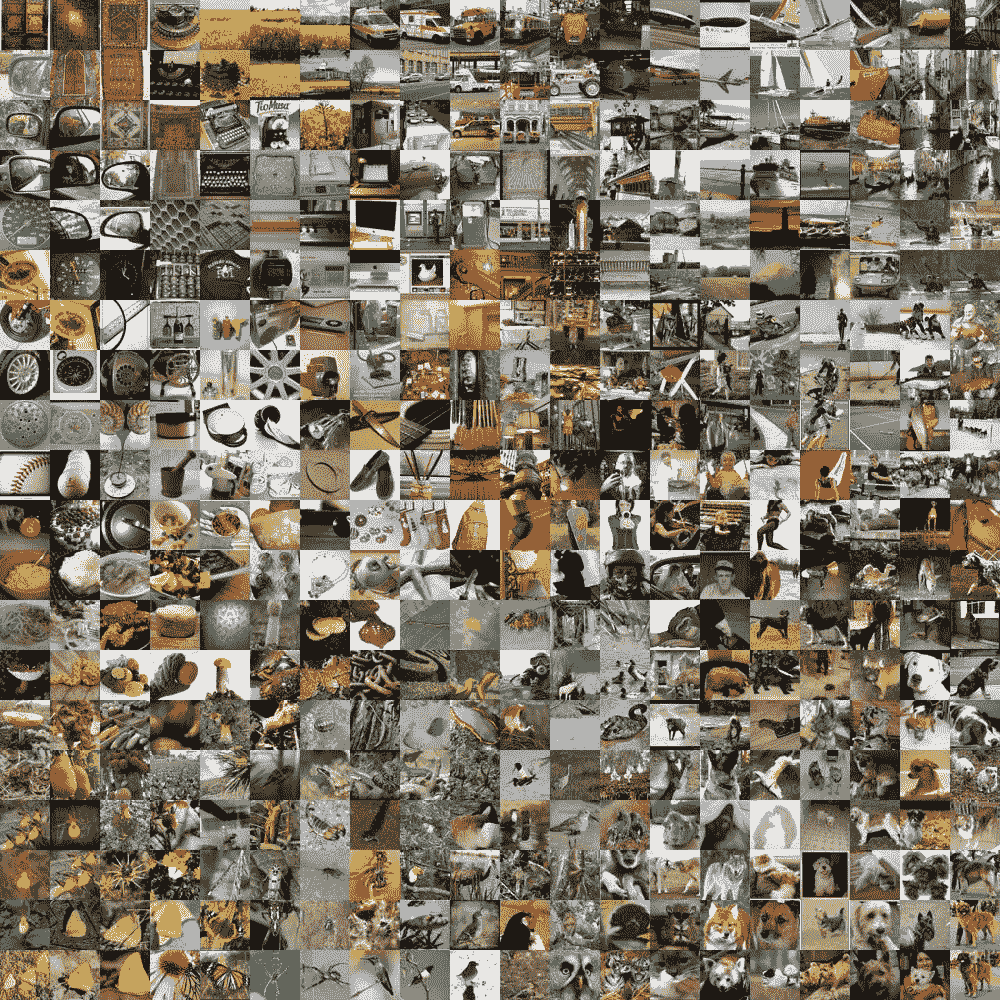

# 如何使用 TensorFlow 2 在 ImageNet 上训练神经网络分类器

> 原文：<https://medium.com/analytics-vidhya/how-to-train-a-neural-network-classifier-on-imagenet-using-tensorflow-2-ede0ea3a35ff?source=collection_archive---------1----------------------->

ImageNet 数据集中的图像样本，其中每个图像都是 1000 个类中的一个。

图像分类是计算机视觉中的一个经典问题。今天，这个问题的最先进的模型使用神经网络，这意味着实现和评估这些模型需要使用像 PyTorch 或 TensorFlow 这样的深度学习库。

您可以很容易地找到 PyTorch 教程，用于下载预训练模型、设置 ImageNet 数据集和评估模型。但是我在 TensorFlow 中找不到一个全面的教程来做同样的事情。在本文中，我将向您展示如何实现。

**要求**

*   Python 3
*   TensorFlow 2.3.1(用`pip3 install tensorflow==2.3.1`安装)
*   TensorFlow 数据集(使用`pip3 install tensorflow-datasets==4.1.0`安装)
*   [CUDA 和 cuDNN](https://docs.nvidia.com/deeplearning/cudnn/support-matrix/index.html) (因为我用的是 NVIDIA GPU)
*   ILSVRC2012_img_train.tar 和 ILSVRC2012_img_val.tar，可以从[这里](http://www.image-net.org/challenges/LSVRC/2012/downloads.php#images)下载。请注意，这些归档通常存储在只读存储器中(供多个用户使用)，因为它们需要大约 156 GB 的存储空间。

**概述**

我们将完成 3 个基本步骤:准备 ImageNet 数据集，编译预训练模型，最后评估模型的准确性。

首先，让我们导入一些包:

现在，我们将下载 ImageNet 标签，并指定 ImageNet 归档文件的位置。尤其是`data_dir`应该是 ILSVRC2012_img_train.tar 和 ILSVRC2012_img_val.tar 所在的路径。而`write_dir`应该是我们想要写入提取的图像内容的目录。确保您的`write_dir`目录包含`extracted`、`dowloaded`和`data`目录。

这里的关键是我们用关键字参数调用了`tfds.load`到`download_and_prepare`调用，指定了我们的归档文件的位置和提取的记录应该放在哪里。

现在，因为预训练的分类模型将 224 x 224 的图像作为输入，所以我们需要对数据进行一些预处理。这里我们将使用`mobilenet_v2.preprocess_input(i)`，但是如果您使用不同的模型，您可以替换这个调用。例如，如果我使用 VGG-16，我会调用`vgg16.preprocess_input(i)`。

接下来，我们编译一个我们选择的模型。在我的情况下，一个移动 V2。

最后，由于我们设置数据集的方式，我们可以在训练数据上评估该模型，并使用几行代码打印准确性！

有了一个运行良好的预训练分类器，您现在可以对模型进行微调，以满足您的分类问题的需要。下面是**的完整实现**，但也可以在我的 GitHub 上找到[。](https://github.com/KMVarma/828i_f20/blob/main/notebooks/MobileNetV2%20on%20ImageNet.ipynb)

下载预训练模型、设置 ImageNet 数据集以及在 Tensorflow 2 中评估模型的完整实施