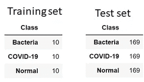
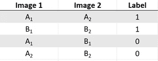
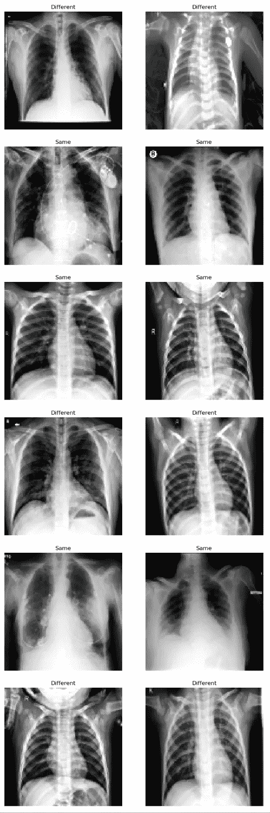
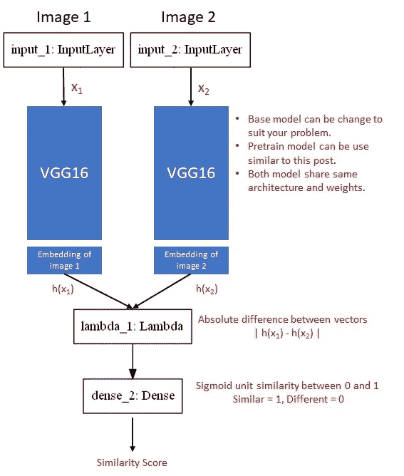
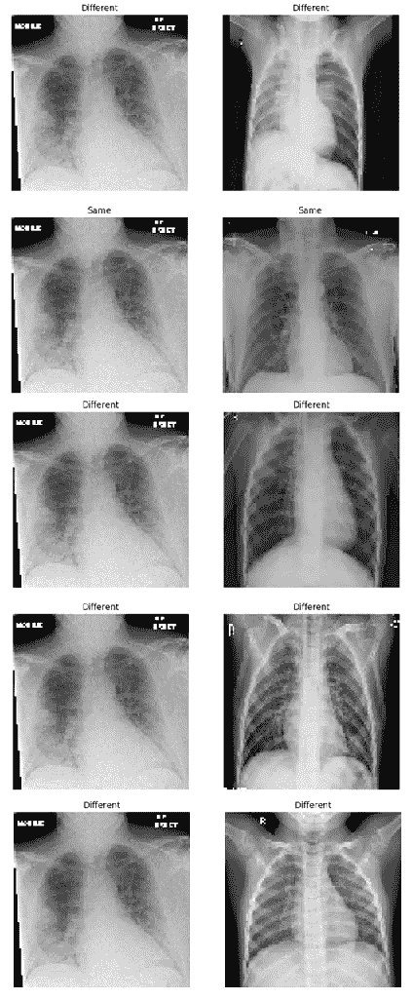

# 如何在新冠肺炎 X 射线图像上训练暹罗网络

> 原文：<https://medium.com/analytics-vidhya/how-to-train-siamese-network-on-covid-19-x-ray-images-639a993b35a3?source=collection_archive---------13----------------------->

MJ Tangonan 在 [Unsplash](https://unsplash.com?utm_source=medium&utm_medium=referral) 上的照片

在这篇文章中，我不解决任何与新冠肺炎相关的问题，而是探索 X 射线图像上 SiameseNet 的概念和实现。如果你想看代码，你可以点击下面的链接。

 [## Niellai/MultiShot_Learning

### permalink dissolve GitHub 是 4000 多万开发人员的家园，他们一起工作来托管和审查代码，管理…

github.com](https://github.com/Niellai/ObjectDetection/blob/master/9_COVID19%20MultiShot_Learning.ipynb) 

# 元学习

元学习是人工智能中最有前途的领域之一。人工智能界的一些思想流派认为，元学习是打开人工一般智能的敲门砖(AGI)。这种技术背后的想法是用学会学习的概念创建一个过程。

为了理解为什么这个元学习是一个重要的里程碑，我们可以看看深度学习分类是如何工作的。想象一下，我们需要建立一个狗和猫的分类器，我们提供数百张狗和猫的图像进行训练，并获得这个训练好的模型。当一个仓鼠图像被提供给我们的分类器时，这个模型将会悲惨地失败。我们的模型会预测它是一只狗还是一只猫，甚至一个 5 岁的小孩也会认出它是一种新的宠物。

那么我们人类是如何学习的呢？我们能够通过观察一些图像来学习，并很容易将仓鼠识别为猫或狗之外的一个新物种。但为了让我们的模型正确预测，我们需要提供数百张仓鼠的图像，并重新训练我们的模型才能工作。

当科罗娜不在乎你只是一只仓鼠的时候。

如果这些图像很难得到呢，例如，某种疾病的阳性病例通常远低于阴性病例(健康患者)的医学图像。元学习为这些问题提供了一种解决方案来创建一个更通用的模型，而无需重新训练来检测一个新的类，并且只需要几个图像来训练。与标准图像分类相比，这更接近人类的学习方式。

# 不同类型的元学习

元学习主要可以分为三类，度量空间学习、初始化学习和优化学习。

**学习度量空间**

学习度量空间简单地意味着让神经网络学习从输入中提取特征，并将它们放置在更高维向量中。假设我们想学习识别两个不同类别的图像。我们使用神经网络模型从这些图像中提取特征，并计算这些类别之间的相似性距离。在训练结束时，我们希望相似的班级靠得很近，而不同的班级离得很远。有许多基于度量的学习算法，其中一种算法被称为暹罗网络，这将在后面更详细地解释。其他这样的算法是原型网络和匹配网络，它们不会在这篇文章中讨论，但如果你想进一步探索，我会提供一些参考。

 [## 少数镜头学习的进展:一次有指导的旅行

### 少数镜头学习是目前机器学习的一个令人兴奋的领域。深度神经网络提取…

towardsdatascience.com](https://towardsdatascience.com/advances-in-few-shot-learning-a-guided-tour-36bc10a68b77) 

**学习初始化**

对于这种方法，方法是学习模型的最佳初始参数或权重。我们使用最优参数开始训练，而不是在初始化时使用随机权重。有了这个，我们将能够更快地收敛，并且在训练时需要更少的数据。这是使用类似迁移学习的概念，目标是使用一些预先获得的知识来帮助我们完成新的任务。有许多初始化算法，如 MAML，爬虫和目前流行的自我监督学习。

 [## 自我监督学习和计算机视觉

### 更新:2020 年 1 月 20 日:感谢 Yann LeCun 推荐的两篇论文来自《人工智能的自我监督学习》

www.fast.ai](https://www.fast.ai/2020/01/13/self_supervised/)  [## 论文复制:使用“MAML”和“爬行动物”进行深度元学习

### 你如何从很少的数据中学习？最近的两篇论文可能给出了答案。让我们重现它们！

towardsdatascience.com](https://towardsdatascience.com/paper-repro-deep-metalearning-using-maml-and-reptile-fd1df1cc81b0) 

**学习优化器**

对于这种方法，算法将尝试学习优化器函数本身。在一个样本中，假设我们正在通过梯度下降计算损失来训练神经网络，我们希望最小化这种损失。通常，我们会使用 SGD 或 Adam 作为优化器。如果我们不使用这些优化器，而是学习这个优化过程会怎么样。一种方法是用递归神经网络代替传统的优化器。如果您想了解更多信息，请参考下面提供的链接。

 [## 通过强化学习学习优化

### 自从我们去年发表了关于“学习优化”的文章后，优化程序学习领域得到了越来越多的关注…

bair.berkeley.edu](https://bair.berkeley.edu/blog/2017/09/12/learning-to-optimize-with-rl/) 

抱歉冗长的介绍，因为我发现分享相当重要。因为人工智能的下一个重大转折点是从更少的例子中更快地概括。让我们开始在 SiameseNet 上实现吧。

如果你对人工智能的未来发展感兴趣，你可以在下面的链接中阅读。

 [## AAAI 2020 |深度学习的转折点？

### 杰佛瑞·辛顿、扬·勒昆、约舒阿·本吉奥周日晚在 AAAI 组织的活动中同台演出…

medium.com](/syncedreview/aaai-2020-whats-next-for-deep-learning-hinton-lecun-and-bengio-share-their-visions-e29385dcaed5) 

# **总结**

1.  训练/测试分割
2.  创建自定义生成器
3.  可视化来自生成器的图像
4.  连体建筑
5.  n 向评估
6.  我们如何使用暹罗网

# **1。训练/测试分割**

训练集 10 个图像，其余为测试集

对于这个项目，将有总共 3 个类，我们将只使用每个类的 10 个样本。这 3 类将由新冠肺炎、细菌和正常患者的 X 射线图像组成。如果你看了别人关于一次学习或者多次学习的帖子。它们都有类似的概念，使用一小部分数据来训练模型。对于我们的情况，这将是 3 个类 10 杆学习。

**2。创建自定义生成器**

图像对的外观示例

为了训练我们的网络，我们需要一个自定义生成器，用于生成图像对进行训练和验证。生成器将提供正确对和不正确对的集合以及它们各自的标签。上面给出了一个示例，说明了这些对的外观，正确的对将被标记为 1，不正确的对将被标记为 0。生成器还确保正确和错误对的集合是平衡的。当我们将批次设置为 30 时，它将产生(2，30，100，100，3)，(30，)的形状，它可以读作:

(2 对，30 个图像，100 个宽度，100 个高度，3 个通道)，(30 个标签)

# 3.可视化来自生成器的图像

以下是模型在训练时将会看到的示例

在这个项目中，我没有使用图像增强。我想探索看看只有 10 个图像课前模型能产生一个好的结果。(剧透:是的，结果还不错)

# 4.暹罗网络

Siamese 网络的直觉是创建双胞胎模型来提取特征并计算输入的两个图像之间的差异。我们希望模型能够学习差异，并创建能够分成不同集群的嵌入。

本文中使用暹罗网架构

以蓝色突出显示的 2 个基础模型不是不同的网络，而是彼此的相同副本，它们共享相同的权重。我们将重用前一篇文章中使用的训练模型，因为这将大大提高 ImageNet 权重训练的收敛速度。我已经使用 ImageNet 权重进行了测试，大约需要 1600 个历元，而使用我们预先训练的权重，我们可以收敛大约 65 个历元。这大约快了 24 倍。

当 2 幅图像作为输入传入我们的模型时，我们的模型将生成 2 个特征向量(嵌入)。然后，我们计算特征之间的差异，并使用 sigmoid 输出相似性得分。在训练过程中，错误将被反向传播，以纠正我们的模型在创建特征向量时所犯的错误。这就是我们的暹罗网从一对图像中学习的方式。

如果你想看看你的基础模型是如何创建的，请参考我以前的帖子。

 [## 基于 Keras 的新冠肺炎 X 射线图像分类及其潜在问题

### 免责声明:在这篇文章中探索的方法和技术是为了教育和分享的目的。这不是一个…

medium.com](/analytics-vidhya/classification-of-covid-19-x-ray-images-with-keras-and-its-potential-problem-e31b3ff16f24) 

# 5.n 向评估

为了评估我们的模型，我们必须创建一个定制的验证过程。测试必须确定模型是否能够从不同的图像中识别相似的图像。一种方法是 **N 向一次学习**，这听起来很难，但实际上非常简单。

该示例显示了 5 路一次学习。请注意，左侧图像都是相同的。

对于这个项目，我们用 N=20 (20 路一次学习)来测试模型。假设我们正在为模型创建一份试卷，每个问题有 20 个选择题，其中只有一个答案是正确的。我们给出 100 个问题让模型回答，看模型表现如何。该模型将对每一对进行预测，预测值最高的预测值是该模型选择的正确预测值。你可以想象如果给一个人 20 个选择题，这份试卷会有多难。

最后，该模型做得相当好，当 N=20 时，它能够获得 96.0%的正确率，当 N=30 时，它能够获得 88%的正确率。太棒了。请记住，我们只为每个类提供 10 个图像的模型。

当你意识到你有 20 个 MCQ 的选择时。

# **6。我们如何使用暹罗网**

在我们训练完暹罗猫后，我们能做什么呢？当一个新的看不见的新冠肺炎 X 射线图像给定，我们可以使用该模型来创建一个图像嵌入。之后，我们可以使用这种嵌入来衡量我们的 3 类聚类的相似性得分。这张新的看不见的新冠肺炎图像应该靠近我们的新冠肺炎星团。

那么我们之前讨论的未知类呢？假设另一张 x 光照片显示了一种新的未知感染。生成的嵌入将是我们所有 3 个聚类之外的异常值。这将把 X 射线图像标记为未知类别，应请医生进行进一步验证。

谢谢你一直读到最后。对于那些坚持到最后的人，我想和你分享一首歌。

一首歌萦绕在我的脑海里。

# 参考

 [## 使用 Keras 一次性学习暹罗网络

### 目录

towardsdatascience.com](https://towardsdatascience.com/one-shot-learning-with-siamese-networks-using-keras-17f34e75bb3d)  [## 元学习:学会快速学习

### 元学习，也称为“学会学习”，旨在设计能够学习新技能或适应新的学习模式

lilianweng.github.io](https://lilianweng.github.io/lil-log/2018/11/30/meta-learning.html)  [## 学会学习

### 智力的一个重要方面是多面性——做许多不同事情的能力。当前的人工智能系统优于…

bair.berkeley.edu](https://bair.berkeley.edu/blog/2017/07/18/learning-to-learn/)