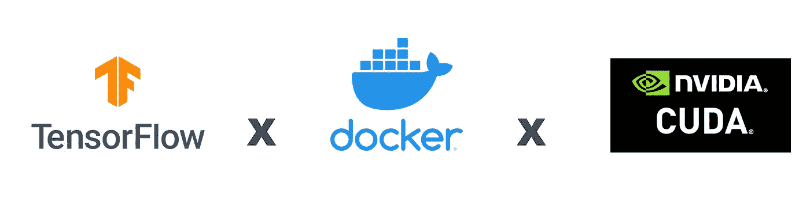
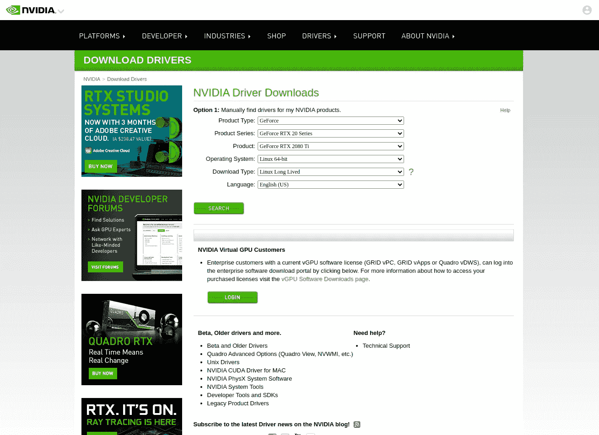
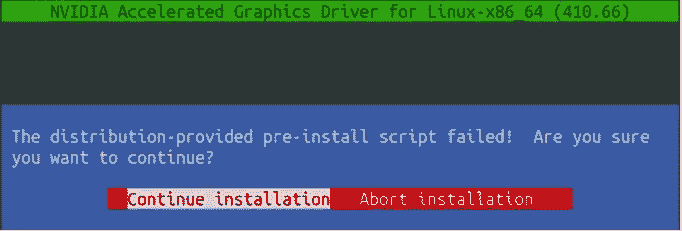
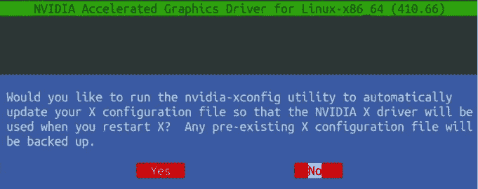
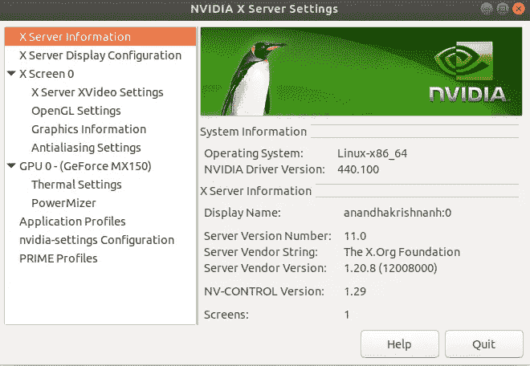
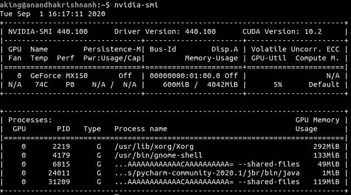

# 如何在 Linux 上使用 Docker(不带 CUDA)训练 TensorFlow 模型

> 原文：<https://medium.com/analytics-vidhya/how-to-train-tensorflow-models-using-docker-without-cuda-on-linux-a327323a6d81?source=collection_archive---------6----------------------->



当你开始使用 GPU 进行机器学习和训练神经网络时，你(和任何 ML 工程师)的第一个障碍是让 CUDA 工作并让 TensorFlow 识别你的 GPU。

# **简介**

> CUDA 是 NVIDIA 开发的并行计算平台和编程模型，用于图形处理单元(GPU)上的一般计算。
> 
> …
> 
> NVIDIA 的 CUDA 工具包提供了开发 GPU 加速应用程序所需的一切。CUDA 工具包包括 GPU 加速库、编译器、开发工具和 CUDA 运行时。
> 
> (来源)【https://developer.nvidia.com/cuda-zone 

通常情况下，安装任何依赖项都需要获得最新版本，这样一切都可以正常工作。但是经验告诉我，事实从来都不是这样。

你看，安装 CUDA 本身是一项棘手的任务，即使有人设法安装它，让它工作本身就是一种痛苦。至于我的情况，即使在经历了几十个 GPU 驱动程序版本、CUDA 版本、cuDNN 版本之后，我仍然无法让 Tensorflow 检测到我有一个 GPU，而是不断地在我的 CPU 上训练。我花了将近一个月的时间才最终让它工作起来。所以，如果你也面临着类似的问题，或者你不想在未来遵循我的领导。你应该只需要花费大约**15-20 分钟**的时间来运行 CUDA 和你的 GPU，而不是花几天时间在 Nvidia 论坛上。

# **依赖关系**

*   码头工人
*   Nvidia GPU 驱动程序
*   就是这样…

我知道这看起来很混乱，但是 Docker 和一个互联网连接是你不需要安装 CUDA 就能运行 CUDA 的全部。如果你没有 docker，不要担心，我会教你如何安装

# **安装依赖关系**

所以让我们继续吧。

**安装最新的 Nvidia GPU 驱动程序**

我已经从这篇非常好的[中型文章](/better-programming/how-to-install-nvidia-drivers-and-cuda-10-0-for-rtx-2080-ti-gpu-on-ubuntu-16-04-18-04-ce32e4edf1c0)中获得了安装 GPU 驱动程序的步骤。你需要从[这里](https://www.nvidia.com/Download/index.aspx?lang=en-us)下载最新的 NVIDIA GPU 驱动。这将比使用 Ubuntu 或 Nvidia GeForce 体验应用程序中的软件和更新更好、更可靠。

1.  转到提到的[网址](https://www.nvidia.com/Download/index.aspx?lang=en-us)。



图一。英伟达的司机网站

2.输入您的 GPU 的详细信息，您应该会看到适合您的配置的最佳驱动程序。

3.请将它下载到您的本地。

4.使用`CTRL+ALT+ T`打开您的终端

5.转到下载驱动程序的目录(在我的例子中是下载) `cd ~/Dowloads`

6.授予执行的权限。运行你下载的文件，`chmod +x NVIDIA-Linux-x86_64–450.66.run`

7.运行。运行文件`sudo ./NVIDIA-Linux-x86_64–450.66.run --no-x-check`

如果在这个阶段后你得到一个错误，这可能意味着有一些 Nvidia 驱动程序已经安装。你可以通过使用`sudo nvidia uninstall`然后`reboot`你的机器来删除任何现有的驱动程序。重启后，重复从**开始的第 3 步**

8.将会出现 Nvidia GUI 提示，选择**继续安装**



选择继续安装:[https://medium . com/better-programming/how-to-install-NVIDIA-drivers-and-cuda-10-0-for-RTX-2080-ti-GPU-on-Ubuntu-16-04-18-04-ce 32 e 4 EDF 1c 0](/better-programming/how-to-install-nvidia-drivers-and-cuda-10-0-for-rtx-2080-ti-gpu-on-ubuntu-16-04-18-04-ce32e4edf1c0)

9.当询问您是否要自动更新 X 配置时，选择**否**。

```
$ sudo apt-get update && sudo apt-get install -y nvidia-container-toolkit$ sudo systemctl restart docker
```



选择否:[https://medium . com/better-programming/how-to-install-NVIDIA-drivers-and-cuda-10-0-for-RTX-2080-ti-GPU-on-Ubuntu-16-04-18-04-ce 32 e 4 EDF 1c 0](/better-programming/how-to-install-nvidia-drivers-and-cuda-10-0-for-rtx-2080-ti-gpu-on-ubuntu-16-04-18-04-ce32e4edf1c0)

10.重启你的机器。

11.搞定了。您已经安装了最新的 Nvidia 驱动程序。但是，您如何确保您正确地遵循了这些步骤呢？

为了验证您是否正确安装，您可以在您的终端上运行`nvidia-settings`,您将获得一个 NVIDIA 应用程序，这意味着您安装正确。



Nvidia X 服务器设置。

您也可以从终端运行`nvidia-smi`,您将得到如下响应



nvidia-smi 命令的响应。

**注意:**在 Docker 上使用 Tensorflow 不需要 CUDA，但是如果你需要它来完成任何其他任务，请查看我上面提到的[中型文章](/better-programming/how-to-install-nvidia-drivers-and-cuda-10-0-for-rtx-2080-ti-gpu-on-ubuntu-16-04-18-04-ce32e4edf1c0)的其余部分。

**安装对接器**

1.  使用以下命令卸载机器中旧版本的 docker(如果有)

```
 $ sudo apt-get remove docker docker-engine docker.io containerd runc
```

2.接下来我们需要设置 Docker 存储库

```
$ sudo apt-get update

$ sudo apt-get install \
    apt-transport-https \
    ca-certificates \
    curl \
    gnupg-agent \
    software-properties-common
```

3.添加码头工人的官方 GPG 键

```
$ curl -fsSL https://download.docker.com/linux/ubuntu/gpg | sudo apt-key add -
```

4.现在我们需要设置稳定的存储库

供 **x86_64 / amd64** 使用，

```
$ sudo add-apt-repository \
   "deb [arch=amd64] https://download.docker.com/linux/ubuntu \
   $(lsb_release -cs) \
   stable"
```

供 **armhf** 使用，

```
$ sudo add-apt-repository \
   "deb [arch=armhf] https://download.docker.com/linux/ubuntu \
   $(lsb_release -cs) \
   stable"
```

供**臂 64** 使用，

```
$ sudo add-apt-repository \
   "deb [arch=arm64] https://download.docker.com/linux/ubuntu \
   $(lsb_release -cs) \
   stable"
```

5.安装 Docker 引擎

```
$ sudo apt-get update
$ sudo apt-get install docker-ce docker-ce-cli containerd.io
```

6.通过运行`hello-world`映像，验证 Docker 引擎是否已正确安装。

```
$ sudo docker run hello-world
```

*该命令下载一个测试映像，并在容器中运行它。当容器运行时，它打印一条信息性消息并退出。*

**安装 NVIDIA-Docker**

我们需要安装 NVIDIA-Docker 来连接我们的 Docker 系统和我们的 GPU。为此，我们将使用 [Nvidia-docker GitHub 库](https://github.com/NVIDIA/nvidia-docker)。

我将下载 Ubuntu 16.04/18.04/20.04，Debian Jessie /Stretch /Buster，如果你使用另一个操作系统，请检查上面提到的 GitHub repo。

```
# Add the package repositories
$ distribution=$(. /etc/os-release;echo $ID$VERSION_ID)$ curl -s -L https://nvidia.github.io/nvidia-docker/gpgkey | sudo apt-key add -$ curl -s -L https://nvidia.github.io/nvidia-docker/$distribution/nvidia-docker.list | sudo tee /etc/apt/sources.list.d/nvidia-docker.list

$ sudo apt-get update && sudo apt-get install -y nvidia-container-toolkit$ sudo systemctl restart docker
```

# 通过 TensorFlow 使用 Docker

最后，我们已经安装了所有的依赖项，但是我们还不能启动我们的神经网络！我知道工作量很大，但是相信我，这是值得的；)

1.  转到您的终端，调出与我们希望使用的 TensorFlow 版本相当的 docker 图像。

所有 TensorFlow 版本的所有不同 docker 图像均可在此处找到。我正在使用 TensorFlow 1.14 与 GPU 和 Python，所以我会运行

```
$ sudo docker pull tensorflow/tensorflow:1.14.0-gpu-py3 
```

你可以使用任何配置的 TF 版本。

2.我们将使用`sudo docker login`登录 docker(这一步不是强制性的)

3.我们可以运行`lspci | grep -i nvidia`来列出所有可用的 GPU，你应该会看到你的 GPU。

4.我们可以通过运行来验证到目前为止所做的一切

```
$ sudo docker run --gpus all --rm nvidia/cuda nvidia-smi
```

5.我们终于跑了

```
$ sudo docker run --gpus all -it tensorflow/tensorflow:1.14.0-gpu-py3 bash
```

现在我们有了一个包含 TensorFlow 和 CUDA 的 docker 容器。这将作为一种类似虚拟机运行在你的电脑终端上。

如果你打开另一个终端并运行`sudo docker ps`，你会看到你的 docker 容器正在运行。您的新 docker 容器将像一个新系统一样运行，并且将只包含基本组件，因此您需要首先安装您需要的所有库。

**注意#1** :您可以使用以下方式将文件从主机传输到 docker 机器

```
*$ sudo docker cp .\host/file/path\ <container_ID>:/destination/path*
```

**注意#2** :你可以从`sudo docker ps`命令中看到你的容器 ID。

**注意#3** :如果您从 docker 正在运行的终端退出，您将停止容器，这将有点难以取回数据。


# 使用 TensorFlow 训练模型

难的部分终于完成了。现在，我们有一台机器在您的本地运行，它可以利用 GPU，您甚至不必担心 CUDA。现在让我们通过在 MNIST 数据集上训练一个简单的神经网络来使用我们的 GPU 推出新的 Docker。

你可以在这里找到笔记本[的 GitHub 链接，在这里](https://github.com/tensorflow/datasets/blob/master/docs/keras_example.ipynb)找到 Collab 链接

**导入库**

```
**import** **tensorflow.compat.v2** **as** **tf**
**import** **tensorflow_datasets** **as** **tfds**

tfds.disable_progress_bar()
tf.enable_v2_behavior()
```

**加载数据集**

```
(ds_train, ds_test), ds_info = tfds.load(
    'mnist',
    split=['train', 'test'],
    shuffle_files=**True**,
    as_supervised=**True**,
    with_info=**True**,
)
```

**建立培训渠道**

```
**def** normalize_img(image, label):
  *"""Normalizes images: `uint8` -> `float32`."""*
  **return** tf.cast(image, tf.float32) / 255., label

ds_train = ds_train.map(
    normalize_img, num_parallel_calls=tf.data.experimental.AUTOTUNE)
ds_train = ds_train.cache()
ds_train = ds_train.shuffle(ds_info.splits['train'].num_examples)
ds_train = ds_train.batch(128)
ds_train = ds_train.prefetch(tf.data.experimental.AUTOTUNE)
```

**建立评估管道**

```
ds_test = ds_test.map(
    normalize_img, num_parallel_calls=tf.data.experimental.AUTOTUNE)
ds_test = ds_test.batch(128)
ds_test = ds_test.cache()
ds_test = ds_test.prefetch(tf.data.experimental.AUTOTUNE)
```

**训练我们的模型**

```
model = tf.keras.models.Sequential([
  tf.keras.layers.Flatten(input_shape=(28, 28, 1)),
  tf.keras.layers.Dense(128,activation='relu'),
  tf.keras.layers.Dense(10, activation='softmax')
])
model.compile(
    loss='sparse_categorical_crossentropy',
    optimizer=tf.keras.optimizers.Adam(0.001),
    metrics=['accuracy'],
)

model.fit(
    ds_train,
    epochs=6,
    validation_data=ds_test,
)
```

仅此而已。

# 在 Docker 上设置 TensorBoard

因为我们用的是 docker，它会有自己的 IP 地址，而且它会作为一台没有 GUI 的独立机器，因此不可能那么容易地设置 TensorBoard。

为了实现这一壮举，我们将使用我们的 TensorBoard 的特定端口进行端口转发。

1.  我们将使用一个单独的命令来启动 docker 机器，而不是我们上面提到的命令。

```
*$ sudo docker run -p 0.0.0.0:6006:6006 — gpus all -it tensorflow/tensorflow:1.14.0-gpu-py3 bash*
```

2.这将与我们之前的命令一样，让我们登录到 docker 机器，但是对于端口，我们指定了 ie。, 6006.

3.我们将开始在这个终端中运行我们的训练脚本，然后使用命令`docker exec -it <container> bash`启动一个新的终端

4.现在，我们将使用两个不同的终端访问同一台 docker 机器，第一个终端用于运行我们的脚本，第二个终端用于运行 TensorBoard。

5.我们将在第二个终端中运行以下命令

```
*$ tensorboard --logdir=/home/faceopen/Desktop/NN_training/facenet/files_for_training/logs — port 6006*
```

希望这将帮助你快速训练深度学习模型，而没有设置 CUDA 的初始麻烦。

如果你有任何进一步的疑问，请与我在 anandhakrishnanh1998@gmail.com 联系

# 参考

1.  [https://www.nvidia.com/Download/index.aspx?lang=en-us](https://www.nvidia.com/Download/index.aspx?lang=en-us)
2.  [https://medium . com/better-programming/how-to-install-NVIDIA-drivers-and-cuda-10-0-for-RTX-2080-ti-GPU-on-Ubuntu-16-04-18-04-ce 32 e 4 EDF 1c 0](/better-programming/how-to-install-nvidia-drivers-and-cuda-10-0-for-rtx-2080-ti-gpu-on-ubuntu-16-04-18-04-ce32e4edf1c0)
3.  [https://www.tensorflow.org/install/docker](https://www.tensorflow.org/install/docker)
4.  【https://github.com/NVIDIA/nvidia-docker】
5.  [https://hub.docker.com/r/tensorflow/tensorflow/tags/](https://hub.docker.com/r/tensorflow/tensorflow/tags/)
6.  [https://docs.docker.com/install/linux/docker-ce/ubuntu/](https://docs.docker.com/install/linux/docker-ce/ubuntu/)
7.  [https://medium . com/@ teavanist/image-class ification-using-tensor flow-on-docker-windows-BD 7824 b 05 fee](/@teavanist/image-classification-using-tensorflow-on-docker-windows-bd7824b05fee)
8.  [https://briancaffey . github . io/2017/11/20/using-tensor flow-and-tensor-board-with-docker . html](https://briancaffey.github.io/2017/11/20/using-tensorflow-and-tensor-board-with-docker.html)