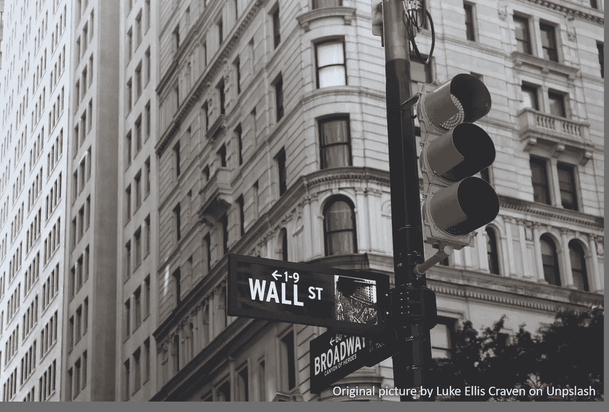
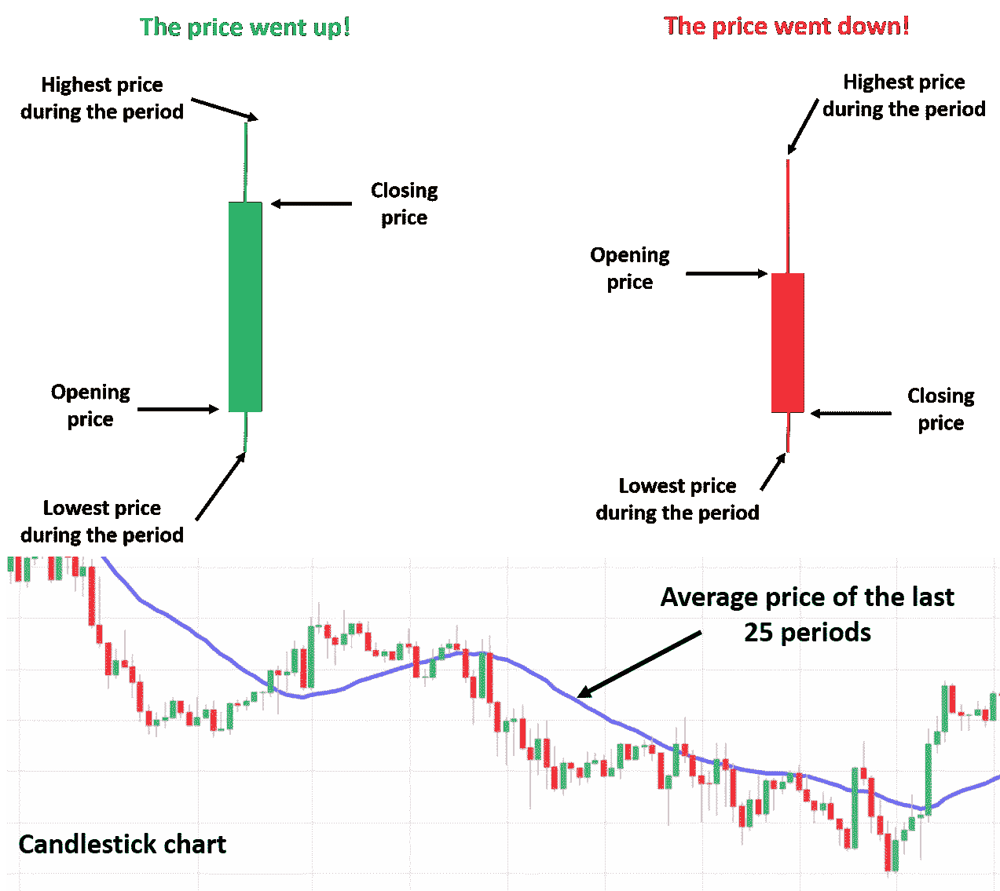
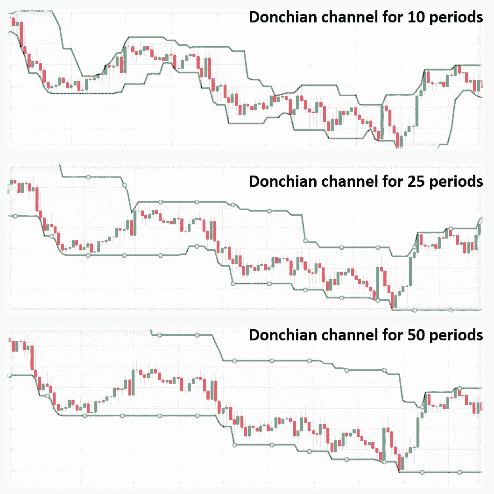
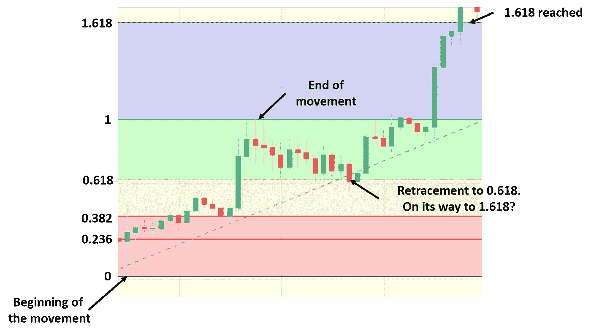
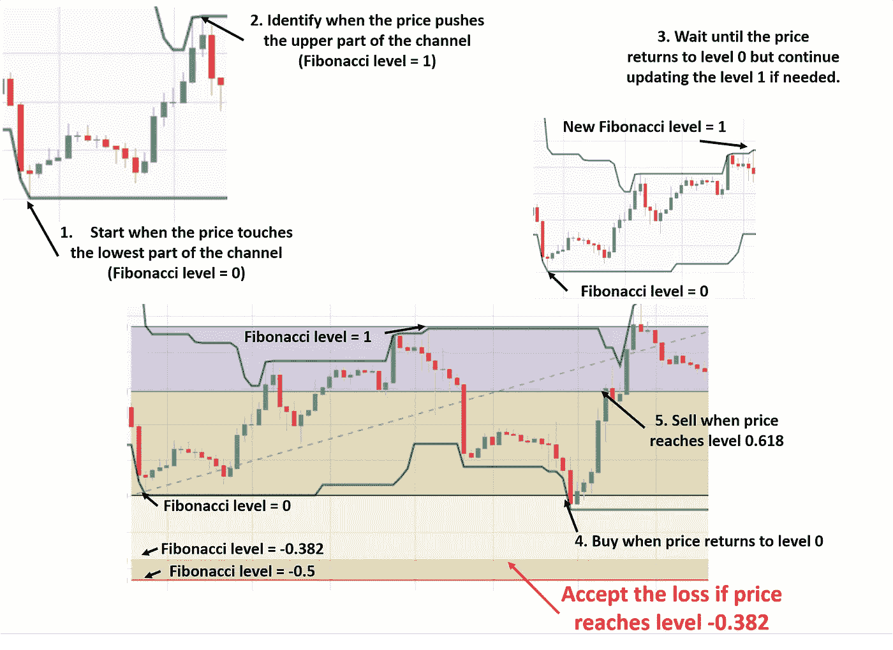
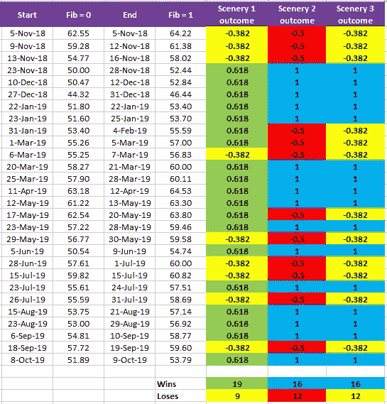

# 如何训练成为一名交易员？

> 原文：<https://medium.com/analytics-vidhya/how-to-train-to-be-a-trader-87cdc7690630?source=collection_archive---------19----------------------->

如果我能预见未来 5 秒钟，我会提前发现商品和世界货币的价格走向，让自己成为一个富人。不幸的是，我不能在时间上走得更远，因此我需要使用传统的市场分析方法，即基本面和技术面。

基本面分析试图通过了解影响价格的事件来预测价格，例如，1)由于可用性增加，发现大规模的石油储藏可能会降低未来几个月的石油价格，2)智利地震可能会影响铜矿的开采，并提高其价格，因为世界上 1/3 的铜是从智利开采的，3)南非的罢工可能会减少铂的开采，这将对其价格至关重要，因为 70%的铂是从南非开采的。

另一方面，技术分析试图通过识别历史价格图表中的模式或几何图形来预测价格。这将是这里讨论的分析类型，我们将使用它来开发一个应用于市场的策略。它并不总是对我们有利，因此会让我们损失一些钱，但这里的想法是，从长远来看，我们将赢得比我们失去的更多。但是更重要的是，要想快速获利，就要学会训练成为一个持续一致的交易者，或者，用马克·道格拉斯在他的书《T2》中的话说，在 T3 区域交易，我们要把自己变成赌场，而不是坐在椅子上的玩家。

*注意:本文是为了教育目的，而不是市场交易手册。这里介绍的策略只是一个例子，我在短期内测试过，我不能保证它的长期有效性。*

**蜡烛图的基本解读**

最常见的显示一段时间内价格变动的方法是使用蜡烛图。这里，每个蜡烛对应于一段时间，例如，5 分钟、15 分钟、1 小时、4 小时、1 天或其他。每根蜡烛线都有开盘价和收盘价，以及一段时间内的最高价和最低价。如果开盘价低于收盘价，那么我们可以说价格在此期间上涨，反之，当开盘价高于收盘价时，价格下跌。这些蜡烛的运动和形状已经可以用来预测未来的蜡烛，因此未来的价格，但交易者也可以添加一些技术指标，如过去时期的简单移动平均线，以帮助他们进行分析，并找出最佳的买卖时间。

图一。蜡烛图的基本解释。

**使用的技术指标**

现在，我将向您描述我想用来制定战略的两个指标。第一个是唐奇安通道，它是蜡烛图中的一个通道，表示过去某个时期的最高价和最低价。因此，随着周期数的减少，通道变得更窄。

图二。不同时期的唐奇安海峡示例。

另一个指标是斐波纳契回撤，它表示价格向斐波纳契数列水平的回撤。这里的想法是，如果我们设法确定一个斐波纳契水平的回撤，那么价格就有可能走向更高的斐波纳契水平。举例来说，从 1 到 0.618 的回撤很可能预示着向 1.618 的移动，如图 3 所示。

图 3。一个使用斐波那契回撤的例子。

**制定战略**

马克·道格拉斯认为，参与市场给交易者提供了无限的自由来表达他们的创造力。记住这一点，我想描述一下我最近开始测试的策略，用唐奇安通道和斐波纳契回撤买卖西德克萨斯石油，如下所述。

1.确定通道的下限何时被下推。这将是斐波纳契级数= 0。

2.确定通道的上限何时被抬高。这将是斐波那契水平 1。

3.等到价格回到 0 水平。如果在等待期间上通道被进一步向上推，那么级别 1 需要被更新。

4.当价格触及 0 水平时买入。

5.当价格达到 0.618 时卖出。

然而，如果价格不到 0.618 水平，而是继续向 0.382 水平，那么我们需要接受事情对我们不利，接受小的损失。这里的想法是开发一个赢的比输的多，赚的比输的多的策略。

图 4。提议的策略。

所以，一旦规则写好了，我们需要分析以前的数据来测试这个策略的有效性。在过去的一年里，我用 1 小时蜡烛做了这件事，并设法识别了 28 个事件和 3 个可能的场景。

风景一:0.618 级赢，0.382 级输。

风景二:1 级胜，0.5 级负。

风景三:1 级胜，0.382 级负。

图 5。一年中登记的事件。

如你所见，风景 1 是赢多输少的那个，但是，这也是利润多的风景吗？好吧，假设每达到一个亏损水平，你就有亏损 1 美元的风险。那么你每赢一次就能获得 1 美元以上，1 年后的下一次盈利。

图 6。一年后的利润为每一个提议的风景。

正如你所看到的，即使风景 1 是一个赢得更多的，它不是一年中利润更多的。在这种情况下，场景 3 寻求以更低的损失获得更大的成功。然而，最佳的赢/输比率因人而异，取决于他们愿意冒多大的风险。

**最终想法**

在这篇文章中，我向你展示了如何提出和测试一个分析市场的策略。理想情况下，你的策略应该是赢的比输的多，赚的比输的多。一旦你的策略被成功测试，你的任务将是在每一个确定的事件中执行它，不要害怕失去，也不要贪婪地赚取比最初计划更多的钱。这样，你将成为赌场，而不是坐在椅子上的玩家。然而，我警告你，这听起来比它容易。