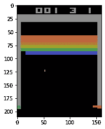

# 如何训练你的人造龙或响片-学习

> 原文：<https://medium.com/analytics-vidhya/how-to-train-your-artificial-dragon-or-clicker-learning-778d24c6ead2?source=collection_archive---------19----------------------->

阿列克谢·科普洛夫、德米特罗·科列斯尼克、基里洛·梅迪亚诺夫斯基

> 职业驯兽师比其他人更擅长训练人工智能吗？为了检验这个假设，我们进行了一个实验。
> 
> 我们从[稳定基线](https://github.com/hill-a/stable-baselines)调整了深度 Q 学习的原始架构，使其在短时间内可训练。一名人类受访者观察一名代理人玩视频游戏，并在每次他们认为代理人行动正确时发送点击。我们测试了专业训狗师和普通人。
> 我们选择了雅达利的游戏突围。[打开 AI 健身房](https://github.com/openai/gym)换环境。我们使用来自[动物园](https://github.com/araffin/rl-baselines-zoo)的预先训练好的重物。
> 源代码可通过[链接](https://github.com/Ofrogue/clicker-learning)获得

图片来源:[https://www.beardeddragon.org/forums/viewtopic.php?p=1775149](https://www.beardeddragon.org/forums/viewtopic.php?p=1775149)

## **简介**

人类通过对特定行为给予奖励来训练狗，这样狗会将特定的行为和情况与积极的(再次重复)或消极的(要避免的)价值观联系起来。类似地，人工智能体现在通过在智能体实现目标后传递的强化信号来自动训练。可惜这个过程非常慢，需要很多样本来学习。这篇博文的目的是测试是否有可能通过在老师选择的任何事件中(不仅仅是在目标结束时)提供奖励(鼠标点击)来训练视频游戏中的角色。

我们应该提到一些关于这项研究的哲学问题，因为这篇博文是在计算神经科学课程的范围内写的。人工神经网络和生物网络之间的联系是有争议的，但仍然是非常有前途的。发现这种联系的方法之一是比较生物系统行为和人工系统行为。但是这个想法的相关性是值得怀疑的。想象一下，我们正在比较人手和仿生假肢。事实上，我们会经历类似的行为。然而，我们物体的组成部分会有不同的性质。

[强化学习](http://Reinforcement learning)是一种方法论，旨在构建一个能够在给定环境中完成特定任务的人工智能体。
在我们的案例中，这是雅达利游戏的突破和深度 Q 学习模式。选择这个游戏是因为它没有代理训练的确定性策略。例如，如果这是一个像迷宫一样谨慎的游戏，人类将有时间选择奖励，并可能在代理人走上正确的道路时发送奖励。在“突围”中，我们建议每个人根据自己的反应速度、耐心，或许还有直觉，坚持自己的特定策略。

[响片训练](https://en.wikipedia.org/wiki/Clicker_training)是一种动物训练方法。它的名字来源于一种叫做“clicker”的工具:一种简单的装置，当按下时会发出声音。它需要立即向动物表明它做了将要被治疗的事情。
这种方法的另一部分是将“点击”和将要给予的食物联系起来。对于一个人工智能体来说，这种联系是不相关的:它只是接受一些奖励，并不关心任何相关的治疗。

突破，一个用 matplotlib 显示的 Atari 游戏

## 背景

Q-learning 是一种技术，来源于在给定状态下做出正确决策的想法。q 代表质量。对于一个状态数量有限的离散游戏，Q-learning 意味着建立一个表格，用行表示状态，用列表示动作。贝尔曼方程用于根据已经做出的行动和收到的奖励更新 Q 值。

游戏的当前画面被视为当前状态。很容易提到我们的环境游戏突围确实有很多状态！比方说，对于大小为 210x160 的 RGB 图像，有超过 100k 种组合。一种叫做[深度 Q 学习](https://arxiv.org/abs/1312.5602)的技术利用神经网络而不是表格来处理高维度。
在基线模型中，出现动作值和状态值之间的划分。这些被设计成两个子网络。行动价值表示如果采取特定行动，未来奖励的平均贴现金额。状态值是对从给定状态开始继续执行当前策略所获得的回报的估计。Q-learning 旨在最大化状态-行动值——估计采取行动并继续执行当前政策。

## **技术信息(调整)**

基线模型由特征提取器、状态值子网络和优势(行动)子网络组成。借助于 3 个卷积层提取特征向量。其他子网可以在下图中看到。(架构设计可以从[稳定基线 DQN](https://github.com/hill-a/stable-baselines/blob/master/stable_baselines/deepq/dqn.py) 模型中探索)

探索模型的部分架构。附加层用绿色标记。输入游戏的画面，输出动作的逻辑。

我们改变了我们的模型，最初对人类训练者来说是不好的，但希望在合理的时间内可以训练。
我们为动作子网增加了一个额外的层**一个**。它是具有输入 4 和输出 4 的密集线性层。所有其他层都是从基线模型初始化的。所以理论上，如果这一层是一个单位矩阵，它的偏差是一个零矢量，我们就有了精确的基线模型。我们冻结了除了附加层 **A** 之外的所有层。所以只有那个是可变的(可训练的)。

让我们坚持一个事实，我们的模型不能比基线表现得更好。20 个参数几乎不可能显著改善 14 Mb 的模型。

## 实验装置

每一步的性能计算为一个生命周期中被破坏的块的累积数量。雅达利突破最初给更高的块更多的点，但我们使用“一个块一个点”奖励(一个稳定基线的默认设置)。

起初，我们想确保带有新图层 **A** 的修改后的模型会比基线表现更差。在这一点上，我们的成功是不可避免的:改变后的模型在训练前为任何状态返回一个动作。

我们决定找出合理训练它所需的时间。一个相对较小的 100 集平均分 2.8 的结果用了 80k 时间步(游戏的实际帧)。因此，以每秒 30 帧的速度，玩游戏大约需要 40 分钟。

当然，我们会让所有的受访者绝望，让他们连续按下 40 多个地雷的按钮！

修改模型的平滑剧集奖励。使用默认超参数进行训练的张量板日志

使用[优先经验回放](https://arxiv.org/abs/1511.05952)训练速度大幅提高。我们在 20k 的时间步长后获得了 100 集 5.5 的平均分数。

我们坚持认为，我们的受访者应该与游戏互动大约 10 分钟。因此，我们将实验持续时间限制在 18000 帧(30fps *秒)。

为了让我们的代理玩得稍微差一点，我们决定将我们的矩阵 **A** 初始化为单位矩阵 **I** 和均匀噪声矩阵 **R** 之和。噪声分布用幅度 **m、**来调节，使得 **R** 的每个元素将具有分布 U([-0.5m，0.5m])。
在这一点上，我们模型的政策非常接近基线。记住，我们只有 20 个参数需要训练，我们的模型几乎不能改变它的行为。它很可能会提高自己的弹跳能力(作为获得奖励的默认场景)，但训练模型让球每次直直地落在垫子上时都通过几乎是不可能的。

下一步是定义 **m** 以期望在 18k 次迭代的训练后获得最高的改进。在这一点上，我们需要为每一个噪声水平(幅度)找到一个相应的学习率。

18k 迭代后获得分数，有固定奖励

我们对这两个参数进行网格搜索。模型的分数平均用不同的量级 **m** 来衡量(对于每个量级，5 个改变的模型运行 10 场游戏)。然后，我们用常规奖励训练我们的模型，并在每个学习速率和幅度下测试平均性能(10 场游戏)。
我们最终得到 **m** =0.15，学习率 5x10^-6 (5e-6)。它给了分数最好的提高。

## 比较奖励系统

在开始对人类进行实验之前，我们决定使用不同的奖励系统对修改后的模型进行几次训练。这些测试非常重要，因为它会告诉我们更多关于模型行为及其对奖励的反应。我们已经为以下每个奖励系统训练了我们的模型 10 次:

*   模特从不接受奖励。
*   模特总是会得到奖励。
*   模特在任何时候都有 10%的几率获得奖励。
*   每当成功摧毁任何一个方块，模型都会获得奖励。

下面你可以看到一张图表，描述了不同奖励制度下模型性能的发展。

没有人类互动的实验每集的平均平滑回报

让我们所有人都感到惊讶的结果之一是，在整个培训过程中，模特的表现没有得到任何奖励。

## 实验

经过几次测试后，我们发现不同的奖励政策对模型性能确实有不同的影响。我们准备进行实地实验。为此，我们决定召集两组人，让他们玩这个游戏。第一组被称为“训练师”，由专业的训狗师组成。第二组是“控制组”，由没有任何动物训练经验的人组成。每个小组都被要求观察游戏，并在模型做了他们认为积极的事情时给予奖励。在对两组进行实验后，我们的团队最终得到了总共 24 个结果，其中 14 个来自“训练者”组，10 个来自“控制”组。

人际互动实验每集的平均平滑回报

从每组的前五个结果来看，人际互动实验每集的平均平滑回报

不同奖励方式下培训期间的平均绩效

不幸的是，在处理了实验结果之后，我们发现，平均来说，实验组和控制组之间的训练速度似乎没有区别。
我们还比较了“控制组”和“培训师组”前五名模特的平均表现。培训师可能被认为是表现更好的人。然而，我们并不认为这个测试的重要性足够高。但是，但是，有一个希望……在*未知的深处，*藏着一个勇敢的旅行者。

## 结论

我们没有收集到足够的证据来证明训狗师的表现明显好于普通人，但是我们观察到了一个有希望的事情。最著名的模特是由几个训狗师训练的。(事实上，它们在我们邀请受访者参与的狗狗比赛中获得了奖项。)

我们可以宣称的另一个区别在于人类训练者和常规奖励方法之间。平均而言，人类表现稍好。

## 评论

我们没有考虑实验中使用的硬件。即使所有的测试对象都有相同的学习迭代次数，我们也没有动态地调整帧速率。这使得游戏在功能更强大的电脑上玩得更快。因此，有些人必须比其他人反应更快。

我们没有考虑每个受试者的年龄。此外，我们的“训练者”小组最终由比我们的“控制”小组年长得多的人组成。
我们没有对反应进行任何测试，我们的团队认为这可能会对实验结果产生影响。

实验组的一个测试对象偶然点击了触摸板，改变了聚焦窗口，这反过来阻止了应用程序对“奖励”按钮的反应。回答者在大约一半的迭代中训练模型，其余的时间模型没有得到任何奖励。再次令人惊讶的是，在这种情况下，最终的模型具有最好的性能。

一个模型获得了太多的奖励，整个游戏过程中超过 800 次，最终总是得到低于平均水平的结果。

我们没有固定层 **A.** 的权重，在每次运行期间，它被随机初始化(但是具有相同的分布)。

## **职责**

阿列克谢·科普洛夫:发展、融合

科列斯尼克:实验设置，参数调整

Kyrylo Medianovskyi:研究，原型

## 承认

我们小组感谢 Tambet Matiisen 的支持和监督。

## 来源

[来源 github](https://github.com/Ofrogue/clicker-learning)