# 如何训练你的 ResNet:珍岛狗

> 原文：<https://medium.com/analytics-vidhya/how-to-train-your-resnet-the-jindo-dog-50551117381d?source=collection_archive---------7----------------------->

## 用 ResNet-50 卷积神经网络实现图像分类的转移学习、Grad-CAM 和其它技术

《小森林》，Yim Soon-rye，2018。

在本文中，我们将讨论*卷积神经网络*、*转移学习*、*瓶颈特性*、 *Grad-CAM* 和*t-分布式随机邻居嵌入*。一大堆听起来很聪明的花哨词。通俗地说，我们将试验一种图像识别算法，并尝试让它识别它没有经过训练识别的东西:[珍岛犬](https://en.wikipedia.org/wiki/Korean_Jindo)。我们还将研究一种有助于理解算法决策的技术，以及另一种将相似图像分组在一起的技术。

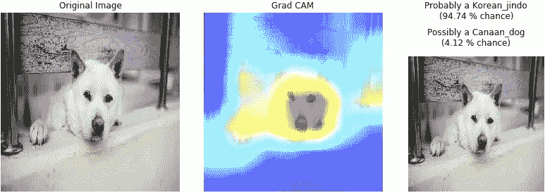

该实验的代码和可视化可在此处获得:[收集图像](https://github.com/thierrylaplanche/DogBreedClassifier/blob/master/DogBreedClassifier-1-Collecting%20images.ipynb) / [预训练模型](https://github.com/thierrylaplanche/DogBreedClassifier/blob/master/DogBreedClassifier-2-Pretrained%20model.ipynb) / [迁移学习和 Grad-CAM](https://github.com/thierrylaplanche/DogBreedClassifier/blob/master/DogBreedClassifier-3-Transfer%20learning.ipynb) / [瓶颈特征和相似性搜索](https://github.com/thierrylaplanche/DogBreedClassifier/blob/master/DogBreedClassifier-4-Similarity%20search.ipynb) / [部署到 Google AI 平台](https://github.com/thierrylaplanche/DogBreedClassifier/blob/master/DogBreedClassifier-5-Deployment%20to%20Google%20AI%20Platform.ipynb)

# A.介绍 ResNet-50 和珍岛狗

研究人员已经用尽了大量的计算能力来训练将图像分类的深度神经网络。许多人都在 ImageNet 的一个子集上接受了训练(一个包含 1400 万张图像的庞大数据库，人工标记了超过 22，000 个类别)，作为 [ImageNet 大规模视觉识别挑战](http://www.image-net.org/challenges/LSVRC/) (ILSVRC)的一部分，该挑战自 2010 年开始以来，每年都有很大的改进(该挑战于 2017 年结束)。每个实现[在架构和性能](https://www.pyimagesearch.com/2017/03/20/imagenet-vggnet-resnet-inception-xception-keras/)方面都有所不同，但都是我们所说的“卷积神经网络”(CNN)，这是一种深度学习网络，在检测图像特征方面具有出色的性能。

幸运的是，这些预先训练好的模型已经被[提供给任何人使用](https://keras.io/applications/)进行实验，节省了我们从头开始训练的时间和费用。其中， [ResNet-50](https://arxiv.org/pdf/1512.03385.pdf) (代表“残差网络”)是速度和精度之间的一个很好的折中。

与为 ImageNet challenge 开发的其他模型一样，ResNet-50 在分布于[1000 个类别](http://image-net.org/explore?wnid=n02084071)的 100 多万张图像上进行了训练。其中包括不少于 189 个品种的狗，从 Affenpinscher 到 Weimaraner(两个德国品种)，但与国际犬业联合会(FCI)认可的 344 个品种相差甚远。

ImageNet 数据库中缺失的品种包括:珍岛犬，FCI 注册的编号为 334 ，这是一种斯皮兹猎犬，原产于朝鲜半岛西南海岸的珍岛。根据皇家犬科犬的说法，珍岛犬大胆、勇敢、机警、细心、格外忠诚，而且“不易动心”。

那么，当 ResNet-50 看到一个 Jindo 时，它看到了什么？我们用几张图试试。

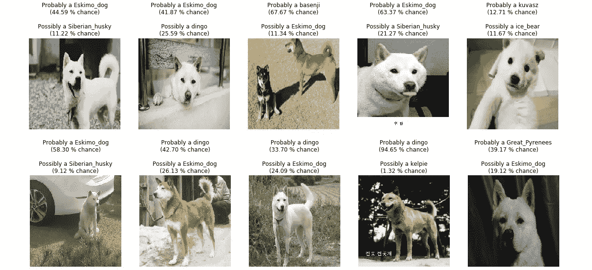

ResNet-50 对珍岛犬图片的前 2 名预测

显然，它(还)没有看到一个进道。在接受测试的 115 张照片中，24 张被归类为“爱斯基摩狗”，20 张被归类为“澳洲野狗”，13 张被归类为“库瓦斯”，一种匈牙利品种。看看那些狗，它们确实有一些相似之处。

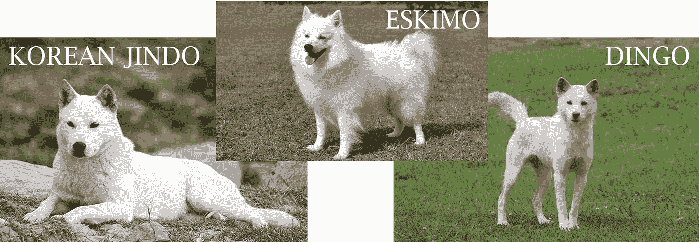

# B.迁移学习:ResNet-50 遇上珍岛狗

如果有一种方法可以教会 ResNet-50 模型识别 Jindo 狗(或任何其他未经训练识别的品种)，而无需重新训练整个模型，这将需要下载 100 多万张图像并花费数天或数月来训练，会怎么样？

这就是迁移学习的用武之地。[迁移学习](https://towardsdatascience.com/transfer-learning-from-pre-trained-models-f2393f124751)是一种方法，它利用通过在大规模数据集上训练的模型获得的*通用知识*，仅使用有限数量的新数据来开发更为*的特定于任务的知识*。虽然一般知识用于检测图像中的低级特征，如边缘和曲线，但特定任务知识使模型能够识别更高级的特征，如耳朵、鼻子或口鼻的形状，并最终区分不同的狗品种。

通用知识在 CNN 的下层形成(靠近输入图像)，而特定知识在上层增长，靠近分类器(输出)，如下图所示，该图摘自 Anirudh Koul、Siddha Ganju 和 Meher Kasam (O'Reilly，2019)的《云、移动和边缘的实用深度学习》*。*

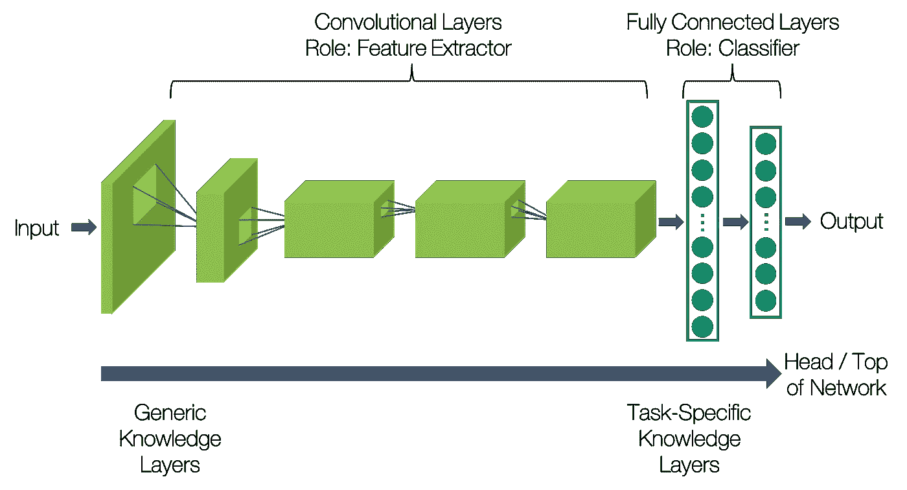

CNN 概述([在此阅读本书](https://learning.oreilly.com/library/view/practical-deep-learning/9781492034858/))

如前所述，ResNet-50 模型能够识别总共 1，000 个类别。这是通过模型的最后和最顶层(输出层)由正好 1000 个节点(或神经元)组成的事实来实现的，每个节点输出图像属于某个类别的概率。

现在，我们如何教 ResNet-50 一个新的类别，例如 Jindo 狗？虽然只需在该层中添加第 1001 个神经元并向网络提供一些新类别的图片会很方便，但这在实践中是不可能的。分类器部分需要在代表每个类别的一小组数据上完全重新训练。(为了获得更好的结果，如果我们有足够的图像用于每个类，我们也可以重新训练一些卷积层。我们就是这么做的)。

总而言之，我们必须:

*   用新类别的一个附加神经元重新创建顶层(分类器),
*   重新训练上层，不仅要有珍岛犬的图片，还要有其他品种的图片，最好数量相近，以避免[等级失衡](https://machinelearningmastery.com/what-is-imbalanced-classification/)。

为了方便我们的任务，我们从 [Udacity 的 GitHub 库](https://github.com/udacity/deep-learning-v2-pytorch/tree/master/project-dog-classification)下载了一个[数据集](https://s3-us-west-1.amazonaws.com/udacity-aind/dog-project/dogImages.zip)。它包含了 133 个品种的 8351 张图片。我们还在 Google Images 和 Naver Images 上收集了珍岛狗的图片。训练过程(重新训练 ResNet-50 模型的前 8 层，加上新的分类器部分)在配备单个 GPU 的机器上花费了一个多小时。

现在，让我们使用之前尝试过的同一组图像来测试我们微调过的模型。以下图片在培训期间没有使用，因此模型第一次看到它们:

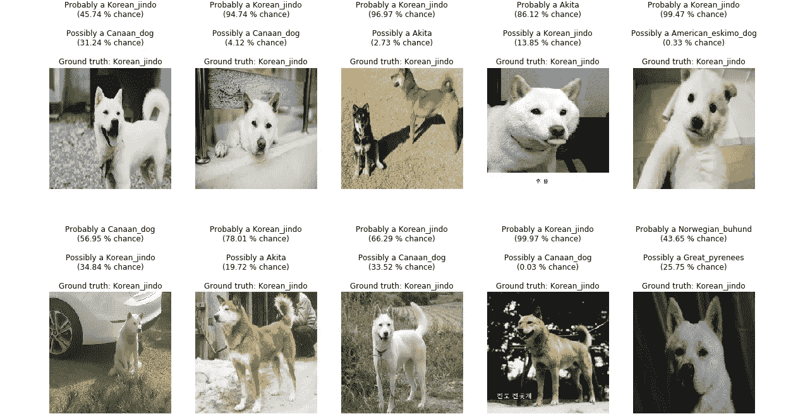

微调 ResNet-50 对珍岛犬图片的前 2 名预测

在 10 张测试图片中，7 张被正确分类为 Jindo，1 张被正确分类为 Akita，1 张被正确分类为 Norwegian Buhund，1 张被正确分类为 Canaan，所有这些图片都来自‘Spitz’犬家族。Jindo 甚至是 3 张错误分类图片中的 2 张的第二个猜测。不错的成绩！

当然，这种模式也适用于其他品种:

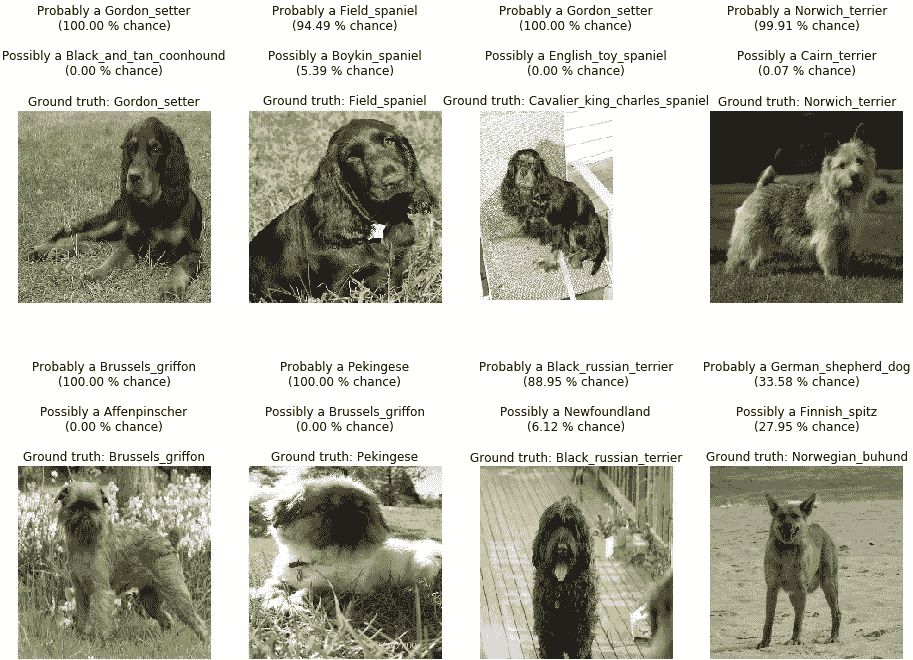

对于非类别品种:

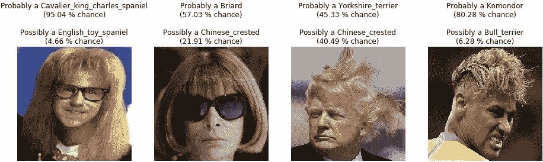

# C.你在看什么？

一个很酷的实验是可视化图像的哪些部分对模型将图像分类到某个类别的决定有最大的影响。这是“可解释的人工智能”的技术之一，人工智能的一个领域，旨在解释由“智能”系统做出的决定。随着越来越多的人工智能用例影响人们的生活(从调整保险费到处理工作申请)，依赖这些方法的企业正在为自己的决策负责。

在计算机视觉领域，研究神经网络“黑匣子”的一种方法是使用 [Grad-CAM](https://arxiv.org/abs/1610.02391) ，这是一种通过突出显示图像中的重要区域来提供 CNN 类型模型预测的视觉解释的技术。

假设你要训练一个模型去识别西伯利亚哈士奇，你的训练图大部分背景都是雪。存在模型学习等式“雪=西伯利亚哈士奇”并将任何背景中有雪的狗图片归类为西伯利亚哈士奇的风险。计算 Grad-CAM 可以确保图像的分类是有充分理由的。

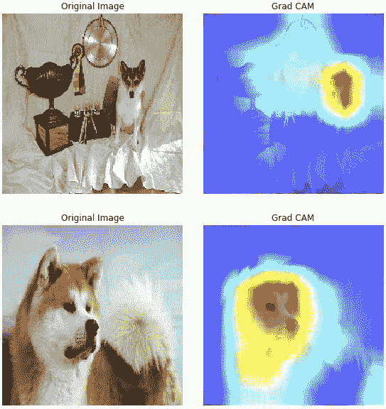

在上图中，Grad-CAM 应用于网络的最后一个卷积层。第一个例子表明，模型正在关注狗本身，而不是场景中的其他对象。在第二个例子中，有趣的是看到模型主要在看眼睛周围的区域。在其他情况下，它将是枪口或耳朵。

# D.瓶颈特征:ResNet-50 剥离

CNN 中卷积层的作用是从图像中提取特征:低层(靠近输入端)的低层特征，如边缘和曲线，高层(靠近输出端)的高层特征，如物体的形状。

如果我们通过剥离其最顶层分类层的模型来提取最后一个卷积层的输出，我们会得到一个抽象的数字向量(通常是 0 到 1 之间的浮点值)图像表示。例如，ResNet-50 模型的最后一个卷积层为每个图像输出一个大小为 7x7x2048 的矩阵，然后通过一个[全局平均池](https://machinelearningmastery.com/pooling-layers-for-convolutional-neural-networks/)操作对 7x7 切片进行平均，将该矩阵缩减为 2048 维向量。这就是*特征向量*。

## 1.寻找相似的图片

特征向量(也称为*瓶颈特征*，因为它的维数降低了)可以与其他图像的特征向量进行比较，以找到相似的图片。实现这一点的一种方法是通过计算向量之间的欧几里德距离。相似的图片将使它们的特征向量彼此“更接近”。在 Python 中，我们可以使用来自 [scikit-learn](https://scikit-learn.org/stable/modules/neighbors.html) 库中的*最近邻*算法。

为我们数据集中的 6，787 张图像计算 2048 维向量用了不到一分钟的时间。如果我们保持“n”的值较低，找到向量的“n-最近邻”甚至更快。让我们看看随机选择的 3 张图片的结果，以及它们的 3 个最近的邻居和到参考图片的欧几里德距离。注意，长相相似的狗狗图片大部分时间是，但不总是，同一品种的图片。

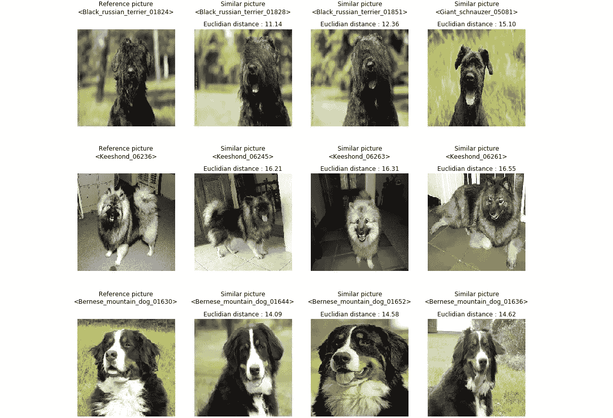

相似图片的特征向量具有较短的欧几里德距离

## 2.用 t-SNE 可视化图像簇

什么品种和其他品种相似？既然我们能够评估图像之间的相似程度，那么让我们试着找到相似图像的聚类。但是如何在 2D 屏幕上想象 2048 维的空间呢？这要归功于另一种算法，它还有一个奇怪的名字:*t-分布式随机邻居嵌入*。

根据[维基百科](https://en.wikipedia.org/wiki/T-distributed_stochastic_neighbor_embedding)，“t-SNE 是一种机器学习算法，用于在二维或三维的低维空间中可视化高维数据。它通过二维或三维点对每个高维对象进行建模，以这种方式，相似的对象通过附近的点进行建模，不相似的对象通过远处的点进行建模的概率很高”。

在我们的例子中，高维对象是每个具有 2048 维的特征向量。scikit-learn 的 [t-SNE 算法](https://scikit-learn.org/stable/modules/generated/sklearn.manifold.TSNE.html)再次派上了用场。在 6787 幅图像上计算 SNE 霸王龙只需要几分钟。绘制结果产生了这幅美丽的点彩单色画:

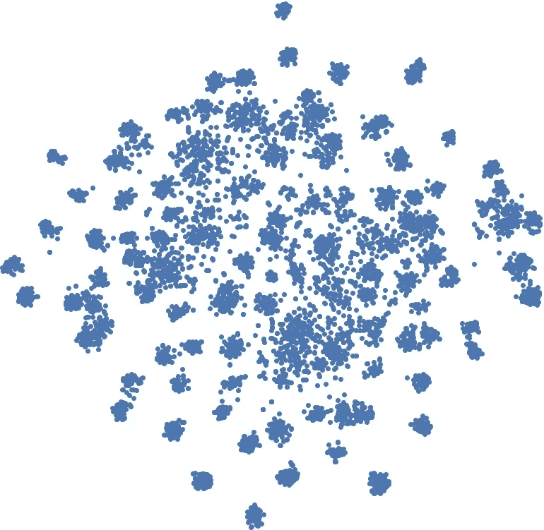

为了理解不同的圆圈代表什么，我们可以绘制一些相应的图像。为了实现这一点，我们从《云、移动和边缘的实用深度学习 [*一书中借用了 Python 代码*](https://learning.oreilly.com/library/view/practical-deep-learning/9781492034858/) 。

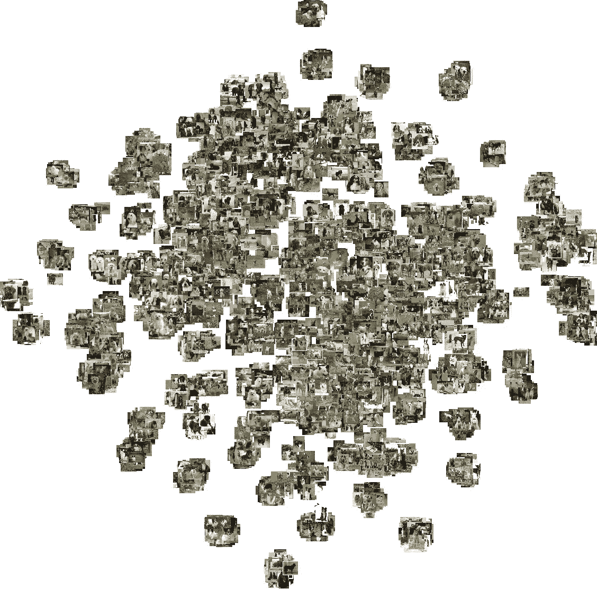

重新排列图像后，我们得到了一个更清晰的画面:

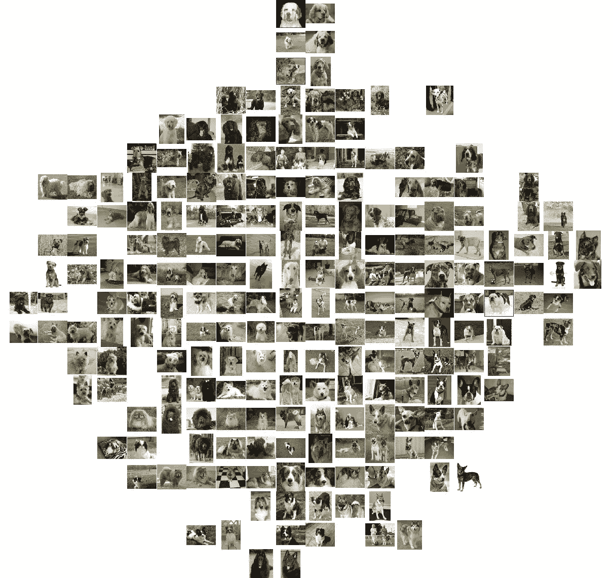

比熊犬(Bichon Frisés)和牛头犬(Bulldogs)处于相反的两端，这是实验取得圆满成功的标志。正如我们所料，我们的 Jindo 狗和更有声望的人一起出去玩。

# E.微调后的 ResNet-50 的一些指标

## 1.预测准确度

对 80 %的数据集进行训练，剩下 20 %用于评估(验证和测试)。数据扩充用于通过自动生成图像的修改版本(应用诸如旋转、移位、缩放等变换)来扩展训练集的大小。).验证数据用于评估不同的算法参数(超参数)，测试数据用于提供模型的最终评估。

调整超参数(辍学率、学习率、时期数、全连接层中的神经元数)导致精确度略有提高。

*   准确度:正确预测的样本与样本总数的比率

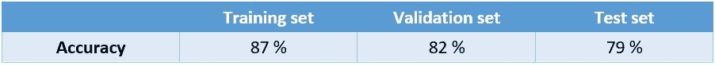

考虑到我们用于迁移学习的少量图片，这些数字已经相当令人满意了。早几个时期停止训练会减少由训练和测试精度之间的差异所说明的“过拟合”效应。请注意，对于 134 个不同的类别，随机猜测只能达到不到 1 %的准确率。

## 2.混淆矩阵

混淆矩阵(此处被截断以仅显示最后 14 个类别)允许容易地识别模型预测和实际类别(矩阵的对角线)之间的正确匹配，以及不正确的预测(所有其他值)。我们可以验证 10 个 Jindo dog 图片中的 7 个被正确分类(其他 3 个在截断矩阵上不可见)。

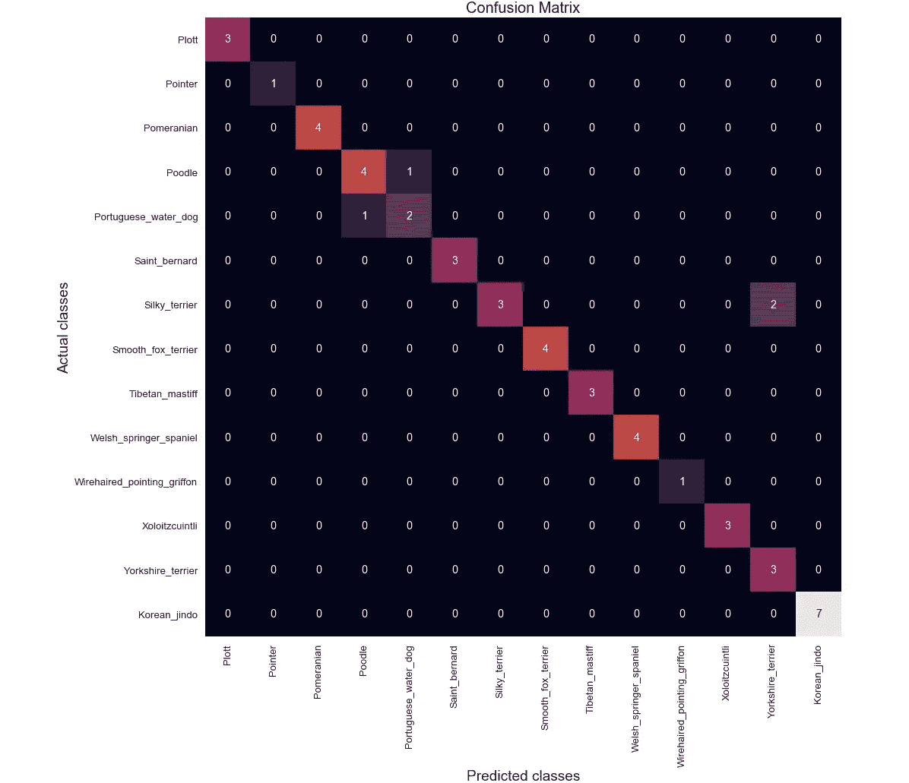

## 3.分类报告

评估分类模型性能的另一个有用工具是分类报告，它显示整个数据集和每个类的主要分类指标(精度、召回率、F1 分数)。

*   精度:某个类别的预测实际上属于该类别的比例
*   召回率:数据集中某个类别的预测占该类别所有样本的比例
*   f1-得分:精确度和召回率的加权平均值

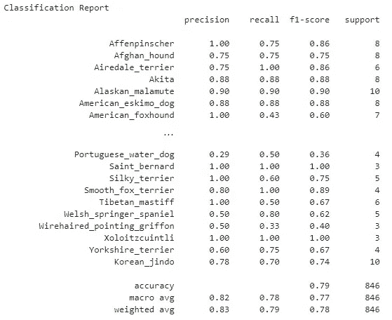

关于“韩国珍岛”类，我们得到了 78 %的准确率和 70 %的召回率，这意味着:

*   78 %被归类为珍岛狗的狗实际上是珍岛狗。剩下的 22 %被误认为是珍岛犬
*   所有 Jindo 狗的 70 %被正确分类(即 10 张照片中的 7 张，因为我们在测试集中有 10 张 Jindo 狗的照片)。

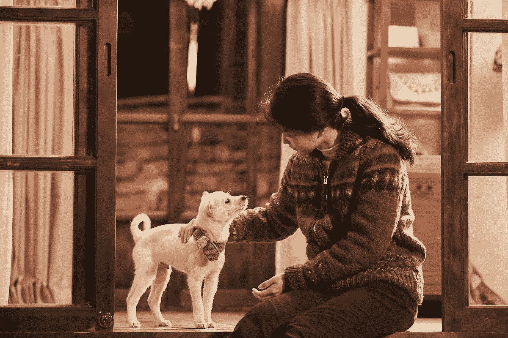

《小森林》，Yim Soon-rye，2018。