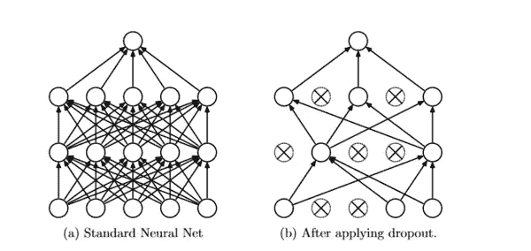

# 如何看待卷积神经网络中的过拟合

> 原文：<https://medium.com/analytics-vidhya/how-to-treat-overfitting-in-convolutional-neural-networks-d6e74a0a479?source=collection_archive---------22----------------------->

# 介绍

当您的训练数据集(用于“教授”模型的数据集)的准确性大于您的测试准确性时，机器学习模型中会出现过度拟合或高方差。就“损失”而言，当您的模型在训练集中的误差较低而在测试集中的误差较高时，过度拟合就会显现出来。您可以通过绘制损失和准确性指标，并查看两个数据集的性能指标的汇合点来直观地识别这一点。

过度拟合表明您的模型对于它正在解决的问题来说太复杂，即您的模型在回归模型和集成学习的情况下有太多的特征，在卷积神经网络的情况下有太多的过滤器，在整体深度学习模型的情况下有太多的层。这导致您的模型很好地了解示例数据，但是对于任何新数据表现不佳。

这很烦人，但是可以通过调整您的超参数来解决，但是首先，让我们确保我们的数据被划分成均匀的集合。

# 拆分数据

对于深度学习模型，我建议有 3 个数据集:训练、验证和测试。验证集应该用于微调您的模型，直到您对其性能感到满意，然后切换到测试数据来训练您的模型的最佳版本。首先，我们将导入必要的库:

```
from sklearn.model_selection import train_test_split
```

现在我们来谈谈比例。我的理想比例是 70/10/20，意思是训练集应该由~70%的数据组成，然后将 10%投入验证集，20%投入测试集，就像这样，

```
# Create the Validation Dataset 
Xtrain, Xval, ytrain, yval = train_test_split(train_images, train_labels_final, train_size=0.9, test_size=0.1, random_state=42) # Create the Test and Final Training Datasets Xtrain, Xtest, ytrain, ytest = train_test_split(Xtrain, ytrain, train_size=0.78, random_state=42)
```

您将需要执行*两个 train_test_split()* 函数调用。第一次调用是在图像和标签的初始训练集上完成的，以形成验证集。我们将调用参数 random_state 以在运行函数时保持结果的一致性，并调用 test_size 以注意我们希望验证集的大小为训练数据的 10%,并调用 train_size 以将其设置为等于剩余数据百分比的 90%。

这在默认情况下可以省略，因为 python 足够智能来进行计算。变量 Xval 和 yval 指的是我们的验证图像和标签。在第二次调用时，我们将根据新形成的训练数据 Xtrain 和 ytrain 生成测试数据集。我们将重复上述操作，但这次我们将把最新的训练集设置为以前的 78%,并将最新的数据集赋给与以前相同的变量，以保持一致性。同时，我们将把测试图像的测试数据分配给 Xtest，并对标签数据进行测试。

现在我们准备开始建模。参考我之前的博客来深入了解 CNN 的初始设置。我们将从第二个模型开始，假设我们的第一个结果如上图所示。我们将使用以下技术:

1.  **正规化**
2.  **重量初始化**
3.  **退学正规化**
4.  **重量限制**
5.  **其他**

# 正规化

[正则化](https://www.analyticsvidhya.com/blog/2018/04/fundamentals-deep-learning-regularization-techniques/)通过惩罚复杂模型来优化模型，从而最小化损失和复杂性。因此，这迫使我们的神经网络更简单。这里我们将使用一个 *L2 正则化子*，因为它是最常见的，并且比 *L1 正则化子*更稳定。这里，我们将在网络的第二层和第三层添加一个正则项，学习率(lr)为 0.01。

```
# Hidden Layer 1 
model2.add(layers.Conv2D(64, (4, 4), activation='relu', kernel_regularizer=regularizers.l2(l=0.01))) 
model2.add(layers.MaxPooling2D((2, 2))) # Hidden Layer 2 
model2.add(layers.Conv2D(128, (3, 3), activation='relu', kernel_regularizer=regularizers.l2(l=0.01))) model2.add(layers.MaxPooling2D((2,2)))
```

# 重量初始化

权重初始化在训练过程开始之前第一次为所有神经元设置权重向量。选择正确的权重至关重要，因为我们希望在足够长的时间内尽可能接近成本函数的全局最小值。在我们模型的这个迭代中，我们将使用一个初始化:

```
# Input Layer of the 3rd Model 
model3.add(layers.Conv2D(32, (3, 3), activation='relu', kernel_initializer='he_normal', input_shape=(96, 96, 3)))
```

# 辍学正规化

在训练阶段将权重设置为零时，丢弃正则化会忽略层中单元的随机子集。



输入层和隐藏层的理想比率是 0.4，输出层的理想比率是 0.2。见下文:

```
random.seed(123) # Establish Consistency in results 
model4 = Sequential() # Instantiate the 4th Model model4.add(layers.Conv2D(32, (3, 3), activation='relu', input_shape=(96, 96, 3))) 
model4.add(layers.MaxPooling2D((2, 2))) model4.add(Dropout(0.4)) model4.add(layers.Conv2D(64, (4, 4), activation='relu')) model4.add(layers.MaxPooling2D((2, 2))) model4.add(Dropout(0.4)) # Flattening- Convert 2D matrix to a 1D vector model4.add(layers.Flatten()) 
model4.add(layers.Dense(512, activation = 'relu')) model4.add(Dropout(0.2)) 
model4.add(layers.Dense(1, activation='sigmoid'))
```

# 重量限制

权重约束检查网络权重的大小，并在大小超过预定义的限制时对其进行重新缩放。重量约束根据需要工作。下面我们使用约束*单位范数*，强制权重为 1.0。

```
model5.add(layers.Conv2D(32, (3, 3), activation='relu', kernel_constraint=unit_norm(), input_shape=(96, 96, 3)))
```

# 其他的

如果所有这些都失败了，你可以通过生成更多的数据来增加你的**训练集**的大小。以下是如何在不改变图像的情况下做到这一点:

```
datagen = ImageDataGenerator(rotation_range = 0, width_shift_range = 0, height_shift_range = 0, rescale = None, shear_range = 0, zoom_range = 0, horizontal_flip = False, fill_mode = 'nearest')
```

另一种方法是通过增加尺寸来提高所有照片的分辨率。为此，您可以为训练、验证和测试数据集调用新的图像数据生成器。请看下面我是如何将照片的尺寸从(96 x 96)增加到(128 x 128)的:

```
# Import the Original Training Dataset 
train_gen2 = ImageDataGenerator(rescale=1./255).flow_from_directory(train_dir, target_size=(128,128), batch_size=15200) # Import the Original Validation Dataset 
val_gen2 = ImageDataGenerator(rescale=1./255).flow_from_directory(val_dir, target_size=(128,128), batch_size=16)# Import the Original Testing Dataset 
test_gen2 = ImageDataGenerator(rescale=1./255).flow_from_directory(test_dir, target_size=(128,128), batch_size=624)
```

艾丽卡·加布里埃尔

您也可以在我们的移动应用程序上阅读这篇文章

*原载于 2020 年 9 月 7 日*[*【https://www.analyticsvidhya.com】*](https://www.analyticsvidhya.com/blog/2020/09/overfitting-in-cnn-show-to-treat-overfitting-in-convolutional-neural-networks/)*。*