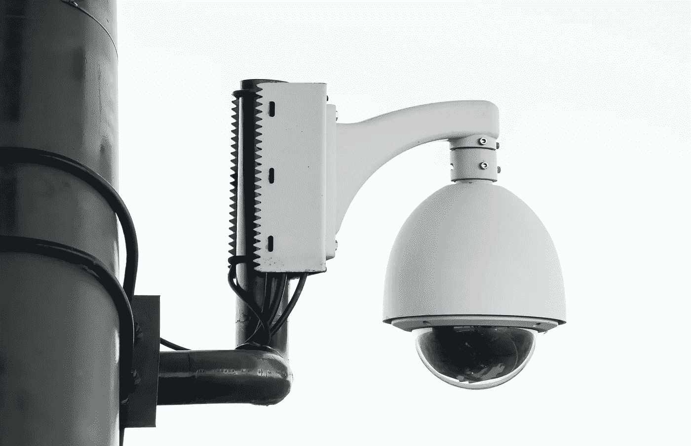

# 如何在 1 秒内将 50 个 OpenCV 帧上传到云存储

> 原文：<https://medium.com/analytics-vidhya/how-to-upload-50-opencv-frames-into-cloud-storage-within-1-second-653ee73d7711?source=collection_archive---------4----------------------->

## 如何读取 RTSP/视频帧并以异步方式上传到云存储



paweczerwi ski 在 [Unsplash](https://unsplash.com/s/photos/surveillance?utm_source=unsplash&utm_medium=referral&utm_content=creditCopyText) 上的照片

# 用例

在这个现代世界，我想我们大多数人都熟悉使用计算机视觉应用的新行业。特别是闭路电视监视摄像机和视频分析，这些都有助于在计算机视觉技术中发挥重要作用。

例如，当我们分析闭路电视摄像机时，作为第一步，我们应该使用 OpenCV 读取 RTSP URL，然后我们应该将它存储在云中的某个位置，以便进一步分析。

但问题是，当我们把帧一个接一个上传到云端的时候，上传是需要一些时间的，不是吗？

为了获得对此的清晰理解，我用 Google bucket 做了一个实验，它计算出一帧需要 1.05 秒来上传 Google bucket。因此，我们将不得不等待 1 秒钟以获得响应，然后，我们需要上传该行中的下一帧。

在你的期待下，我正在寻找解决这个问题的方法，给你！！！

> 解决方案是，我们可以使用 [**芹菜**](https://docs.celeryproject.org/en/master/index.html) 以异步方式上传帧。

当我们以异步方式上传帧时，我们无法获得序列帧，作为一种手段，我们应该使用芹菜中的组和链概念。

许多人(非专业人士)会有兴趣知道；**芹菜是什么？**

[**芹菜**](http://www.celeryproject.org/) 是 Python 世界中最受作业管理者欢迎的背景之一。

“芹菜”与 RabbitMQ 或 Redis 等几个消息代理兼容。这些既可以作为生产者，也可以作为消费者。此外，“Celery”是基于分布式消息传递的异步任务队列/作业队列。除此之外，它还专注于实时操作，并支持调度。

澄清了定义之后，下面让我们看看如何用 python 代码配置 celery。

**第一步:-** 导入所有必需的芹菜包

```
from celery import Celery
from celery.result import AsyncResult
from celery.result import allow_join_result
from celery.decorators import periodic_task
```

**步骤 2:-** 我们应该在芹菜中配置代理和后端。我已经使用 Redis 作为后端，所以[在你的系统中安装 Redis](https://www.digitalocean.com/community/tutorials/how-to-install-and-secure-redis-on-ubuntu-18-04) ，请确保它运行成功；

```
app = Celery(‘tasks’, backend=’redis://guest@127.0.0.1:6379', broker=’redis://guest@127.0.0.1:6379')
```

**第三步:-** 为了异步调用一个函数，我们要在函数上放 **"@app.taks annotation"** 。

下面是将帧上传到 Google bucket 的样本 celery 代码。

```
[@app](http://twitter.com/app).task(bind=True, max_retries=30)
def upload_frames_gcs(self, file_name):
    try:
        url = upload_file_to_gcs(file_name)
        return url
    except Exception as e:
        raise self.retry(exc=e)
```

第四步:- 以下是最重要的步骤:

我们将无法直接调用函数并以异步方式上传帧，因为上传后无法获得序列帧，所以要使用芹菜中的[链](https://docs.celeryproject.org/en/stable/userguide/canvas.html#chains)和[组](https://docs.celeryproject.org/en/stable/userguide/canvas.html#groups)概念将帧上传到一个桶中。使用这种技术，我们可以并行上传多达 5 或 10 帧，也可以得到帧的序列顺序。然而，在进入编码之前，让我们先看看**“芹菜中的链和组是什么”**

## 芹菜链

> 链是一种原语，它让我们将更多的任务链接到一个单一的签名中，因此它被称为**“一个接一个，本质上形成了回调的*链***。

也许，如果你仍然不确定，然而，下面的图表会给你一个清晰的想法，如何在芹菜链工程。这些是芹菜里的任务 id。

## 芹菜中的群体

> 组原语是一个签名，它接受应该并行应用的任务列表。

这是示例代码来解释，**我如何上传帧到谷歌桶使用组和链技术在芹菜**。

```
jobs = group(upload_frames_gcs.s(file_name, ts) for ts, file_name in file_name_dic.items())result = jobs.apply_async()
```

可以理解的是，我在一个组方法中调用 **upload_frames_gcs** 函数，然后你可以看到“s”传递一个名为**“Chains concept”**的参数，这允许你链接签名，在结果**中一个接一个地被调用，实质上形成了一个回调**的*链*。最后，我们可以在一个任务中得到一组结果。

**第五步:-** 难怪，如果你可能认为如何在芹菜上传后获得框架网址。很简单，在结果变量中你可以得到这个组函数的任务 id，我们可以使用这个任务 id 来得到结果。

但是，要小心检查任务的状态，一旦任务完成，我们就可以获得框架的 URL。

```
def taskid_status(task_id_array):
        for task in task_id_array:
            if task.successful():
                task_id_array.remove(task)
                with allow_join_result(): frames_array = []
                    for results in task.join(): 
                        frame_dic = {}
                        frame_dic['frame_url'] = results[0]
                        frames_array.append(frame_dic) return task_id_array, frames_array
```

在 frames_array 变量中，您可以获得带有时间戳的所有帧。

# 我已经用多个不同的测试用例测试了性能。

1.  **5 帧上传谷歌存储需要 0.85 秒。**
2.  **10 帧上传谷歌存储需要 0.77 到 0.82 秒。**
3.  **15 帧上传谷歌存储需要 0.9 到 1.0 秒。**
4.  **30 帧上传谷歌存储需要 0.7 到 0.8 秒。**

很明显，增加上传到 bucket 的帧数并没有太大的区别，因为在 celery 中使用了多处理来执行任务的并发执行。

> 如果你需要进一步的帮助。请随时联系我[balavenkatesh.com](http://balavenkatesh.com/)📬我很乐意帮助你。🖥️