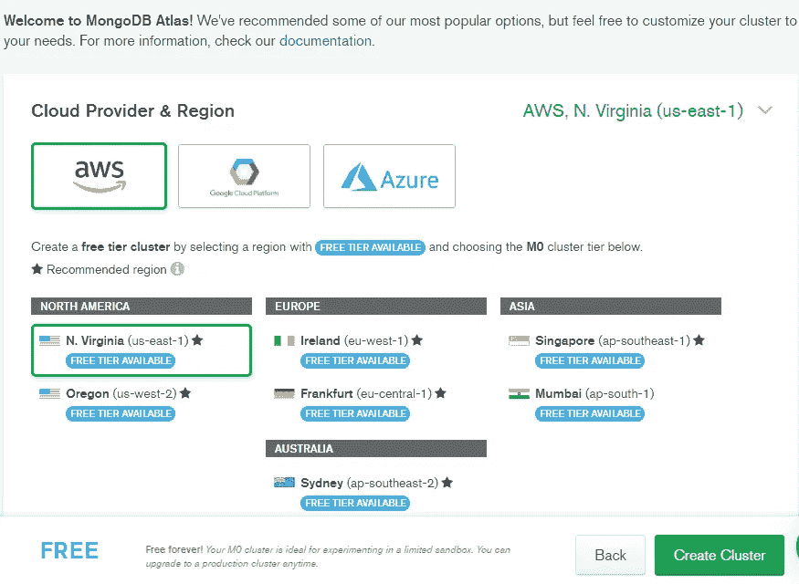
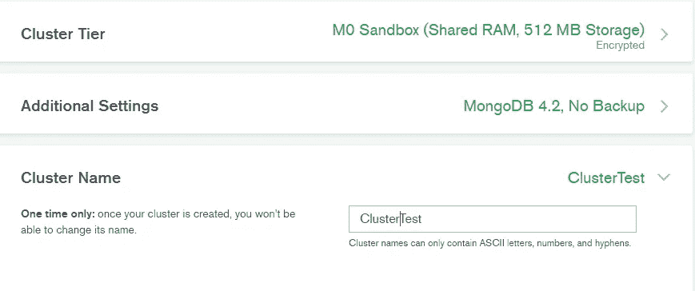
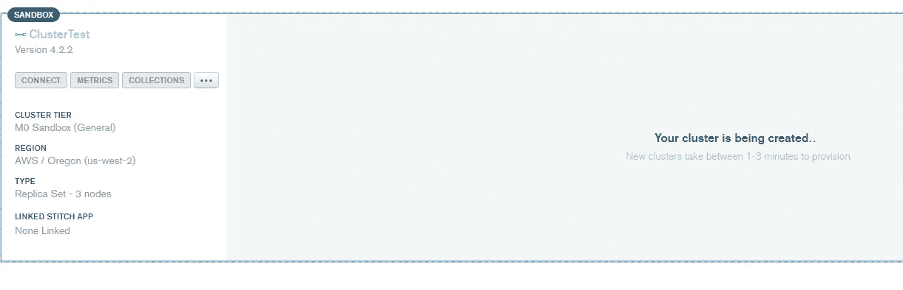
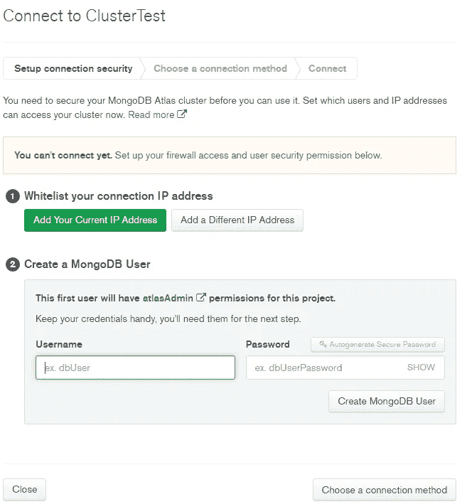
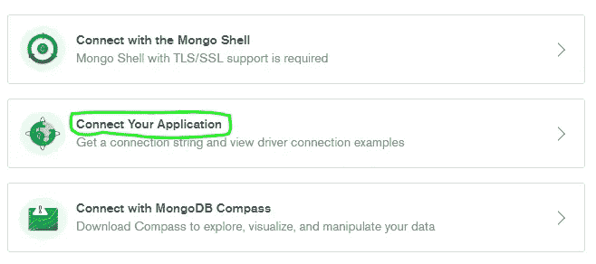
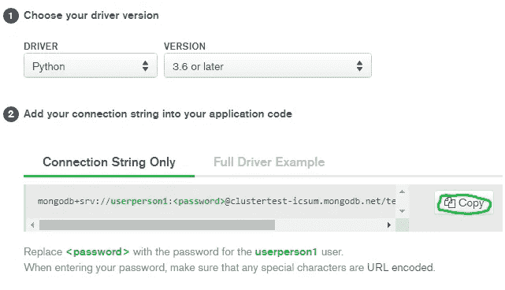
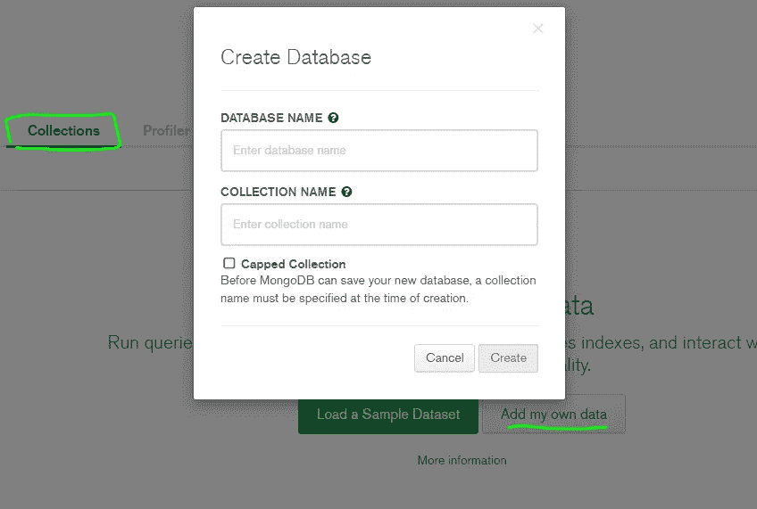
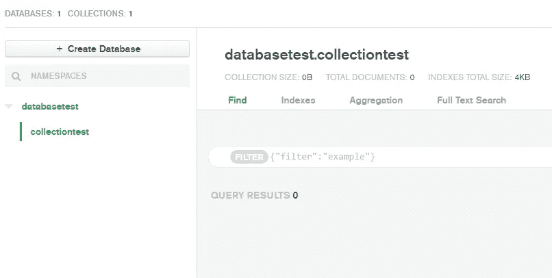

# 上传熊猫数据到 MongoDB

> 原文：<https://medium.com/analytics-vidhya/how-to-upload-a-pandas-dataframe-to-mongodb-ffa18c0953c1?source=collection_archive---------0----------------------->

*快速简单的指南*


如果您已经设置了一个 MongoDB 帐户和集群，我建议您跳到“将数据帧上传到 MongoDB”一节。如果您不确定如何连接和设置数据库，您可能还想看看前面的部分。

# 设置您的 MongoDB 和集群

您需要做的第一件事是创建一个 MongoDB 帐户。你可以在这里这样做:R [注册 MongoDB](https://cloud.mongodb.com/user#/atlas/register/accountProfile)

注册后，应该会提示您创建一个集群。假设你不想付费，你可以在“**启动集群**选项中选择创建集群。


接下来，您需要选择一个提供商和一个地区。在这种情况下，最简单的方法就是选择 AWS 并选择离您最近的位置。



在同一页面上，如果您向下滚动，您将看到您能够升级存储和备份选项，以及命名您的群集。我将把它命名为“集群测试”从这些选项中进行选择后，点击站点右侧的“**创建集群**按钮。



现在，您应该看到集群正在创建。这可能需要 3 分钟，所以在你等待的时候喝点咖啡吧！加载完成后，点击“**连接**”按钮。



# 设置到集群的连接并创建数据库

接下来，将提示您设置连接安全性。根据我的经验，创建一个 Mongodb 用户比将您的 IP 地址列入白名单更容易。这样你就可以从任何一台计算机上访问数据库。为此，创建一个您可以记住的用户名和密码。然后，点击**“创建 MongoDB 用户”**和**选择连接方式**按钮。



现在，你可以选择如何联系。由于我们使用 python 中的 pandas 数据框架，我们将选择“**连接您的应用程序。**从驱动列表中选择**Python**&’**3.6 或更高版本**。



点击“复制”您刚刚保存的字符串将用于连接到数据库。接下来，您需要点击“**收藏库**”选项卡，然后点击“**添加我自己的数据**”按钮。然后，填写您想要的数据库名称和集合名称，并单击“**创建**按钮。



# 将熊猫数据帧上传到 MongoDB

我推荐使用 python 笔记本，但是您也可以轻松地使用普通的。py 文件类型。你需要在所有标有<<caps>的区域填入你的相关信息。函数“df_to_mongo”按行将数据帧格式化成一个类似 json 的对象，并返回每行的列表。</caps>

```
# Imports
import pandas as pd
from pymongo import MongoClient# Load csv dataset
data = pd.read_csv('<<INSERT NAME OF DATASET>>.csv')# Connect to MongoDB
client =  MongoClient("mongodb+srv://<<YOUR USERNAME>>:<<PASSWORD>>[@clustertest](http://twitter.com/clustertest)-icsum.mongodb.net/test?retryWrites=true&w=majority")db = client['<<INSERT NAME OF DATABASE>>']
collection = db['<<INSERT NAME OF COLLECTION>>']data.reset_index(inplace=True)
data_dict = data.to_dict("records")# Insert collection
collection.insert_many(data_dict)
```

**祝贺你！**如果您用自己的信息替换了< < > >并运行了这段代码，那么您应该会看到来自 pandas dataframe 的数据出现在您在 MongoDB 上设置的数据库的 collections 选项卡中。



在这里，您甚至可以通过列名和该列中的值来过滤数据库中的结果。需要注意的一点是，上传到 MongoDB 的 dataframe 不再是表，因为 MongoDB 是非关系数据库。

*这是我写的为数不多的文章之一，所以如果我有任何错误，请原谅我。我希望这篇文章对你有所帮助，并非常感谢你的任何批评或问题。*