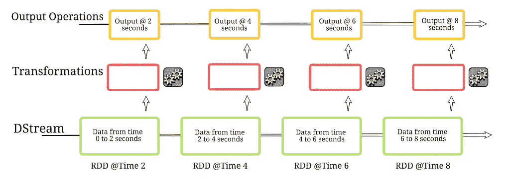
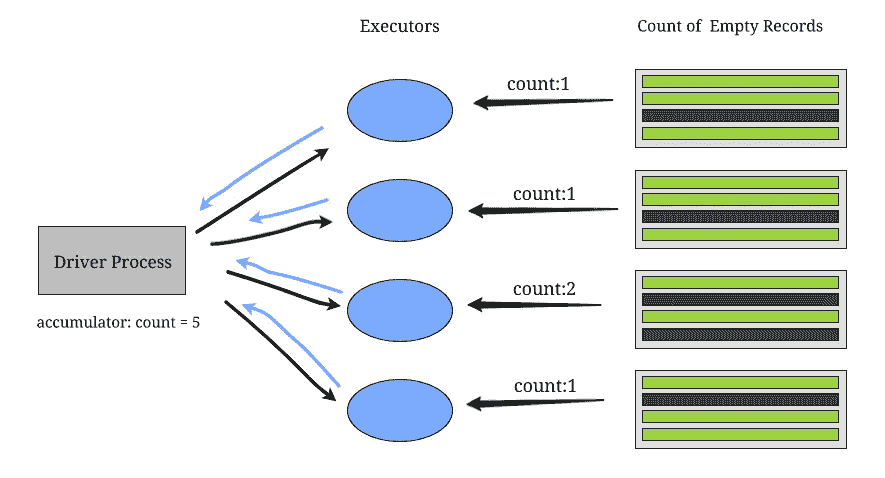
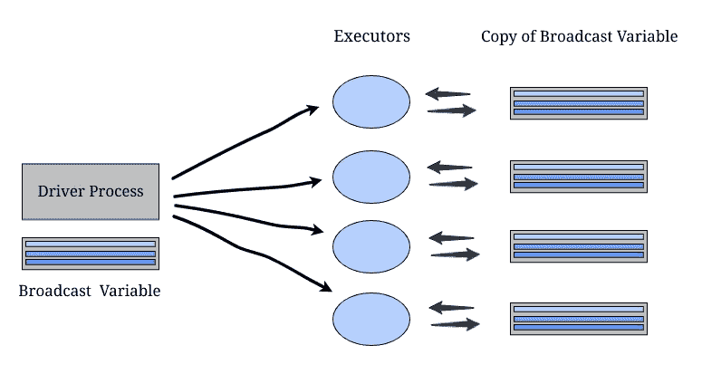
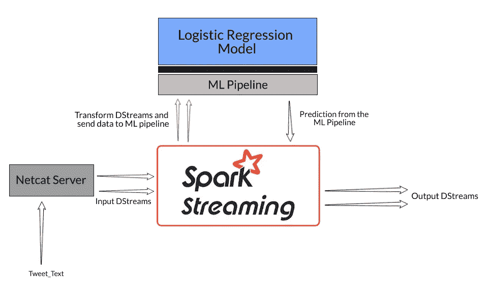
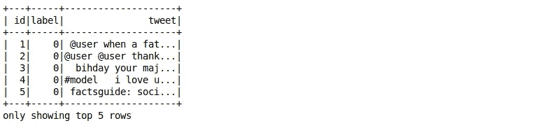
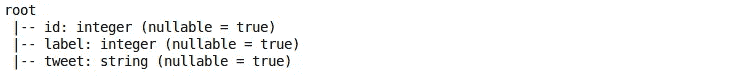
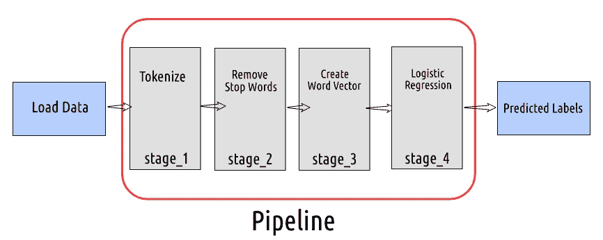

# 如何使用机器学习模型对使用 PySpark 的流数据进行预测？

> 原文：<https://medium.com/analytics-vidhya/how-to-use-a-machine-learning-model-to-make-predictions-on-streaming-data-using-pyspark-f3d27722a48c?source=collection_archive---------16----------------------->

想象一下，每秒钟有超过 8500 条推文被发送，超过 900 张照片被上传到 Instagram，超过 4200 次 Skype 通话，超过 78000 次谷歌搜索，超过 200 万封电子邮件被发送(根据[互联网直播统计](https://www.internetlivestats.com/one-second/))。

我们现在正在以前所未有的速度和规模生成数据。在数据科学领域工作是多么美好的时光啊！但是海量数据也带来了同样复杂的挑战。

主要是——我们如何收集这种规模的数据？我们如何确保我们的机器学习管道在数据生成和收集后立即继续产生结果？这些是行业面临的重大挑战，也是为什么流数据的概念在组织中获得更多关注的原因。


添加处理流数据的能力将大幅提升您当前的[数据科学组合](https://courses.analyticsvidhya.com/courses/ace-data-science-interviews?utm_source=blog&utm_medium=streaming-data-pyspark-machine-learning-model)。这是业内非常需要的技能，如果你能掌握它，它将帮助你获得下一个数据科学职位。

因此，在本文中，我们将学习什么是流数据，了解 Spark 流的基础知识，然后处理一个行业相关的数据集，使用 Spark 实现流数据。

# 什么是流数据？

我们看到了上面的社交媒体数据——我们正在处理的数据令人难以置信。你能想象存储所有这些数据需要什么吗？这是个复杂的过程！因此，在我们深入本文的 Spark 方面之前，让我们花一点时间来理解什么是流数据。

> *流数据没有离散的开始或结束。每秒钟都会从数千个数据源中生成这些数据，并且需要尽快对其进行处理和分析。相当多的流数据需要实时处理，比如谷歌搜索结果。*

我们知道，一些见解在事件发生后更有价值，但随着时间的推移，它们往往会失去价值。以任何体育赛事为例，我们希望看到即时分析、即时统计洞察，以便在那一刻真正享受比赛，对吗？

例如，假设你正在观看一场激动人心的网球比赛，对手是罗杰·费德勒和诺瓦克·德约科维奇。

这场比赛在两局中打成平手，你想知道费德勒反手回球的百分比与他职业生涯的平均水平相比是多少。几天后或者在决胜局开始前的那一刻看到这一点有意义吗？

# 火花流的基本原理

> *Spark Streaming 是核心 Spark API 的扩展，支持实时数据流的可扩展和容错流处理。*

在跳到实现部分之前，让我们先了解一下 Spark 流的不同组件。

# 离散流

**离散化流，或数据流，代表连续的数据流。**这里，数据流要么直接从任何来源接收，要么在我们对原始数据进行一些处理后接收。

构建流应用程序的第一步是为我们收集数据的数据源定义批处理持续时间。如果批处理持续时间为 2 秒，则数据将每 2 秒收集一次，并存储在 RDD 中。并且这些 rdd 的连续系列的链是不可变的并且可以被 Spark 用作分布式数据集的数据流。

我强烈推荐您阅读这篇文章，以便更好地了解 RDDs—[Spark:RDDs](https://www.analyticsvidhya.com/blog/2016/09/comprehensive-introduction-to-apache-spark-rdds-dataframes-using-pyspark/?utm_source=blog&utm_medium=streaming-data-pyspark-machine-learning-model)的全面介绍。



想想一个典型的数据科学项目。在数据预处理阶段，我们需要转换变量，包括将分类变量转换为数字变量、创建箱、移除异常值和许多其他事情。Spark 维护我们对任何数据定义的所有转换的历史。因此，无论何时出现任何错误，它都可以追溯转换的路径，并再次生成计算结果。

我们希望我们的 Spark 应用程序能够 24 x 7 全天候运行，无论何时出现任何故障，我们都希望它能够尽快恢复。但在处理大规模数据时，Spark 需要重新计算所有转换，以防出现任何错误。可以想象，这可能相当昂贵。

# 贮藏

这里有一个应对这一挑战的方法。我们可以临时存储计算(缓存)的结果，以维护数据上定义的转换结果。这样，当任何错误发生时，我们不必一次又一次地重新计算这些转换。

数据流允许我们将流数据保存在内存中。当我们想要对相同的数据进行多重运算时，这很有帮助。

# 检查点

当我们正确使用缓存时，它非常有用，但是它需要大量的内存。并不是每个人都有数百台 128 GB 内存的机器来缓存所有东西。

这就是检查点的概念将帮助我们的地方。

> *检查点是另一种保存转换数据帧结果的技术。它会不时地将运行中的应用程序的状态保存在任何可靠的存储设备上，比如 HDFS。但是，它比缓存慢，灵活性差。*

当我们有流数据时，我们可以使用检查点。变换结果依赖于先前的变换结果，并且需要被保留以便使用它。我们还检查元数据信息，如用于创建流数据的配置和一组数据流操作的结果等。

# 流数据中的共享变量

有时，我们需要为 Spark 应用程序定义 map、reduce 或 filter 等函数，这些函数必须在多个集群上执行。该功能中使用的变量被复制到每台机器(集群)中。

这里，每个集群都有一个不同的执行器，我们需要一些东西来给出这些变量之间的关系。

例如，让我们假设我们的 Spark 应用程序运行在 100 个不同的集群上，这些集群捕获来自不同国家的人发布的 Instagram 图像。我们需要一个帖子中提到的特定标签的计数。

现在，每个集群的执行程序将计算该特定集群上的数据结果。但是我们需要一些东西来帮助这些集群进行通信，这样我们就可以得到聚合的结果。在 Spark 中，我们共享了允许我们克服这个问题的变量。

# 累加器变量

像错误发生的次数、空白日志的数量、我们从特定国家收到请求的次数等用例，所有这些都可以使用累加器来解决。

每个集群上的执行器将数据发送回驱动程序进程，以更新累加器变量的值。累加器只适用于结合律和交换律。例如，总和与最大值可以工作，而平均值则不行。



# 广播变量

当我们处理位置数据时，比如城市名称和邮政编码的映射——这些是固定变量，对吗？现在，如果每次任何集群上的特定转换都需要这种类型的数据，我们就不需要向驱动程序发送请求，因为这太昂贵了。

相反，我们可以在每个集群上存储这些数据的副本。这些类型的变量被称为广播变量。

> *广播变量允许程序员在每台机器上缓存一个只读变量。通常，Spark 使用有效的广播算法自动分配广播变量，但是如果我们的任务需要多个阶段的相同数据，我们也可以定义它们。*



# 使用 PySpark 对流数据执行情感分析

是时候启动你最喜欢的 IDE 了！让我们在这一节开始编码，并以实用的方式理解流数据。

# 理解问题陈述

在本节中，我们将使用真实世界的数据集。我们的目标是检测推文中的仇恨言论。为了简单起见，如果一条推文带有种族主义或性别歧视的情绪，我们就说这条推文包含仇恨言论。

所以，任务是将种族主义或性别歧视的推文从其他推文中分类。我们将使用推文和标签的训练样本，其中标签“1”表示推文是种族主义/性别歧视的，标签“0”表示不是。


*来源:TechCrunch*

为什么这是一个相关的项目？因为社交媒体平台以评论和状态更新的形式接收庞大的流数据。这个项目将帮助我们缓和什么是公开张贴。

你可以在这里查看更详细的问题陈述— [练习题:推特情绪分析](https://datahack.analyticsvidhya.com/contest/practice-problem-twitter-sentiment-analysis/?utm_source=blog&utm_medium=streaming-data-pyspark-machine-learning-model)。我们开始吧！

# 设置项目工作流

1.  **模型构建**:我们将构建一个逻辑回归模型管道，对推文是否包含仇恨言论进行分类。这里，我们的重点不是建立一个非常精确的分类模型，而是了解如何使用任何模型并返回流数据的结果
2.  **初始化 Spark 流上下文**:一旦模型构建完成，我们需要定义主机名和端口号，从那里获取流数据
3.  **流数据:**接下来，我们将从定义的端口添加来自 netcat 服务器的 tweets，Spark 流 API 将在指定的持续时间后接收数据
4.  **预测并返回结果:**一旦我们接收到 tweet 文本，我们将数据传递到我们创建的机器学习管道中，并从模型中返回预测的情绪



以下是我们工作流程的简洁说明:

# 用于构建逻辑回归模型的定型数据

我们在一个映射到标签的 CSV 文件中有关于 Tweets 的数据。我们将使用一个[逻辑回归模型](https://www.analyticsvidhya.com/blog/2015/11/beginners-guide-on-logistic-regression-in-r/?utm_source=blog&utm_medium=streaming-data-pyspark-machine-learning-model)来预测推文是否包含仇恨言论。如果是，那么我们的模型将预测标签为 1(否则为 0)。可以参考本文 [PySpark 初学者](https://www.analyticsvidhya.com/blog/2019/10/pyspark-for-beginners-first-steps-big-data-analysis/?utm_source=blog&utm_medium=streaming-data-pyspark-machine-learning-model)来设置 Spark 环境。

你可以在这里下载[数据集和代码](https://github.com/lakshay-arora/PySpark/tree/master/spark_streaming)。

首先，我们需要定义 CSV 文件的模式。否则，Spark 会将每一列的数据类型视为 string。读取数据并检查模式是否符合定义:

```
# importing required libraries
from pyspark import SparkContext
from pyspark.sql.session import SparkSession
from pyspark.streaming import StreamingContext
import pyspark.sql.types as tp
from pyspark.ml import Pipeline
from pyspark.ml.feature import StringIndexer, OneHotEncoderEstimator, VectorAssembler
from pyspark.ml.feature import StopWordsRemover, Word2Vec, RegexTokenizer
from pyspark.ml.classification import LogisticRegression
from pyspark.sql import Row# initializing spark session
sc = SparkContext(appName="PySparkShell")
spark = SparkSession(sc)

# define the schema
my_schema = tp.StructType([
  tp.StructField(name= 'id',          dataType= tp.IntegerType(),  nullable= True),
  tp.StructField(name= 'label',       dataType= tp.IntegerType(),  nullable= True),
  tp.StructField(name= 'tweet',       dataType= tp.StringType(),   nullable= True)
])

# read the dataset  
my_data = spark.read.csv('twitter_sentiments.csv',
                         schema=my_schema,
                         header=True)# view the data
my_data.show(5)# print the schema of the file
my_data.printSchema()
```



# 定义我们机器学习管道的阶段

现在我们已经有了 Spark 数据框架中的数据，我们需要定义我们想要转换数据的不同阶段，然后使用它从我们的模型中获得预测标签。

在第一阶段，我们将使用 *RegexTokenizer* 将 Tweet 文本转换成单词列表。然后，我们将从单词列表中移除停用单词，并创建[单词向量](https://www.analyticsvidhya.com/blog/2019/07/how-to-build-recommendation-system-word2vec-python/?utm_source=blog&utm_medium=streaming-data-pyspark-machine-learning-model)。在最后阶段，我们将使用这些词向量来建立逻辑回归模型，并获得预测的情感。

*你可以参考这篇文章——《*[*Twitter 情感分析综合动手指南*](https://www.analyticsvidhya.com/blog/2018/07/hands-on-sentiment-analysis-dataset-python/?utm_source=blog&utm_medium=streaming-data-pyspark-machine-learning-model)*》——构建一个更准确、更健壮的文本分类模型。并且你也可以在这里阅读更多关于构建 Spark 机器学习管道的内容:* [*想要构建机器学习管道？使用 PySpark*](https://www.analyticsvidhya.com/blog/2019/11/build-machine-learning-pipelines-pyspark/?utm_source=blog&utm_medium=streaming-data-pyspark-machine-learning-model) *的快速介绍。*



请记住，我们的重点不是建立一个非常准确的分类模型，而是看看如何使用预测模型来获得流数据的结果。

```
# define stage 1: tokenize the tweet text    
stage_1 = RegexTokenizer(inputCol= 'tweet' , outputCol= 'tokens', pattern= '\\W')
# define stage 2: remove the stop words
stage_2 = StopWordsRemover(inputCol= 'tokens', outputCol= 'filtered_words')
# define stage 3: create a word vector of the size 100
stage_3 = Word2Vec(inputCol= 'filtered_words', outputCol= 'vector', vectorSize= 100)
# define stage 4: Logistic Regression Model
model = LogisticRegression(featuresCol= 'vector', labelCol= 'label')
```

# 设置我们的机器学习管道

让我们在管道对象中添加阶段，然后我们将按顺序执行这些转换。用训练数据集拟合管道，现在，每当我们有新的 Tweet 时，我们只需要通过管道对象传递它，并转换数据以获得预测:

```
# setup the pipeline
pipeline = Pipeline(stages= [stage_1, stage_2, stage_3, model])# fit the pipeline model with the training data
pipelineFit = pipeline.fit(my_data)
```

# 流数据并返回结果

假设我们每秒收到数百条评论，我们希望通过阻止用户发布包含仇恨言论的评论来保持平台的清洁。因此，每当我们收到新的文本，我们将把它传递到管道，并获得预测的情绪。

我们将定义一个函数 **get_prediction** ，它将删除空白句子并创建一个数据帧，其中每行包含一条 Tweet。

因此，初始化 Spark 流上下文并定义 3 秒的批处理持续时间。这意味着我们将对每 3 秒钟收到的数据进行预测:

```
# define a function to compute sentiments of the received tweets
def get_prediction(tweet_text):
 try:
    # filter the tweets whose length is greater than 0
  tweet_text = tweet_text.filter(lambda x: len(x) > 0)
    # create a dataframe with column name 'tweet' and each row will contain the tweet
  rowRdd = tweet_text.map(lambda w: Row(tweet=w))
    # create a spark dataframe
  wordsDataFrame = spark.createDataFrame(rowRdd)
    # transform the data using the pipeline and get the predicted sentiment
  pipelineFit.transform(wordsDataFrame).select('tweet','prediction').show()
 except : 
  print('No data')

# initialize the streaming context 
ssc = StreamingContext(sc, batchDuration= 3)# Create a DStream that will connect to hostname:port, like localhost:9991
lines = ssc.socketTextStream(sys.argv[1], int(sys.argv[2]))# split the tweet text by a keyword 'TWEET_APP' so that we can identify which set of words is from a single tweet
words = lines.flatMap(lambda line : line.split('TWEET_APP'))# get the predicted sentiments for the tweets received
words.foreachRDD(get_prediction)# Start the computation
ssc.start()# Wait for t
ssc.awaitTermination()
```

在一个终端中运行程序，并使用 Netcat(一个实用工具，可用于向定义的主机名和端口号发送数据)。您可以使用以下命令启动 TCP 连接:

```
nc -lk port_number
```

最后，在第二个终端中键入文本，您将在另一个终端中实时获得预测:

完美！

流数据在未来几年只会增加，所以你应该开始熟悉这个话题。请记住，数据科学不仅仅是建立模型，还有一个完整的管道需要处理。

本文介绍了 Spark 流的基础知识以及如何在真实数据集上实现它。我鼓励您采用另一个数据集或收集实时数据，并实现我们刚刚介绍的内容(您也可以尝试不同的模型)。

我期待在下面的评论区听到你对这篇文章的反馈和你的想法。

*原载于 2019 年 12 月 12 日*[*【https://www.analyticsvidhya.com】*](https://www.analyticsvidhya.com/blog/2019/12/streaming-data-pyspark-machine-learning-model/)*。*