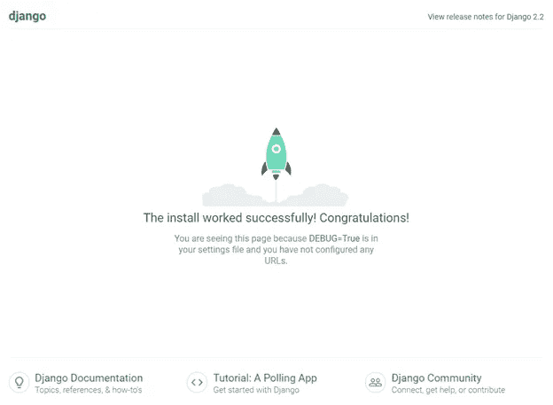
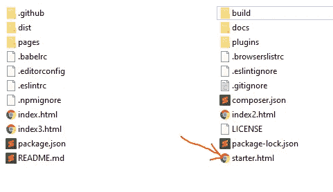
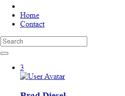
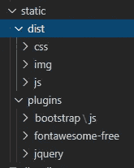
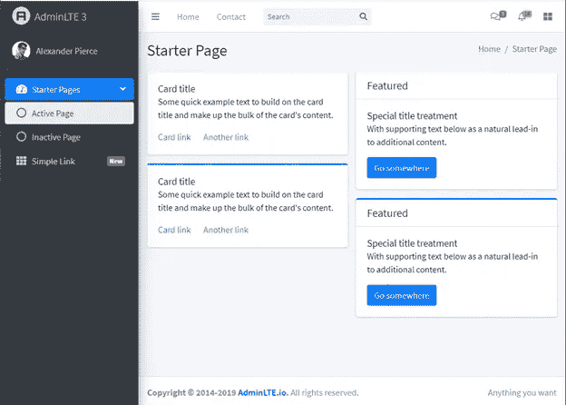

# 如何在 Django 中使用 AdminLTE

> 原文：<https://medium.com/analytics-vidhya/how-to-use-adminlte-in-django-225359ce8c72?source=collection_archive---------2----------------------->

我已经做了 5 年多基于 Django 框架的设计和开发工作。虽然 Django 开发的核心是 Python 编程，但我们不可避免地需要 CSS/HTML/JavaScript 来呈现。谈到 CSS/JavaScript 库的选择，jQuery/Bootstrap 组合似乎是最受欢迎的选择。已经有很多 Django 包支持 jQuery 和 Bootstrap。然而，我决定更进一步，使用现成的主题库。我花了一段时间才找到一个合适的 CSS/JavaScript 主题库来处理我们基于 Django 的项目。我选的是 admin LTE(【https://adminlte.io/】T2)。在我看来，AdminLTE 是最好的开源 Bootstrap 4 主题库之一。在这篇文章中，我将分享如何使用 AdminLTE 和 Django 框架来建立一个网站。

**依赖:**

1.  Python 3.7
2.  姜戈 2.2
3.  AdminLTE 3.0.5(引导数据库 4)

在本教程中，我将使用 [Visual Studio 代码](https://code.visualstudio.com/)作为我的主 IDE。

# 第一步。创建 Django 项目

转到 **mysite** 文件夹，通过运行此命令启动项目。

```
python manage.py runserver
```

默认情况下，Django 项目运行在 [http://127.0.0.1:8000/](http://127.0.0.1:8000/) 上。使用此 url 打开浏览器时，我们会遇到这种情况。



姜戈在跑

# 第二步。创建应用程序

运行这个命令来创建一个名为 **polls** 的新应用。

```
python manage.py startapp polls
```

在 **mysite/settings.py** 中，在 **INSTALLED_APPS** 中添加 **polls** 。

```
INSTALLED_APPS = [
    'django.contrib.admin',
    'django.contrib.auth',
    'django.contrib.contenttypes',
    'django.contrib.sessions',
    'django.contrib.messages',
    'django.contrib.staticfiles', # apps
    'polls.apps.PollsConfig',
]
```

在 **polls/views.py** 中，添加一个简单的查看功能。

```
from django.http import HttpResponsedef index(request):
    return HttpResponse("Hello, world. You're at the polls index.")
```

在 **polls/urls.py** 中，添加索引页面的 url 模式。

```
from django.urls import path
from . import viewsurlpatterns = [
    path('', views.index, name='index'),
]
```

在 **mysite/urls.py** 中，添加 url 模式以映射 **polls/urls.py** 。

```
from django.contrib import admin
from django.urls import include, pathurlpatterns = [
    path('polls/', include('polls.urls')),
    path('admin/', admin.site.urls),
]
```

运行服务器并在浏览器中检查[http://127 . 0 . 0 . 1:8000/polls/](http://127.0.0.1:8000/polls/)。我们会看到“你好，世界。你在民意调查指数上。”印在屏幕上。

无聊的内容，是吗？再加一个花式方案吧！

# 第三步。下载管理

在我写这篇文章的时候，AdminLTE 的版本是 3.0.5。下载并解压缩源代码。有很多包和模板。我们不一定需要里面的一切。在本教程中，我们将使用模板**starter.html**。

[https://github.com/ColorlibHQ/AdminLTE/releases/tag/v3.0.5](https://github.com/ColorlibHQ/AdminLTE/releases/tag/v3.0.5)



AdminLTE v3.0.5 源代码文件夹的快照

# 第四步。设置模板文件夹

在**投票**文件夹中创建一个名为**模板**的文件夹。在我们刚刚创建的**模板**文件夹中，创建另一个名为 **polls** 的文件夹，并在其中创建一个名为**index.html**的文件。然后将 AdminLTE 文件夹中**starter.html**的内容复制粘贴到我们刚刚创建的**index.html**中。

修改 **polls/views.py** ,以确保它使用 html 模板响应丰富的内容。

```
from django.http import HttpResponse
from django.shortcuts import renderdef index(request):
    return render(request, 'polls/index.html')
```

让我们再次运行服务器。我们希望屏幕如下所示。



仅包含文本的索引页面快照

嗯…没我们想的那么丰富。原因是我们还没有设置静态文件夹。

# 第五步。设置静态文件夹

在项目文件夹中创建一个名为 **static** 的文件夹。**静态**文件夹和**轮询**文件夹应该在同一层。我们将把所有需要的静态文件添加到这个文件夹中。因为它们是很可能被多个应用程序共享的全局文件。

另外，在**设置. py** 中添加 **STATICFILES_DIRS** 。

```
STATICFILES_DIRS = [
    os.path.join(BASE_DIR, "static"), 
]
```

展望 index.html，我们需要做以下工作。

```
<link rel="stylesheet" href="plugins/fontawesome-free/css/all.min.css">
<link rel="stylesheet" href="dist/css/adminlte.min.css"><script src="plugins/jquery/jquery.min.js"></script>
<script src="plugins/bootstrap/js/bootstrap.bundle.min.js"></script>
<script src="dist/js/adminlte.min.js"></script>
```

我们只挑选这个模板需要的包。将它们移到**静态**文件夹中。这就是它最终的样子。



静态文件夹的文件结构快照

# 第六步。修改模板

我们必须修改**index.html**以便 Django 模板引擎能够识别静态文件的路径。

在 index.html 的开头添加 **** 模板标签。

```

```

样式表路径更改示例

```
<link rel="stylesheet" href="">
<link rel="stylesheet" href="">
```

图像路径上的更改示例

```

```

Javascript 路径更改示例

```
<script src=""></script>
<script src=""></script>
<script src=""></script>
```

好的。我们一切都准备好了。让我们重新启动服务器并结帐吧！我们期待最终的观点如下。



最终视图快照

对于任何对真正的项目感兴趣的人，我已经在我的 GitHub 帐户上创建了一个教程项目。存储库名称是:[djangoandadminlet](https://github.com/slow999/DjangoAndAdminLTE)。资源库的网址是:[https://github.com/slow999/DjangoAndAdminLTE](https://github.com/slow999/DjangoAndAdminLTE)。

*   如果您想在您的网站中添加 Google ReCaptcha 支持，请查看这篇文章。
*   如果您想了解 Django 部署的一些情况，请查看本文。

敬请关注。

我还做了一个视频教程如下。请结帐。