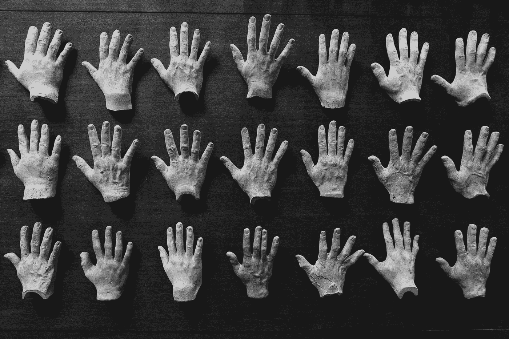

# 如何使用 AutoKeras 用一行代码建立图像分类模型？

> 原文：<https://medium.com/analytics-vidhya/how-to-use-autokeras-to-build-image-classification-models-using-one-line-of-code-c35b0c36e66e?source=collection_archive---------3----------------------->

## 初学者的深度学习

## 甚至不需要知道 Conv2d、Maxpool 或批处理规范化层是做什么的！

你能多快根据人们的手将他们分成不同的年龄组？你只差一行代码就知道了。[图像来源](https://www.pexels.com/@italo-melo-248867?utm_content=attributionCopyText&utm_medium=referral&utm_source=pexels)

*免责声明:我之所以想写这篇文章，主要是因为我找不到很多教程来演示如何* …