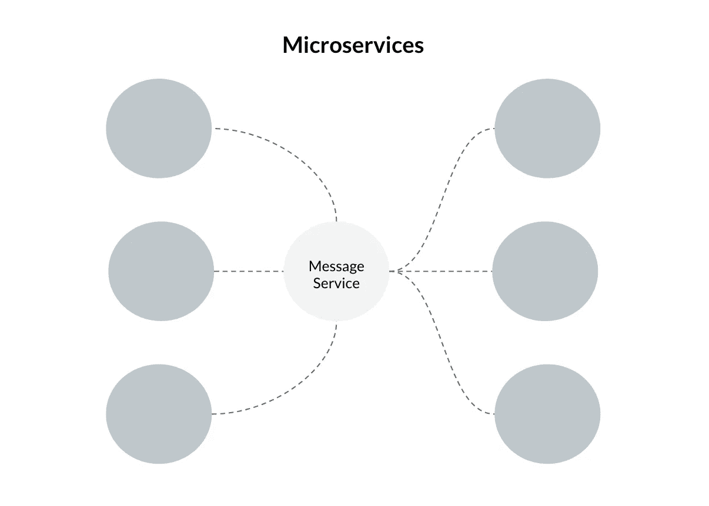
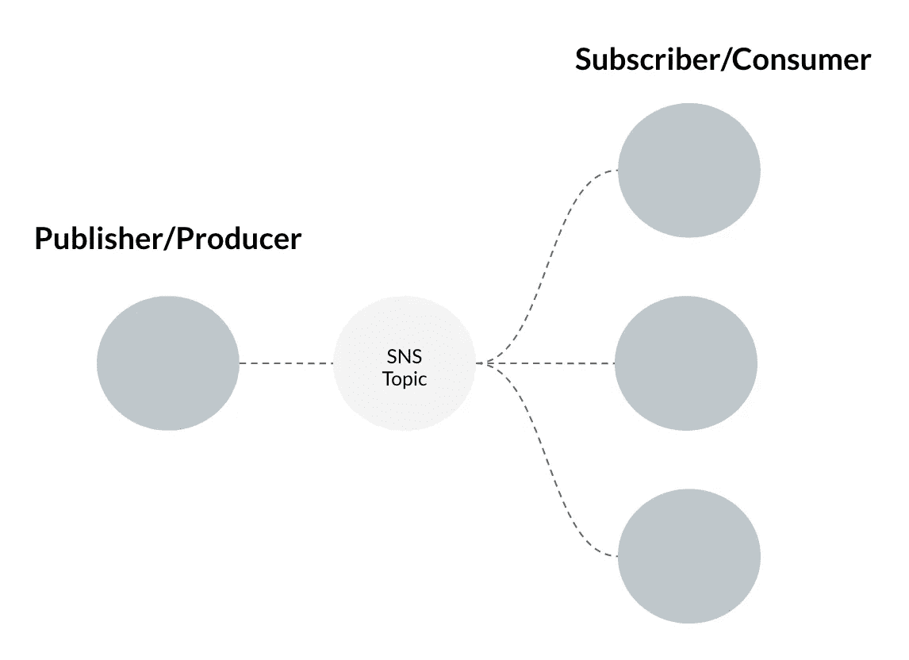
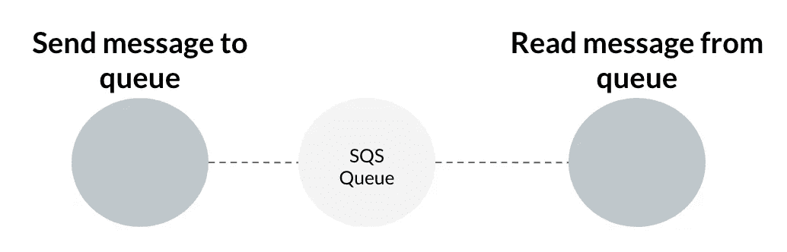
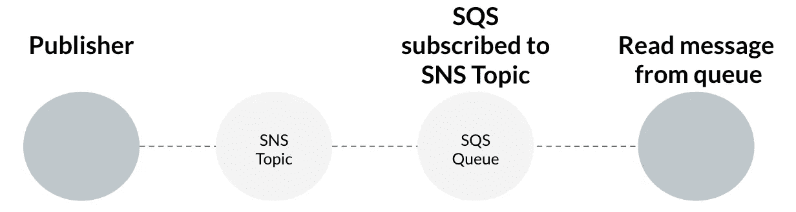

# 如何使用 AWS: SNS 和 SQS

> 原文：<https://medium.com/analytics-vidhya/how-to-use-aws-sns-and-sqs-528c485db051?source=collection_archive---------3----------------------->


你好，你好，我的工程师同事们！

最近，我不得不在我们构建的两个服务之间建立通信，这是一项有趣的任务。有许多消息服务选项，但我们最终使用了 AWS: SNS 和 SQS。

首先，我会给你一个简短的背景介绍，告诉你为什么使用信息服务。然后我会用 Python 演示一个例子，关于如何建立一个简单的 SNS 主题，发布一条消息，建立一个 SQS 队列，订阅 SNS 主题和阅读一条被 SQS 队列消费的消息…所以不多…

不要害怕！这听起来很复杂，但使用 Boto3 和 Moto 让它变得超级简单。

如果你是一个听觉学习者，那么你可以跟随这个 YouTube 视频:[https://youtu.be/E2-nbtdKZ-4](https://youtu.be/E2-nbtdKZ-4)

# 背景

首先，让我们看看为什么您会使用消息服务:



使用消息服务进行通信的微服务

当您拥有微服务基础架构时，其中一些服务可能需要相互通信。您可能有一些在一个服务中生成的数据，需要在另一个服务中进一步处理；但是您需要保持对数据的跟踪，并确保数据在被处理之前是安全的。

这就是消息服务的用武之地。

## 沟通

使用消息服务为服务之间的通信提供了一致的结构。这种结构可以在您的基础设施中采用，以实现简单、可管理的消息传递。

## 排队

对于某些服务，您可能会生成几个需要由另一个服务使用的消息。在这种情况下，您可能希望建立一个队列。

## 并行处理

对于大型数据流，消息服务可以扩展。只要你的数据没有耦合，就可以并行处理。

## 裁员

像所有好的系统一样，我们可能需要一些冗余。您可以通过重试、死信队列或提交偏移(如果您使用的是 Kafka)来设置您的消息服务。同时保持消息的安全，直到它被消费掉…你不会希望一个新用户注册你的网站失败，因为一个消息没有被处理。

# AWS: SNS 和 SQS

那么区别在哪里呢？

## 社交网站（Social Network Site 的缩写）



SNS 结构

SNS 代表简单通知服务。这是典型的发布者/订阅者一对多服务。消息被发布到一个主题，然后订阅这些主题的消费者会收到相同的消息。把它想象成一份报纸被送到几个不同的家庭。

## SQS



SQS 结构

SQS 代表简单排队服务。您设置了一个队列，并向其中添加消息。然后，您的一个服务从队列中读取并处理下一条消息。消息仅由一个源读取和处理。把它想象成收到一封私人信件。

## 设置 SQS 队列以订阅 SNS 主题



SQS 排队订阅 SNS 话题

您也可以设置队列来订阅 SNS 主题，在下面的示例中，我们将介绍如何做到这一点。

# 有趣的事情来了！

## 依赖关系:

*   Boto3
*   摩托
*   Pytest

## 创建接收消息并将其发布到 SNS 的功能:

```
"""aws_service_handler.py"""import os

import boto3

def publish_message_to_sns(message: str):
    topic_arn = os.environ["sns_topic_arn"]

    sns_client = boto3.client(
        "sns",
        region_name="eu-west-1",
    )

    message_id = sns_client.publish(
        TopicArn=topic_arn,
        Message=message,
    )

    return message_id
```

为了发布到 SNS 主题，你需要该主题的亚马逊资源名称(ARN)。在上面，我们从一个名为`sns_topic_arn`的环境变量中获取，然后使用 Boto3 设置`sns_client`并从客户端设置`publish`消息。AWS 将返回一个`MessageId`，您可以从该函数返回。

## 测试测试测试

现在让我们编写测试！我坚信博客不仅仅是向你展示“展示代码”。作为软件工程师，我们需要了解这样一种心态，有时我们在测试上花费的时间要比编写实现的时间多。

所以让我们测试上面的代码:

```
"""test_aws_service_handler.py"""import os

import boto3
from moto import mock_snsfrom aws_service_handler import publish_message_to_sns@mock_sns
def test_publish_message_to_sns():
    sns_resource = boto3.resource(
        "sns",
        region_name="eu-west-1"
    ) topic = sns_resource.create_topic(
        Name="test-topic"
    )

    os.environ["sns_topic_arn"] = topic.arn
    test_message = "test_message"
    message_id = publish_message_to_sns(test_message)

    assert message_id["ResponseMetadata"]["HTTPStatusCode"] == 200
```

实现 Moto 的方法是使用 decorators 来包装您的测试，并在内存中构建 AWS 基础设施，Boto3 将使用这种方法。在上面的测试中，我们使用`mock_sns`来创建一个 SNS 资源，并创建一个主题来发布我们的消息，使用我们之前构建的函数。

`MessageId`响应看起来会像这样:

```
{
  "MessageId": "7c446cbb-fb6a-4c03-bc0b-ded3641d5579",
  "ResponseMetadata": {
    "RequestId": "f187a3c1-376f-11df-8963-01868b7c937a",
    "HTTPStatusCode": 200,
    "HTTPHeaders": {
      "server": "amazon.com"
    },
    "RetryAttempts": 0
  }
}
```

因此，我们可以断言我们得到了一个 200 状态码(快乐路径:)响应。

# 更多有趣的东西！

## 设置一个从 SQS 队列中读取消息的函数:

```
"""aws_service_handler.py"""import os

import boto3def read_from_sqs_queue():
    queue_url = os.environ["sqs_queue_url"]
    sqs_client = boto3.client(
        "sqs",
        region_name="eu-west-1",
    )

    messages = sqs_client.receive_message(
        QueueUrl=queue_url,
        MaxNumberOfMessages=1,
    )

    return messages
```

类似于 SNS，在这种情况下，我们将需要一个`QueueUrl`，它指向我们的`sqs_client`将从其接收消息的队列。我们只想一次读取一条消息，所以我们将`MaxNumberOfMessages`设置为 1，并返回我们的消息。

## 测试测试测试…再来！

这个测试会稍微复杂一点。

像上次测试一样，我们将创建一个 SNS 主题，但我们也将创建一个订阅该主题的 SQS 队列。所以我们需要 Moto 的`mock_sns`和`mock_sqs`装饰师。

```
"""test_aws_service_handler.py"""import json
import os

import boto3
from moto import mock_sns, mock_sqsfrom aws_service_handler import read_from_sqs_queue @mock_sns
@mock_sqs
def test_read_from_sqs_queue():
    sns_resource = boto3.resource(
        "sns",
        region_name="eu-west-1"
    )
    topic = sns_resource.create_topic(
        Name="test-topic"
    )

    sqs_resource = boto3.resource(
        "sqs",
        region_name="eu-west-1",
    )

    queue = sqs_resource.create_queue(
        QueueName="test-queue",
    )
    os.environ["sqs_queue_url"] = queue.url
    os.environ["sns_topic_arn"] = topic.arn

    topic.subscribe(
        Protocol="sqs",
        Endpoint=queue.attributes["QueueArn"],
    )

    test_message = "test_message"
    message_id = publish_message_to_sns(test_message)

    messages = read_from_sqs_queue()
    message_body = json.loads(messages["Messages"][0]["Body"])

    assert message_body["MessageId"] == message_id["MessageId"]
    assert message_body["Message"] == test_message
```

创建 SNS 资源和 SNS 主题后，我们创建一个 SQS 资源和 SQS 队列。然后，我们设置函数中需要的环境变量，并让 sqs 订阅 SNS 主题，使用“SQS”协议并将`Endpoint`设置为`QueueArn`。然后像第一个测试一样，我们创建一个`test_message`并将消息发布到 SNS。

然后，我们使用自己创建的函数从队列中读取消息。

AWS 返回的`Messages`对象看起来会(真的很乱！)类似于:

```
{
  'Messages': [
    {
      'MessageId': 'b5f1b55e-00b1-3430-fbd8-1c5873369f9d',
      'ReceiptHandle': 'wlmpcuuuusmottnwqvbanonfztvgntpsulcrjmyyjxeinlmrkrsaxxnvdhenqfhcbmymmuiepcexwiwfgwbthqhgrkktankjacedfydhkhtekyqmgfclbvecdcuqazvclefxynbnbaockuoksbdmfugqnpwwzjwqqzvofjkavpjtdtydbvlujgkmz',
      'MD5OfBody': '4bf2e25ee48ea07fe629c59c056501eb',
      'Body': '{\n  "Message": "test_message",\n  "MessageId": "2ec54c59-e7ed-450b-9de8-1b94980e9d71",\n  "Signature": "EXAMPLElDMXvB8r9R83tGoNn0ecwd5UjllzsvSvbItzfaMpN2nk5HVSw7XnOn/49IkxDKz8YrlH2qJXj2iZB0Zo2O71c4qQk1fMUDi3LGpij7RCW7AW9vYYsSqIKRnFS94ilu7NFhUzLiieYr4BKHpdTmdD6c0esKEYBpabxDSc=",\n  "SignatureVersion": "1",\n  "SigningCertURL": "[https://sns.us-east-1.amazonaws.com/SimpleNotificationService-f3ecfb7224c7233fe7bb5f59f96de52f.pem](https://sns.us-east-1.amazonaws.com/SimpleNotificationService-f3ecfb7224c7233fe7bb5f59f96de52f.pem)",\n  "Subject": "my subject",\n  "Timestamp": "2020-06-28T01:07:17.218Z",\n  "TopicArn": "arn:aws:sns:eu-west-1:123456789012:test-topic",\n  "Type": "Notification",\n  "UnsubscribeURL": "[https://sns.us-east-1.amazonaws.com/?Action=Unsubscribe&SubscriptionArn=arn:aws:sns:us-east-1:123456789012:some-topic:2bcfbf39-05c3-41de-beaa-fcfcc21c8f55](https://sns.us-east-1.amazonaws.com/?Action=Unsubscribe&SubscriptionArn=arn:aws:sns:us-east-1:123456789012:some-topic:2bcfbf39-05c3-41de-beaa-fcfcc21c8f55)"\n}',
      'Attributes': {
        'SenderId': 'AIDAIT2UOQQY3AUEKVGXU',
        'SentTimestamp': '1593306437219',
        'ApproximateReceiveCount': '1',
        'ApproximateFirstReceiveTimestamp': '1593306437233'
      }
    }
  ],
  'ResponseMetadata': {
    'RequestId': 'CXIXFV0VWIW73I4K5FDTO64LOOWDQNHSI5BNHZQSLWKT8IG2J4YK',
    'HTTPStatusCode': 200,
    'HTTPHeaders': {
      'server': 'amazon.com',
      'x-amzn-requestid': 'CXIXFV0VWIW73I4K5FDTO64LOOWDQNHSI5BNHZQSLWKT8IG2J4YK',
      'x-amz-crc32': '3042017029'
    },
    'RetryAttempts': 0
  }
}
```

这里我们真正想测试的有两件事:

1.  `MessageId`是我们从 SNS 收到的发布消息的同一个 ID。
2.  `Body`中的`Message`本身就是我们发布给 SNS 的同一个消息。

在上面的`Messages`对象中，你可以在`Body`中看到我们的 test_message 已经被读取！所以剩下唯一要做的事情就是加载 JSON 字符串并根据这两个标准进行断言！

就这么简单！

我们已经成功创建了一个 SNS 主题，创建了一个 SQS 队列，订阅了该主题，发布了该主题的消息，并从我们的 SQS 队列中读取了该消息。

可爱的朱布里！

我希望这有一些用处。如果你有任何问题，请让我知道。下次再见！

> 文档:

 [## SNS - Boto3 文档 1.14.12 文档

### 一个代表 Amazon 简单通知服务(SNS)的底层客户端:这些是可用的方法:检查一个…

boto3.amazonaws.com](https://boto3.amazonaws.com/v1/documentation/api/latest/reference/services/sns.html)  [## SQS - Boto3 文档 1.14.12 文档

### 代表亚马逊简单队列服务(SQS)的低级客户端:以下是可用的方法:添加权限…

boto3.amazonaws.com](https://boto3.amazonaws.com/v1/documentation/api/latest/reference/services/sqs.html)  [## Moto:模拟 AWS 服务- Moto 1.3.15.dev 文档

### 一个允许您轻松模拟基于 AWS 基础设施的测试的库。如果您以前从未使用过，您应该…

docs.getmoto.org](http://docs.getmoto.org/en/latest/index.html)