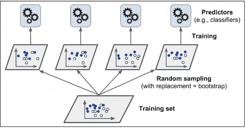
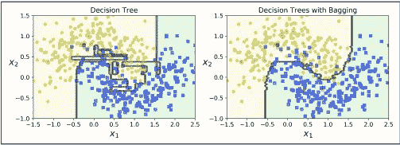

# 如何将 Bagging 技术用于集成算法——决策树上的代码练习

> 原文：<https://medium.com/analytics-vidhya/how-to-use-bagging-technique-for-ensemble-algorithms-a-code-exercise-on-decision-trees-6f944cacf085?source=collection_archive---------13----------------------->

如果你没有通过看标题来收集这篇文章的全部内容，请原谅我，因为我可能需要一组更简洁的句子和一个新的词汇。

这篇文章将涵盖集成学习中最重要的技术之一，即引导聚合技术。

请注意，这不是佛罗多·巴金斯的故事。


巴金斯一家



套袋技术(资料来源——Aurelion Geron)

这有很大的不同，但我会作为你的山姆来解释给你听。

集成学习主要有两个技术，一个是装袋，一个是粘贴。

 [## 集成学习/投票分类器或如何聚集来自不同分类器的结果

### 今天我将讲述机器学习中一个非常非常重要和酷的技术，它涉及到使用一组…

medium.com](/@madanflies/ensemble-learning-voting-classifier-or-how-to-aggregate-results-from-different-classifiers-a0ca27322bc7) 

装袋更常用，因为它能产生更好的模型，我们将只在本文中讨论装袋。

**什么是套袋技术？**

合奏技巧是

1.  一种使用不同算法对同一训练数据集使用不同分类器或回归器的方法。
2.  或者使用训练算法子集(训练数据的随机实例)在不同预测器上使用相同训练算法的方法。

当我们对数据集进行采样时，如果我们提供训练数据的替换，我们称之为装袋，而不提供替换则称为粘贴。

这意味着，当我们对训练数据进行采样，以生成数据集子集，并使用这些子集训练预测器时，我们会对相同的预测器反复进行采样练习。

**例句**

想象一下拥有 moons 数据集，现在我们将采用 3 个预测器，比如逻辑回归、SVM 和决策树，并在 moons 数据集的 10，000 个样本上运行。然后，当我们使用所有训练数据来获得一个聚合结果时，它被称为集成学习(1)。

当我们从 10，000 个样本中产生 500 个子集，并随机选取子集来反复训练预测器时，然后聚合结果就被称为 bagging。

到目前为止，很好，现在和我呆在一起。

有两种方法可以得到聚合的结果

1.  软投票
2.  硬投票

**原理差异 btw them** —如果使用的预测器具有 predict_proba()类，或者如果要聚合以获得结果的预测器使用每个类的概率来聚合结果，则这是软投票，否则是硬投票。

在我看来，软投票更好，即使用 predict_proba()比硬投票更好。

现在我们知道了两种投票类别的装袋，让我们用一个代码来演示装袋技术。

```
bag_clf = BaggingClassifier(
    DecisionTreeClassifier(random_state=42), n_estimators=500,
    max_samples=100, bootstrap=True, random_state=42)bag_clf.fit(X_train, y_train)y_pred = bag_clf.predict(X_test)
```

我们在这里使用 500 个决策树，每个子集中有 100 个样本。

Bootstrap = True 表示打包，= False 表示粘贴。

准确度分数

```
0.904
```

这不是很好，但是如果我们没有使用这种打包技术，只使用决策树来进行预测，我们的准确率会是多少

```
0.856
```

所以装袋肯定有帮助。

注意(额外信息)-使用 bagging 在决策树上使用集成技术被称为随机森林，但还要注意，最大样本被设置为整个训练集，即与整个数据集一样大的树。

在 Aurelion Geron 的书中有一个很好的图表，解释了使用 bagging 和不使用它 clear 之间的区别。



左图显示了决策树预测与 Bagging 预测，看看右边的曲线有多平滑？以及左边的数字是如何过度拟合的。

如果你想在源代码上有一个峰值-

[](https://github.com/Madmanius/Bagging_DecisionTree) [## madmanius/Bagging _ 决策树

### 此时您不能执行该操作。您已使用另一个标签页或窗口登录。您已在另一个选项卡中注销，或者…

github.com](https://github.com/Madmanius/Bagging_DecisionTree) 

如果你有反馈或者想合作，给我写信@ rohitmadan16@gmail.com