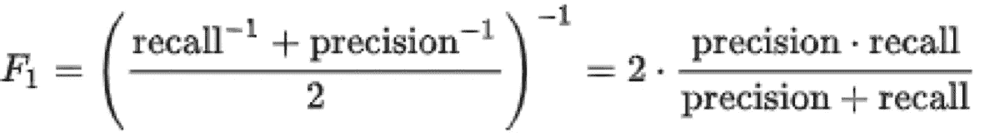

# 如何使用分类绩效指标

> 原文：<https://medium.com/analytics-vidhya/how-to-use-classification-performance-measures-6f907ee45a47?source=collection_archive---------24----------------------->

我们如何区分两个事物和更多的事物或者哪一个比另一个好？在现实生活中，我们做事情，决定一个特定的。我们是如何做到的？我们跟踪测量结果，并根据正确与实际正确匹配的次数做出决策。这里我们将讨论如何选择最佳分类模型。

在一个分类问题中，分类器根据一些静态数据预测类别，但是选择正确的分类器模型有点困难。了解数据和所需的输出会使它变得容易。

以下是评估模型优劣的分类矩阵。

**1。准确度** 简而言之，准确度是我们的模型正确预测的分数，它由**正确预测的数量/预测的总数给出。** Sklearn 提供 accuracy_score 函数。

```
from sklearn.metrics import accuracy_score
print(accuracy_score(y_actual, y_preds)) # it will print .895
```

在交叉验证中，可以将 scoring='accuracy '传递给 k 倍的准确度分数。

```
from sklearn.model_selection import cross_val_score
cross_val_score(clf, x_train, y_train, scoring=’accuracy’, cv=4)
#array([0.99047619, 0.97770701,0.98726115,0.99044586])#print output
```

**2。混乱矩阵**

评估分类预测的更好方法是评估混淆矩阵。

```
from sklearn.metrics import confusion_matrix
from sklearn.model_selection import cross_val_predict
y_preds = cross_val_predict(SGD_clf, x_test, y_test, cv=4)
confusion_matrix(y_test, y_preds)# result
#array([[485,   3],
#       [  6,  46]], dtype=int64)
```


混淆矩阵是一个包含四个元素的表，如果我们只讨论二元分类，如癌症疾病，其中患者可能患有或不患有癌症疾病。患者前往诊所进行检测，检测结果为:

*   **TP** :当患者实际患有癌症时，分类器预测测试为阳性。
*   **FN** :当患者实际患有癌症时，分类器预测测试结果为阴性。
*   **FP** :当患者未感染癌症时，分类器预测测试为阳性。
*   **TN** :当患者也没有癌症时，分类器预测测试结果为阴性。

**3。精度&回想一下** 当我们在处理一个敏感的问题或者不平衡的数据集时，精度在评估模型的好坏上并没有起到很好的作用。在这类问题中，我们追求精确和召回措施。

> **Precision** Precision 试图回答以下问题。
> 积极预测中有多少是正确的？

**精度= TP/(TP+FP)**

> **回忆**回忆试图回答以下问题。
> 实际阳性预测的正确率是多少？

**召回= TP(TP+FN)**

```
from sklearn.metrics import precision_score, recall_scoreprecision_score(y_test, y_preds)   # 0.9387755102040817
recall_score(y_test, y_preds)      # 0.8846153846153846
```

**4。F1-Score** 将精确度和召回率结合成一个称为 F1 分数的单一指标通常是很方便的，特别是如果你需要一个简单的方法来比较两个分类器。F1 分数是精确度和召回率的调和平均值。常规平均值对所有值一视同仁，而调和平均值对低值给予更大的权重。因此，只有在召回率和精确度都很高的情况下，分类器才会得到高的 F1 分数。



快照来自谷歌图片。

**结论:** 选择一个衡量标准取决于问题，因为输出我们想要更精确的东西。


这张快照来自谷歌图片。

注意:欢迎所有的建议，如果你喜欢，请点击鼓掌按钮。
谢谢