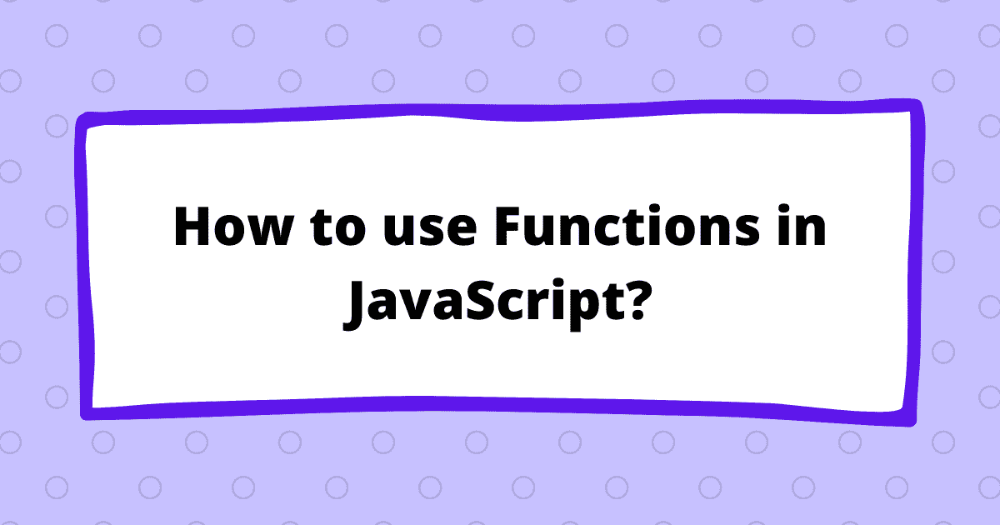

# JavaScript 中如何使用函数？

> 原文：<https://medium.com/analytics-vidhya/how-to-use-functions-in-javascript-cb3d4a7166a3?source=collection_archive---------27----------------------->



函数是 JavaScript 编程语言的基础部分。它是一个可重用的代码块，也就是说，可以在代码中的任何地方调用该函数，并根据需要多次执行所需的任务。

在这篇文章中，我们将看看使用 JavaScript 函数的各种方式/方法

*   **函数语句** :-在这个方法中，我们简单地使用`function`关键字和函数名来声明函数。我们在圆括号`()`中传递参数(如果有的话),并在圆括号`{}`中写下你希望函数在被调用时执行的代码。

在 function 语句中，函数被提升，也就是说，甚至在声明函数之前，您就可以访问或调用它。你可以在我之前的[文章](https://sarveshkadam.tech/learn-var-const-and-let-javascript-in-6-minutes)中简单讨论过的地方了解更多关于提升的知识

```
square(4) //Output: 16

function square(a){
    console.log(a * a);
}

square(2)

//Output : 4
```

*   函数表达式 :-创建了一个匿名函数，它没有自己的名字，因此我们通过使用等号`=`操作符给一个变量赋值来创建一个表达式。

```
var square = function(a){
    console.log(a * a);
}

square(2)

//Output : 4
```

`square`变量不是函数的名字，它只是指向函数在内存空间中的地址。

> *注意* :-在函数表达式中，我们不能在函数声明之前访问它，因为它将变量`square`作为`undefined`返回

*   **立即调用函数表达式** : —在这里，我们简单地声明了一个匿名函数，就像我们在上面的函数表达式中讨论的那样，但是我们没有将它赋给一个变量，而是将它包装在括号`()`中，我们可以立即调用该函数。

```
(function(a){
    console.log(a * a);
})(2)//Output : 4
```

正如你在上面的例子中看到的，我们创建了一个匿名函数，传递了一个参数`a`，它返回参数的平方，我们也可以在花括号`{}`后面立即调用这个函数，如下所示。

```
(function(a){
    console.log(a * a);
}(2))

//Output : 4
```

*   **箭头函数** :-箭头函数是一种简洁整洁的编写 JavaScript 函数的方式。它是在 ES6 中引入的，这样我们就不需要在声明函数时明确提到`function`关键字，而是使用箭头`=>`。

```
var square = (a)=>{
    console.log(a * a);
}
square(2)

//Output : 4
```

因为在上面的代码中，我们只传递一个参数`a`并且只返回一个值，即数字的平方，所以我们可以通过删除参数括号和圆括号`{}`来使代码更加简洁

```
var square = a => console.log(a * a);
square(2)

//Output : 4
```

在此之前，让我们讨论一下 about `this`关键字，普通函数中的`this`指向它所在的对象，而在 arrow 函数中，它指向全局对象。

```
var a = {
    square1 : ()=> {
        console.log(this);
    },
    square2 : function(){
        console.log(this);
    }
}a.square1() //Output: Window {parent: Window, opener: null …}
a.square2() //Output: {square1: ƒ, square2: ƒ}
```

*   **回调函数** :-回调函数是你作为参数传递给另一个函数的函数。听起来很困惑！让我们看看下面的例子。

```
var square = (callback)=>{
    callback(2);
}

square((a)=>{
    console.log(a * a); 
})
```

所以在上面的例子中，我们创建了一个 square 函数，其中我们将“回调”函数作为一个参数传递，该函数本身有一个声明为“2”的参数。在调用`square`函数的过程中，我们传递参数为`a`的“回调”函数，它在控制台上打印出`a`的平方。

还有另一个叫做`async`的函数，我们将在以后的博客中讨论，因为它也需要`promise`的概念

**结论** :-

*   在函数语句中，我们使用关键字`function`和`this`声明指向它所在的对象。
*   在函数表达式中，我们使用`=`等号运算符将函数赋给变量。
*   一个立即调用的函数表达式用括号`()`括起来，并在声明后立即被调用。
*   ES6 中引入的 arrow 函数是一种简洁的函数编写方式，arrow 函数中的`this`关键字指向全局对象，而不管它位于何处。
*   回调函数是作为参数传递给另一个函数的函数。

> *感谢您抽出时间阅读本文，请关注我的* [*推特*](https://twitter.com/kadamsarvesh10) *作为我学习的记录*

*原载于*[*https://sarveshcadm . tech*](https://sarveshkadam.tech/how-to-use-functions-in-javascript)*。*