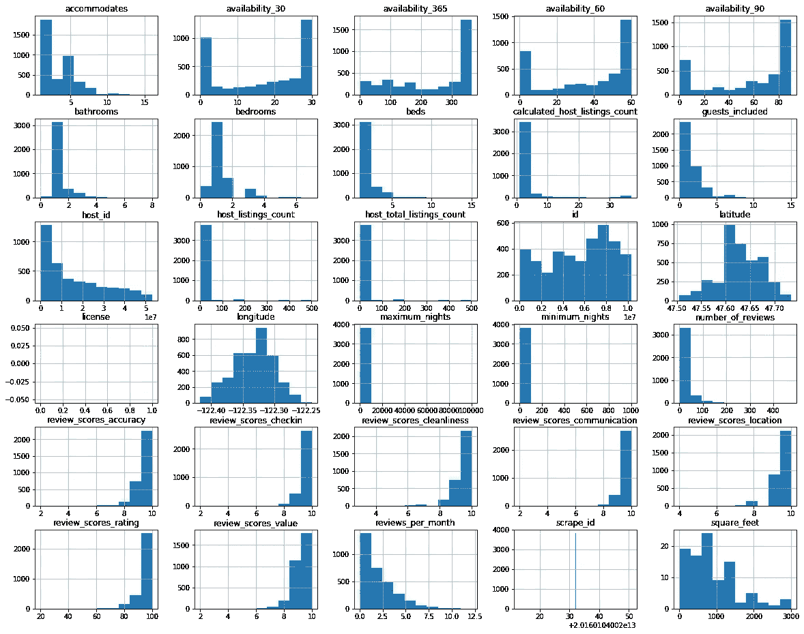
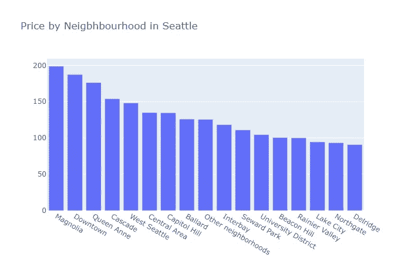
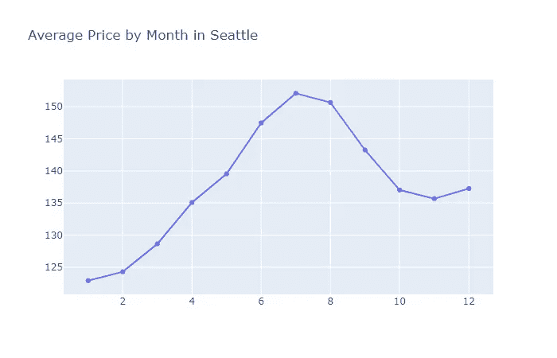
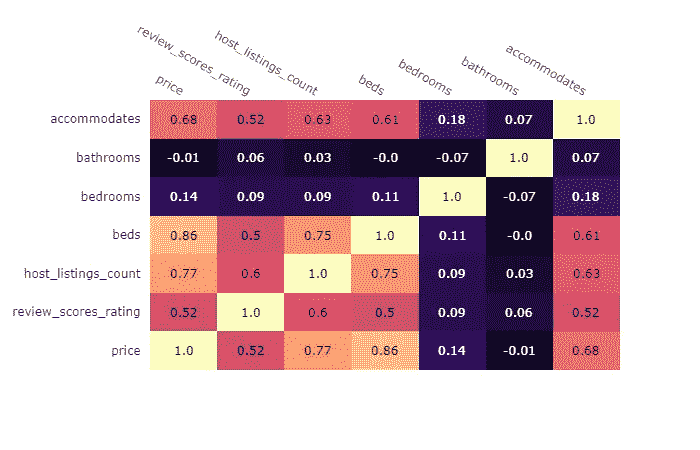

# 如何使用 Google Colab、Kaggle 和 Plotly 选择你的下一套 AirBnB 公寓

> 原文：<https://medium.com/analytics-vidhya/how-to-use-google-colab-kaggle-and-plotly-to-choose-your-next-airbnb-flat-e0ca03b08eaa?source=collection_archive---------12----------------------->

## 分析 AirBnB 西雅图开放数据集


萨法尔·萨法罗夫在 [Unsplash](https://unsplash.com?utm_source=medium&utm_medium=referral) 上拍摄的照片

# 介绍

我们大多数人在生活中的某个时候都会预订一套 AirBnB 公寓来度假。我最近去了德国的科隆，那里以圣诞市场闻名，最后去了一个真正的圣诞市场。然而，当我回来时，我意识到我支付的价格比我的朋友们几周前参观同一地方时支付的价格要高。这让我产生了以下问题:什么因素影响 AirBnB 公寓的价格？一个城市中不同社区的价格如何波动，季节性如何影响价格。为了回答我的问题，我将使用 AirBnB 西雅图开放数据集、Google Colab、Kaggle API 和 Plotly。

# 用数据科学来回答我的问题

这是一些可以用数据科学来回答的经典问题。X 如何影响 Y 是数据科学世界的面包和黄油。因此，我们将使用众所周知的 CRISP-DM 流程来用数据回答我们的问题。CRISP-DM 代表数据挖掘的跨行业标准流程，它是许多数据科学家为解决类似问题而遵循的常见流程。

# 步骤 1 —业务理解

CRISP-DM 流程的第一步是了解我们经营的业务或环境。显然，这里没有我们需要了解的业务，但我们了解 AirBnB 价格是如何形成的，这将是关键。

AirBnB 预订价格基于以下成本(根据 [**AirBnB 官网信息**](https://www.airbnb.com/help/article/125/how-is-the-price-determined-for-my-reservation?locale=en) ):

*   费用由主办方决定:
*   每晚价格:每晚价格由主人决定；
*   清洁费:一些主机收取的一次性费用，用于支付清洁其空间的成本；
*   额外来宾费:一些主机收取的一次性费用，用于支付与使用他们的空间相关的其他费用；
*   Airbnb 确定的费用:Airbnb 服务费；
*   可能包括的其他费用:货币兑换费、增值税、其他地方税等。

# 步骤 2—数据理解

从这个阶段开始，乐趣逐渐增加。

第一步是加载我们的数据。我们将使用 Google Colab 作为我们的笔记本。Colab 是一个免费的 Jupyter 笔记本环境，不需要设置，完全在云中运行。([https://colab.research.google.com](https://colab.research.google.com))

为了获得我们的数据，我们需要将它与 Kaggle API 连接起来。

首先我们需要和 [Kaggle](http://www.kaggle.com) 签约。去 [Kaggle](http://www.Kaggle.com) 注册——这是免费的——然后去我的账户，在那里选择创建新的 API 令牌。将下载一个 json 文件，您可以使用下面的代码将它上传到您的 Colab 笔记本。

```
#install kaggle
!kaggle#upload our kaggle key
from google.colab import files
files.upload()#set up the directory
!mkdir  -p ~/.kaggle!cp kaggle.json ~/.kaggle/
!chmod 600 ~/.kaggle/kaggle.json
```

然后，我们将需要从 Kaggle 的数据集链接，我们只是把它粘贴在这里，然后解压缩我们的文件。

```
#API link that we get from Kaggle
!kaggle datasets download -d airbnb/seattle#unzip the filesimport zipfile
with zipfile.ZipFile('seattle.zip', 'r') as zip_ref:
zip_ref.extractall()#simply read our data fileslistings = pd.read_csv('listings.csv')
calendardf = pd.read_csv('calendar.csv')
reviews = pd.read_csv('reviews.csv'
```

为了得到我们数据的第一张图表，我将通过键入以下命令来检查我们数值的分布

```
fig = plt.figure(figsize = (20,16))
ax = fig.gca()
listings.hist(ax=ax)
plt.show()
```



# 步骤 3—数据准备

在回答我们的问题之前，还有一个步骤是处理我们的数据集，为分析做好准备——你可以在 github 资源库[这里](https://github.com/harrystamatoukos/datascience/blob/master/Airbnb_Seattle.ipynb)跟随这个过程。

# 步骤 4—数据建模

在这里，我们将回答 3 个主要问题

有关数据建模的代码，请访问我的报告中的笔记本

[](https://github.com/harrystamatoukos/datascience/blob/master/Airbnb_Seattle.ipynb) [## harrystamatoukos/数据科学

### 此时您不能执行该操作。您已使用另一个标签页或窗口登录。您已在另一个选项卡中注销，或者…

github.com](https://github.com/harrystamatoukos/datascience/blob/master/Airbnb_Seattle.ipynb) 

# 步骤 5—结果交流

## 问题 1:西雅图不同社区的房价有什么不同？

这里我们绘制了西雅图每个街区的平均价格。让我们看看他们是怎么做的:

```
fig = go.Figure(
data=[go.Bar(
y=Price_by_Neighbourhoud_df['price'], x=Price_by_Neighbourhoud_df['neighbourhood_group_cleansed'])],
layout_title_text="Price by Neigbhbourhood in Seattle")
fig.show()
```



木兰花和市中心似乎是预订下一套公寓最贵的街区。真正有趣的是，它们的平均价格是 Northgate 和 Delridge 等公司的两倍。如果你预算有限，你知道该去哪里。

## 问题 2:价格如何受季节性影响？

为了回答这个问题，我们创建了一个名为“Month”的新列，从数据集中的每个日期“提取”月份。然后类似于我们上面所做的，我们创建了下面的图表。

```
#find average price by monthaverage_price_by_month = pd.DataFrame(df.groupby(['month'])['price'].mean().reset_index())#create figure in plotly
fig = go.Figure(data=[go.Scatter(
y=average_price_by_month['price'], x=average_price_by_month['month'])],
layout_title_text="Average Price by Month in Seattle")fig.show()
```



从上面的图可以明显看出，如果你在预算之内，你需要做什么。夏天不要旅游！从价格角度来看，旅行的最佳月份是冬季的头几个月、一月、二月和三月。不过，最好先检查一下温度。

## 问题 3:

## 影响价格的因素有哪些？？

最后，我们想了解哪些因素与价格高度相关。我们将需要使用 Plotly 的图形工厂来注释热图。瞧啊。

```
import plotly.figure_factory as ffz_text = np.around(corrs, decimals=2)
fig = ff.create_annotated_heatmap(z=corrs,
annotation_text=z_text,
x=cols,
y=cols,
hoverongaps = True,
colorscale = 'Magma',)fig.show()
```



从上面的图中，我们可以得出一些结论，证明我们直觉上已经知道的东西是正确的。房间越大，价格越高。没有获得真正的智慧，但是把数字放在我们的直觉后面是很有趣的。

# 结论

总而言之，我们最初看到了如何开始在 Google Colab 中工作，以及如何使用 Kaggle API 加载我们的数据。然后我们用 Plotly 创建了一些漂亮的图表，这些图表也回答了我们关于 AirBnB 公寓价格的 3 个问题，最终归结为:如果你预算有限，那么就在冬天旅行，避开好的社区。如果你是一个经验丰富的旅行者，你已经知道这一点，但现在它得到了科学的支持。

请随意查看数据集，并告诉我您还发现了什么。我将继续挖掘和改进我在 github repo 中的发现。