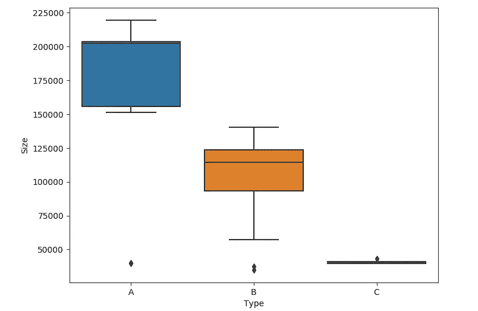
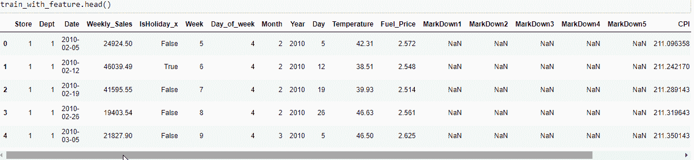

# 如何利用历史降价数据预测店铺销售！

> 原文：<https://medium.com/analytics-vidhya/how-to-use-historical-markdown-data-to-predict-store-sales-f670af542033?source=collection_archive---------1----------------------->

时间序列是一个可观察变量在相等时间间隔的历史测量序列。时间序列数据可以看作是顺序数据。

研究时间序列有几个目的，例如根据过去的知识预测未来，了解衡量标准背后的现象，或简单地描述时间序列的显著特征。

作为 [Kaggle](https://www.kaggle.com/c/walmart-recruiting-store-sales-forecasting) 上的招聘比赛，我们需要使用历史降价数据来预测下一年的销售额。

# **问题陈述:**

我们获得了位于不同地区的 45 家沃尔玛商店的历史销售数据。每个商店包含许多部门，我们的任务是预测每个商店的部门范围内的销售额。

# 业务目标和约束:

*   预测每个商店的全部门销售额。
*   没有严格的延迟限制。

# 数据概述:

数据取自 kaggle 上的沃尔玛招聘挑战赛。数据字段总共包含 4 个数据集:

**T5 | stores . CSV**

该文件包含 45 家商店的匿名信息，表明商店的类型和规模。

商店:商店编号

类型:商店的类型

规模:商店的规模

***| train . CSV***

这是历史培训数据，涵盖 2010 年 2 月 5 日至 2012 年 11 月 1 日。在该文件中，您将找到以下字段:

*   商店:商店编号
*   部门:部门编号
*   日期:销售日期
*   Weekly_Sales:给定商店中给定部门的销售额
*   IsHoliday:该周是否为特殊假日周

***| test . CSV***

该文件与 train.csv 相同，只是我们保留了每周销售额。您必须预测该文件中每个商店、部门和日期三元组的销售额。

***| features . CSV***

该文件包含与给定日期的商店、部门和区域活动相关的附加数据。它包含以下字段:

*   商店——商店编号
*   日期—星期
*   温度-该地区的平均温度
*   燃料价格-该地区的燃料成本
*   减价 1–5—与沃尔玛促销减价相关的匿名数据。降价数据仅在 2011 年 11 月后可用，并非所有商店都随时可用。任何缺少的值都标有安娜。
*   CPI——消费者价格指数
*   失业——失业率
*   IsHoliday —该周是否为特殊假日周

# 探索性数据分析:

1.  商店类型的直观表示饼图:

2.商店类型大小的箱线图:

3.配对图:

**观察:**

*   总共有 45 家店。
*   总共有 3 种类型的商店:A 型、B 型和 c 型。
*   通过箱线图和饼图，我们可以说 A 型商店是最大的商店，C 型商店是最小的
*   A、B 和 c 之间没有大小重叠的区域。

4.检查假日销售频率:

5.了解部门频率:

## 观察结果:

*   假日销售比非假日销售多一点
*   从这个图中，我们注意到销售额最高的部门位于部门 60 和 80 之间

作为比赛的一部分，我们总共有 **421570 个值**用于**训练**和 **115064 个值**用于**测试**。但是我们将**只处理 421570 个数据**，因为我们有标签来测试模型的性能和准确性。

# 特征工程:

由于我们的数据集中有日期，我们可以使用 pandas 构建一些漂亮的日期时间特征。

我们可以把临时工和失业作为我们特征

## 合并训练、测试和要素数据集

## 将所有要素合并到一个数据框中:

因为我们在每个数据集中都有“IsHoliday”功能，所以它被复制了。因此，让我们通过删除其中的一个并将其重命名为原来的“IsHoliday”列名来进行更正。

我们应该用数值来表示我们的 IsHoliday 列。因此，让我们将 IsHoliday 列的' False '改为 0，将' True '改为 1。

同样，让我们将商店的“类型”转换成数值。

**现在让我们检查特性相关性:**

相关性是一种双变量分析，用于衡量两个变量之间的关联强度和关系方向。就关系的强度而言，相关系数的值在+1 和-1 之间变化。

# 修复缺失值:

“降价”中缺少值，将其输入为零(无降价)。我们可以安全地用零填充所有缺失的值。

经过几次提交测试后，我知道这个功能的意思是提高分数，

# 功能选择:

经过几次提交后，我知道降价功能对提高分数没有太大帮助。所以，我必须找出他们。

因为我们已经计算了 CPI、失业率、燃料价格的平均值，我们也可以把它们降下来。正如我们在关联图中看到的，Day_of_week 是不稳定的，所以我们也需要放弃这个特性。

现在，我们已经完全准备好定义最终的训练和测试数据来训练我们的模型。

*列车组:*

*测试集:*

# 机器学习模型:

*模型预测下一年的销售额*

我们用来训练模型的最终特征如下:

*   商店——商店编号
*   部门——部门编号
*   周:每年的第几周。
*   月份:一月=1，十二月=12。
*   年份:日期时间的年份。
*   Day:日期时间的天数。
*   温度:该地区的平均温度
*   IsHoliday:如果 Holiday = True == 1，否则为 0
*   规模:商店的规模
*   类型:商店的类型，A = 1，B = 2，C = 3
*   Temp_mean:平均值温度
*   失业平均值:失业的平均值
*   燃料价格平均值:该地区燃料成本的平均值
*   CPI _ Mean:CPI _ Mean 的平均值

最终数据集的维数不会太大，可以使用 ***随机森林*** 和 ***额外树*** 等袋装决策树来估计特征的重要性。

## 使用我们的随机森林模型进行预测:

最后，生成每周销售预测 CSV 文件

# 让我们上传我们预测的 CSV:

TADA！！！

*   这是这个 Kaggle 竞赛的完整故事，其中包含了学到的和应用的东西。
*   谢天谢地，在 Kaggle 上传预测销量文件的时候，我得到了 **2762.09** 的分数，接近排名 **41** ！！

## 未来工作:

沃尔玛全年都会举办几次促销活动。这些降价发生在重要的节日之前，其中四个最大的节日是超级碗、劳动节、感恩节和圣诞节。包含这些假期的周在评估中的权重是非假期周的五倍。

超级碗:2010 年 2 月 12 日、2011 年 2 月 11 日、2012 年 2 月 10 日、2013 年 2 月 8 日
劳动节:2010 年 9 月 10 日、2011 年 9 月 9 日、2012 年 9 月 7 日、2013 年 9 月 6 日
感恩节:2010 年 11 月 26 日、2011 年 11 月 25 日、2012 年 11 月 23 日、2012 年 11 月 29 日
圣诞节:2010 年 12 月 31 日、2011 年 12 月 30 日

为了获得更好的结果分数，我们可以使用这些信息来制作一些精彩的功能。我确信，这肯定会有助于提高分数。

我们已经看到了可以用来检查时间序列平稳性的不同方法，以及一套经典的时间序列预测方法，我们可以在我们的时间序列数据集上进行测试和调整。

**这里是**[**GitHub**](https://github.com/ishritam/Walmart-Recruiting---Store-Sales-Forecasting)**项目的链接。**

# 参考

**EDA:**

*   [https://www . ka ggle . com/yepp 2411/Walmart-prediction-1-EDA-with-time-and-space](https://www.kaggle.com/yepp2411/walmart-prediction-1-eda-with-time-and-space)
*   [https://www.kaggle.com/bnorbert/eda-walmart](https://www.kaggle.com/bnorbert/eda-walmart)

**日期时间特性:**

*   [https://pandas . pydata . org/pandas docs/stable/reference/series . html # datetime-properties](https://pandas.pydata.org/pandas-docs/stable/reference/series.html#datetime-properties)
*   [https://stack overflow . com/questions/33365055/attribute error-can-only-use-dt-accessor-with-datetime like-values](https://stackoverflow.com/questions/33365055/attributeerror-can-only-use-dt-accessor-with-datetimelike-values)
*   [https://stack overflow . com/questions/25146121/extracting-just-month-and-year-separately-from-pandas-datetime-column](https://stackoverflow.com/questions/25146121/extracting-just-month-and-year-separately-from-pandas-datetime-column)

**功能选择:**

*   [https://www . ka ggle . com/c/Walmart-recruiting-store-sales-forecasting/discussion/8032 # latest-44077](https://www.kaggle.com/c/walmart-recruiting-store-sales-forecasting/discussion/8032#latest-44077)
*   [https://www . ka ggle . com/c/Walmart-recruiting-store-sales-forecasting/discussion/8033 # latest-181583](https://www.kaggle.com/c/walmart-recruiting-store-sales-forecasting/discussion/8033#latest-181583)

如果你认为这篇文章遗漏了什么，请在下面回复。

我希望这有助于你更好地理解[沃尔玛招聘——商店销售预测](https://www.kaggle.com/c/walmart-recruiting-store-sales-forecasting)问题，如果你感兴趣，这有助于你在 Kaggle 数据科学竞赛中竞争。您可以在[*kaggle.com*](https://www.kaggle.com/)查看当前正在进行的比赛！

**感谢迄今为止的阅读。**

我会在我的下一篇文章中看到你！！！