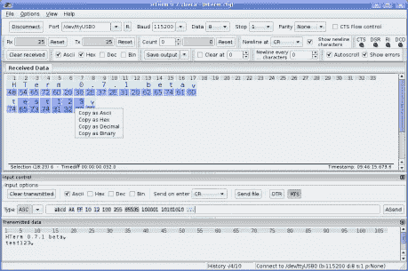

# 如何在 windows PC 中使用 Hterm 通过 USB 串口发送和接收串行数据？

> 原文：<https://medium.com/analytics-vidhya/how-to-use-hterm-for-sending-and-receiving-the-serial-data-through-usb-com-port-in-windows-pc-8d7d83c36796?source=collection_archive---------1----------------------->

Hterm 软件

在您开始阅读本文之前，我将简要介绍 HTerm，以及我们如何在 windows 操作系统中设置环境，以使用该软件调试和解码串行数据。

**要求:**

*   PC 上的 USB 串行端口(例如:COM9)
*   Hterm 软件