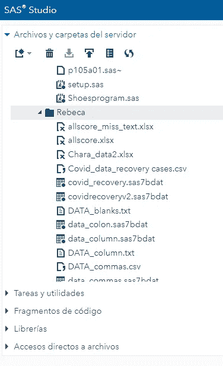
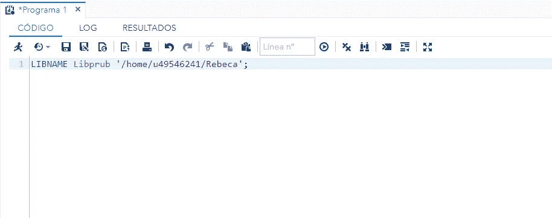
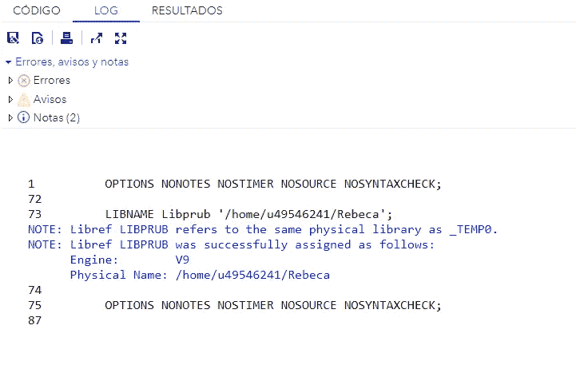
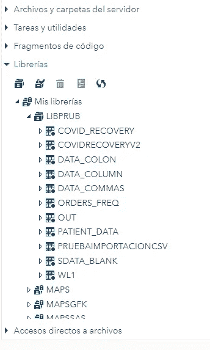

# 如何在 SAS 中使用 LIBNAME 语句？

> 原文：<https://medium.com/analytics-vidhya/how-to-use-libname-statement-in-sas-10e778586eae?source=collection_archive---------4----------------------->


这将是第一篇关于我计划制作的所有 SAS 教程的文章。这篇文章的主要目的是帮助你理解 SAS 是如何工作的，希望它能给你一些工具来开始使用这个神奇的软件。

# **什么是 LIBNAME 语句？**

所有永久和临时 SAS 文件都存储在 SAS 库中。SAS 库是存储在操作系统下的物理位置的 SAS 文件的集合。**只有** SAS 文件被认为是 SAS 库的一部分。

LIBNAME 语句帮助我们定义一个库，基本上我们给一个 SAS 数据集合的特定位置分配一个昵称。这个 statemet 的语法是:

```
LIBNAME libref <engine> "Path";
```

*   **LIBNAME:** 这是保留字，用于给库指定昵称。
*   **Libref:** 这将是与 SAS 数据库的位置相对应的库的名称。**libref 和 SAS 库之间的关联仅在会话期间有效，或者直到您更改或中断它。只要你想使用这个库，你可以在你的整个代码中使用这个 libref。**
*   **路径:**必须是 SAS 库的物理名称。物理名称是操作环境识别的名称。应该用单引号或双引号引起来。
*   **引擎:**在我学习之初，我对何时以及如何使用*“引擎”*有些困惑，让我告诉你写它是可选的。该引擎也称为"*访问方法"提供对多种格式数据的访问"*，识别 SAS 用来访问库中文件的例程集。数据可以驻留在不同类型的文件中，包括 SAS 文件和由其他软件产品格式化的数据，如 DBMS。通过对文件类型使用适当的引擎，SAS 可以写入或读取文件。对于某些类型的文件，您需要告诉 SAS 使用什么引擎，对于其他文件，SAS 会自动使用合适的引擎。

> 如果没有在 LIBNAME 语句中指定引擎名，SAS 会尝试确定引擎(默认引擎或兼容引擎)。

示例:

1.  我在我的服务器中创建了一个新文件夹(Rebeca ),因为我正在使用[SAS on demand for Academics](https://welcome.oda.sas.com/login)。我还添加了一些数据文件。



2)现在在编辑器中，我们创建 LIBNAME 语句，我省略了引擎部分，因为这不是一个必要的步骤。我的新 SAS 库将是“Libprub”。



3)我们应该经常检查日志窗口，以便查看是否有任何错误。对我来说，一切都很好。



4)为了检查您的文件夹是否已创建，您应该转到库窗口并查找库名称。如果原始文件夹中有 SAS 数据文件，它们应该出现在此部分。



> 现在，您可以在 data 或 PROC 语句中使用这个 libref 来获取数据或永久保存数据。

这些是 LIBNAME 语句的基础，在以后的文章中，我们将深入了解与引擎和高级选项相关的更多信息。

如果您有任何问题，请告诉我！