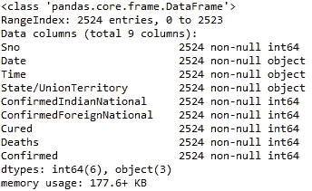
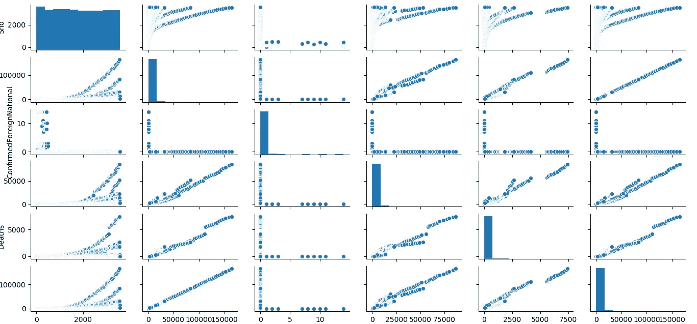
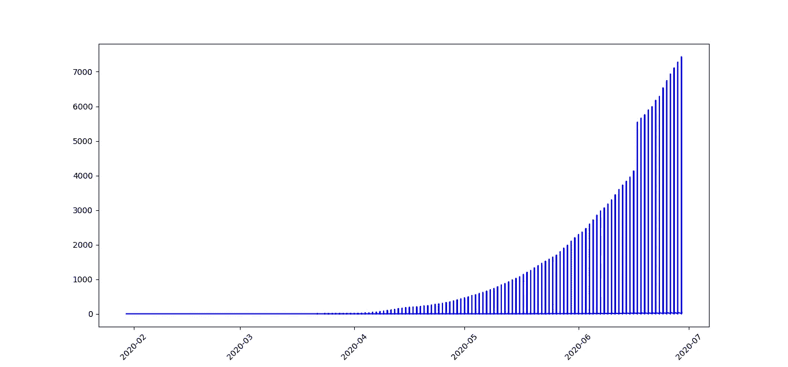
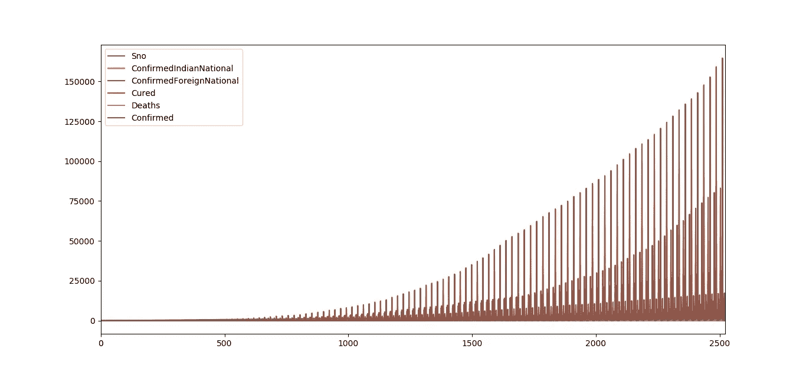
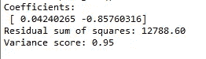
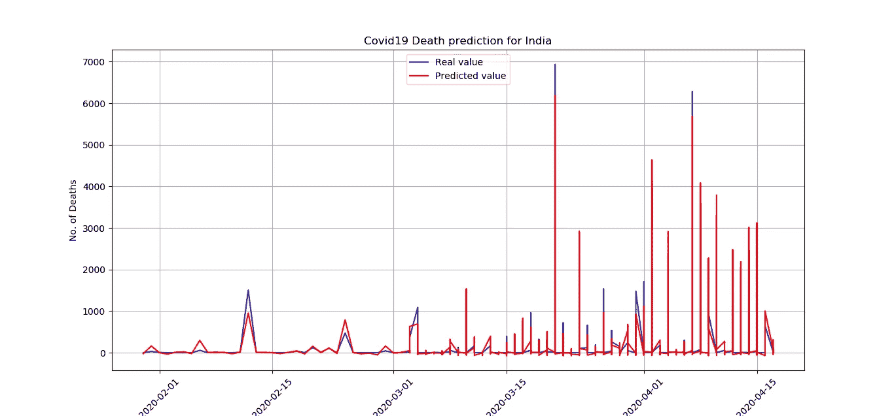

# 在 Covid19 数据集上实现线性回归算法进行预测

> 原文：<https://medium.com/analytics-vidhya/how-to-use-machine-learning-algorithms-such-as-linear-regression-on-covid19-datasets-for-prediction-56a623e2899a?source=collection_archive---------9----------------------->

回归模型估计变量之间的关系。简而言之，从给定的输入变量或特征列表中，它估计连续的因变量。典型的应用包括生存预测、天气预报等。如果数据范围和响应的性质是实数，则使用回归技术。回归激活函数可以是线性的、二次的、多项式的、非线性的等等。在训练阶段，隐藏参数根据训练中给出的输入值进行优化。进行优化的过程是梯度下降算法，也称为**最速下降算法**。梯度下降用于更新模型的参数。如果学习速率太大，将会导致超调，如果学习速率太小，将需要更长的时间来收敛，如果使用神经网络，则还需要反向传播算法来计算每一层的梯度。一旦理论参数/假设参数得到训练(当它们在训练期间给出最小误差时)，则具有训练参数的相同理论/假设与新的输入值一起使用，以预测将再次成为真实值的结果。

**线性回归**是一种基于单一预测变量 x 预测响应 Y 的方法

# **数据集描述:**

我已经从 kaggle.com 下载了数据集。数据集名称为“印度 2019 年新型冠状病毒疾病数据集”

冠状病毒是一个很大的病毒家族，可能导致动物或人类疾病。在人类中，已知几种冠状病毒会导致呼吸道感染，从普通感冒到更严重的疾病，如中东呼吸综合征(MERS)和严重急性呼吸综合征(SARS)。最近发现的冠状病毒导致冠状病毒疾病新冠肺炎-世界卫生组织

世界各地新病例的数量与日俱增。该数据集包含来自印度各邦和中央直辖区的每日信息。

州一级的数据来自卫生部家庭福利部

个人层面的数据来自 [covid19india](https://www.covid19india.org/)

我在每日数据集上使用了大量的印度新冠肺炎病例

由于 *error_bad_lines=False* ，python 只从 3567 行中挑选了 2524 个条目



数据集描述

# **Python 代码**

1.  导入库

```
import pandas as pd
import numpy as np
import matplotlib.pyplot as plt #Data visualisation libraries 
import seaborn as sns
from sklearn.model_selection import KFold, cross_val_score, train_test_split
```

2.读取数据集，并使用 seaborn 对其进行配对绘制。Seaborn 是 python 中最常用的可视化工具之一

```
covid_data = pd.read_csv(r’C:\Users\sushilkumar.yadav\Desktop\vmware\Personal\Spyder\Covid19datasets\covid_19_india.csv’, header=0, delim_whitespace=True, error_bad_lines=False)
covid_data.head()
covid_data.info()
covid_data.describe()
covid_data.columns
sns.pairplot(covid_data)
```

输出



3.让我们现在开始训练回归模型！我们需要首先将数据分成一个 X 数组和一个 y 数组，X 数组包含要训练的特性，y 数组包含目标变量，在本例中是死亡列。

```
X = covid_data[[‘Date’, ‘Confirmed’]]
y = covid_data[‘Deaths’]
X[‘Date’] = pd.to_datetime(X[‘Date’], format=’%d-%m-%y’)
```

4.现在，根据数据绘制死亡率，根据日期绘制所有曲线

```
plt.xticks(rotation=45)
print(X[‘Date’])
plt.plot_date(X[‘Date’], y, fmt=’b-’, xdate=True, ydate=False)
covid_data.plot()
plt.show()
date = X.loc[:, [‘Date’]]
X[‘Date2num’] = X[‘Date’].apply(lambda x: mdates.date2num(x))
del X[‘Date’]
```

输出



死亡率绘图



5.**列车试分裂**

让我们将数据分为训练数据集和测试数据集，在我们的例子中，我们使用 30%的数据作为测试数据，其余的数据作为训练数据

```
X_train, X_test, y_train, y_test = train_test_split(X, y, test_size=0.3, random_state=101)
date_test = date.loc[:np.floor(m*0.3)]
date_train = date.loc[np.floor(m*0.3)+1:]
```

6.**创建和训练模型**

让我们对训练数据拟合线性回归模型

```
lr = LinearRegression()
lr.fit(X_train,y_train)
```

7.让我们预测并可视化这个模型

```
print(‘Coefficients: \n’, lr.coef_)
# The mean square error
print(“Residual sum of squares: %.2f”
 % np.mean((lr.predict(X_test) — y_test) ** 2))
# Explained variance score: 1 is perfect prediction
print(‘Variance score: %.2f’ % lr.score(X_test, y_test))
# Plot outputs
plt.xticks(rotation=45)
plt.plot_date(date_test, y_test, fmt=’b-’, xdate=True, ydate=False, label=’Real value’)
plt.plot_date(date_test, lr.predict(X_test), fmt=’r-’, xdate=True, ydate=False, label=’Predicted value’)
plt.legend(loc=’upper center’)
plt.ylabel(‘No. of Deaths’)
plt.title(‘Covid19 Death prediction for India’)
plt.grid()
```

输出



真实值和预测值

我希望这能给机器学习在解决现实生活问题中的应用提供一些小依据

这是完整的代码，

要了解机器学习算法，请参考我以前的文章

[](/analytics-vidhya/an-overview-of-machine-learning-algorithms-4a9a881a1a4b) [## 机器学习算法综述

### 机器学习是让计算机在没有程序员明确编程的情况下行动的科学。它…

medium.com](/analytics-vidhya/an-overview-of-machine-learning-algorithms-4a9a881a1a4b) [](/analytics-vidhya/kernel-based-approaches-in-machine-learning-aaf174bdf49a) [## 机器学习中基于核的方法

### 核是一种使用线性分类器来解决非线性问题的方法，这是通过转换一个

medium.com](/analytics-vidhya/kernel-based-approaches-in-machine-learning-aaf174bdf49a)