# 如何使用机器学习方法预测电影票房收入/成功？

> 原文：<https://medium.com/analytics-vidhya/how-to-use-machine-learning-approach-to-predict-movie-box-office-revenue-success-e2e688669972?source=collection_archive---------2----------------------->

电影制片厂及其利益相关者使用一种预测方法，根据一些给定的输入属性，如预算、运行时间、发行年份、受欢迎程度等，来预测一部新电影可以产生的收入？


雨人海报

## 项目目标

主要目标是建立一个机器学习模型，在给定预算、上映日期、流派等特征的情况下，预测一部新电影的收入。建模性能基于 R 平方进行评估。

第二个目标是练习数据争论、数据可视化以及使用随机森林、线性回归、LightGBM 回归器和梯度推进回归器进行模型预测等技能。

## 项目方法

*   我们为 TMDB 数据集提取的数据采集。
*   数据探索性分析和特征工程探索和可视化数据，以便对变量内部和变量之间的情况有一个总体了解。
*   模拟实验设计用于评估性能和选择机器学习方法。
*   寻找特征的重要性/权重。
*   最后，使用 R 平方对验证集上的模型进行评估。

## 所需工具

1.  Python 和 Jupyter 笔记本(最好是 anaconda)
2.  熊猫，Numpy，Scikit-learn，wordcount，eli5，TFID
3.  用于模型预测的随机森林、LGB 和 GB 回归器。

## 数据采集

*加载数据集*

```
import pandas as pd
#loading the data set
df = pd.read_csv("data/train.csv")
#displaying top 5 data set
df.head()
```

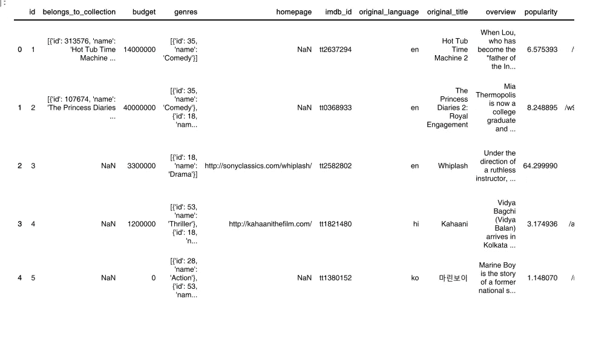

加载数据集

*让我们看看数据集中的专栏。*

```
#display the columns from the data set.
df.columns
```

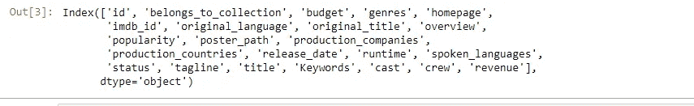

我们的专栏列表

# 数据探索性分析

***我们来看看营收、运行时间、人气、预算之间的相关性。***

了解相关性:-相关系数的值范围是-1.0 到 1.0。如果 corr 为零，则意味着两个变量之间没有线性关系。
如果 corr 为正且接近 1，这意味着它是强相关的，例如，石油价格与机票价格直接相关。
如果 corr 值介于 0 和-1 之间，这意味着它们完全负相关，即如果一个变量增加，另一个变量以相同的比率减少，反之亦然。如果您想了解更多信息，请点击此处查看相关的详细说明。

使用 dataframe **在 python 中找到相关性非常简单。corr()** 我们将使用 seaborn 库和 corr()函数来显示上述数据之间的相关性。

```
sns.heatmap(df.corr(), cmap='YlGnBu', annot=True, linewidths = 0.2);
```

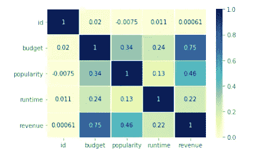

相互关系

> 从这张 corr 图中，我们可以看到收入与预算的 corr 值为 **0.75** 个单位，收入与运行时间的 corr 值为 **0 .22** 个单位。
> 
> 嗯，这解释了收入与电影的预算密切相关，而运行时间与收入的相关性最小。因此，我们可以说，电影的预算直接关系到所产生的收入。

***让我们使用 seaborn distplot 绘制收入分布图。***

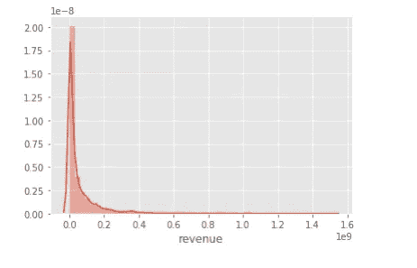

收入图

我们可以看到这个数据非常不准确，因此很难从这个图表中得出结论。我们需要将这些数据标准化。因此，我们将使用对数转换对其进行规范化。

**介绍日志转换**

为什么偏斜数据不适合线性回归建模？

*   因为它们可能充当离群值，而我们知道离群值对我们的模型性能没有好处。
*   它们有不均匀的均值、中值、众数，根据大数定律，正态分布允许研究者做出更准确的预测。
*   以尽可能地线性化拟合。统计检验通常基于正态性(正态分布)的假设。

对数变换是一种广泛用于处理倾斜数据的方法，是研究中最常用的变换之一。因此，我们将在收入中使用日志转换。[如果您想了解更多关于日志转换的信息，请点击此处](https://www.ncbi.nlm.nih.gov/pmc/articles/PMC4120293/)。

```
#creating log transformation for reveune
df['log_revenue'] = np.log1p(df['revenue']) #we are not using log0 to avoid & and null value as there might be 0 value
```

*让我们使用 seaborn 库来比较我们的价值收入和收入的日志转换。*

```
#comapring distribution of reveune and log revune side by side with histogram
fig, ax = plt.subplots(figsize = (16, 6))
plt.subplot(1, 2, 1) 
plt.hist(df['revenue']);
plt.title('Distribution of revenue');
plt.subplot(1, 2, 2)
plt.hist(df['log_revenue']);
plt.title('Distribution of log transformation of revenue');
```

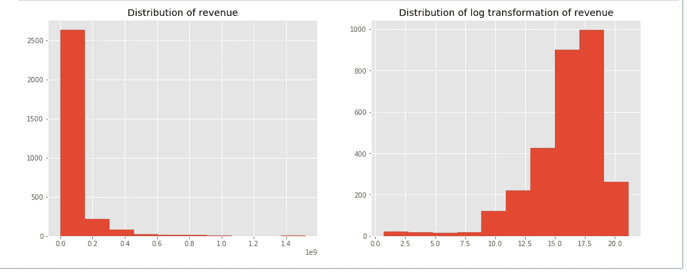

收入图和收入的对数变换。

> 我们可以看到，原始分布，即(一个没有日志)是非常偏斜的。我们使用了对数变换方法，使数据呈正态分布，具有较小的偏度和峰度。

***电影收入与预算的关系。***

让我们用散点图来检验这种关系。

```
#let's create scatter plot
plt.figure(figsize=(16, 8))
plt.subplot(1, 2, 1)
plt.scatter(df['budget'], df['revenue'])
plt.title('Revenue vs budget fig(1)');
plt.subplot(1, 2, 2)
plt.scatter(df['log_budget'], df['log_revenue'])
plt.title('Log Revenue vs log budget fig(2)');
```

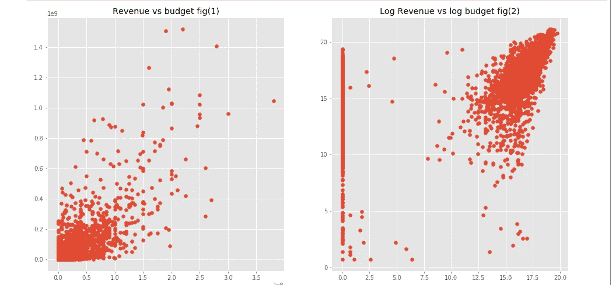

日志预算与日志转换

> 图(1，左侧):我们可以看到预算和收入之间有一定的相关性，但我们不清楚。
> 图(2，右侧):然而，该图表明收入的对数转换和预算的对数转换这两个变量之间存在相关性。
> 我们还可以看到许多零预算电影，因为我们发现有一部 815 电影的预算为零(这是一个错误)，我们将在稍后预测我们的模型时清除它。

***首页与收入的关系。***

让我们看看有一个主页是否会影响收入。为此，我们先来看看电影有没有主页。

```
#let's creat column called has_homepage and pass two value 1,0 (1, indicates has home page, 0 indicates no page)
df['has_homepage'] = 0
df.loc[df['homepage'].isnull() == False, 'has_homepage'] = 1 #1 here means it has home page#since has_homepage is categorical value we will be using seaborn catplot.
sns.catplot(x='has_homepage', y='revenue', data=df);
plt.title('Revenue for movie with and w/o homepage');
```

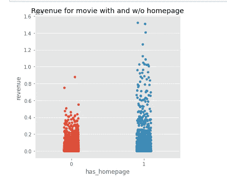

主页情节

> 从上图中，我们可以看到，与没有主页的电影相比，有主页的电影(用蓝色表示)有更多的收入。根据这个散点图，我们可以说它们可能是相关的。

***语言分布(Orginal _ language)与平均收入的关系。***

我们来搞清楚语言和收入的关系。我们将从数据框中计算前 10 种语言，并选择 df orginale_langauge 中的语言。这里我们将使用箱线图，因为箱线图对于识别异常值非常有用。

```
#we will be using blox pot
plt.figure(figsize=(16, 8))
plt.subplot(1, 2, 1)
sns.boxplot(x='original_language', y='revenue', data=df.loc[df['original_language'].isin(df['original_language'].value_counts().head(10).index)]);
plt.title('Mean revenue per language fig_1');
plt.subplot(1, 2, 2)
sns.boxplot(x='original_language', y='log_revenue', data=df.loc[df['original_language'].isin(df['original_language'].value_counts().head(10).index)]);
plt.title('Mean log revenue per language fig_2');
```

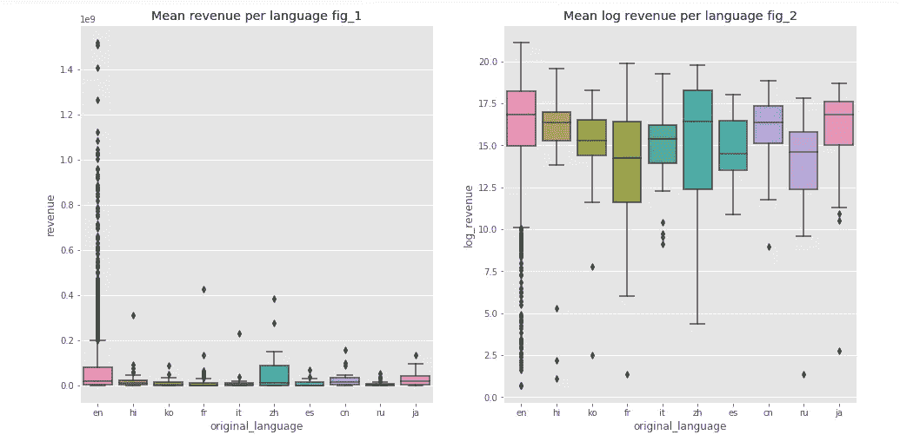

语言分布与平均收入的箱线图

从图 1 中我们可以看到 x 轴表示的语言。我们可以看到，与其他语言相比，英语的收入要高得多。这张图表还告诉我们，就收入而言，英语盖过了所有其他语言。这一信息可能是非常不正确和误导的。让我们看图 2 了解更多细节

从图 2 中:我们可以看到原始语言与对数转换的收入，我们可以看到其他语言也创造了收入，接近英语创造的收入。无论如何，这是一部领先收入排行榜的英语电影。

***电影片名和描述中有哪些常用词？***

这是这个分析中我最喜欢的部分之一。很好奇想知道描述/剧情简介里的热门片名和用词。我们将使用 wordcount 库。词云是一种数据可视化技术，用于表示文本数据，其中每个词的大小指示其频率或重要性。

```
#let's find top words from movie Titles
start = time.time()
plt.figure(figsize = (12, 12))
token_title = ' '.join(df['original_title'].values) #create split to title by sprace to extract the text.
#bg color set to white for good contrast, by default bg color is darker
wordcloud = WordCloud(max_font_size=None, background_color='white', width=1200, height=1000).generate(token_title)
plt.imshow(wordcloud)
plt.title('Top words from movie titles ')
plt.axis("off") # we dont need axes for this
plt.show()
print(" Time taken to complete this operation is", time.time() - start, 'seconds')
```


热门电影片名。

我们可以看到，最流行的词是人，最后，爱，拉，生命，死亡，等等。最受欢迎或最常用的单词尺寸更大。


描述/概要栏中的流行词汇

较大的单词是经常出现的单词。我们可以看到，生活，发现，一个，等等是电影描述中最流行的词汇。

***电影上映日期影响收入吗？***

让我们画出每个月，一年中不同的季度，一周中不同的发行日的收入，看看它是否会影响电影的收入。并且要记住，月、年、季度是分类数据，不是连续数据，因此，将使用 catplot 方法而不是 countplot 来创建图表。Catplot 用于分类数据，countplot 用于连续数据。

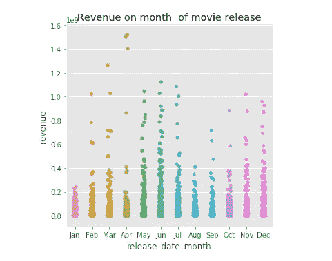

fig 收入与电影上映月份

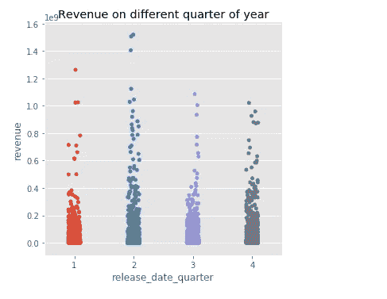

收入与发布数据季度对比

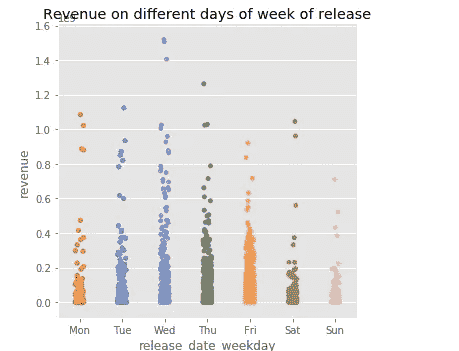

收入与每周发布天数

*   从上面的图表中，我们可以看到，四月份上映的电影收入最高，而一月份上映的电影相比其他月份收入较低。
*   从上面的图表中，我们可以看到第二季度(4 月-6 月)上映的电影比上一季度上映的电影收入更多。
*   令人惊讶的是，周三和周四上映的电影收入更高。

> 嗯，这似乎有关联，但它可能没有一对一的因果关系。

# 模型预测法

我们将从我们的数据集预测模型。我们将只选择数字列来预测我们的模型。我们将用中值替换数字列中的空值或零值。(如预算列、运行时间、收入)。预算不能为 0，收入和运行时间也是如此。

```
#selecting the numeric column
numerics = ['int16', 'int32', 'int64', 'float16', 'float32', 'float64'] #so that easy for us to perform  train and test
df_train=df.select_dtypes(include=numerics)df_train.drop(columns=['id'],inplace=True) #we will be dropping ID
df_train=df_train.fillna(df_train.median()) #let's film the empty value with median of the data set
```

***训练模型。***

我们将把数据分成两部分。特征变量和预测/响应变量。我们的特征变量是下面列出的上面数字列中的所有数据集。

'预算'，'人气'，'运行时间'，'收入'，'日志 _ 收入'，'日志 _ 预算'，' has _ 主页'，'发行 _ 日期 _ 年'，'发行 _ 日期 _ 月'，'发行 _ 日期 _ 星期'，'发行 _ 日期 _ 年'，'发行 _ 日期 _ 季度'，'动作'，'冒险'，'动画'，'喜剧'，'犯罪'，'纪录片'，'家庭'，'幻想'，'外国'，'历史'，'恐怖'，'音乐'，'神秘'，'浪漫'，'科幻'，'电视电影'，'惊悚片'，'战争'，'西部'。

我们将从特色变量中删除收入和日志收入，我们的预测变量是我们的收入。

```
#loading the training data set
X = df_train.drop(['revenue', 'log_revenue'], axis=1)
y= df_train['revenue'] #prediction
X_train, X_test, y_train, y_test = train_test_split(X, y, random_state = 1)
```

***让我们用线性回归来预测模型。***

```
#linear regression
lm = LinearRegression() #our 6th model
lm.fit(X_train, y_train)
lm_preds = lm.predict(X_test)
print("R Square: ", r2_score(y_test, lm_preds))
```

我们的线性回归预测 R 2 的平方为 0。36860 . 68686868661

***我们用随机福里斯特来预测模型。***

```
import sklearn.metrics as metrics
from sklearn.ensemble import RandomForestRegressorRF_model = RandomForestRegressor(random_state =0, n_estimators=500, max_depth=10)
RF_model.fit(X_train, y_train)y_hat = RF_model.predict(X_test)
print ("R-Squared is:", metrics.r2_score(y_hat, y_test))
```

我们对随机森林的预测是 0.5672234342768。

***让我们用梯度推进回归器预测模型。***

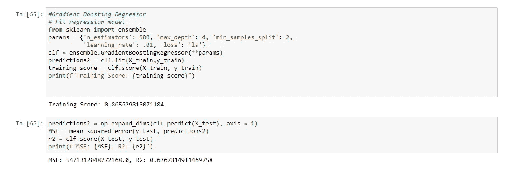

GB 回归量

我们从 GB booster 预测的 R 平方相当好于其他模型，R 平方为 67%。

**特征重要性/特征权重**

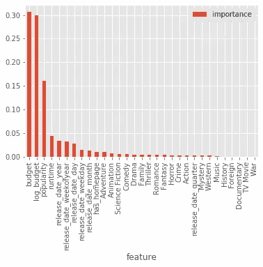

特征权重

从上面的图表中，我们可以看到预算更重要，其次是受欢迎程度、运行时间和年度发布日期。由于一年中的发行日期与当时的人口直接相关，因此它也是一个重要的特征。

让我们用我们的模型来预测数据。

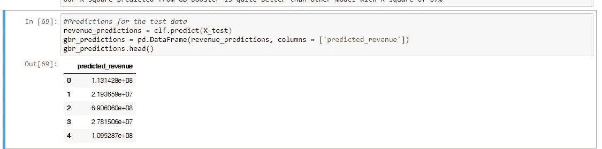

我们的模型预测的收入。

让我们比较一下我们的预测收入和电影在给定年份产生的收入。

```
test_result = pd.concat([train_genres, gbr_predictions], axis = 1, sort=True)
#look at top values only
test_result = test_result[[ 'budget', 'popularity', 'release_date_year','release_date_month', 'revenue','predicted_revenue']]
test_result.head()
```

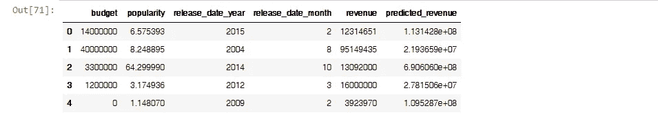

收入与预测收入

在这里，我们可以看到从我们的测试模型中预测的收入，该模型并不准确，可以通过尝试其他模型实验和使用特征变量来使其更加准确。这篇文章的重点是告诉你如何建立一个模型，并使用不同的功能预测收入。

***关键洞察***

*   戏剧是最受欢迎的类型，其次是喜剧、惊悚片和动作片。
*   外国电影在所有电影类型中收入较少。
*   2013 年是一年中上映电影最多的一年。
*   《复仇者联盟》、《速度与激情 7》、《美女与野兽》位列电影总收入的前三名。
*   今年第二季度上映的电影创造了最多的收入。
*   电影预算和电影收入之间有很高的相关性。
*   高预算的电影已经显示出高收入的趋势。

# 结论

上述模型训练和调整过程的关键点是，我们可以使用特色标签来预测电影收入，如该年的电影上映日期(因为该年与该时间的人口、电影预算、受欢迎程度、播放时间相关联。电影产业和与电影相关的人可以通过输入上述特征，使用机器学习模型来预测电影的收入。

我们最初有一个 3000 行 23 列的数据集。我们使用上述数据集进行训练和测试。因此，我们对我们的模型有一些限制，因为它不能提供准确的结果，为了提高模型性能，我们必须添加更多的数据集和一些特征变量。因此，为了更好地衡量模型的准确性，需要进行大量的观察来捕捉测试数据集中电影数据的更多可变性。

另一件要记住的重要事情是，电影成功的定义是相对的，有些电影被称为成功是基于其全球总收入，而有些电影可能在商业部分并不出色，但由于良好的评论家评论和受欢迎程度，可以被称为成功。例如“搏击俱乐部”的预算是 6300 万美元，但全球总收入只有 1 亿美元，这意味着净利润只有 3700 万美元，这根本不是一个好的利润额。但另一方面，这是一部非常受欢迎的电影，每个电影爱好者都喜欢看这部电影。因此，如果我们只考虑利润作为成功的定义，那么《搏击俱乐部》不是一部成功的电影，但如果我们考虑其他因素，任何人都可以认为这部电影是一部成功的电影。

请参考我的 [Github](https://github.com/saphal/TMDB-Revenue-Prediction) 获得这段代码的完整视图。

参考

[](https://www.dummies.com/education/math/statistics/how-to-interpret-a-correlation-coefficient-r/) [## 如何解读相关系数 r -假人

### 在统计学中，相关系数 r 衡量两个变量之间线性关系的强度和方向

www.dummies.com](https://www.dummies.com/education/math/statistics/how-to-interpret-a-correlation-coefficient-r/) [](https://www.ncbi.nlm.nih.gov/pmc/articles/PMC4120293/) [## 对数变换及其对数据分析的意义

### 对数变换广泛用于生物医学和心理社会研究，以处理偏斜数据。这篇论文…

www.ncbi.nlm.nih.gov](https://www.ncbi.nlm.nih.gov/pmc/articles/PMC4120293/) [](https://scikit-learn.org/stable/modules/generated/sklearn.ensemble.GradientBoostingRegressor.html) [## 3.2.4.3.6.sk learn . ensemble . gradientboostingregressor-sci kit-learn 0 . 22 . 2 文档

### class sk learn . ensemble . GradientBoostingRegressor(loss = ' ls '，learning_rate=0.1，n_estimators=100，子样本=1.0…

scikit-learn.org](https://scikit-learn.org/stable/modules/generated/sklearn.ensemble.GradientBoostingRegressor.html) [](https://www.kaggle.com/zero92/tmdb-prediction/data) [## TMDB 预测

### 使用 Kaggle 笔记本探索和运行机器学习代码|使用来自多个数据源的数据

www.kaggle.com](https://www.kaggle.com/zero92/tmdb-prediction/data) 

[http://DSpace . bracu . AC . BD/xmlui/bitstream/handle/10361/9015/13301028% 2c 13301019 _ CSE . pdf？sequence=1 &被允许=y](http://dspace.bracu.ac.bd/xmlui/bitstream/handle/10361/9015/13301028%2C13301019_CSE.pdf?sequence=1&isAllowed=y)