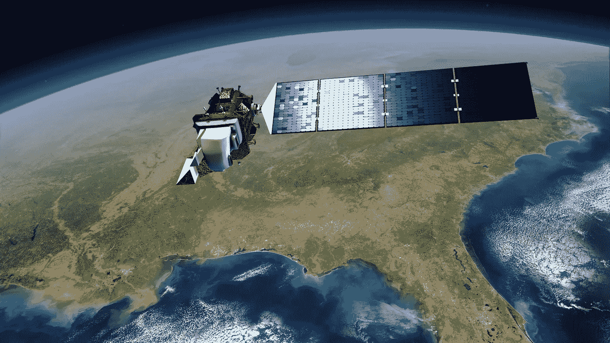
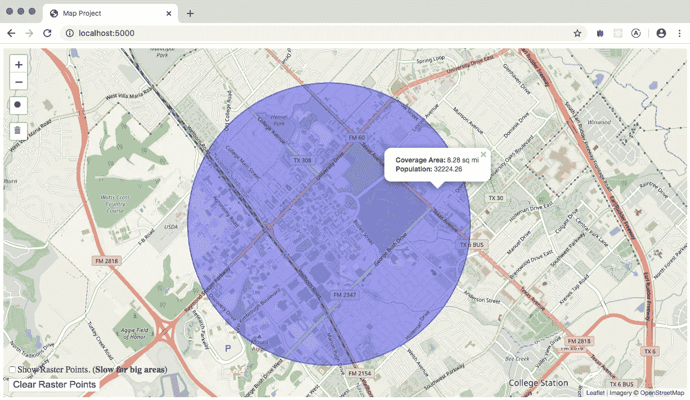
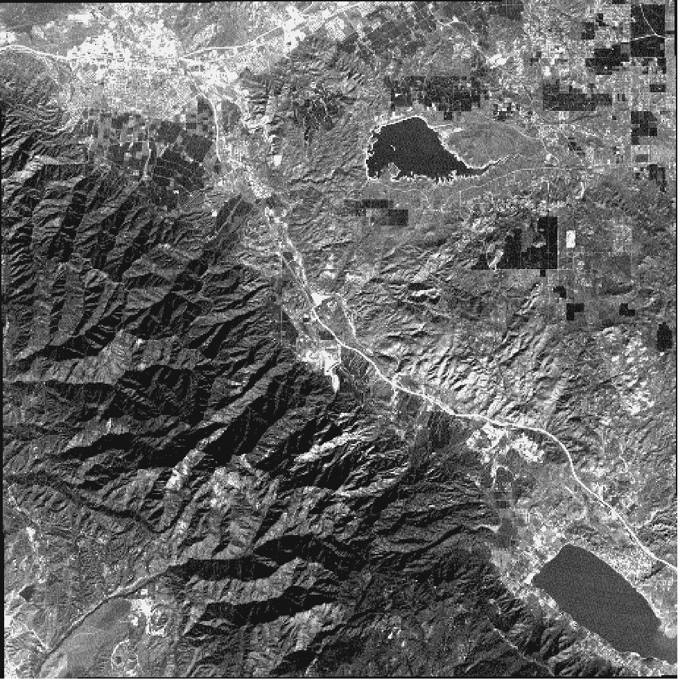
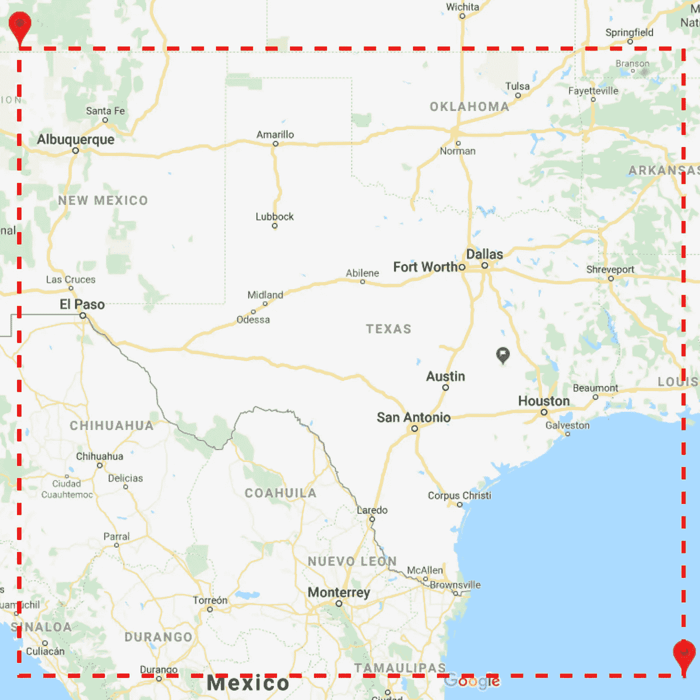
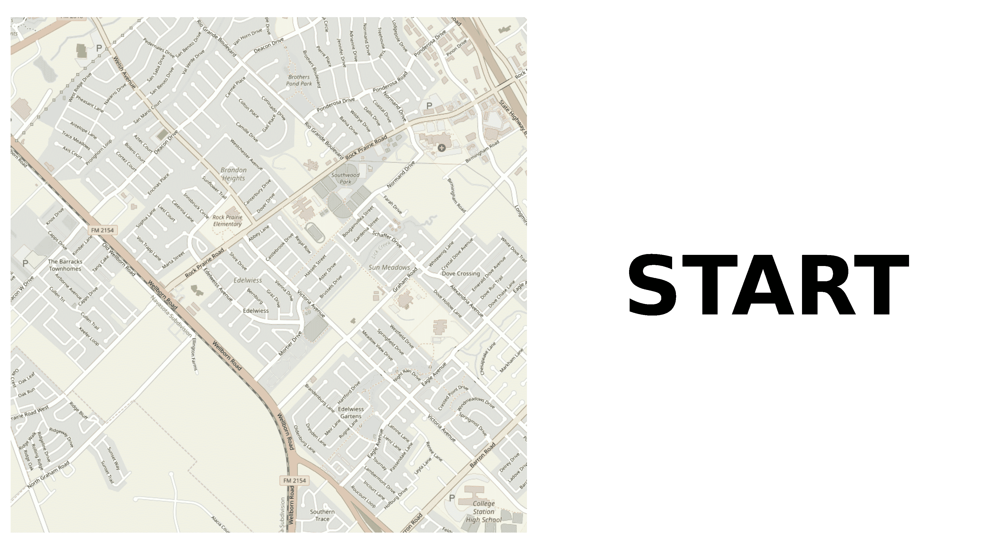
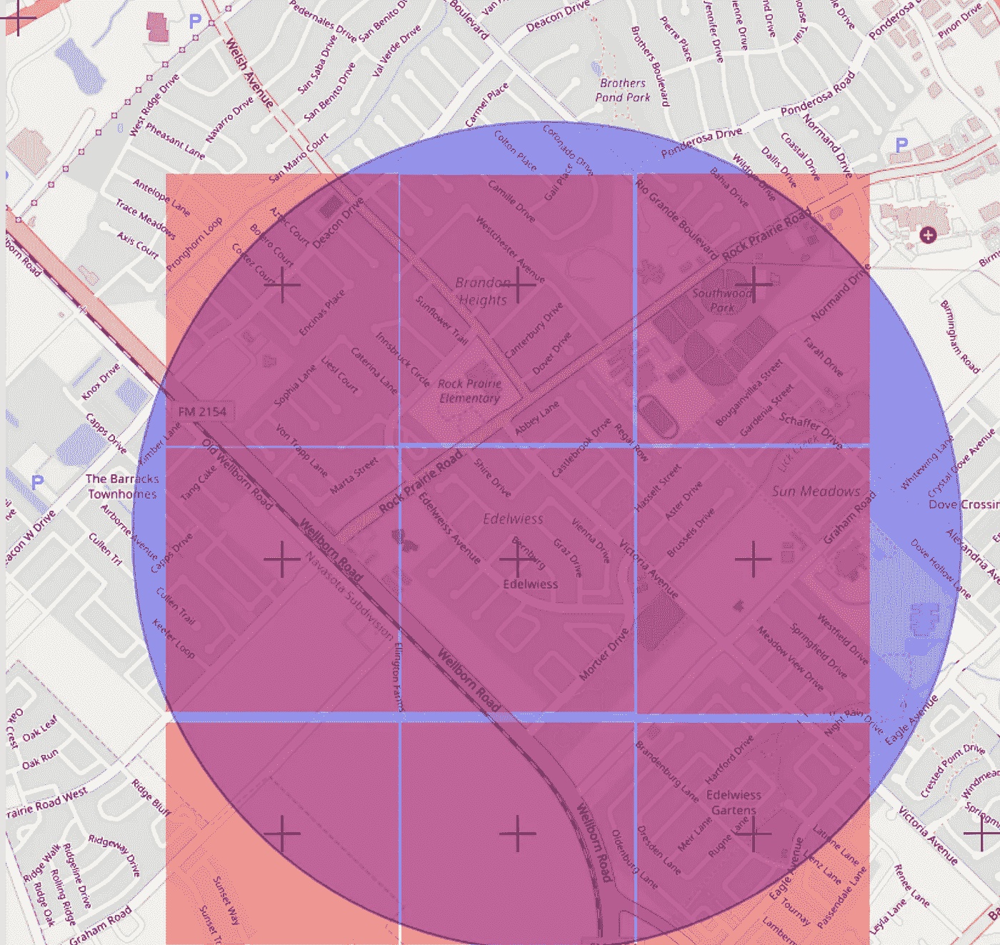

# 如何使用 NASA 开放存取数据查找全球人口

> 原文：<https://medium.com/analytics-vidhya/how-to-use-nasa-open-access-data-to-find-worldwide-populations-230d19da5763?source=collection_archive---------12----------------------->

许多美国机构(以及私人公司)在互联网上有大量的开放存取数据，通过正确的工具，我们能够探索这些信息。在本文中，我们将重点关注包含人口信息的地理空间数据和光栅图形。



图片来源:美国宇航局

尽管光栅图像是表示空间数据的一种强有力的方式，但它们经常被误解，主要原因只有一个:它们是 3D 世界的 2D 表示。在本文中，我们将使用一个简单的代码示例来指导我们讨论如何处理这些文件。

你可以在这个 GitHub 库 中找到我们需要的所有代码。这个 repo 有一个应用程序，可以获取地图上给定的一个圆圈中的人口(这是一个示例版本，所以它只覆盖了德克萨斯州)。我把它做成了一个网络应用，以利用交互式地图和图像提供商的 JavaScript 库(我正在使用[传单](https://leafletjs.com/)和[开放街道地图](https://www.openstreetmap.org)来完成这项工作)。但是所有的数据分析都是在后端使用 python 完成的。前端发送一个请求，通知圆心及其半径，后端用总人口进行响应。



应用程序运行:使用交互式地图工具查找人口。

所有的栅格数据都是从[SEDAC——NASA 社会经济数据和应用中心](https://sedac.ciesin.columbia.edu/)获得的。如果你对这个主题感兴趣，我强烈建议你去他们的网站，探索那里所有可用的数据。他们有许多不同领域的数据，如气候、土地使用、健康、人口、人类足迹等等。他们的大多数数据都可以在 GeoTIFF 中获得，这是一种以 TIFF 图像存储地球地理参考信息的特定文件格式。

# 使用地理参考影像



GeoTIFF 图片样本(来自[维基百科](http://www.wikipedia.com)

首先，我们必须了解 GeoTIFF 格式以及如何操作它。基本上，它是一个图像，它的像素映射了一个表面区域，一些元数据描述了它在地球上的位置。每个像素代表一条信息(可能是人口、人口密度、健康保险值等。).它也可以有多层，每层代表一条不同的信息。

地理空间图书馆有一些非常好的选择，比如 [GDAL](https://www.osgeo.org/projects/gdal/) 和 [rasterio](https://rasterio.readthedocs.io/en/latest/index.html) 。你有无数的理由使用它们，主要是为了处理你可能在途中发现的所有[仿射变换](https://en.wikipedia.org/wiki/Affine_transformation)。这些转换是将坐标点(纬度和经度)映射到数据图像中所必需的。这里我们将使用 rasterio，一个 python 库来帮助我们进行这类计算。

您可以在前面提到的 GitHub 存储库中找到包含德克萨斯州人口信息的 GeoTIFF 文件。它是从 NASA SEDAC 数据库中提取的，并且只包含德克萨斯州的领土，所以它比他们的原始文件要小得多。在进入应用程序代码之前，让我们先玩一会儿 rasterio:

```
$ python
>>> import rasterio
>>> dataset = rasterio.open('./texas.tif')
>>> dataset.width
1920
>>> dataset.height
1560
```

这样做，我们打开数据图像并检查文件的大小，它是一个 1920 列和 1560 行的矩阵。注意:重要的是要知道这个信息与图像矩阵有关，它不包含映射到图像中的尺寸。要处理图像的大小和位置，我们必须使用仿射:

```
>>> dataset.transform
Affine(0.008333333333333333, 0.0, -108.0,
       0.0, -0.008333333333333333, 37.0)
```

数据集的`transform`是一个仿射变换矩阵，它将(行，列)位置中的像素位置映射到(x，y)空间坐标。现在我们知道我们的地图从北纬 37 度、西经 108 度开始(减号表示它在地图的左边，也就是西边。我们还可以知道地图的另一个极端点:

```
dataset.transform * (dataset.width, dataset.height)
(-92.0, 24.0)
```

所以，它去 24N，92W。下图展示了我们正在使用的地图切片:



简单点说，所有的后端都包含在 app.py 中，包括 [Flask](https://www.palletsprojects.com/p/flask/) 微服务和所有的计算。这里我们关注的是地理空间操作，所以我将避免所有关于服务器的讨论。所以，我对从 circle_population()函数开始的每一行都进行了注释。

```
#!/usr/bin/env python
from flask import Flask, render_template, make_response, request
from flask_json import FlaskJSON, JsonError, json_response
from flask_cors import CORS
import rasterio
from math import sin, cos, sqrt, atan2, radians, asin, degreesapp = Flask(__name__, instance_relative_config=True)
path = 'rasters/texas.tif'
dataset = rasterio.open(path)
band1 = dataset.read(1)
affine = dataset.transform
FlaskJSON(app)
CORS(app)[@app](http://twitter.com/app).route('/')
def index():
    return render_template('index.html')[@app](http://twitter.com/app).route('/population', methods = ['POST'])
def population():
    if request.method == 'POST':
        try:
            points = str(request.get_json()['data']['points'])
            location = request.get_json()['data']['location']
            longitude = float(location['coordinates'][0])
            latitude = float(location['coordinates'][1])
            radius = float(location['radius'])
            point = (longitude, latitude)
            response = circle_population(point, radius, points)
        except (KeyError, TypeError, ValueError, IndexError):
            return json_response(501)
        return  json_response(data = response, headers_={'X-STATUS': 'ok'})
    else:
        raise JsonError(description='Invalid value.')def circle_population(point, radius, points):
    # meters to kilometers:
    radius = radius / 1000
    # get the vertices of a square containing the circle:
    vertice1, vertice2 = get_vertices(point, sqrt(2*radius**2))
    # get the population of the circle:
    population, points = get_population(vertice1, vertice2, band1, affine, center = point, radius = radius, points = points)
    # return as a dict (wich will be converted to JSON by Flask):
    response = {
        'population' : population,
        'points' : points,
    }
    return responsedef get_vertices(point, distance):
    # get the top left vertice by walking the given distance towards 315 degrees from the center:
    vertice1 = get_destination_point(point, 315, distance)
    # get the bottom right vertice by walking the given distance towards 135 degrees from the center:
    vertice2 = get_destination_point(point, 135, distance)
    # return the vertices:
    return vertice1, vertice2def get_destination_point(point, bearing, distance):
    # the earth radius (in km):
    earth_radius = 6373.0
    # transform the angle to radians:
    bearing = radians(bearing)
    # transform the latitude to radians:
    longitude = radians(point[0])
    # transform the longitude to radians:
    latitude = radians(point[1])
    # move the given distance towards the angle in the y axis:
    dest_latitude  = asin(sin(latitude)*cos(distance/earth_radius) +
                    cos(latitude)*sin(distance/earth_radius)*cos(bearing))
    # move the given distance towards the angle in the x axis:
    dest_longitude = longitude + atan2(sin(bearing)*sin(distance/earth_radius)*cos(latitude),
                    cos(distance/earth_radius)-sin(latitude)*sin(dest_latitude))
    # return the vertice in degrees (as they are lat and lgd):
    return (degrees(dest_longitude), degrees(dest_latitude))def distance(point1, point2):
    R = 6373.0
    # transform all the angles to radians: 
    lat1 = radians(point1[1])
    lon1 = radians(point1[0])
    lat2 = radians(point2[1])
    lon2 = radians(point2[0])
    # calculate the difference between the latitudes:
    dlon = lon2 - lon1
    # calculate the difference between the longitudes:
    dlat = lat2 - lat1
    # using the ‘haversine’ formula:
    a = sin(dlat / 2)**2 + cos(lat1) * cos(lat2) * sin(dlon / 2)**2
    c = 2 * atan2(sqrt(a), sqrt(1 - a))
    return R * cdef get_population(vertice1, vertice2, band, affine, center = False, radius = False, points = False):
    # get the position (x,y) in the image for the first vertice:
    vertice1_xy = rasterio.transform.rowcol(affine, vertice1[0], vertice1[1])
    # get the position (x,y) in the image for the second vertice:
    vertice2_xy = rasterio.transform.rowcol(affine, vertice2[0], vertice2[1])
    # start a counter for the population:
    population = 0
    # create an empty array for the data points 
    pointsArray = []
    # for all pixels between those vertices:
    for i in range(vertice1_xy[0], vertice2_xy[0]+1):
        for j in range(vertice1_xy[1], vertice2_xy[1]+1):
            # get the value of the the pixel 
            new_point = rasterio.transform.xy(affine , i, j, offset='center')
            # if the the distance is less than the radius:
            if distance(center, new_point) <= radius:
                # increase the population with the value of the pixel:
                population += band[i][j]
                # if the data points were requested:
                if points == 'True':
                    # append them to the array:
                    pointsArray.append(new_point)
    return population, pointsArray
```

代码真的很简单，也很容易理解(加上注释就更好了)。此外，我在下面包含了一个. gif 动画来说明代码的操作。它确实有直截了当的执行，但如果您有任何疑问或意见，请随时与我联系！



所用算法的动画。它主要是说明性的，所以它没有如实地表示代码的执行(但是足够接近)。

你可能已经注意到了，这种方法并不精确地计算圆圈内居民的数量。下图向我们展示了我使用矩阵中的信息假设的圆形人口。给或拿，这将是一个相当公平的近似值。顺便说一句，即使你改变形状(例如，变成正方形…)，这也只是一个近似值，因为形状的界限在大多数情况下可能与 GeoTiff 像素不匹配。这里使用的数据是以 30 角秒(赤道上约 1 公里)分辨率生成的全球栅格，这是美国宇航局网站上可用的最大分辨率。



算法产生的近似值。

这是我们能力的一个简单例子。使用强大的工具和正确的数据(都可以在网上找到)，你可以做真正酷的事情。我希望您对这个例子感到兴奋，并尝试这些工具。