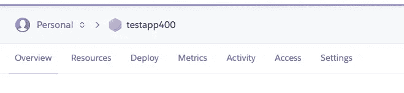
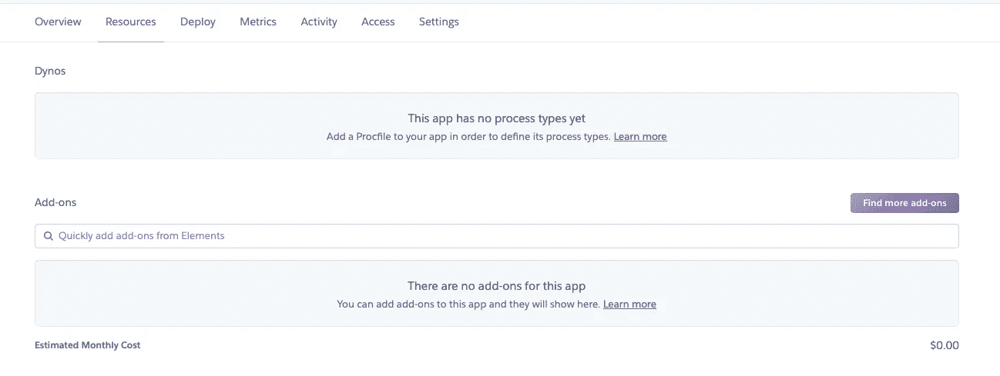
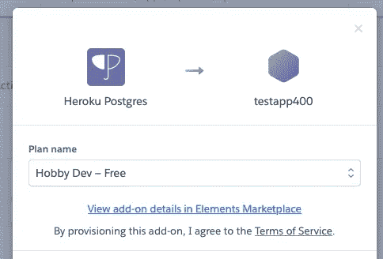
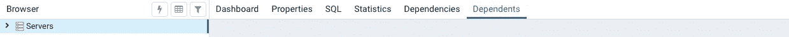
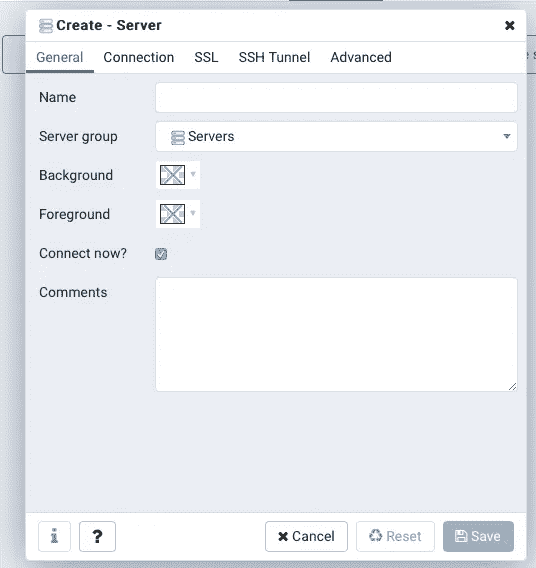
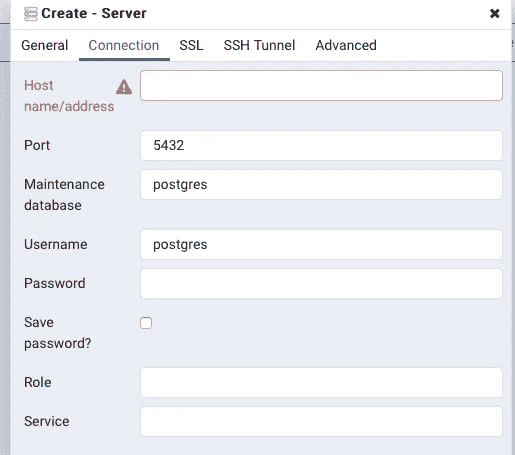
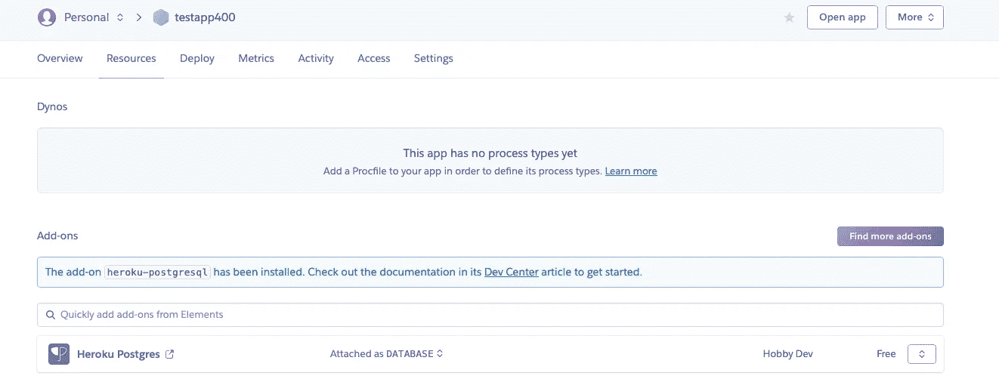
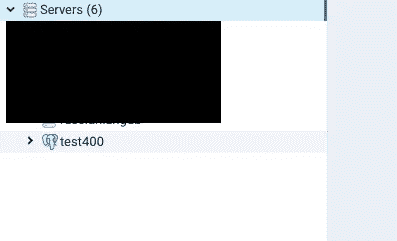
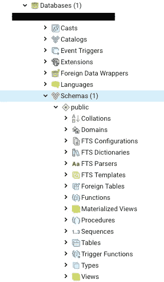

# 如何使用 PGAdmin 连接到 Heroku 数据库

> 原文：<https://medium.com/analytics-vidhya/how-to-use-pgadmin-to-connect-to-a-heroku-database-c69b7cbfccd8?source=collection_archive---------3----------------------->

在我的应用程序开发过程中，我遇到过各种不得不整合某种数据库的情况。我最初使用 MongoDB 和 MLab 作为存储数据的方式。然而，我习惯在工作时使用 SQL Server Management Studio，由于 MongoDB 是 NoSQL，我发现有时很难用这些应用程序做我想做的事情，因为我的一些功能需要关系。然而，我已经找到了一个替代解决方案，那就是 PostGre SQL，它是一个免费的开源关系数据库管理系统，使用 pgadmin 作为管理数据库的工具。

当编写 API 作为我的应用前端和后端之间的中间人时，我发现最初设置我使用 PG Admin 与我的数据交互的方式很麻烦，所以我想我应该写一篇文章/教程来帮助其他人设置这一点，因为当我在寻找这个主题的答案/指南时，我找不到太多！所以现在开始。

注意:我已经下载了 postgre sql 并安装了必要的软件包。你可以在这里找到软件和文档的下载链接:[https://www.postgresql.org](https://www.postgresql.org)

下载完必要的软件后，如果你还没有的话，你需要创建一个 heroku 账户。(heroku 的一个特点是，如果你没有借记卡或信用档案，你的账户上最多只能有 5 个项目，否则我相信你的 heroku 账户上最多可以有 200 个项目/数据库)

您可以在此注册或登录 heroku:

 [## Heroku |注册

### 免费创建应用程序、连接数据库和附加服务，并在应用程序上进行协作。一个应用程序平台，包含…

signup.heroku.com](https://signup.heroku.com/login) 

创建帐户并登录后，找到您的帐户控制面板(您可以通过单击帐户资料图片左侧由 9 个圆点组成的正方形，然后单击“控制面板”找到它)。然后，您应该单击“新建”按钮，然后单击显示“创建新应用程序”的按钮。您现在需要为您的应用程序输入一个唯一的名称，我现在就称我的应用程序为“testapp400”。然后点击“创建应用程序”。这应该会生成一个应用程序，并向您展示各种标签为“概述”，“资源”，“部署”，“指标”，“活动”，“访问”和“设置”。点击“资源”选项卡。

在附加组件搜索栏中输入“PostgreSQL，单击出现的顶部选项。应该会出现如下所示的弹出窗口。

选择您想要的资源计划，我只需选择爱好的默认计划，然后单击标有“供应”的按钮。

然后，将 post-gre sql as at 数据库附加到您的应用程序/项目。

仍然在“资源”选项卡上，您现在应该看到“Heroku Postgres”作为一个附加项和文本“作为数据库附加”。单击 add on 图标，这将打开另一个选项卡，该选项卡将描述关于您的数据库的各种元素。如果您单击“设置”选项卡，您将看到一个标有“数据库凭据”的标题，如果您单击标题右侧的按钮，主机、用户名和密码等信息将显示这些是您想要通过 pgadmin 使用数据库时需要使用的凭据。

**使用 PGAdmin**

如果你已经正确安装了 pgadmin，那么在你的窗口顶部的一个标签应该会显示一个像大象一样的图标。单击此处，然后单击“新的 pgadmin 4 窗口”。

浏览器中的一个新选项卡应该加载了一个 pgadmin 4 链接

右键单击左侧的“服务器”,然后单击“创建新服务器”。

这将弹出一个如下所示的窗口

您可以将服务器的名称设置为您喜欢的任何名称。设置好名称后，单击“连接”选项卡。

包括主机名/地址、数据库、用户名和密码在内的所有信息都是通过 heroku 为您的数据库应用程序生成的唯一凭据，您可以在之前访问的页面上找到这些信息，在加载项部分单击“Heroku Postgres”图标，如下图所示。

当您输入信息后，找到您的应用程序的数据库名称，它很可能以 d4 开头，单击“高级”选项卡，然后将数据库名称粘贴到标有“数据库限制”的文本框中。这将过滤掉所有被加载的数据库，所以只有你的数据库显示在这个服务器上，因为 Heroku 做了一些奇怪的事情，加载了所有用它创建的数据库，但是没有人可以访问你的，所以不必担心未经授权的访问。单击 save 按钮，现在您应该可以使用 PGAdmin 访问 heroku 数据库了。

正如您从上面看到的，我有一个服务器设置，如果您单击该服务器，它应该会打开各种标题，如数据库、组角色和表空间。现在，您可以在这个数据库中创建表，并通过单击“schemas”标题做您喜欢的任何事情。

这就是 Heroku 应用程序/数据库，并且可以使用 PG Admin 对其进行编辑。我希望这篇文章对您有所帮助和启发，在下一篇教程中，我将向您展示如何通过 NodeJS API 与您的数据库通信。