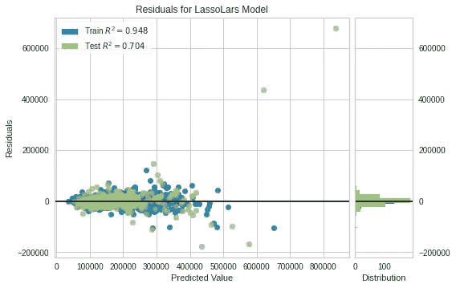
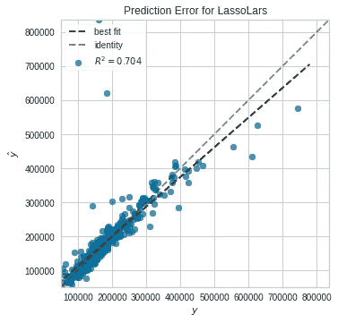
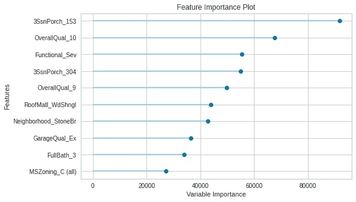

# 如何用 PyCaret 2.0 预测房价

> 原文：<https://medium.com/analytics-vidhya/how-to-use-pycaret-2-0-to-predict-house-prices-bfc9ce6121b6?source=collection_archive---------16----------------------->

在本文中，我们将设置并使用 PyCaret 2.0，使用来自[房价:高级回归技术](https://www.kaggle.com/c/house-prices-advanced-regression-techniques/overview) kaggle 竞赛的数据来预测房价。


来自 [Pexels](https://www.pexels.com/photo/aerial-view-of-buildigns-1642125/?utm_content=attributionCopyText&utm_medium=referral&utm_source=pexels) 的[懒艺术家画廊](https://www.pexels.com/@thelazyartist?utm_content=attributionCopyText&utm_medium=referral&utm_source=pexels)的照片

# PyCaret 是什么？

> PyCaret 是一个开源的，Python 中的低代码机器学习库，允许你在几分钟内从准备数据到在你选择的笔记本环境中部署你的模型。— [PyCaret 主页](https://pycaret.org/)

版本 2 中有大量的变化。关于这些变化的细节，你应该看这里[https://github.com/pycaret/pycaret/releases/tag/2.0](https://github.com/pycaret/pycaret/releases/tag/2.0)。

您还应该查看该库的作者 [Moez Ali](https://medium.com/u/fba05660b60f?source=post_page-----bfc9ce6121b6--------------------------------) 在《走向数据科学》中写的一篇[文章](https://towardsdatascience.com/announcing-pycaret-2-0-39c11014540e)。

# 只是一张纸条

我在我的机器上使用的是 Ubuntu，因此下面的一些安装代码可能无法在 Windows 机器上运行。没有一个设置代码是复杂的，如果您以前使用过 Anaconda 和 pip，那么您应该熟悉替代方法。如果有足够的需求，我可能会包括一些特定于 Windows 的指令。

此外，我使用的是一台 5 年前的笔记本电脑，配有 i7 英特尔 cpu 和 16GB 内存。在运行任何模型时，我都尽量将处理时间控制在 10 分钟以内。如果你的机器比我的机器发出的声音更大，那就把它砸碎吧:-)。

我还会把它写在笔记本上。

现在开始表演。

# 安装和设置 PyCaret 2.0

首先我们需要安装 PyCaret 2.0。我建议使用 Anaconda 并建立一个新的 conda 环境，以避免与您可能使用的其他库发生冲突。我使用的是 Python 3.7.6，我的环境叫做“pycaret_example”。

```
conda create --name pycaret_example python=3.7.6
```

一旦完成，我们需要激活环境。

```
conda activate pycaret_example
```

现在我们可以继续使用 pip 安装 PyCaret 2.0，这大约需要 5 分钟。这也将下载运行 PyCaret 2.0 所需的所有依赖项。

```
pip install pycaret==2.0
```

一旦完成，我们应该检查版本，以确保我们有我们需要的。

```
> pip show pycaret
Name: pycaret
Version: 2.0
Summary: PyCaret - An open source, low-code machine learning library in Python.
Home-page: [https://github.com/pycaret/pycaret](https://github.com/pycaret/pycaret)
Author: Moez Ali
Author-email: [moez.ali@queensu.ca](mailto:moez.ali@queensu.ca)
License: MIT
Location: ....
```

# 获取数据

我们将使用在[房价:高级回归技术](https://www.kaggle.com/c/house-prices-advanced-regression-techniques/overview) Kaggle 竞赛中找到的数据集。我建议花些时间阅读概述页面，了解数据是什么，以及评估选项卡，了解任务的一些背景。

作为一个非常简短的总结，我们试图使用每栋房子的已知指标来预测房价。这是一个经典的回归问题，所以我们需要建立某种模型来完成这项任务。顺便提一下，在与非数据科学客户合作时，这通常是尽可能详细的。

让我们来看看数据。我使用 Kaggle API 来下载数据，但是您也可以从竞赛的数据选项卡中简单地下载 zip。

```
> conda install -c conda-forge kaggle
> kaggle competitions download -c house-prices-advanced-regression-techniques
```

您现在应该有一个 zip 文件，可以从中提取所有内容。您应该有以下 4 个文件

*   train.csv
*   test.csv
*   数据 _ 描述. txt
*   sample_submission.csv

我将 **train.csv** 和 **test.csv** 移动到一个名为 data 的新目录中。这对我来说看起来不错，有助于保持一切结构化。

**data_description.txt** 包括对每列含义的解释，以及可能的值及其含义，例如。

```
SaleType: Type of sale

       WD  Warranty Deed - Conventional
       CWD Warranty Deed - Cash
       VWD Warranty Deed - VA Loan
       New Home just constructed and sold
       ...
```

我们还有 **sample_submission.csv** 文件，它向我们展示了我们需要以什么格式提交给竞争对手，例如。

```
Id,SalePrice
1461,169277.0524984
1462,187758.393988768
1463,183583.683569555
1464,179317.47751083
1465,150730.079976501
1466,177150.989247307
...
```

这两个文件都非常有用，您应该试着熟悉它们。

我们将使用的实际数据已经分为训练集和测试集。我们将在最后使用测试集来检查我们的最终模型。让我们开始查看 **train.csv** 并将 **test.csv** 留给测试。

# 设置 PyCaret 环境

让我们首先导入 PyCaret 和 pandas 的回归库来读取数据。

```
# import libraries
from pycaret.regression import *
import pandas as pd
```

现在，让我们读入数据，看看前 5 行。

```
# read in the data
df = pd.read_csv('data/train.csv')
pd.options.display.max_columns = 500
df.head()
```

您应该看到 81 列，包括我们的目标列 SalePrice，就在最后。不做任何转换，让我们初始化 PyCaret。

```
# initialize the setup
exp_reg = setup(df, target='SalePrice')
```

这将开始检查数据的过程，我检查了列的类型是否正确(即数字、分类)并按下 enter 键。我们得到 PyCaret 所做的总结，我们没有尝试做任何转换，所以任何转换应该是假的或没有。你应该看到**我们有缺失值**、 **21 个数字特征**和 **59 个分类特征** (PS，列和特征是一回事)。

# 比较模型

现在让我们通过跑步来比较模型

```
compare_models(sort='RMSE', blacklist=['tr'])
```

我们按照 **RMSE** 进行排序，因为这是我们评估提交作品的方式。我还把 TheilSen 回归器列入了黑名单，因为估计的训练时间大约是 10 个小时。

比较得出的最佳模型是正交匹配追踪模型。你可以在这里阅读更多关于车型[的信息。上面的输出是](https://scikit-learn.org/stable/modules/generated/sklearn.linear_model.OrthogonalMatchingPursuit.html)

我们的 RMSE 是 23474.3803 或 23，474.38 美元。对于仅仅几行代码来说还不算太坏。这很好，但我们应该调整这些模型，以潜在地获得更好的结果。

# 调整您的模型

让我们选择前 3 个模型，并在本文的剩余部分使用它们。这意味着我们需要为他们创建模型。我们可以如下使用 **create_models()** 来实现。

```
# create the top 3 models
OMP = create_model('omp', verbose=False)
LLAR = create_model('llar', verbose=False)
CBR = create_model('catboost', verbose=False)
```

我已经取消了输出，因为它将与我们运行 **compare_models()** 时的输出相同。

现在我们可以使用 **tune_model()** 来调优模型。

```
> tuned_OMP = tune_model(OMP, optimize='RMSE')
> tuned_LLAR = tune_model(LLAR, optimize='RMSE')
> tuned_CBR = tune_model(CBR, optimize='RMSE')
```

我分别运行了上面的每一项，这样我就可以在输出中看到最终的 RMSE。调整后，3 的最佳表现模型是**拉索最小角度回归**模型，其 **RMSE 为 23000.3172** 。

# 绘制您的模型

PyCaret 还附带了一些非常有用的绘图工具，可以用来诊断和检查模型的性能。绘制残差很容易

```
plot_model(tuned_LLAR)
```



我们也可以看到预测误差

```
plot_model(tuned_LLAR, plot='error')
```



和特征重要性

```
plot_model(tuned_LLAR, plot='feature')
```



我们还可以绘制一系列其他可能更符合您需求的图

*   残差图
*   误差预测误差图
*   库克的库克距离图
*   rfe 的递归壮举。选择
*   “学习”学习曲线
*   vc 验证曲线
*   流形学习
*   “特征”特征重要性
*   参数模型超参数

# 测试模型

在我们最终确定模型之前，我们需要根据模型以前没有见过的一组测试数据来测试它的性能。默认情况下，设置步骤为此任务留出 30%的时间。让我们来看一下我们的前三个模型，根据测试集再次进行测试。

```
> predict_model(tuned_OMP)
> predict_model(tuned_LLAR)
> predict_model(tuned_GBR)
```

就像生活中一样，现实世界中的事情并不总是那么顺利。我们的**性能最好的模型现在是 CatBoost 回归器**，其 **RMSE 为 39805.99** 。RMSE 从训练交叉验证中增加了很多，意味着 RMSE 建议在所有三个模型上过度拟合。这就是你必须戴上数据科学家的帽子，回去找出原因的地方。现在我只想向前冲。

# 最终确定部署模型

现在我们已经决定了一个模型， **CatBoost** ，我们希望它可以在现实世界中使用。finalize_model()函数将训练您先前调优的模型，但将使用整个数据集。

```
final_CBR = finalize_model(tuned_CBR)
```

# 检查 test.csv 上的最终模型

让我们读入测试集，并对照它检查我们的模型性能。我们需要创建预测，这样我们就可以将它们上传到 kaggle 比赛，并在那里进行检查。

```
df_test = pd.read_csv('data/test.csv')
test_predictions = predict_model(final_CBR, data=df_test)
submission = test_predictions[['Id', 'Label']]
submission.columns = ['Id', 'SalePrice']
submission.to_csv('submission.csv', index=False)
```

跳转到比赛的排行榜选项卡，选择**提交预测**。一旦提交，你会得到一个分数。

我提交的分数是 0.14249，几乎没有赢得比赛，但它让我在 5117 份提交的作品中排名第 2661 位，因为我基本上没有使用任何数据科学技能，只需几分钟就可以编写几行代码。

# 摘要

PyCaret 是一个很棒的工具，版本 2 建立在 AutoML 已经很强大的基础之上。作者 [Moez Ali](https://medium.com/u/fba05660b60f) 应该为这个令人敬畏的工具而受到祝贺。

自从学习 PyCaret 以来，我就把它放在了我的工具箱中，因为它允许我快速构建 ML 解决方案。

在本教程中，我没有涉及 PyCaret 可以做的所有事情，还有大量的附加功能可以将我的提交提升到一个新的水平。我鼓励你去看看[网站](https://pycaret.org/)和 [git repo](http://www.github.com/pycaret/pycaret) 。

想给我买杯咖啡吗？翻到我的 [**页，它有助于我继续写作。**](https://www.patreon.com/DataRacoon)