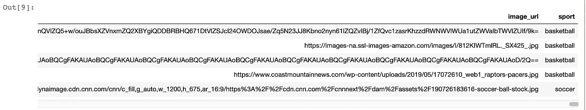
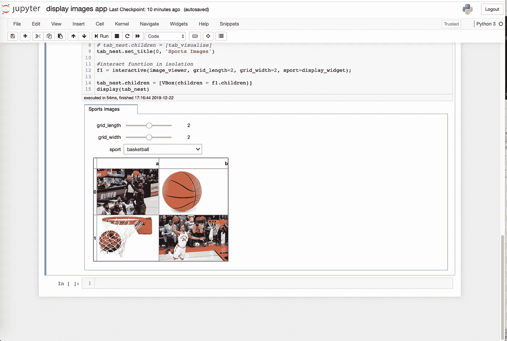

# 如何在 Jupyter 笔记本中使用 Python 构建图像显示 app

> 原文：<https://medium.com/analytics-vidhya/how-to-use-python-to-build-an-image-display-app-in-jupyter-notebook-337c4fd3775f?source=collection_archive---------7----------------------->

使用 python widgets 库动态显示 Jupyter 笔记本中 URL 的图像

图像显示应用程序

你有没有想过如何在 jupyter 笔记本上显示图片，使用一个动态的小工具应用程序？这个方法将教你使用 widgets 库显示给定了图片 url 的 HTML 图片。

对于本教程，我们将创建一个简单的应用程序，根据您的选择过滤足球或篮球图像的数据帧，并在模块中显示体育图像。它获取 url，将其转换为 HTML，并将其提供给小部件。

## 导入包:

```
from IPython.display import display, HTML
from ipywidgets import interact, interactive, fixed, interact_manual
import ipywidgets as widgets
from ipywidgets import *
import pandas as pd
pd.set_option('display.max_colwidth', -1)
import warnings
warnings.filterwarnings('ignore')
import string
```

*重要注意事项:使用*PD . set _ option(' display . max _ col width '，-1)* 确保 pandas 不会切断长 url 的 URL。

## 读入数据帧

dataframe 应该是某种标识列和图像 url。在这种情况下，我使用足球和篮球图像。在一列中，我有图片 url，在另一列中，我有运动名称。

```
# read in dataframe
sports_df = pd.read_csv('~/downloads/sports.csv')
sports_df.head()
```



sports_df 数据帧

## 转换图像 url 的函数:

创建一个函数，将图像 url 转换为 HTML 库需要的格式:

```
def path_to_image_html(path):
    '''
     This function essentially convert the image url to 
     '' format. And one can put any
     formatting adjustments to control the height, aspect ratio, size etc.
     within as in the below example. 
    ''' return ''
```

## 在 HTML 中显示图像的函数

创建一个将图像文本转换为 HTML 图像的函数:

```
def show_im():
    CSS = """
    .output {
        flex-direction: row;
    }
    """ HTML('<style>{}</style>'.format(CSS))
```

## 处理数据帧和显示图像的功能

创建一个函数来操作数据帧和显示图像，并将其输入到小部件包中:

```
def image_viewer(grid_length, grid_width, sport):

    images_df = sports_df[sports_df['sport'] == sport]  # filter by sport input
    image_grid = images_df['image_url']
    image_grid_size = grid_length + grid_width
    image_grid = image_grid.iloc[0:image_grid_size] # size of grid 
    image_grid = image_grid.as_matrix() #turn into matrix for reshaping
    image_grid = image_grid.reshape(grid_length, grid_width) 
    image_grid = pd.DataFrame(image_grid)
    image_grid.columns =    list(string.ascii_lowercase[:len(image_grid.columns)]) image_grid_html = HTML(image_grid.to_html(escape=False ,formatters=dict(a=path_to_image_html, 
                                                        b=path_to_image_html))) display(image_grid_html)
    show_im()
```

## 使用小部件显示图像

最后，将数据帧、网格参数和 sport 过滤器传递到 widgets 包中。

```
sport_list = ['soccer', 'basketball']  # list of sports#define widgets
display_widget = widgets.Dropdown(options=sport_list)#create tabs
tab_nest = widgets.Tab()
tab_nest.set_title(0, 'Sports Images')#interact function in isolation
f1 = interactive(image_viewer, grid_length=2, grid_width=2, sport=display_widget);tab_nest.children = [VBox(children = f1.children)]
display(tab_nest)
```

最终结果是一个模块，您可以在其中选择运动，该运动的图像显示在一个动态小部件中:



使用 widget 应用程序显示图像

Gif 版本:

完整代码和输入数据请看我的 [github](https://github.com/spencernelsonucla/image_display_app) 。

斯潘塞毕业于加州大学洛杉矶分校，是洛杉矶一家电子商务公司的数据科学家。我的一些爱好是高保真音响、健康生活和数据科学。在 [LinkedIn](https://www.linkedin.com/in/spencernelsonucla/) 上和我联系，写的时候提到这个故事。