# 如何在 Power BI 中使用 Python 可视化

> 原文：<https://medium.com/analytics-vidhya/how-to-use-python-visuals-in-power-bi-c1ec92206781?source=collection_archive---------4----------------------->

数据科学是城里的新话题，因此数据的可视化和分析也随之而来。Power BI 是简化可视化的主要工具，但是对于复杂的数据集成，python 库是必不可少的。

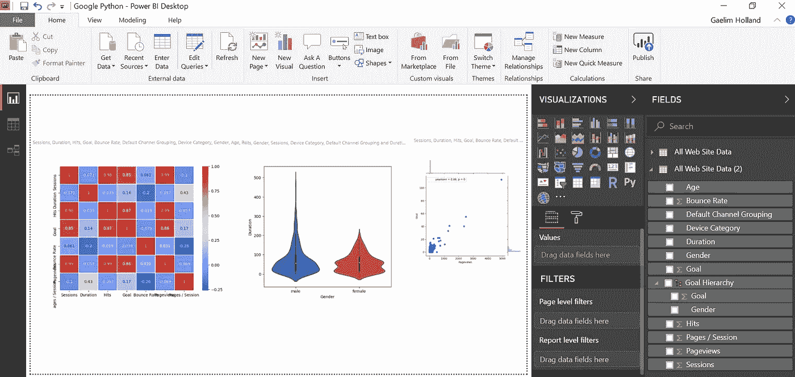

在 Power BI 中增加 Python 集成是微软能做的最伟大的事情之一。这给了用户利用惊人的视觉库的能力，这里我将给出 Seaborn 库的快速指南。除了可视化，你还可以利用一些机器学习包。

你首先需要的是最新版本的 Power BI，它将在预览功能中集成 Python，你可以启用它，然后重启。只需进入您的选项并启用该功能。

# 使用 Python 脚本编辑器和可视切片

1.单击可视化面板中的 Python 可视化。这将在页面底部打开脚本编辑器窗口。

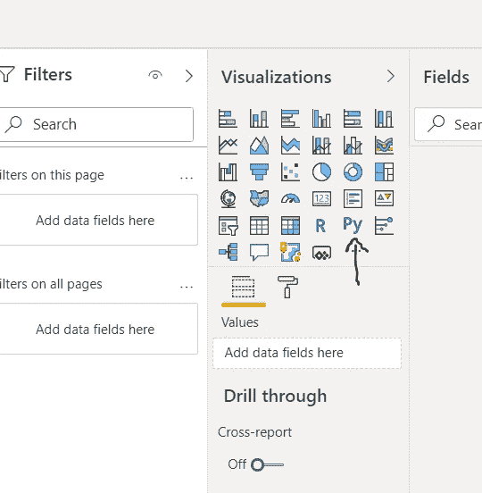

单击此图标时，脚本编辑器会打开一个空的可视区域。我正在使用谷歌分析数据来制作我的数据集。

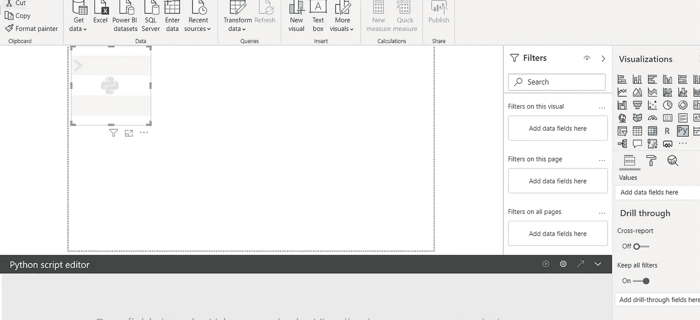

2.您需要添加值来构建数据集，方法是选择将填充您的值部分的字段来创建将在可视化中使用的数据。一旦你建立了数据集，你会看到它是一个熊猫数据框，可以认为是一个表。

3.现在你需要导入一些库来确保你可以创建视觉效果。使用以下脚本导入 Matplotlib 和 Seaborn。我们使用 plt for 和 seaborn 的缩写来使我们的代码更有效。

```
import matploblib.pylot as plt
import seaborn as sns
```

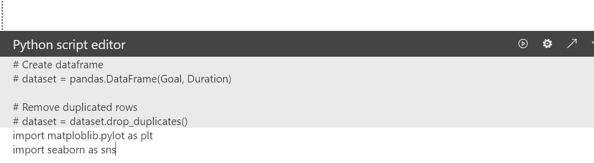

# 小提琴情节与 Seaborn 图书馆

这将导入视觉库，允许你创建一些很酷的视觉效果。现在让我们建立一些情节又名视觉效果。既然我们已经有了代码的第一部分，让我们添加代码来获得我们想要的视觉效果。我们将创建的第一个视觉效果是小提琴的情节。我们将使用在中添加的值来创建数据集。

**粘贴代码:**

```
import matploblib.pylot as plt
import seaborn as sns
sns.violinplot(x='Device',y='Session Duration',data=dataset)
plt.show()
```

使用此代码将生成一个 violin 图，它将向您显示设备在 y 轴上的会议持续时间的集中位置。

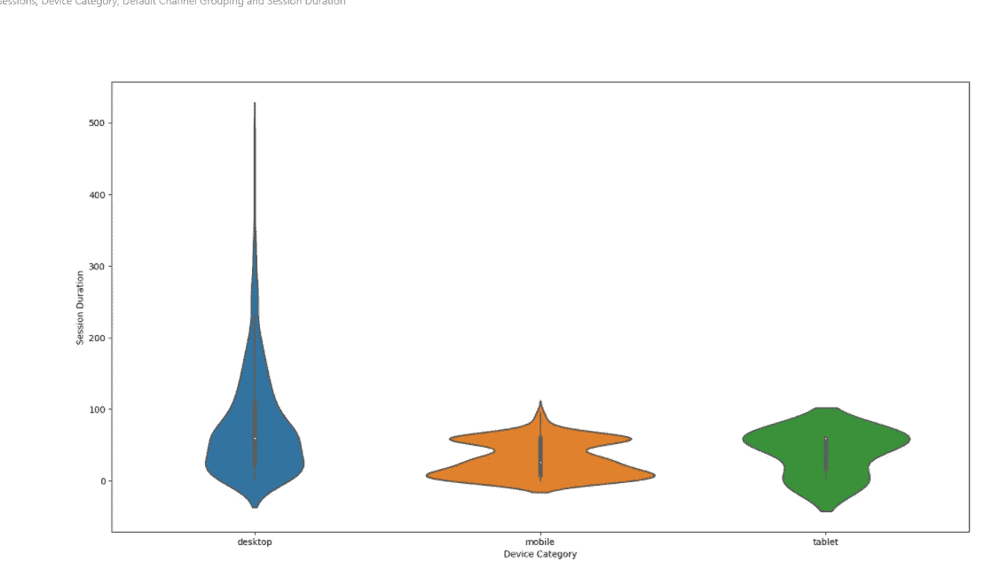

我们可以从桌面上看到，与任何其他设备相比，桌面上的异常值数量更多，会话持续时间更长。我们可以简单的把 x 轴改成性别来评价性别。

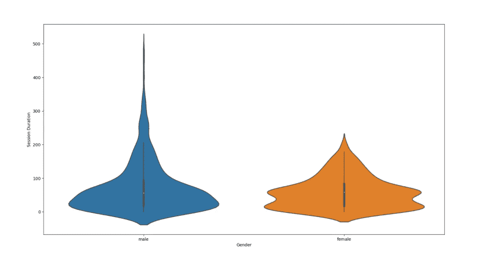

# 创建一个联合地块

下一个情节是要联合剧情。这与您已经使用 violinplot 构建的代码主干是一样的。唯一的区别是您将把 sns.violinplot 换成 sns.jointplot。但是，联合图是一个修改的散点图，因此您的 X 和 Y 变量将需要数值。对于这个例子，我想知道会话持续时间和目标完成之间是否有关联。您可以从下面的代码中看到，我将会话持续时间作为 x 轴，将目标完成情况作为 y 轴

**粘贴代码:**

```
import matplotlib.pyplot as plt
import seaborn as sns
sns.jointplot(x='Session Duration', y='Goal Completions', data=dataset)
plt.show()
```

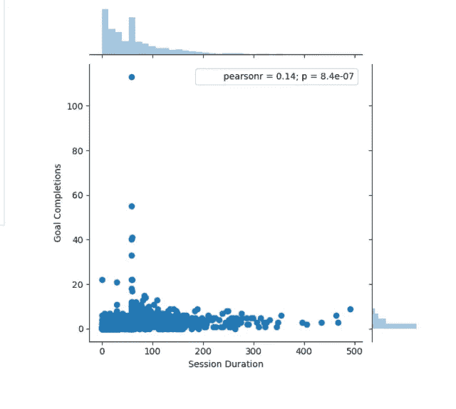

这个情节并没有让我对自己的目标完成情况有更多的了解。我们可以将 x 变量更改为页面浏览量，看看我们是否可以获得更好的相关性分数，该分数列在右上角。

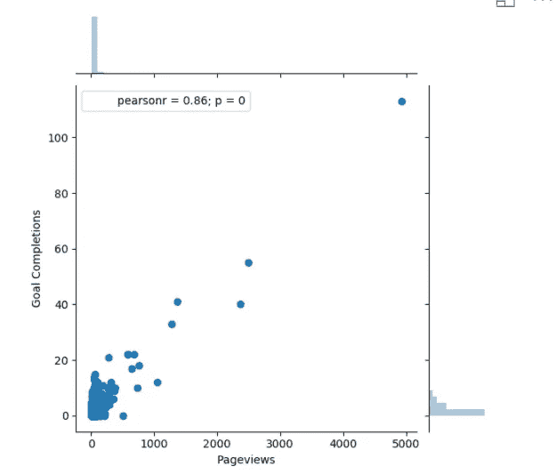

# 创建热图关联图

现在，我们必须根据数据集创建一些关联。这是做一些探索性数据分析的好方法。我们可以通过热图来做到这一点，热图是一种非常强大的视觉工具。因为我们要评估整个数据集，所以不需要定义 x 轴和 y 轴。我们可以得到每个变量的相关分数。

粘贴代码:

```
import matplotlib.pyplot as plt
import seaborn as sns
sns.heatmap(dataset.corr(),cmap='coolwarm')
plt.show()
```

代码包含了整个数据集，我添加了一个颜色渐变，叫做“冷温”,但是你可以探索大量的颜色渐变。这是通过 cmap 参数添加的。你可以去 Seaborn 网站看看你可以使用的其他色标。

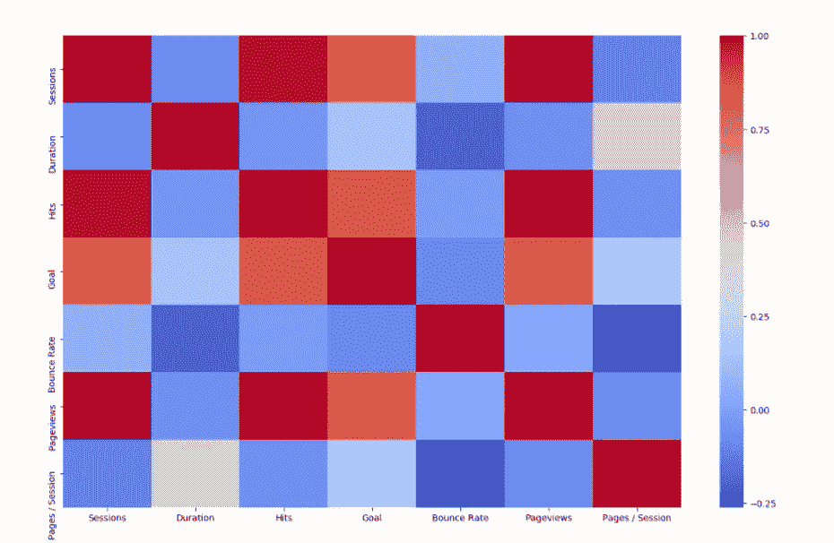

为了有正确的理解，我们可以通过添加标签和线宽来定制它。这将通过显示相关性使热图更具可操作性。

粘贴以下代码:

```
import matplotlib.pyplot as plt
import seaborn as sns
sns.heatmap(dataset.corr(),cmap='coolwarm', annot = True, linewidth =0.7)
plt.show()
```

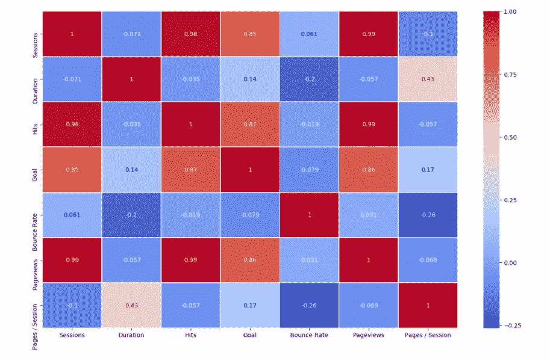

# 创建 Seaborn Pair 图

这里的最后一个情节是最容易创造的。它被称为配对图，本质上是所有数据集相关性的集合，类似于单独的图形。它可以让你快速简单地查看你的相关性，以便进行更深入的探索。

粘贴以下代码:

```
import matplotlib.pyplot as plt
import seaborn as sns
sns.pairplot(dataset)
plt.show()
```

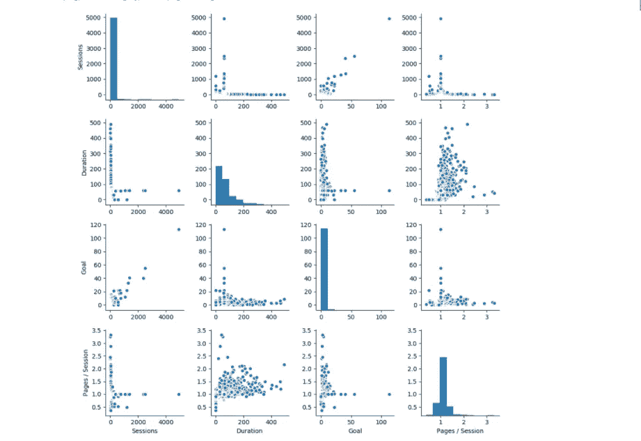

然后，您可以以任何方便的方式将这些可视化显示为适当的报告。

