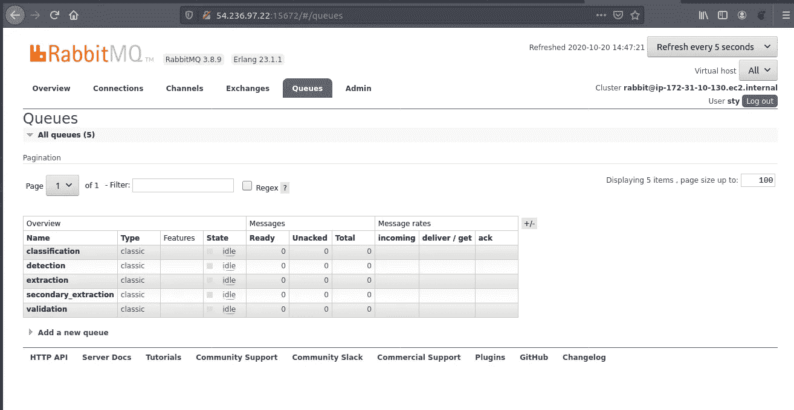

# 如何配合 python 使用 RabbitMQ？

> 原文：<https://medium.com/analytics-vidhya/how-to-use-rabbitmq-with-python-e0ccfe7fa959?source=collection_archive---------1----------------------->

这个博客的目的是通过使用 RabbitMQ 作为测试用例来制作一个快速的“hello world”式的应用程序。RabbitMQ 是一个开源、轻量级、易于云部署且高度可扩展的消息传递代理。它被 Reddit、Stack、Trivago 等科技公司使用。这个博客是在你自己的基于 python 的项目中安装和使用 rabbitMQ 的快速入门指南。

# 装置

## 设置 rabbitmq 服务器

要访问 python 中的 RabbitMQ 或我们称之为“**rabbit MQ 的纯 Python AMQP 0–9–1 客户端**”，有一个名为 pika 的包(库)，可以使用 pip 安装。但是首先我们需要安装“rabbitmq-server ”,它将作为后端系统程序运行。
*安装 erlang
*安装 rabbitmq-server
*启用 rabbitmq-server 作为系统程序
*后端启动 rabbitmq-server
*启用 rabbit MQ 管理插件

```
sudo apt-get update && sudo apt-get upgrade
sudo apt-get install erlang
sudo apt-get install rabbitmq-server
sudo systemctl enable rabbitmq-server
sudo systemctl start rabbitmq-server
sudo rabbitmq-plugins enable rabbitmq_management
```

*   创建用户名和密码以登录 rabbitmq 管理

```
##user is the username and password is the new password
sudo rabbitmqctl add_user user password
##giving that user adiministraitve rights
sudo rabbitmqctl set_user_tags user administrator
```

*   授予管理员权限

```
sudo rabbitmqctl set_permissions -p / user "." "." "."
```

这将启动 rabbitmq 服务器。现在，您可以使用 python 中名为 pika 的 AMQP rabbitmq 客户端访问它了。

## 安装 Pika

```
pip install pika
```

您已经准备好从 python 访问和管理 rabbitmq 了

# 消息生产者和消费者“应用程序”


一个例子的简单图示

如图所示，我们有消息的生产者和消费者。因此，这个设计有两个方面，一个是生产者，另一个是消费者。我们将看到两端，并为此编写一个 python 脚本。

## 生产者

> * **凭证** -在这里，我们将定义 rabbitmq-server(请参考上面的安装部分)
> * **主机**知道的用户名和密码-默认情况下，我们使用“localhost”或 0.0.0.0 作为监听服务器，但它可以在具有 rabbitmq-server 监听
> * **端口**的云上拥有任何其他 IP 地址-默认情况下，这是 5672， 但是它应该指向我们的服务器正在监听的端口
> * **交换**——这可以假设为一个需要声明的桥名，以便可以访问队列
> ***routing _ key**——这是一个与该键对应的绑定键，我们可以将其设置为任何名称
> ***basic _ publish**——这是我们调用的将消息发送到相应队列的方法

```
#producer
**import pika**#declaring the credentials needed for connection like host, port, username, password, exchange etc
**credentials = pika.PlainCredentials(‘tester’,’secretPass’)
connection= pika.BlockingConnection(pika.ConnectionParameters(host=’localhost’, credentials= credentials))
channel= connection.channel()****channel.exchange_declare(‘test’, durable=True, exchange_type=’topic’)****channel.queue_declare(queue= ‘A’)
channel.queue_bind(exchange=’test’, queue=’A’, routing_key=’A’)****channel.queue_declare(queue= ‘B’)
channel.queue_bind(exchange=’test’, queue=’B’, routing_key=’B’)****channel.queue_declare(queue= ‘C’)
channel.queue_bind(exchange=’test’, queue=’C’, routing_key=’C’)**#messaging to queue named C
**message= ‘hello consumer!!!!!’**
**channel.basic_publish(exchange=’test’, routing_key=’C’, body= message)****channel.close()**
```

我们将使用在安装 rabbimq-server 时创建的相同凭证。


交换名:在我的例子中是 dde



在 dde 交换中:声明了五个队列

## 消费者

```
#consumer**import pika**
#declaring the credentials needed for connection like host, port, username, password, exchange etc
**credentials = pika.PlainCredentials('tester','secretPass')
connection = pika.BlockingConnection(pika.ConnectionParameters(host='localhost', port='5672', credentials= credentials))
channel = connection.channel()
channel.exchange_declare('test', durable=True, exchange_type='topic')**#defining callback functions responding to corresponding queue callbacks
**def callbackFunctionForQueueA(ch,method,properties,body):
 print('Got a message from Queue A: ', body)
def callbackFunctionForQueueB(ch,method,properties,body):
 print('Got a message from Queue B: ', body)
def callbackFunctionForQueueC(ch,method,properties,body):
 print('Got a message from Queue C: ', body)**#Attaching consumer callback functions to respective queues that we wrote above
**channel.basic_consume(queue='A', on_message_callback=callbackFunctionForQueueA, auto_ack=True)
channel.basic_consume(queue='B', on_message_callback=callbackFunctionForQueueB, auto_ack=True)
channel.basic_consume(queue='C', on_message_callback=callbackFunctionForQueueC, auto_ack=True)
#this will be command for starting the consumer session
channel.start_consuming()**
```

## 这经常发生

由于阻塞连接，如果通道长时间连接，则服务器拒绝连接。为了克服这一点，我们可以通过两种方法，一种是改变长期的连接类型，另一种是只有当你想发送或接收某些东西时才建立连接。第二个是更好的方法。

```
def startConsumer():
 connection= pika.BlockingConnection(pika.ConnectionParameters(host=’localhost’))
 #creating channels
 channel= connection.channel()
 #connecting queues to channels
 channel.basic_consume(queue=’**A**’,  on_message_callback=**callbackFunctionForQueueA**, auto_ack=True)
 channel.basic_consume(queue=’**B**’, on_message_callback=**callbackFunctionForQueueB**, auto_ack=True)
 channel.basic_consume(queue=’**C**’, on_message_callback=**callbackFunctionForQueueC**, auto_ack=True)#Starting Threads for different channels to start consuming enqueued requests
 Thread(target= channel.start_consuming()).start()while True:
 try:
  startConsumer()
 except:
  continue
```

# 结论

这个博客旨在成为 python 入门所需的最少代码，我们可以在它的基础上开发更多高级功能，并利用它来构建一个伟大的项目。

为了进一步阅读，pika 有很棒的文档可供我们阅读:-[https://pika.readthedocs.io/en/stable/](https://pika.readthedocs.io/en/stable/)