# 如何使用 AWS (SQL SERVER)中的 RDS 服务进行机器学习？

> 原文：<https://medium.com/analytics-vidhya/how-to-use-rds-service-in-aws-sql-server-for-machine-learning-8ffc65d9b12b?source=collection_archive---------13----------------------->

自动警报系统

数据库是任何编程语言的支柱。如果你使用机器学习，管理数据库会变得非常复杂，因为机器学习需要大量的计算能力和快速、可扩展、安全和持久的数据库。在这篇文章中，我们将学习如何在 AWS RDS 服务中使用 SQL SERVER 数据库，这是一个快速、可伸缩且安全的数据库。让我们开始吧。

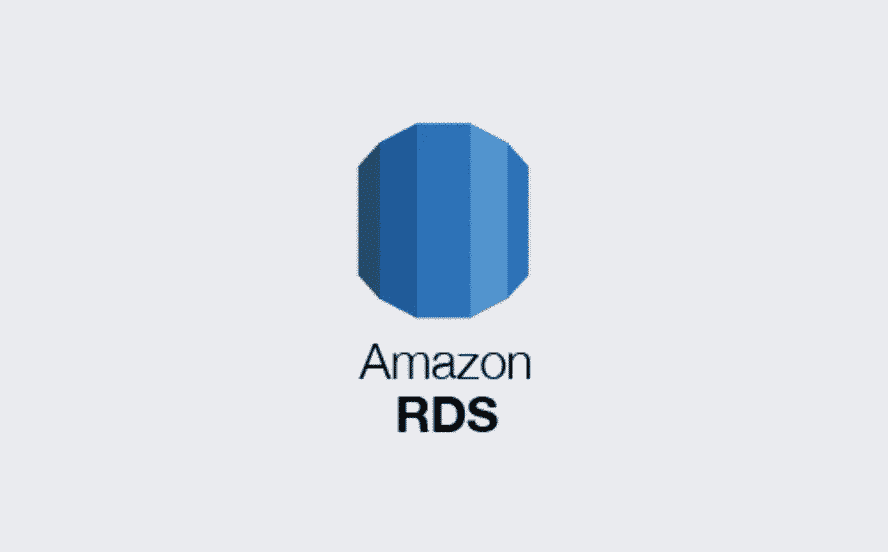

我们可以通过几种方式在 AWS 中创建 SQL SERVER 服务。

*   EC2(我们都必须安装许可证、SQL SERVER 和其他东西)。
*   AMI (AMI 在我们可以使用的包中提供了 SQL SERVER 的快照)。
*   RDS (RDS 是 AWS 为 MySQL、SQL server 等所有数据库管理的服务)。

在这篇博客中，我们将使用 RDS 服务。登录到您的 AWS 帐户，如果您没有 AWS 帐户，只需创建一个免费层帐户。

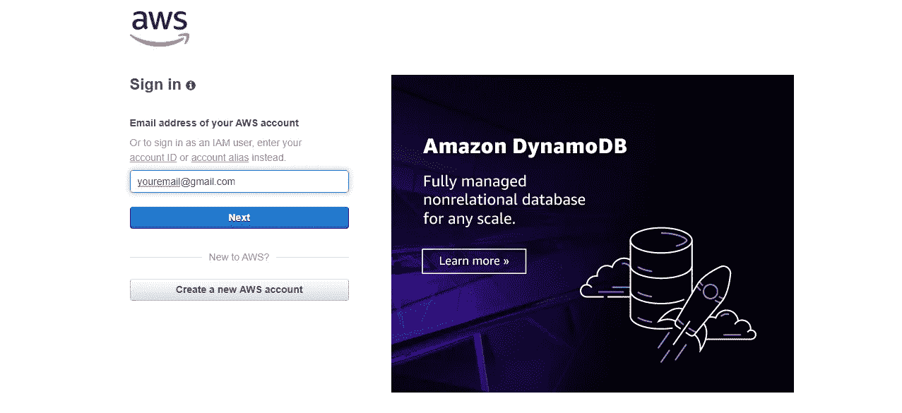

登录 aws 帐户

登录后，您将看到 RDS 服务的这种屏幕搜索，然后单击它。

注意:不要忘记选择适当的地区，在本例中，我使用了 N.Virginia，

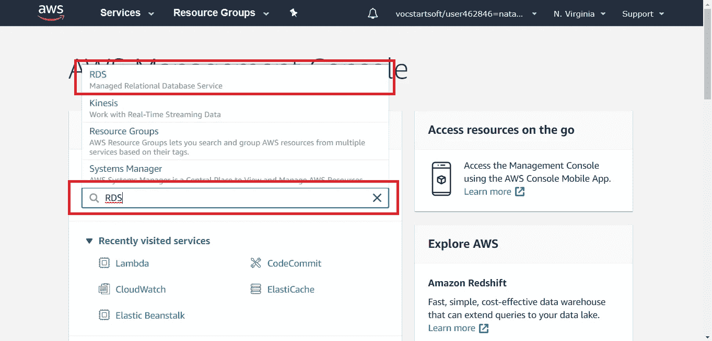

点击它后，您将被定向到仪表板，在那里选择创建数据库选项并点击它。

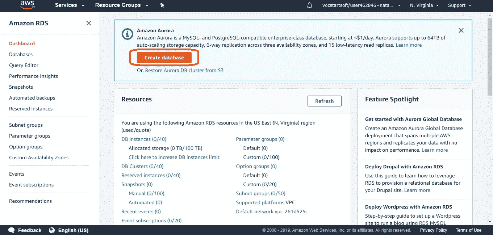

创建数据库

*   然后，您必须选择如何创建您的数据库标准创建或简单创建。我们将首选标准创建，因为在这种情况下，我们将根据我们的要求进行设置。在 Easy create 中，AWS 将为我们做那些可以在以后修改的事情。
*   选择 SQL SERVER。

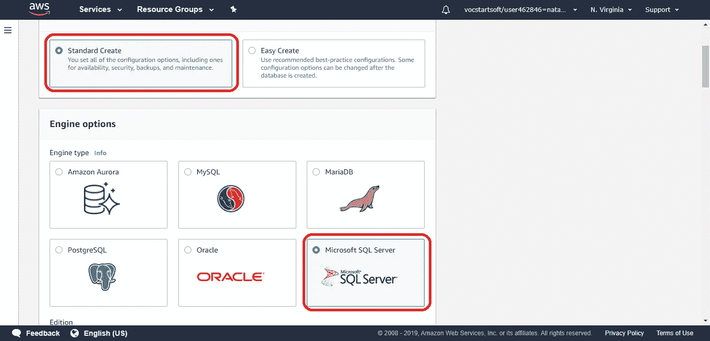

数据库选择

*   选择您需要的版本，您可以在此许可证中看到的版本将被包括在内，否则我们必须手动在 EC2 虚拟机中设置它。
*   从模板中选择自由层资格。

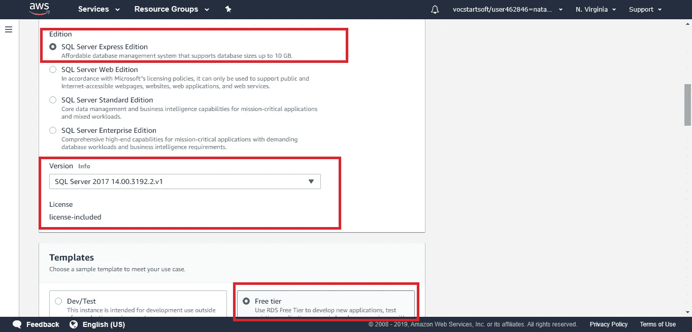

*   设置数据库实例名称，可以是任何名称。
*   设置用户名和密码，并记在某个地方。

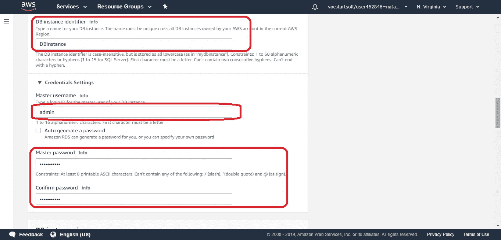

*   内部连接选择 VPC 和子网作为默认。
*   选择公开访问，这样我们可以在我们的 VPC 以外的我们的数据库。

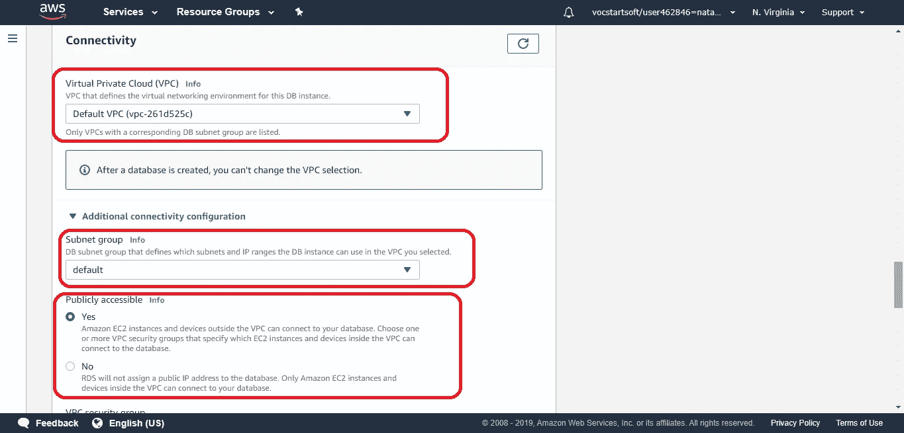

选择默认安全组，或者您可以创建自己的安全组，选择可用性区域和数据库端口。为了方便起见，我保留为默认值。将 Microsoft SQL server windows 身份验证保留为默认设置。

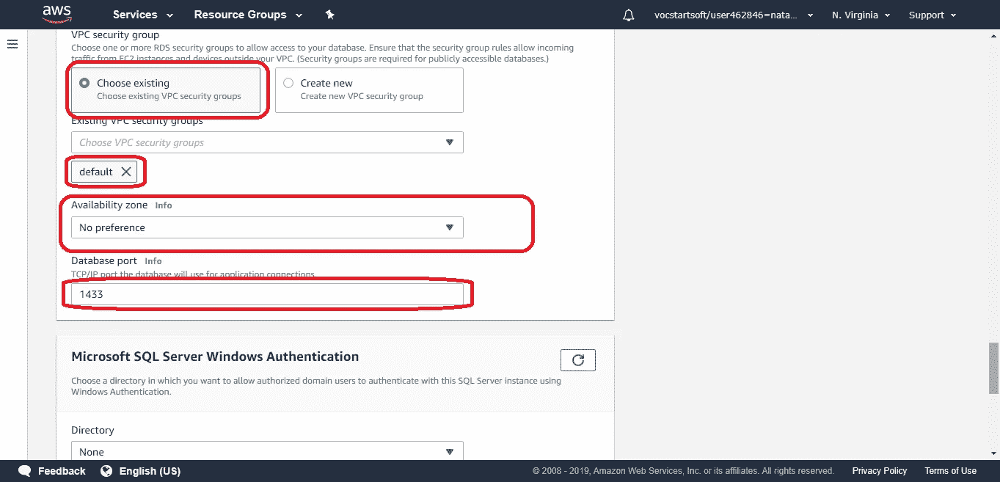

*   我留下了额外的配置，你可以离开它。只有时区和其他信息。
*   点击创建数据库按钮

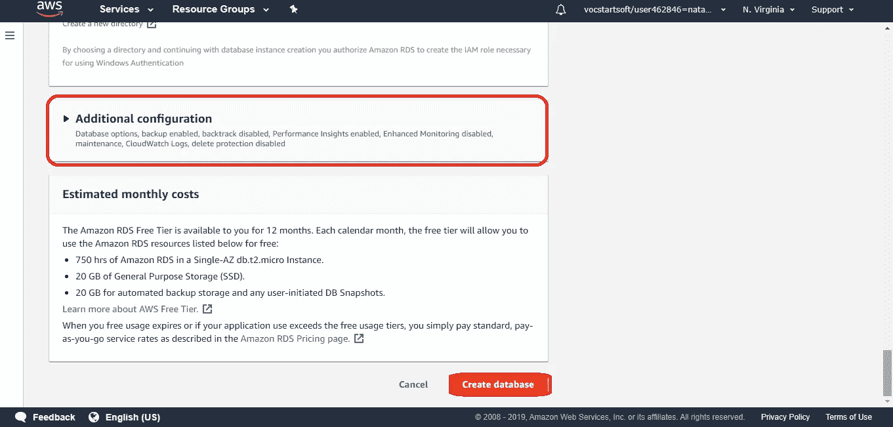

现在应该开始创建数据库了。干得好！

选择左侧的数据库，您将看到实例名称向右滚动以查看状态

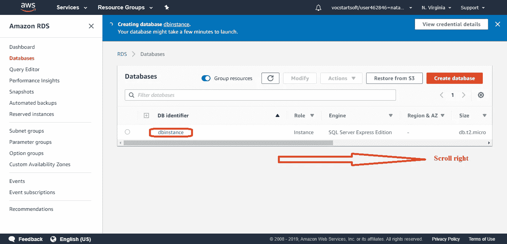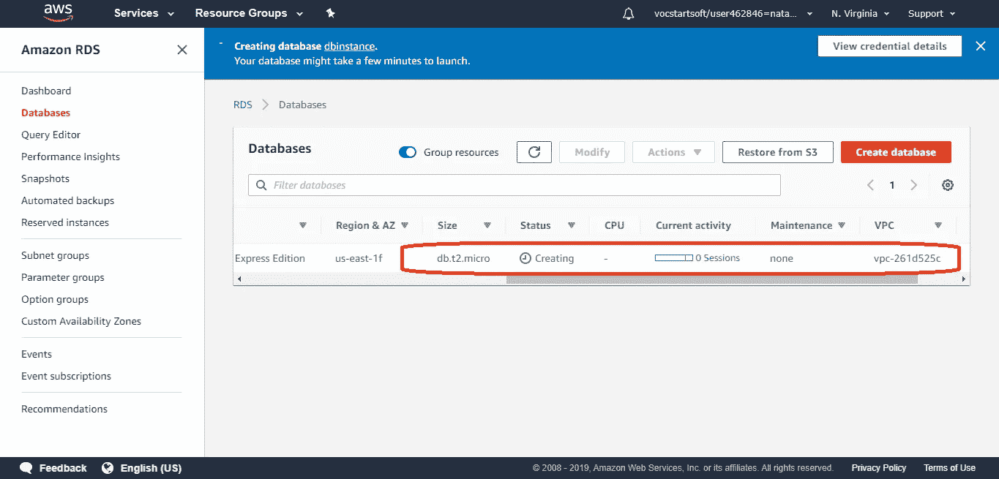

您将看到它正在创建和备份，完成后，您将看到这里的可用状态。当它可用时，单击您的数据库实例名称。

当数据库处于活动状态时，您将看到您的端点和端口。

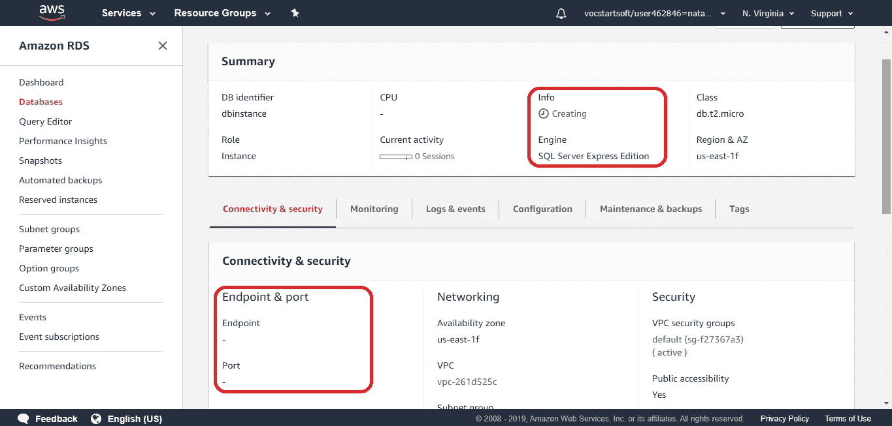

当它可用时，让我们尝试连接我们的数据库。当所有的设置完成后，我们将有这些东西。

*   端点
*   用户名
*   密码

让我们使用 visual studio 进行连接测试。转到服务器资源管理器->右键单击数据连接选择添加连接

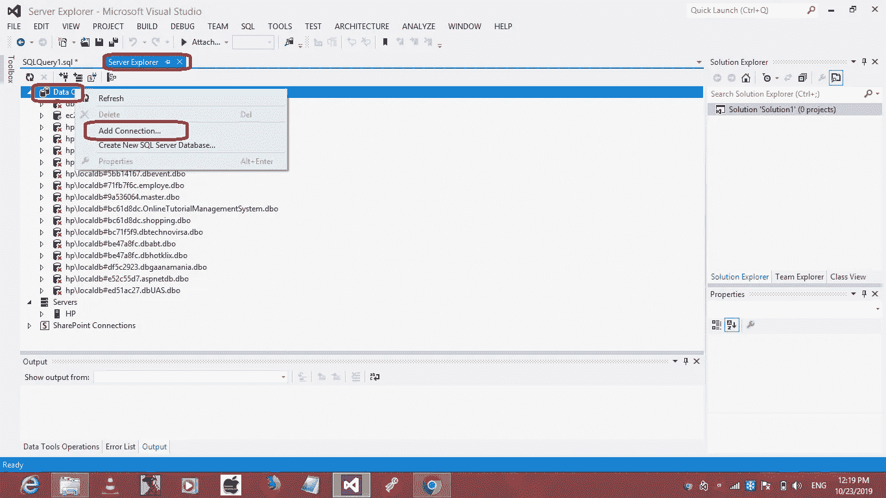

*   添加端点->服务器名称
*   用户名->用户名
*   密码->密码
*   单击(输入数据库名称)上的箭头按钮，您将在 RDS 中看到您的 SQL server 的数据库名称。
*   通过选择“在数据库上”或“新建”，单击“测试连接”

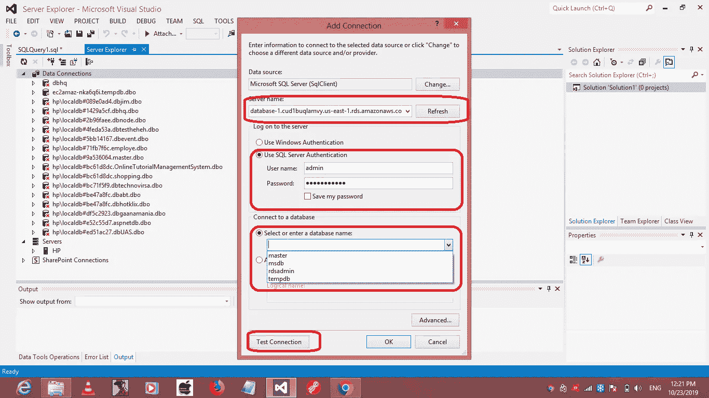

如果一切正常，将会提示您连接成功的消息。

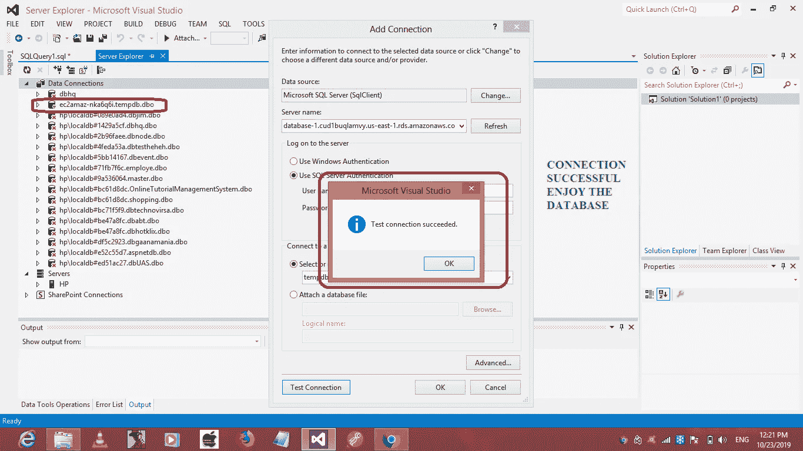

我看到有些人在连接数据库时遇到了问题。这是因为没有设置入站规则。

为此，请遵循以下步骤:

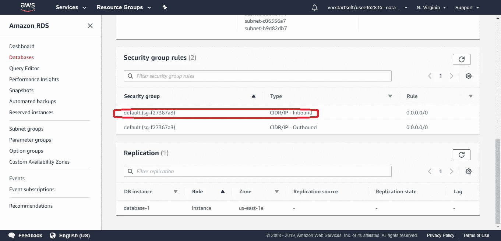

转到 RDS 中的数据库实例:在安全性内部，组选择入站规则。新的一页将会打开。

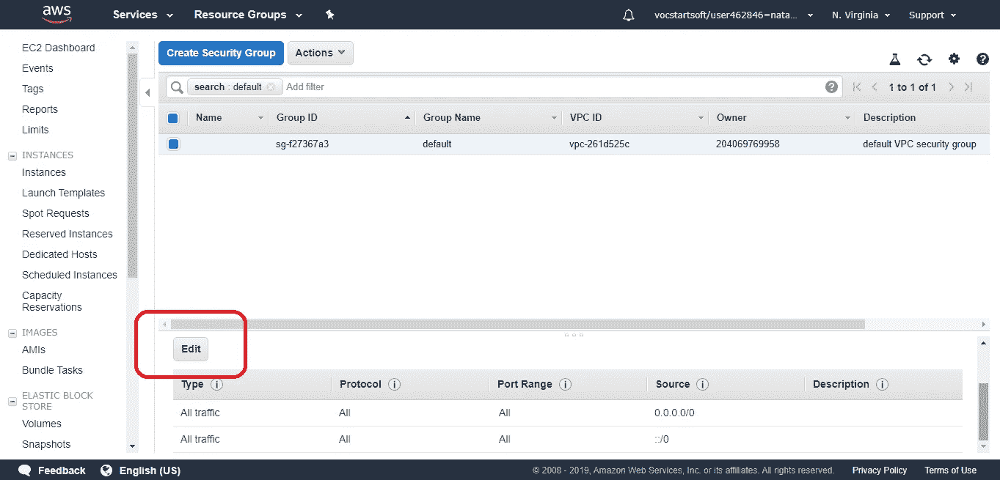

点击“编辑”,您将看到一个新页面，并设置以下设置:

*   类型->所有流量
*   协议->全部
*   来源->任何地方

保存它，然后尝试与 SQL SERVER 连接，一切都会正常工作。

这个数据库是非常快速和可伸缩的。我们可以在多个地区创建尽可能多的副本，因此它是持久和非常好的服务。这可以用来存储大量的数据集，这些数据集可以用于机器学习，这是任何事情中最重要的一步。

参考:[https://stack overflow . com/questions/44682864/cannot-connect-to-rds-SQL-server-database-using-management-studio](https://stackoverflow.com/questions/44682864/cannot-connect-to-rds-sql-server-database-using-management-studio)

希望你喜欢！