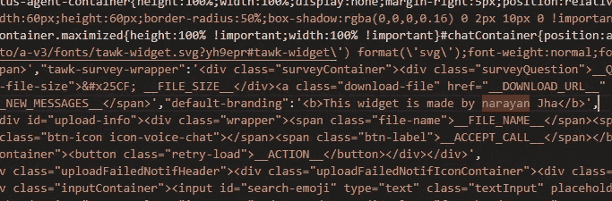

# 如何使用 Tawk.to 不加水印？

> 原文：<https://medium.com/analytics-vidhya/how-to-use-tawk-to-without-watermark-b5a6b5e2783e?source=collection_archive---------7----------------------->

> 众所周知，使用 tawk.to 插件非常简单，我们的网站上也有类似聊天的功能。

简单地说，我们需要从仪表板复制粘贴代码:

转到仪表板

**但是在免费账户中，我们不能移除插件的水印，但是看完这篇博客后，我们将能够移除插件。我们将间接黑掉这个 tawk.to 呵呵只是开个玩笑。那我们开始吧。**

> 第一步:**首先复制粘贴我们从 tawk.to 应用程序中获得的代码，看起来像这样。粘贴代码后，我们现在可以在这里看到 URL。**

对话的 URL

第二步:**只需在浏览器中打开网址，这看起来就像网页上的小蚂蚁。**

将 URL 另存为 tawk.js

**不过不用担心。只需将其保存为 tawk.js 文件，不要忘记像这样在 Html 文件中更改路径。**

**一旦完成这一步。检查一下我们的文件夹必须有两个文件:**

*   1.HTML 文件
*   2.我们用 tawk.js 保存的 tawk URL 的 JS 文件

两个文件

我们在上一步中链接了这些文件:

s1.src= '。/tawk.js '

tawk.js 与 Html 文件的链接

步骤 3:让我们现在改变水印的名称:

*   打开 tawk.js 文件并按 CTRL + F，现在找到 tawk.to 或我们正在

tawk.js

> 现在只要改变你想要的名字。
> 
> 在浏览器中打开此文件
> 
> 确保此 HTML 文件应由服务器托管
> 
> 在浏览器中正常打开文件将不起作用

我们的代码终于开始工作了。

希望你喜欢这个博客。