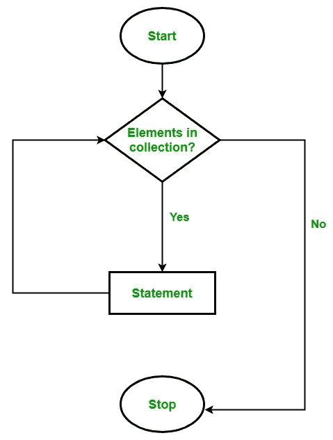

# ES6 阵列功能之间的差异

> 原文：<https://medium.com/analytics-vidhya/how-to-use-the-real-power-of-es6-array-functions-e332082d0154?source=collection_archive---------12----------------------->

在这里，我们将看看如何在适当的地方使用 map、forEach、filter、find 和 findIndex 函数。

ECMAScript 6，也称为 ES6 或 ECMAScript 2015，是一种规范标准，它为 JavaScript 编程语言引入了一些令人兴奋的新功能，旨在使您的代码更加现代、可读和通用，尤其是在构建大规模应用程序时。


在 ES6 中，我们可以找到不同的方法来遍历数组。但最常见的问题是，我应该在哪里使用这些函数来获得正确的结果。没有进一步的讨论，让我们一个接一个地检查使用这些函数时到底发生了什么。

# 1.为每一个

forEach 将逐个获取数组中的元素，并将其作为参数传递给回调函数。它还允许将元素的索引传递给回调函数。让我们看一些编码示例，并尝试理解这一点。



forEach 函数背后的逻辑

```
const array = [10, 20, 30, 40, 50]const result = array.forEach( (number, index) => {
  console.log( "[" + index + "] =" + number)
})console.log("final result : " + result)
```

输出:

```
/* Loop through the array */
[0] = 10
[1] = 20
[2] = 30
[3] = 40
[4] = 50/* finally print the value of the result */final result : undefined
```

这里我们可以看到，for each 循环通过数组并返回未定义的。

让我们用循环中的 return 语句来试验同一个例子，看看结果是什么。

```
const array = [10, 20, 30, 40, 50]const result = array.forEach( (number, index) => {
  console.log( "[" + index + "] =" + number)
  return number;
})console.log("final result : " + result)
```

输出:

```
/* Loop through the array */
[0] = 10
[1] = 20
[2] = 30
[3] = 40
[4] = 50/* finally print the value of the result */final result : undefined
```

结果还是一样。这意味着即使试图在 forEach 循环内部返回一些值，那也是不可能的。在这个例子中，还有一点需要注意。重点是 return 语句不要中断循环。循环运行，直到数组结束。

这意味着在循环数组时返回值的函数在 forEach 中是不可能的。看下面的例子。

```
const array = [10, 20, 30, 40, 50]const findEqual = (array, number) => {
    array.forEach(item => {
        if(item === number ){
            return true;
        }
    })
}const result = findEqual(array, 10)console.log(result);
```

输出:

```
undefined
```

# 2.地图

在 map 中还有一个内置的数组函数，可以用来遍历数组。于是一个新的问题出现了。forEach 和 map 函数有什么区别？这些一样吗？

让我们用一个编码示例来尝试一下。

```
const array = [10, 20, 30, 40, 50]const result = array.map( (number, index) => {
  console.log( "[" + index + "] =" + number)
})console.log(result)
```

输出

```
/* Loop through the array */
[0] =10
[1] =20
[2] =30
[3] =40
[4] =50/* finally print the value of the result */
[ undefined, undefined, undefined, undefined, undefined ]
```

在这个输出中，我们得到了一个包含 5 个未定义对象的数组。这意味着在每次迭代中，函数试图输出一些东西，并试图返回数组作为最终输出，它由单次迭代中的每个单独的返回组成。

所以让我们通过在每次迭代中修改它们来返回值。

```
const array = [10, 20, 30, 40, 50]const result = array.map( (number, index) => {
  console.log( "[" + index + "] =" + number)
  return number + 100
})console.log(result)
```

输出:

```
/* Loop through the array */
[0] =10
[1] =20
[2] =30
[3] =40
[4] =50/* finally print the value of the result */
[ 110, 120, 130, 140, 150 ]
```

我们可以看到 map 函数的最终结果返回一个数组，该数组包含每次迭代返回的值。这意味着当我们需要在循环中更新整个数组时，map 函数是非常强大的。

让我们尝试另一个例子，我们需要检查数组中的值是“偶数”值。如果值为“真”,则放入新数组中的相应索引中。如果值是奇数，则在结果数组中添加一个 false。

```
const array = [10, 23, 30, 41, 50]const result = array.map( (number, index) => {
  if(number % 2 === 0){
   return true;
  }else {
   return false;
  }
})console.log(result)
```

输出:

```
[true, false, true, false, true]
```

# 3.过滤器

单词过滤器背后的基本思想是根据条件从集合中选择一个或多个项目。

看下面的图片，它代表了根据学生高中的平均绩点来选择学生上大学的过程。有一个最低的 GPA 值需要被大学选中。绩点高于要求的学生被录取，其他学生被拒绝。


ES6 过滤方法功能相同吗？让我们找出答案。

在 filter 函数中，我们需要根据条件检查数组中的每一项，并需要根据条件的满足情况返回 true 或 false。

```
const array = [10, 20, 30, 40, 50]const result = array.filter(item => {
    if(item > 30){
        return true;
    }else {
        return false
    }
})console.log(result)
```

输出:

```
[ 40, 50 ]
```

太好了！过滤功能如我们预期的那样工作。但是我们需要那么多行代码来过滤这个数组吗？

有没有比使用整个 if else 块更简单的方法？

是的，我们可以！。我们可以将整个过滤功能缩减为一行代码。

```
const result = array.filter(item => item > 30)
```

在这里，如果项目大于 30，则返回 true，否则返回 false。与 if else 块相同！

# 4.发现

Find 也类似于 filter 函数。唯一的区别是 find 返回满足条件的第一个值，并打破循环。这将有助于通过随处使用地图和 forEach 来减少不必要的时间复杂性。

```
const array = [10, 20, 30, 40, 50]const result = array.find(item => item > 30)console.log(result)
```

输出:

```
40
```

即使 50 大于 30，find 方法也只输出满足给定条件的第一项(40)。

# 5.findIndex

findIndex 函数的逻辑与 find 方法相同。但是 findIndex 方法不是返回满足条件的第一个值，而是返回该值的索引。

```
const array = [10, 20, 30, 40, 50]const result = array.findIndex(item => item > 30)console.log(result)
```

输出:

```
3
```

通过在正确的地方应用这些函数，将减少程序不必要的复杂性。

如果你是一个初学者，刚刚开始学习 javascript，这肯定会是你面试的问题之一。

在评论区写下你的问题…

更多 javascript 相关文章请关注我！