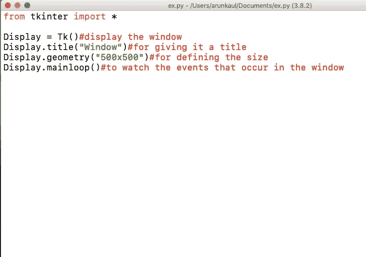
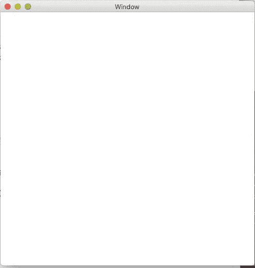
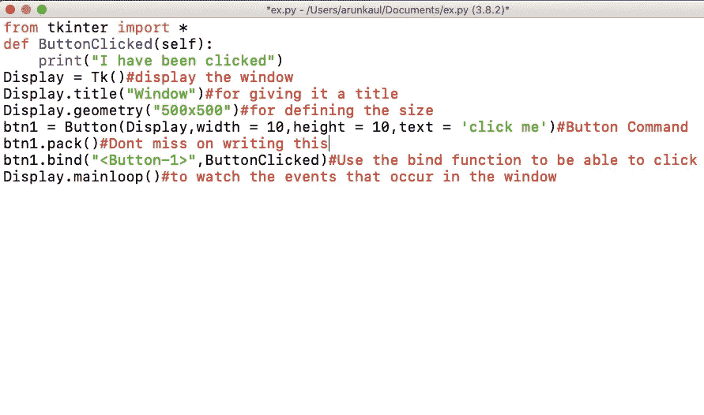
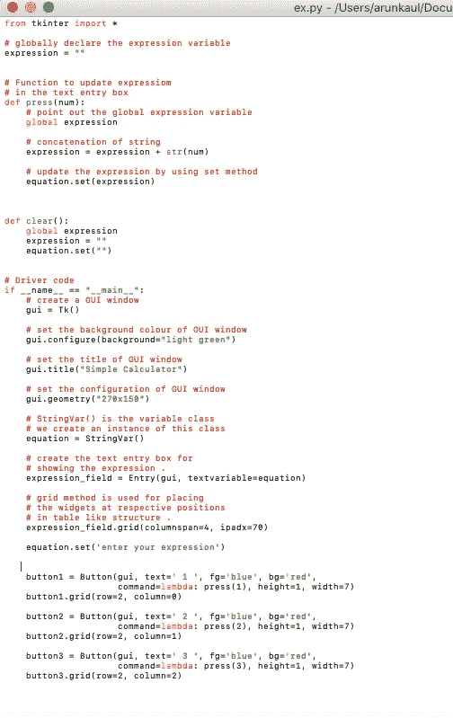
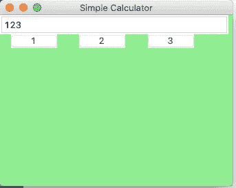

# 如何在 python 中使用 Tkinter(第 1 部分)

> 原文：<https://medium.com/analytics-vidhya/how-to-use-tkinter-in-python-7b43bfabe940?source=collection_archive---------18----------------------->

## 显示窗口

为了在程序中显示按钮、条目(文本框)和更多的功能，我们需要一个窗口。为了显示该窗口，我们需要遵循 python 中的语法和代码。

输入:

这段代码首先显示定义标题和大小的窗口。因此，作为输出，我们将看到一个标题为“窗口”和大小为“500x500”的空白窗口

输出:

## 使用 Tkinter 中的按钮:

所以现在我们将构建一个程序，当按钮被点击时，程序会打印(“我被点击了”)

输入:

定义一个打印输出的函数，不要忘记打包你的按钮，否则它不会显示在窗口中。绑定功能使你的按钮可点击。

输出:

当我点击按钮时，这就是输出。

## 使用文本框或条目:

可以与 Entry 一起使用的函数:

**血糖**

标签和指示器后面显示的正常背景色。

**bd**

指示器周围边框的大小。默认值为 2 像素。

**命令:**

每次用户更改 checkbutton 的状态时调用的过程。

**光标:**

如果将此选项设置为光标名(*箭头、点号等)。*)，当鼠标光标在复选按钮上时，鼠标光标将变为该模式。

**字体:**

用于文本的字体。

**fg:**

用于呈现文本的颜色。

**荧光笔颜色**

当 checkbutton 获得焦点时，焦点的颜色突出显示。

**对齐**

如果文本包含多行，此选项控制文本的对齐方式:居中、左对齐或右对齐。

**减压**

使用默认值 relief=FLAT，checkbutton 不会从其背景中突出出来。您可以将此选项设置为任何其他样式

选择背景

用于显示所选文本的背景色。

**选择边框宽度**

所选文本周围使用的边框宽度。默认值为一个像素。

**选择前景**

所选文本的前景(文本)颜色。

**显示**

通常，用户键入的字符会出现在条目中。要创建将每个字符作为星号回显的. password .条目，请设置 show="* "。

**状态**

默认值为 state=NORMAL，但是您可以使用 state=DISABLED 使控件变灰并使其无响应。如果光标当前位于 checkbutton 上，则状态为活动。

**文本变量**

为了能够从入口小部件中检索当前文本，必须将该选项设置为 StringVar 类的一个实例。

**宽度**

复选按钮的默认宽度由显示的图像或文本的大小决定。您可以将此选项设置为多个字符，复选按钮将始终有足够的空间容纳这些字符。

输入:(与按钮一起使用)

网格功能允许你组织窗口中的按钮。

输出:(点击按钮后)

