# 如何在 TensorFlow 中使用迁移学习

> 原文：<https://medium.com/analytics-vidhya/how-to-use-transfer-learning-in-tensorflow-aa7779302369?source=collection_archive---------25----------------------->

迁移学习是 TensorFlow 提供的一个非常出色的功能。它通过从已经训练好的模型中获取帮助来帮助训练新的模型。考虑到您想要训练一个模型来预测图像中某些对象的数量，但是没有足够的图像来进行训练，我们可以利用已经训练好的模型并调整它们来获得我们的结果，而无需为庞大的数据集训练模型并在训练上花费大量的时间和计算。

在这篇文章中，我将解释如何利用迁移学习来处理来自 Analytics Vidhya 的人脸计数挑战数据集。

链接到数据集:[https://data hack . analyticsvidhya . com/contest/vista-code fest-computer-vision-1/](https://datahack.analyticsvidhya.com/contest/vista-codefest-computer-vision-1/)

首先，我们需要将图像和目标值读入一个 numpy 数组。我已经分享了笔记本的链接，那里有完整的代码。

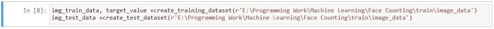

将数据加载到 numpy 数组

现在，我们将基本模型加载到一个变量中。这里使用 TensorFlow 中的 MobileNetV2 模型。我们提供图像的输入形状，并使用“imagenet”加载权重。这意味着基础模型是在 imagenet 数据集上训练的。我们将基本模型的训练设置为 False，这样我们就不会再经历训练这些层的整个过程。

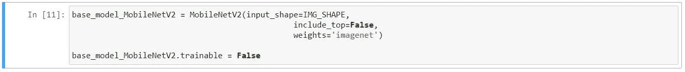

装载基础模型

现在，我们可以通过打印模型概要来查看基本模型的层，以检查模型是否被正确加载。

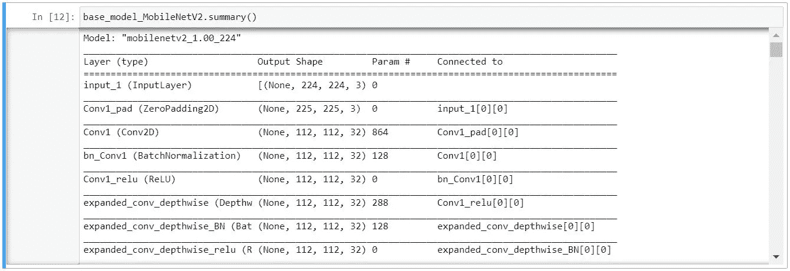

模型摘要

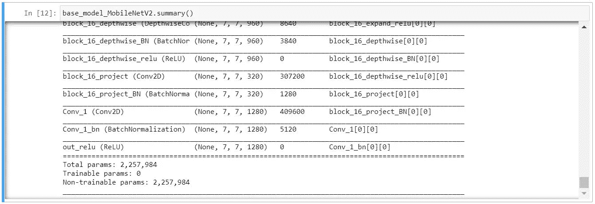

模型摘要

从摘要中我们可以看到，基本模型已经成功加载。基本模型采用 shape (224，224，3)作为输入，模型的最后一层是(7，7，1280)。现在我们在这个模型的基础上构建我们的模型。

首先，我们获得输出的最后一层，并创建一个输入层，该层根据基本模型的要求提供数据，例如:模型可能需要在[-1，1]或[0，1]之间归一化的数据，这取决于它的训练方式。

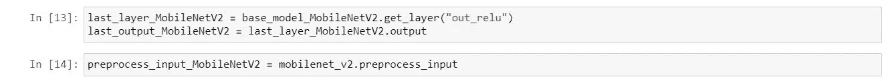

从基本模型中设置预处理输入层和最后一层

现在我们可以展平最后一层，并根据我们的需要添加一些密集层，或者添加一些卷积，并根据我们的要求创建模型。

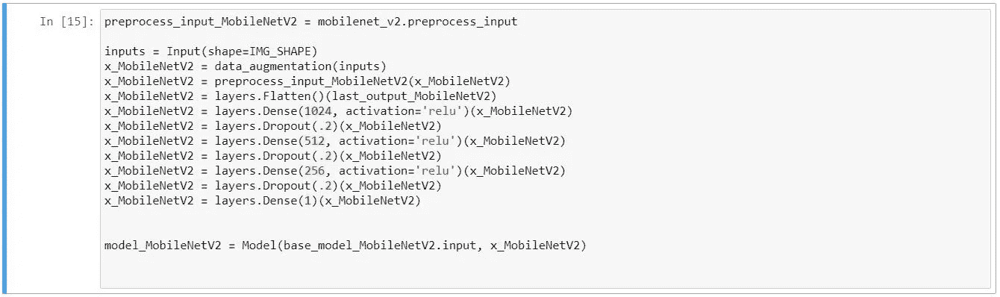

在基本模型的基础上构建我们自己的模型

一旦建立了模型，我们就可以编译这个模型，这里我们保留了最后一层，没有任何激活，因为我们试图预测图像中人脸的数量。

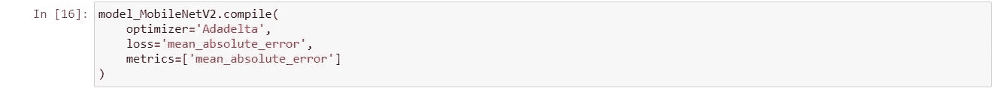

编译模型

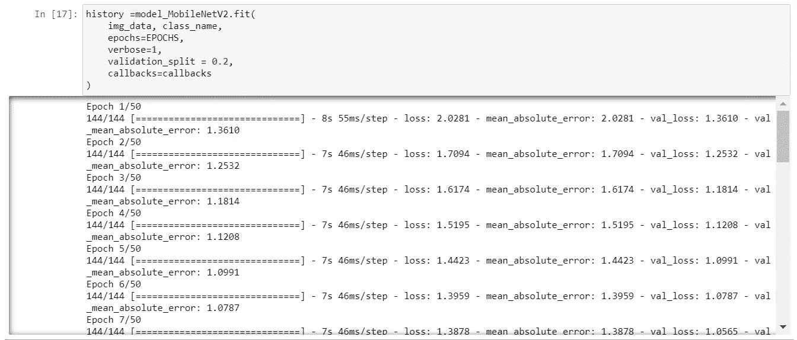

训练模型

然后，我们可以绘制模型的历史，以查看训练和验证中的损失。在这里，我们可以看到训练曲线非常平稳地下降，表明模型的训练是稳定的。

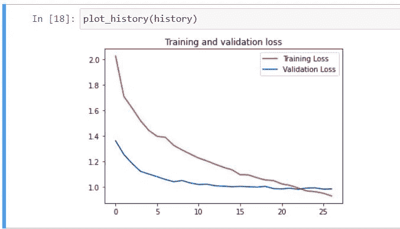

模型的训练和验证损失

当我们提交测试数据的预测时，我们得到的 RMSE 为 1.86，在预测得分中排名前 100。

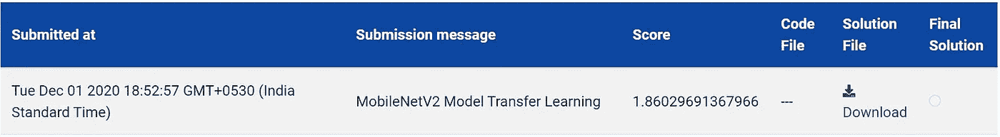

预测结果

此处有完整代码:[https://colab . research . Google . com/drive/1 wwrscvk 2 b 6 ACI 6 eusuveibtbgwjyoave？usp =共享](https://colab.research.google.com/drive/1wWRScvK2B6ACi6eusuvEiBtBGwJyOAve?usp=sharing)

请检查使用多个迁移学习模型来预测该数据集输出的代码，该数据集在撰写本文时给出了 1.68 的 RMSE 和 82 的排名:[https://github . com/losing coder/machine learning/tree/master/Face % 20 counting % 20 challenge](https://github.com/LosingCoder/MachineLearning/tree/master/Face%20Counting%20Challenge)

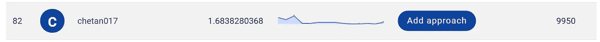